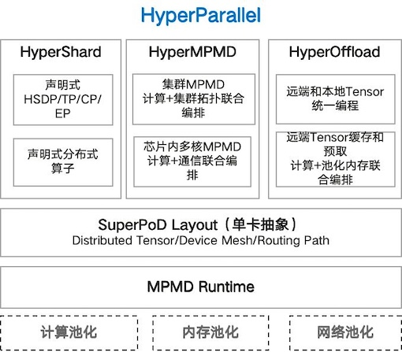

# HyperParallel

An Ascend SuperPod-affinity distributed parallel acceleration library that simplifies supernode programming and
unleashes computational potential.

HyperParallel provides Ascend SuperPod-affinity distributed parallel acceleration capabilities. Whilst maintaining ease
of use, it addresses the architectural characteristics of Ascend SuperPods, including resource pooling, peer-to-peer
architecture, hierarchical and diverse network topology, and FP8 low-precision formats. It implements distributed
parallelism from cluster level to multi-core parallelism within chips, supports unified pooled management of CPU DRAM
and NPU HBM, topology-aware scheduling and communication path planning, and FP8 mixed-precision training amongst other
Ascend SuperPod-affinity acceleration capabilities.

Key design principles:

**Decoupling of Model and System Optimisation**: With the continuous evolution of LLM and multimodal algorithm
architectures, performance optimisation techniques have also been advancing. The traditional integrated architecture of
algorithm and system optimisation poses challenges for algorithm iteration and long-term system maintenance.
HyperParallel supports evolving the programming model from system optimisation embedded within model scripts to a
decoupled model and system optimisation approach, with implicit injection of parallelism, recomputation, offload and
other system optimisations. It supports the evolution of parallel paradigms from SPMD to MPMD, further supporting
coordinated optimisation of cluster MPMD and multi-core MPMD. It supports the evolution of compute-storage relationships
from Stateful to Stateless with separated computation and state, as well as large language model training, multimodal
large model training, and reinforcement learning capabilities.

**End-to-End Determinism**: To further ensure training stability and precision reproducibility, HyperParallel supports
end-to-end determinism, including high-performance deterministic computation, communication, data preprocessing, and
random number determinism, supporting floating-point bitwise alignment. All supported models are validated using
determinism. Although there is some performance degradation, enabling determinism during training remains recommended
for precision reproducibility, rapid SDC detection, and bug identification.

**Unified Training and Inference**: As Reasoning RL and Agentic RL tasks become increasingly complex, the
training-inference inconsistency problem causing reinforcement learning training convergence difficulties has become
more prominent. HyperParallel will explore a unified training-inference architecture, achieving performance optimisation
for both training and inference through a single acceleration framework, strengthening training-inference consistency
and ensuring RL convergence.

**Hybrid Dynamic-Static Execution**: Optimisation based on static graphs is an important means of further improving
performance. For instance, capabilities such as compute-communication concurrency, memory analysis, and execution
sequence orchestration based on static graphs can effectively optimise performance, which are not easily achievable in
dynamic graph mode. However, dynamic-to-static compilation support is extremely challenging, and complete
dynamic-to-static conversion is not yet achievable. HyperParallel will support partial dynamic-to-static conversion
through certain syntax constraints, utilising MindSpore's advanced graph optimisation capabilities to further enhance
performance.

## Architecture Overview

<div align="center">  </div>

### HyperShard: Programming Model Evolution, System Optimisation Embedded in Model -> Decoupled Model and System Optimisation

- SuperPod Layout: Unified modelling of tensor sharding, device mapping, and communication paths, achieving single-card
  abstraction for SuperPods;
- Declarative HSDP/TP/CP/EP: Implicit injection of optimisations such as parallelism, recomputation, and offload into
  models, achieving decoupling of model code and system optimisation code, improving algorithm development efficiency;

### HyperMPMD: Parallel Paradigm Evolution, SPMD -> Cluster MPMD -> Cluster + Multi-Core MPMD

- Cluster MPMD: Supports heterogeneous model sharding, supports arbitrary device allocation for model slices;
- Intra-Chip Multi-Core MPMD: Intra-chip multi-core MPMD parallelism, combined with core-level memory semantic one-sided
  communication, enhancing compute-communication overlap and MAC utilisation;

### HyperOffload: Compute-Storage Relationship Evolution, Stateful -> Stateless Computation-State Separation

- Unified Programming for Remote and Local Tensors: Supports tensor location allocation, hides remote data transfer,
  improves cluster memory utilisation;
- Remote Tensor Prefetching and Caching, Full Model Offload: DDP/HSDP+Offload replaces complex parallel modes such as
  DP/TP/PP/CP/SP/EP, simplifying system design and improving performance;

## Key Features

- Models
    - [x] DeepSeekV3
    - [x] Qwen3.5-0.8B-Base
    - [x] Qwen3.5-35B-A3B-Base (MoE)
    - [x] Qwen3-VL-30B-A3B-Instruct (MoE)
    - [ ] DeepSeekV3.2
    - [ ] Qwen3-Omni

- HyperShard
    - DTensor
        - [x] DTensor basic
        - [x] DTensor redistribute
        - [x] manual_seed (distributed random number seed control)
        - [ ] DTensor centric communication
        - [ ] Cross Mesh DTensor redistribution
    - HSDP / FSDP
        - [x] Parameter & Optimiser Sharding
        - [x] Parameter & Optimiser & Gradient Sharding
        - [x] Overlap (full overlap mode)
        - [x] gradient_scaling_factor
        - [ ] Dynamic-to-Static Conversion
    - Shard / TP
        - [x] Distributed Operator Support List
        - [x] Custom Distributed Operator Registration (YAML registry + Python impl)
        - [x] Custom Shard
        - [x] DFunction (custom distributed autograd functions)
        - [x] parallelize_value_and_grad
        - [x] Loss Parallel (TP training loss parallelism)
        - TP Styles
            - [x] ColwiseParallel / RowwiseParallel / SequenceParallel
            - [x] parallelize_module (declarative TP interface)
            - [x] 1D
            - [ ] Higher-Dimensional TP, 2D/2.5D/3D
        - EP
            - [x] ExpertParallel / ExpertTensorParallel (basic workflow)
            - [x] MoE building blocks (GroupedExperts / TokenChoiceTopKRouter / MoE)
            - [x] Load balancing (expert_bias + aux_loss + AutoScaler)
            - [x] MoE zero-overhead activation storage
            - [x] MoE+EP token dispatch decoupling
            - [ ] Dropless basic workflow
            - [ ] Compute-Communication Overlap
            - [ ] Expert Hot Migration / Hot Expert Replication
        - CP
            - [x] ContextParallel (basic context parallelism)
            - [x] AsyncContextParallel (async context parallelism)
            - [x] DSA series (Indexer / Loss / SparseAttention)
            - [x] TP DTensor local rewrap
            - [ ] DeepSpeed Ulysses
            - [ ] Ring Attention
            - [ ] 3D Sequence Parallelism
        - [ ] Overlap
    - Distributed Random Numbers
        - [x] manual_seed (seed control)
        - [ ] DropOut

- HyperMPMD
    - Pipeline Parallelism
        - [x] GPipe
        - [x] 1F1B
        - [x] VPP (ScheduleInterleaved1F1B)
        - [x] PP+FSDP (MetaStep integration)
        - [x] PipelineStage dx/dw computation
        - [x] Compute-Communication Overlap overlap_b_f (CommComputeOverlap dual-thread orchestrator)
        - [x] batched P2P transport / overlap_p2p
        - [x] PP Activation Swap
        - [x] variable-layer + mixed-recompute under overlap_b_f
        - [ ] ZBV
        - [ ] SeqPP
        - [ ] Different Device Allocation per PP Stage
    - Subgraph Partitioning
        - [ ] Multimodal Encoder/Decoder Partitioning to Different Devices
    - Multi-Core Parallelism
        - [ ] Multi-Core Parallelism - O0
        - [ ] Multi-Core Parallelism - O1
        - [x] MoE Compute-Communication Overlap Optimisation Based on Multi-Core Parallelism
        - [ ] PP 1B1F Compute-Communication Overlap Optimisation Based on Multi-Core Parallelism

- HyperOffload
    - [x] Activation Checkpoint (checkpoint / checkpoint_wrapper / CheckpointPolicy)
    - [x] Activation Swap (swap / swap_wrapper / swap_tensor_wrapper / SwapManager)
    - [x] Activation Swap and Checkpointing Coordinated Configuration
    - [x] Swap Fusion
    - [ ] SAS (Selective Activation Swap)
    - [ ] SPO (Selective Parameter/Gradient/Optimizer Offload)
    - [ ] Memory Semantic-Based Offload
    - [ ] Automatic Activation Swap Strategy Generation

- Optimizer
    - [x] AdamW
    - [x] Muon (momentum-based optimizer)
    - [x] ChainedOptimizer (Muon+AdamW chained combination)
    - [x] get_hyper_optimizer / get_hyper_lr_scheduler
    - [x] Sharded Optimizer (FSDP/HSDP integration)
    - [x] gradient scaling factor + clip_grad enhancements

- AutoParallel
    - [x] Fast-Tuner: Based on profiling information, constructs black-box cost models, automatically generates
      multi-dimensional hybrid parallel strategies through enumeration, pruning, and search
    - [x] SAPP-PPB: Pipeline Parallelism Balancing
    - [x] SAPP-ND: ND Search (memory estimation + performance estimation)
    - [ ] PARADISE

- One-Sided Communication
    - [x] Symmetric Memory
    - [x] AllGather
    - [x] AllGatherMatmul / MatmulReduceScatter (MC2 fused communication ops)
    - [ ] AllToAll
    - [ ] AllReduce
    - [ ] ReduceScatter
    - [ ] Low-Precision Communication with High-Precision Accumulation

- Fast Fault Recovery
    - [x] DCP (Distributed Checkpoint)
        - [x] Distributed checkpoint save/load
        - [x] Async staging save
        - [x] Offline format transform
        - [ ] Huggingface Format Support
        - [ ] Different Sharding Strategy Conversion Support
    - [ ] Basic Fault Recovery Workflow
    - [ ] Process-Level Fast Fault Recovery
    - [ ] Last Words (fault-triggered checkpoint saving)
    - [ ] SDC Detection

- Trainer
    - [x] LLMTrainer framework
    - [x] VLTrainer framework (visual-language)
    - [x] Callbacks (Logging / MoeMonitor)
    - [x] parallel_dims configuration

- Integration
    - [x] LlamaFactory integration (activation recompute & swap + HSDP)

- Tools
    - Precision Monitoring
        - [ ] global norm
        - [ ] local norm
        - [ ] local loss

    - DryRun
        - [ ] Memory Overhead Analysis
        - [ ] Single-Card Cluster Execution Simulation

## Installation Guide

HyperParallel offers two installation methods:

- **pip installation**: install an already built `hyper-parallel` package and use extras to select runtime deep
  learning framework dependencies.
- **source build**: use `./build.sh` to generate a whl package, and use build arguments to decide whether native
  extensions are compiled.

If you only need to install a released package, prefer `pip install`. If you need to generate a whl package locally or
customize native extension build options, build from source.

### 1. Install With pip

`pip install` extras only control Python runtime dependencies. They do not control native extension compilation.

| Command                                   | Installed dependencies                                          | Use case                                                                          |
|-------------------------------------------|-----------------------------------------------------------------|-----------------------------------------------------------------------------------|
| `pip install hyper-parallel`              | Common dependencies only, no deep learning framework            | You manage framework versions yourself or only use framework-independent features |
| `pip install 'hyper-parallel[mindspore]'` | Common dependencies + `mindspore>=2.10`                         | Use the MindSpore backend                                                         |
| `pip install 'hyper-parallel[torch]'`     | Common dependencies + `torch==2.9.1` + `torch-npu==2.9.1`       | Use the default PyTorch 2.9 backend                                               |
| `pip install 'hyper-parallel[torch26]'`   | Common dependencies + `torch==2.6.0` + `torch-npu==2.6.0.post3` | Use the PyTorch 2.6 backend                                                       |
| `pip install 'hyper-parallel[torch27]'`   | Common dependencies + `torch==2.7.1` + `torch-npu==2.7.1`       | Use the PyTorch 2.7 backend                                                       |
| `pip install 'hyper-parallel[torch29]'`   | Common dependencies + `torch==2.9.1` + `torch-npu==2.9.1`       | Explicitly use the PyTorch 2.9 backend                                            |
| `pip install 'hyper-parallel[all]'`       | Common dependencies + MindSpore + default PyTorch 2.9           | Use both backends in the same environment; PyTorch defaults to 2.9                |

In shells such as zsh, quote package names with extras so `[]` is not treated as a glob pattern.

### 2. Build a Wheel From Source

Building hyper-parallel from source can compile three native modules: `multicore`, `symmetric memory`, and `custom ops`.

Building a whl with `build.sh` supports the following build arguments:

| Argument       | Default     | Values                                                                  | Description                                                                                                                   |
|----------------|-------------|-------------------------------------------------------------------------|-------------------------------------------------------------------------------------------------------------------------------|
| `--multicore`  | `mindspore` | `off`, `mindspore`, `ms`, `torch`, `pytorch`, `all`, `both`             | Controls the multicore build scope; `ms` is equivalent to `mindspore`, `pytorch` is equivalent to `torch`, and `both` is equivalent to `all` |
| `--shmem`      | `all`       | `off`, `mindspore`, `ms`, `torch`, `pytorch`, `all`, `both`             | Controls the symmetric memory build scope; `all` builds the common library, MindSpore wrapper, and PyTorch wrapper             |
| `--custom-ops` | `on`        | `on`, `off`                                                             | Controls whether MindSpore custom ops are built                                                                               |
| `--strict`     | `on`        | `on`, `off`                                                             | Controls whether native module build failures stop whl building; `off` records a warning and continues packaging              |

Source build environment requirements for hyper-parallel are as follows:

| Environment item                | Requirement                                                               | Notes                                                                                                             |
|---------------------------------|---------------------------------------------------------------------------|-------------------------------------------------------------------------------------------------------------------|
| Python                          | 3.10, 3.11, or 3.12                                                       | The built whl can only be installed into the matching Python minor version                                        |
| Host GCC                        | [7.3.0, 11.3.0]                                                           | Aligned with MindSpore's compile policy                                                                           |
| CMake                           | >= 3.18                                                                   | Required for native extension builds                                                                              |
| CANN toolkit                    | A valid `ASCEND_HOME_PATH` is required when native extensions are enabled | Scripts try to source `/usr/local/Ascend/cann/set_env.sh` automatically                                           |
| MindSpore                       | >= 2.10                                                                   | Required when `--custom-ops on`, `--multicore mindspore/all`, or `--shmem all/mindspore`                         |
| PyTorch and NPU adapter package | Backend-compatible PyTorch version                                        | Required when `--multicore torch/all`, or `--shmem all/torch`                                                     |

```bash
git clone https://gitcode.com/mindspore/hyper-parallel.git
cd hyper-parallel
./build.sh
./build.sh --multicore all --shmem all --custom-ops on
./build.sh --multicore torch --shmem torch --strict off
./build.sh --multicore off --shmem off --custom-ops off
pip install dist/hyper_parallel-*.whl
```

> Note: the built whl has requirements on the glibc version of the runtime environment. The glibc version in the
> installation environment must be no lower than the glibc version in the build environment.
> If you need to deploy to an older system, build inside an older release image. For example, a whl built on OpenEuler
> 22.03 (glibc 2.34) cannot run in an environment with glibc < 2.34.

## Quick Start

1. Use `fully_shard` for data-parallel parameter sharding

```python
from hyper_parallel import fully_shard, init_device_mesh

mesh = init_device_mesh(device_type="npu", mesh_shape=(dp_size,), mesh_dim_names=("dp",))
model = fully_shard(model, mesh=mesh)
```

2. Use `shard_module` for tensor parallelism

```python
from mindspore.nn.utils import no_init_parameters
from hyper_parallel import DTensor, Layout, fully_shard, init_device_mesh, init_parameters, shard_module

# Define tensor layout
layout = Layout((dp, mp), ("dp", "mp"))
x_layout = layout("dp", "mp")
w_layout = layout("mp", "None")
out_layout = layout()

# Delayed network weight initialisation
with no_init_parameters():
    model = SimpleModel()

# Configure sharding for network input/output/weights
sharding_plan = {"forward": {"input": (x_layout,), "output": (out_layout,)},
                 "parameter": {"weight": w_layout}}
model = shard_module(model, sharding_plan)

# Can further configure fully_shard
mesh = init_device_mesh(device_type="npu", mesh_shape=(dp, 1), mesh_dim_names=("dp", "tp"))
model = fully_shard(model, mesh=mesh["dp"])

# Sharded weight initialisation
model = init_parameters(model)

# Execute
x = DTensor.from_local(local_x, x_layout)
run_model(x, model)
```

3. Use declarative TP Styles for tensor parallelism

```python
from hyper_parallel import ColwiseParallel, RowwiseParallel, parallelize_module, init_device_mesh

tp_mesh = init_device_mesh("npu", (tp_size,), mesh_dim_names=("tp",))

parallelize_module(
    model,
    tp_mesh,
    {
        "attn.q_proj": ColwiseParallel(),
        "attn.k_proj": ColwiseParallel(),
        "attn.v_proj": ColwiseParallel(),
        "attn.o_proj": RowwiseParallel(),
        "mlp.gate_proj": ColwiseParallel(),
        "mlp.up_proj": ColwiseParallel(),
        "mlp.down_proj": RowwiseParallel(),
    },
)
```

4. Use `PipelineStage` and `PipelineSchedule` for pipeline parallelism

```python
from hyper_parallel import PipelineStage, Schedule1F1B

# Wrap the partitioned module into PipelineStage
stage = PipelineStage(split_model, stage_index, stage_num=4)

# Select pipeline parallel scheduling
schedule = Schedule1F1B(stage, micro_batch_num=8)

# Execute
x = DTensor.from_local(local_x, x_layout)
schedule.run(x)
```

5. Use Optimizer for Muon+AdamW chained optimisation

```python
from hyper_parallel.core.optimizer import get_hyper_optimizer

optimizer = get_hyper_optimizer(
    model=model,
    muon_params=muon_param_groups,
    adamw_params=adamw_param_groups,
    muon_kwargs={"lr": 0.02, "momentum": 0.95},
    adamw_kwargs={"lr": 3e-4, "weight_decay": 0.1},
)
```

6. Use Activation Checkpoint/Swap for memory optimisation

```python
from hyper_parallel.core.activation_checkpoint import checkpoint_wrapper, swap_wrapper

model.layer = checkpoint_wrapper(model.layer, policy="full")
model.layer = swap_wrapper(model.layer, offload_to="cpu")
```

7. Use MoE Compute-Communication Overlap Optimisation Based on Multi-Core Parallelism

For details, see the [MOE-FFN Documentation](./hyper_parallel/core/multicore/doc/README.md).

## Documentation

- [Docs Hub](./docs/index.md) - Documentation index and navigation
- [Quick Start](./docs/getting_started/quick_start.md) - Design principles, minimal example
- [Installation Guide](./docs/getting_started/installation.md) - Source build, dependencies
- [Feature Guides](./docs/guide/) - 10 core feature usage guides
- [API Reference](./docs/api/api_reference.md) - Interface descriptions organised by feature module
- [FAQ & Troubleshooting](./docs/faq.md) - Common issues and solutions
- [Contributing](./docs/contributing/) - Dev environment, testing, release process
- [Release Notes](./hyper_parallel_v1.0.0_release_notes.md) - Version change records

## Contributing

1. Fork this repository
2. Create a new Feat_xxx branch
3. Commit your code
4. Create a new Pull Request

If you have any suggestions for HyperParallel, please contact us through issues and we will address them promptly.
If you are interested in HyperParallel's technology or would like to contribute code, you are welcome to join
the [Parallel Training System SIG](https://www.mindspore.cn/sig/Parallel%20Training%20System).

## License

[Apache 2.0 License](LICENSE)
