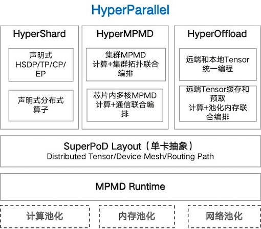

# MindSpore HyperParallel
昇腾超节点亲和的分布式并行加速库，简化超节点编程，释放算力潜能。
#### 介绍
HyperParallel提供昇腾超节点亲和的MindSpore原生分布式并行加速能力，在保障易用性的前提下，针对昇腾超节点资源池化、对等架构、网路拓扑分层多样、FP8低精格式等架构特点，实现了集群的分布式并行到芯片内多核并行，支持CPU DRAM和NPU HBM的池化统一管理，支持拓扑感知调度和通信路径规划，支持FP8混合精度训练等昇腾超节点亲和的加速能力。  
通过HyperParallel，支持编程模型从系统优化内嵌到模型脚本演进到模型和系统优化解耦；支持并行范式从SPMD演进到MPMD，进一步支持集群MPMD和多核MPMD协同优化；支持存算关系从Stateful演进到Stateless计算状态分离。支持大语言模型、多模态大模型训练及强化学习等能力。  
   
**本项目正在快速迭代，相关特性会持续开源，欢迎共建。**

#### 架构简介


##### HyperShard：编程模型演进，系统优化内嵌到模型 -> 模型和系统优化解耦
•SuperPoD Layout：Tensor切分、Device映射、通信路径统一建模，实现超节点单卡抽象;<br>
•声明式HSDP/TP/CP/EP：并行、重计算、offload等优化隐式注入到模型，实现模型代码和系统优化代码解耦，提高算法开发效率；<br>
##### HyperMPMD：并行范式演进，SPMD -> 集群MPMD -> 集群+多核MPMD
•分布式MPMD：支持异构模型切分，支持模型切片任意分配卡数；<br>
•多核MPMD：芯片内多核MPMD并行，结合核级内存语义单边通信，增强通算掩盖和MAC利用率；  
##### HyperOffload：算存关系演进，Stateful -> Stateless计算状态分离
•远端和本地Tensor统一编程：支持tensor位置分配，隐藏远端数据传输，提升集群内存利用率；  
•远端Tensor预取和缓存，全模型Offload：DDP**本项目正在快速迭代**/HSDP+Offload替换DP/TP/PP/CP/SP/EP等复杂并行模式，简化系统设计，提升性能；

#### 安装教程

当前仅支持从源码安装，你需要执行：

```
git clone https://gitee.com/mindspore/hyper-parallel.git
cd hyper-parallel
pip install .
```
HyperParallel 依赖深度学习框架，在使用HyperParallel，你需要：
•安装深度学习框架
•推荐安装的MindSpore版本 >= 2.8，最好使用最新的MindSpore版本

#### 使用说明

1.  使用hsdp进行数据并行和zero切分优化
```
# 配置数据并行
model = hsdp(model, shard_size=1)

# 或者配置zero切分(level1：切分优化器状态， level2：切分优化器状态和梯度， level3：切分优化器状态、梯度和参数)
model = hsdp(model, shard_size=dp_size, optimizer_level="level1")
```

2.  xxxx
3.  xxxx

#### 参与贡献

1.  Fork 本仓库
2.  新建 Feat_xxx 分支
3.  提交代码
4.  新建 Pull Request


#### 特技

1.  使用 Readme\_XXX.md 来支持不同的语言，例如 Readme\_en.md, Readme\_zh.md
2.  Gitee 官方博客 [blog.gitee.com](https://blog.gitee.com)
3.  你可以 [https://gitee.com/explore](https://gitee.com/explore) 这个地址来了解 Gitee 上的优秀开源项目
4.  [GVP](https://gitee.com/gvp) 全称是 Gitee 最有价值开源项目，是综合评定出的优秀开源项目
5.  Gitee 官方提供的使用手册 [https://gitee.com/help](https://gitee.com/help)
6.  Gitee 封面人物是一档用来展示 Gitee 会员风采的栏目 [https://gitee.com/gitee-stars/](https://gitee.com/gitee-stars/)
