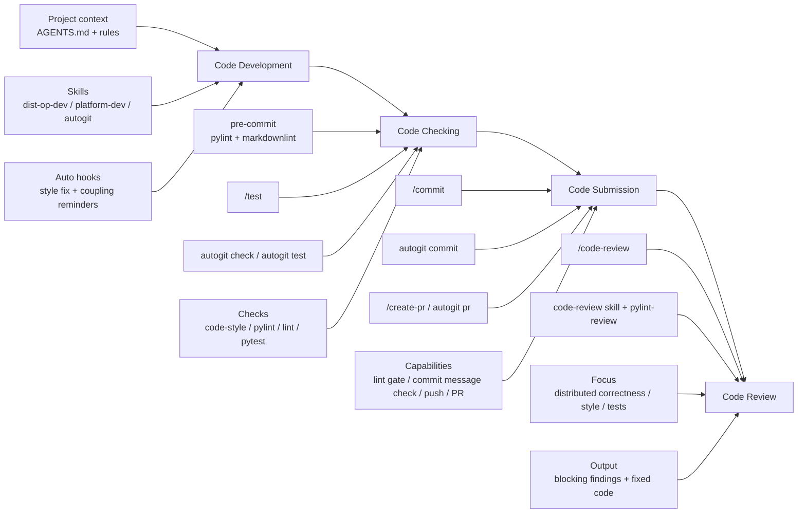

# AI Agent Workflow In HyperParallel

This document summarizes the end-to-end development capabilities that
the AI agent provides in the HyperParallel repository, based on
`AGENTS.md` and the `.agent/` configuration directory.

## Overview

The AI agent in this repository is not only a code generator. It is
configured as a full development workflow assistant that can:

- understand the project architecture and high-risk distributed areas
- apply repository rules automatically based on file scope
- guide specialized development workflows for distributed operators and
  platform abstraction changes
- auto-check and auto-fix style issues during editing
- run lint, pylint, and test workflows before commit
- automate commit, push, PR creation, and PR append workflows
- perform distributed-first code review with mandatory style compliance

The configuration is centered around these entry points:

- `AGENTS.md`
- `.agent/rules/`
- `.agent/hooks/`
- `.agent/commands/`
- `.agent/skills/`
- `.agent/agents/`

## Daily Workflow By Stage

For a normal repository developer, the AI agent capabilities can be
understood through four stages:

- code development
- code checking
- code submission
- code review

## 1. Code Development

At the development stage, the AI agent can help in three ways.

### 1.1 Load Project Context Automatically

Before implementation, the AI agent can use:

- `AGENTS.md`
- `.agent/rules/project-overview.md`
- `.agent/rules/code-style.md`
- `.agent/rules/distributed.md`
- `.agent/rules/platform.md`
- `.agent/rules/testing.md`

This lets it understand:

- project architecture
- distributed correctness risks
- coding style requirements
- test conventions
- cross-platform constraints

### 1.2 Provide Specialized Development Skills

For common development work, the main available skills are:

- `dist-op-dev`
  for distributed operator development
- `platform-dev`
  for platform abstraction and backend feature development
- `autogit`
  for Git workflow operations

Typical usage value:

- help identify which files need to change
- remind developers about DTensor, stream sync, memory lifecycle, and
  backend parity risks
- guide implementation, test, and follow-up Git actions in one workflow

### 1.3 Auto-Guard During Editing

When the AI agent writes or edits files, repository hooks are triggered
from `.agent/settings.json`:

- `enforce-code-style.sh`
  auto-fixes lightweight style issues
- `check-op-yaml.sh`
  reminds developers to check related YAML, opposite backend changes,
  buffer cleanup, and other coupling points

This means the AI agent can reduce missed follow-up work during coding,
not only after coding.

## 2. Code Checking

At the checking stage, the AI agent mainly helps with validation before
commit.

### 2.1 Main Command

- `/test`

This command delegates to `autogit test` and runs the test stage:

- `pytest` on `tests/ut`

Lint checks (`code-style`, `pylint`, Markdown lint) are handled separately
through `autogit check` or the `pre-commit` git hook, not by `/test`. It is
the most direct repository-level test entry for a normal developer.

### 2.2 Supporting Capabilities

The AI agent can also use:

- `autogit check`
  for lint-only checking (skill subcommand)
- `code-verifier`
  for lint and test verification assistance (specialized agent, not a skill)

### 2.3 What Is Checked

Repository checking emphasizes:

- style compliance with `code-style.md`
- Python quality via `pylint`
- distributed development-related lint checks
- Markdown and other repository lint checks
- repository test execution through `pytest`
- local commit-time checks through `pre-commit`

## 3. Code Submission

At the submission stage, the AI agent can help developers complete a
safer and more standardized Git workflow.

### 3.1 Main Commands

- `/commit`
- `/create-pr`

### 3.2 What `/commit` Provides

`/commit` delegates to `autogit commit` and can help with:

- loading `code-style.md` first
- auto-fixing style issues before commit
- running commit-stage lint checks
- validating commit message format
- committing and pushing to origin

### 3.3 What `/create-pr` Provides

`/create-pr` delegates to `autogit pr` and can help with:

- verifying branch and remote prerequisites
- pushing branch updates
- generating PR content
- creating a new PR or appending to an existing PR

### 3.4 Submission Safety Features

The AI agent submission workflow also includes:

- no silent overwrite
- no implicit force push
- branch protection awareness
- optional backup for dangerous operations
- commit message restrictions

## 4. Code Review

At the review stage, the AI agent can be used as a repository-aware code
review assistant.

### 4.1 Main Command

- `/code-review`

It supports:

- local branch review
- PR review
- detailed review mode

### 4.2 Review Focus

This repository does not treat review as style-only checking. The AI
agent review focuses on:

- stream synchronization correctness
- memory lifecycle
- DTensor and layout correctness
- cross-platform consistency
- code quality
- style compliance
- testing adequacy

### 4.3 Review Output Expectations

The repository review workflow requires:

- `code-style.md` must be treated as a blocking baseline
- `pylint-review` output should be included
- style violations must be explicitly pointed out
- corrected final code should be provided for style violations

## Common Commands For Developers

For most team members, the most practical AI agent entry points are:

- `/test`
  run repository checks before commit
- `/commit`
  commit and push with repository safeguards
- `/create-pr`
  create or update a PR
- `/code-review`
  review local branch or PR
- `autogit check`
  run lint-only checking
- `autogit test`
  run repository test-stage checks
- `autogit commit`
  commit and push through the Git automation workflow
- `autogit pr`
  create or append PRs through the Git automation workflow
- `dist-op-dev`
  use when developing distributed operators
- `platform-dev`
  use when changing platform abstraction or backend features

## Suggested Team Usage

For daily work, a simple and efficient usage pattern is:

1. Use the AI agent to implement or modify code with repository rules
   loaded.
2. Use `pre-commit` and `/test` or `autogit test` to check changes.
3. Run `/commit` or `autogit commit` to complete guarded commit and push.
4. Run `/create-pr` or `autogit pr` when the branch is ready.
5. Use `/code-review` for self-review or PR review.

## Workflow Diagram

## Practical Takeaway

In this repository, the AI agent acts as a practical repository workflow
assistant for normal developers. The most useful daily understanding is:

- during development, it can load repository rules and specialized skills
- during checking, it can run `/test`
- during submission, it can run `/commit` and `/create-pr`
- during review, it can run `/code-review`

Its biggest value is helping the team reduce missed checks, improve
consistency, and speed up standard repository workflows.
