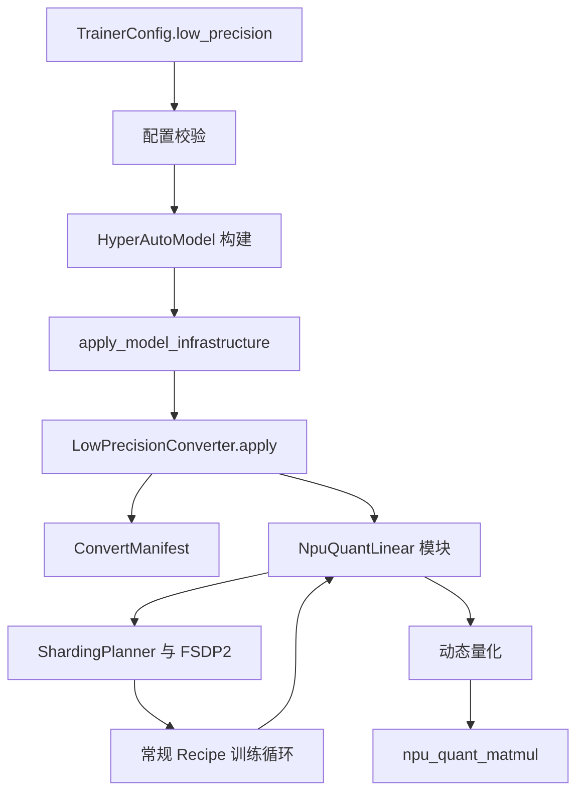

# HyperParallel NPU 低精训练方案

## 1. 范围与决策

本文为重构后的 `hyper_models/` 路径设计低精训练能力。它刻意不做成一个泛化的量化框架，而是先交付边界清晰、可验证的 NPU 训练闭环：

- 后端仅支持昇腾 NPU，直接调用 `torch_npu` 算子。
- 第一条支持路径是普通 `nn.Linear` 的动态 MXFP8 E4M3 训练。
- 第二种 Dense 格式是 HiF8 tensorwise 动态 scaling，但需在目标 CANN 版本完成 MXFP8 验证后再纳入。
- 只有前向、dgrad、wgrad 都实际执行 NPU 低精矩阵乘时，才称为“支持低精训练”。FakeQuant、仅保存 FP8 权重、或量化后仍执行 BF16 GEMM 都不等价。

第一版不承诺 MoE grouped GEMM、delayed scaling、激活重算时的量化缓存，以及所有 TP/CP/EP/FSDP 组合。它们会以明确里程碑逐项完成，而不是通过隐式回退伪装成已支持。

## 2. 设计哲学

### 2.1 低精是模型基础设施，不是训练循环开关

当前模型基础设施的既定顺序位于 `hyper_models/_transformers/infrastructure.py`：

```text
PP split -> PEFT -> QAT/FP8 -> freeze -> ShardingPlanner.plan()
         -> apply_sharding_plan -> torch.compile -> FSDP2 -> load weights
```

低精模块必须在 `QAT/FP8` 槽位完成安装，并发生在 planner 观察模型之前。全局 `fp8_autocast` 式训练循环 context 会使 planner 看不到模型真实的计算类型，也会把框架绑定到某一种模块实现。它适用于模型全部由 TE 模块组成的 Megatron，但不适合作为 HyperParallel 面向 HF/PyTorch 模型和 Dual-mode DTensor 的所有权模型。

因此，低精应是构建期的模型转换。训练循环仍只负责常规的 forward、backward、梯度同步、optimizer step 与 checkpoint。

### 2.2 format、scaling、target 必须正交

一个 `fp8: true` 过于含混。数值格式、scaling 方式和目标模块是独立变化的维度，必须在配置中保持独立：

| 维度 | 示例 | 决定内容 |
| --- | --- | --- |
| format | `mxfp8_e4m3`、`hif8` | 量化 tensor dtype 与 matmul dtype 入参 |
| scaling | `mx_block`、`tensorwise` | 量化算子和 scale 表示 |
| target | FQN include/exclude 规则 | 哪些模块边界执行低精 GEMM |
| fallback | `error`、`bf16` | 已选择目标不受支持时的行为 |

这与 NPU 算子实现相符：MXFP8 是 32 元素 block scale，HiF8 是 tensorwise 动态量化；二者不存在默认的从属关系。

### 2.3 低精层只拥有 GEMM 边界

标准 `nn.Parameter` 仍是 BF16/FP32 的权重真源。每次调用时，低精层量化本 rank 可见的 activation 与 weight shard，执行 NPU matmul，再返回 BF16/FP32 tensor。它不维护 master weight、optimizer state、FSDP all-gather、梯度归约或持久 scale history。

这样 `ShardingPlanner`、FSDP2、checkpoint 和 optimizer 仍分别是参数生命周期的唯一 owner。动态 MXFP8 和本文所述 HiF8 都没有跨 step 的 scale 状态，第一版也就不新增低精 checkpoint state。

## 3. 用户配置

`LowPrecisionConfig` 应是 `TrainerConfig` 的强类型字段，不能只是现有 `MixedPrecisionConfig` 的别名。mixed precision 描述参数、归约和累加策略；这里改变的是 GEMM 的执行方式。

```yaml
low_precision:
  enabled: true
  backend: npu
  format: mxfp8_e4m3
  scaling: mx_block
  include_fqns: []
  exclude_fqns:
    - "lm_head"
    - "*.router.gate"
    - "*.embed_tokens"
  fallback: error
  activation_checkpoint_mode: recompute
```

建议的 schema：

```python
@dataclass
class LowPrecisionConfig:
    enabled: bool = False
    backend: Literal["npu"] = "npu"
    format: Literal["mxfp8_e4m3", "hif8"] = "mxfp8_e4m3"
    scaling: Literal["mx_block", "tensorwise"] = "mx_block"
    include_fqns: list[str] = field(default_factory=list)
    exclude_fqns: list[str] = field(default_factory=list)
    fallback: Literal["error", "bf16"] = "error"
    activation_checkpoint_mode: Literal["recompute", "cache"] = "recompute"
```

配置规则：

- `mxfp8_e4m3` 必须搭配 `mx_block`，`hif8` 必须搭配 `tensorwise`；无效组合在配置解析阶段失败。
- 空的 `include_fqns` 表示选择所有合格的 Dense Linear，但仍受排除规则约束；排除规则优先级最高。
- FQN 用完整模块名的 glob 匹配，不使用子串匹配；manifest 记录最终精确命中的 FQN。
- 默认 `fallback: error`。shape、bias、device 或模块类型不满足约束时直接失败，避免“看起来开了 FP8、实际跑 BF16”。
- 第一版仅实现 `activation_checkpoint_mode: recompute`，即反传或重算时重新量化，不维护隐藏的全局栈。`cache` 只有在 autograd 与 `torch.compile` 的端到端正确性得到证明后才实现。

## 4. 分层架构



实现拆为五个小单元：

| 单元 | 职责 | 建议位置 |
| --- | --- | --- |
| Schema | 校验用户意图 | `hyper_models/trainer/config.py` |
| Converter | 选择 FQN、替换模块、生成 manifest | `hyper_models/components/training/low_precision/converter.py` |
| Dense 模块 | 保持 `weight`/`bias`，调用 autograd kernel | `.../low_precision/linear.py` |
| NPU kernel | format 对应的 quant/matmul 与能力校验 | `.../low_precision/npu_ops.py` |
| Manifest | 交付 converted、skipped 与 kernel 策略 | `.../low_precision/manifest.py` |

不建议把 QAT、GPU TorchAO、NPU kernel 和 reporting 全部塞入单个 `components/training/quantization.py`。使用 `low_precision/` 子包可以显式表达 NPU 专属边界，也为日后独立 QAT 能力留下空间。

### 4.1 转换契约

converter 的输入是已经构建的 `nn.Module`，不是 optimizer。它将每个满足条件的 `nn.Linear` 替换为 `NpuQuantLinear`，但必须保持：

- 原始 `weight` 与可选 `bias` 的 parameter object；
- `in_features`、`out_features`、`training`、`requires_grad`、dtype 与 device 语义；
- 模块 FQN 的稳定性，从而保持 FSDP、TP plan、state-dict key 和用户排除规则的含义不变。

`NpuQuantLinear` 增加显式标记，例如 `_hp_linear_compute_kind = "npu_quant"`。若当前 planner 模板使用精确类型判断，则扩展为识别此标记或小型 adapter registry；不要依赖它仍恰好是 `nn.Linear`。这是低精引入后 planner 所需的唯一类型兼容点。

转换结果不是仅打印日志，而是结构化 `ConvertManifest`：

```python
@dataclass
class ConvertManifest:
    backend: str
    format: str
    scaling: str
    converted: list[str]
    skipped: dict[str, str]
    kernel_contract: dict[str, str]

    def require_complete(self) -> None: ...
```

manifest 作为私有构建元数据附在 model 上，并在每个 rank 仅打印一次。它不是训练状态，因此不写进 checkpoint。当 `fallback == "error"` 时，任何被选择却未转换的目标都必须在 optimizer 创建之前报错。

### 4.2 Dense kernel 契约

`NpuQuantLinear` 只是一个包裹单一 autograd function 的薄模块；只有该 function 直接调用 `torch_npu`。

```text
forward:
  x, weight（BF16/FP32 local tensor）
    -> 动态量化 x 和 weight
    -> npu_quant_matmul
    -> 若当前 kernel contract 支持，则加 BF16 bias
    -> BF16/FP32 output

backward:
  grad_output
    -> 按 dgrad、wgrad 所需布局量化 grad_output
    -> npu_quant_matmul 计算 dgrad
    -> npu_quant_matmul 计算 wgrad
    -> 返回 grad_input、grad_weight、grad_bias
```

MXFP8 使用 `npu_dynamic_mx_quant` 或 `npu_dynamic_mx_quant_with_dual_axis`，然后以 E4M3/E8M0 scale 和 group size 32 的契约调用 `npu_quant_matmul`。dual-axis quantization 是优化，不是 v1 前提：只有在重算和 compile 交互已有端到端测试后才启用。正确性基线是每个所需方向都独立执行 single-axis quantization。

HiF8 使用 `npu_dynamic_quant` 得到 tensorwise HiF8 表示，并给 `npu_quant_matmul` 传入对应 `x1_dtype` 和 `x2_dtype`。精确算子参数、shape 约束和 bias 支持情况都收敛到 `npu_ops.py`，因为它们是 CANN 版本契约，而不是框架策略。

## 5. 并行与运行时契约

### 5.1 时序

完整数据流如下：

```text
构建模型
  -> PP split
  -> PEFT
  -> 低精转换
  -> freeze
  -> sharding plan 与模块包装
  -> compile/FSDP2
  -> 权重 materialize 与加载
  -> 构建 optimizer
```

这使 sharding plan 看到最终模块拓扑，同时 optimizer 在替换完成后仍看到原 parameter identity。

### 5.2 本地 shard 原则

量化发生在正常 TP/FSDP materialization 边界之后，使用模块可见的 local activation 和 local weight。低精模块不得自行执行 all-gather、reduce-scatter 或查询 process group；已有 precompiled boundary 与 FSDP wrapper 继续是通信的唯一 owner。

由此得到的约束：

- TP column/row Linear 只有在单卡与 TP 数值测试确认 local shape 满足 NPU kernel 契约后才纳入支持范围。
- FSDP 仅在目标模块 forward 时能取得 materialized local parameter 后才支持。converter 必须能处理 meta tensor：从模块元数据校验 shape，在 materialization 后再做 device capability check。
- tied embedding/LM head 默认排除。只替换共享 parameter 的一侧会使 state-dict 和 output 契约难以判断，需在后续单独设计。

### 5.3 当前仓库的前置项

新的 `hyper_models/` 训练路径中仍存在 CUDA 专属的设备选择，例如 `_transformers/auto_model.py` 传入 device 的逻辑，以及部分 gradient accumulation、signal handler 的实现。低精不能掩盖这一问题。对外宣称 NPU 端到端支持前，应先抽取共享 accelerator-device helper，并替换新 trainer path 的 CUDA 硬编码。这是前置工作流，不属于量化模块本身。

## 6. 构建 API

Recipe 通过已有 model build 调用传入配置：

```python
model, optimizer_init = build_model(
    cfg.model,
    peft_config=cfg.peft,
    low_precision_config=cfg.low_precision,
    distributed_setup=self.distributed_setup,
)
```

`build_model()` 将参数依次传到 `HyperAutoModelForCausalLM.from_pretrained()`、`_build_model()` 与 `apply_model_infrastructure()`。后者在 Step 5 调用 `apply_low_precision(model, config)`。该函数内部返回 `(model, manifest)`，但基础设施公共 API 继续只返回 model，避免扩大无关接口。

Recipe 在模型构建后记录 manifest。动态 scaling v1 不需要逐 step 开关、step counter、recipe override 或 checkpoint payload。

## 7. 分阶段落地

### Phase 0：先让 NPU 训练骨架可信

1. 将新 `hyper_models/` 训练路径的 CUDA 专属设备选择替换为已有 platform/device helper 或等价的小型 helper。
2. 使用 `examples/training_skeleton` 跑通单卡 NPU BF16 的 forward、backward、optimizer smoke test。
3. 添加测试，锁定“转换发生在 planning 和 optimizer 创建之前”的构建时序。

验收：重构后的 Recipe 能在 NPU 上以普通 BF16 模型连续训练多个 step。

### Phase 1：MXFP8 Dense MVP

1. 新增 `LowPrecisionConfig`、resolver 校验和带注释 YAML 样例。
2. 实现 FQN 选择、`ConvertManifest` 与无 bias Dense Linear 的 `NpuQuantLinear`。
3. 基于已确认的 `torch_npu` 契约实现 MXFP8 forward、dgrad 和 wgrad；bias 等 kernel 行为核实后再增加。
4. 在基础设施 Step 5 接入 converter，并交付 manifest。
5. 先验证一张 NPU 上的 tiny model，再验证 TP=2 的 Dense 模型。

验收：trace 证明三段 GEMM 都走 `npu_quant_matmul`；BF16 和 MXFP8 都能完成多个 optimizer step；manifest 没有未预期的 skipped target。

### Phase 2：生产安全与并行组合

1. 增加 shape/dtype/device capability 校验及 `fallback: bf16` 测试。
2. 分别验证 Dense TP 与 FSDP2 组合，不能将未测组合归入“支持”。
3. 覆盖 activation checkpoint 的 `recompute`；之后才 benchmark dual-axis cache，并仅在 autograd/compile 结果确定时实现 `cache`。
4. 增加按 FQN 统计的 kernel counter 或 profiler marker，使性能结论能证明实际命中目标路径。

验收：支持拓扑矩阵明确标注测试结果与硬件/CANN 版本，而不是根据未测代码路径推断。

### Phase 3：HiF8 tensorwise

1. 在 `npu_ops.py` 实现独立的 `HiF8KernelPolicy`，不要让 Dense module 堆叠 format 分支。
2. 在目标 CANN 版本校验 NPU 算子入参与数值行为。
3. 按 MXFP8 的同一标准完成 Dense、TP、FSDP、checkpoint 和 activation checkpoint 验证矩阵。

### Phase 4：MoE grouped GEMM

MoE 是独立 converter 和模块契约：

```text
token dispatch / ordering
  -> NpuQuantGroupedExperts
  -> npu_grouped_matmul forward 与 dgrad
  -> grouped quantization + npu_grouped_matmul wgrad
```

必须在模型原生 token dispatcher 与 grouped GEMM 的实现确定后接入。converter 顺序须明确：dispatcher 与基础 grouped-GEMM 转换先于低精 grouped experts。通用 `nn.Linear` 替换不能替代这项工作。

## 8. 验证证据

能力矩阵中的每一个“支持”单元格都需要以下全部证据：

| 证据 | 证明内容 |
| --- | --- |
| Converter 单测 | FQN 规则、排除、异常、manifest、parameter identity |
| Mock kernel 单测 | format 分派、tensor 方向、输出 shape、bias gradient |
| NPU 算子测试 | forward/dgrad/wgrad 调用目标算子且满足 shape 约束 |
| 数值对比 | 相比 BF16 的 loss 有限，输出和梯度误差有界 |
| 端到端 smoke | 经由 Recipe 完成 optimizer 更新和重复 step |
| 分布式测试 | 声称的 TP/FSDP/EP 组合在对应拓扑实际运行 |
| Trace/profiler | 真实目标 GEMM 命中 `npu_quant_matmul` 或 `npu_grouped_matmul` |

manifest 是配置证据，trace 是执行证据，两者缺一不可。模块被转换并不等于实际执行过程中一定命中目标 kernel，例如未来的 graph break 或不支持的 runtime path 都可能改变执行路径。

## 9. 非目标与延后决策

- 本功能不建立通用 GPU/TorchAO 抽象。后续 GPU 后端可以复用配置语义，但不应强迫 NPU kernel 走最低公分母的接口。
- v1 不做 delayed scaling。它会引入 amax history、更新时机和 checkpoint state，是独立的有状态设计。
- 不做自动 recipe 搜索、自动 fallback 选择，也不声称框架自动找到了数值安全的配置。
- 不替换所有 matmul 类算子。attention、embedding、router logits、loss、normalization 和不支持的 projection 保持原精度，直到后续能力矩阵明确选择它们。

该方案保持用户接口简洁，遵循重构后项目的构建期所有权边界，并让每一条宣称支持的 NPU 低精路径都有可测试的定义。
