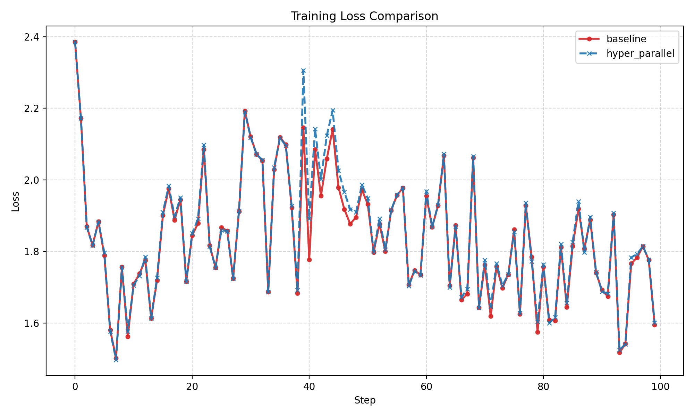
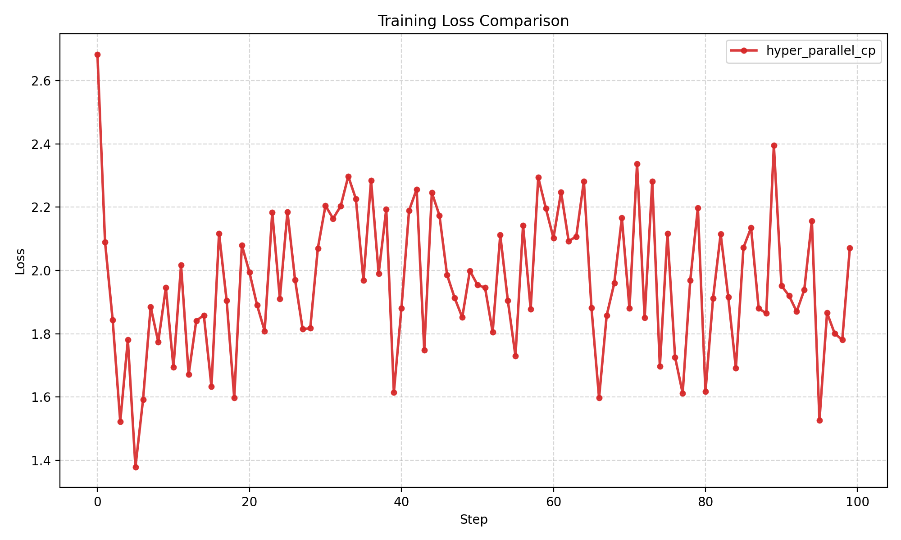
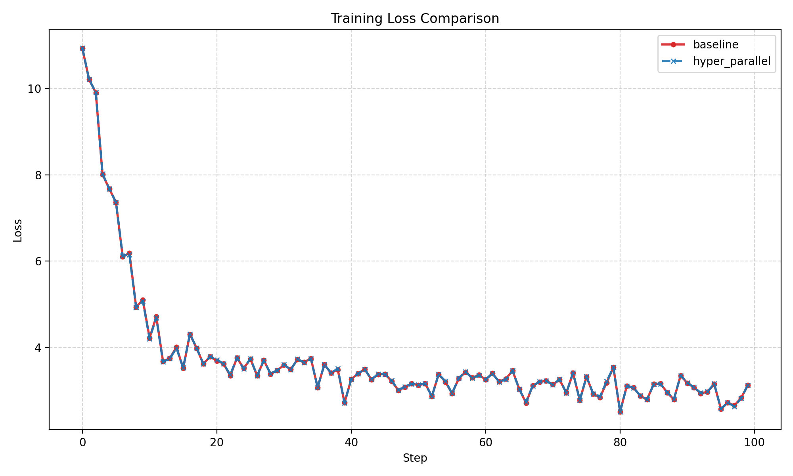

# Llama Factory训练说明文档

## 版本及示例

**请严格按照给出的版本进行实验，已发现torch/torch-npu/cann/机器(910B/910C)有较严格的对应关系。**

基础环境

| **项目** | **配置**  |
|----------|-----------|
| 计算设备 | 昇腾 910C |
| CANN     | 8.5.2     |
| Python   | 3.11.10   |

框架与依赖

| **框架**      | **版本**    | **代码**                                           |
|---------------|-------------|----------------------------------------------------|
| LlamaFactory  | master      | <https://github.com/hiyouga/LlamaFactory>          |
| HyperParallel | master      | <https://gitcode.com/mindspore/hyper-parallel.git> |
| Transformers  | 4.57.1      |                                                    |
| Accelerate    | 1.11.0      |                                                    |
| torch         | 2.7.1       |                                                    |
| torch\_npu    | 2.7.1.post4 | torch\_npu按对应版本安装，此处仅为参考             |
| torchvision   | 0.22.1      |                                                    |
| torchaudio    | 2.7.1       |                                                    |
| trl           | 0.24.0      |                                                    |
| datasets      | 4.0.0       |                                                    |
| peft          | 0.18.0      |                                                    |

## yaml配置

`qwen3vlmoe_full_sft_fsdp2.yaml`

```yaml
# Start FSDP2 fine-tuning
# accelerate launch \
#     --config_file examples/accelerate/fsdp2_config.yaml \
#     src/train.py examples/ascend/qwen3vlmoe_full_sft_fsdp2.yaml
# Change `num_processes` in fsdp2_config.yaml to 16 in A3

### model
model_name_or_path: /home/ma-user/work/bucket-910c-6055/yushi/qwen30b_vl
image_max_pixels: 262144
video_max_pixels: 16384
trust_remote_code: true
use_v1_kernels: true
flash_attn: fa2

use_hyper_parallel: true
hyper_parallel_cp_size: 2

### method
stage: sft
do_train: true
finetuning_type: full
disable_gradient_checkpointing: false

### dataset
dataset: llava_1k_en, llava_1k_zh
template: qwen3_vl
cutoff_len: 16384
overwrite_cache: true
preprocessing_num_workers: 16
dataloader_num_workers: 4

### output
output_dir: saves/Qwen3-VL-30B-A3B-Instruct/full/sft
logging_steps: 1
save_steps: 1000
max_steps: 100
plot_loss: true
overwrite_output_dir: true
save_only_model: true
report_to: none  # choices: [none, wandb, tensorboard, swanlab, mlflow]

### train
per_device_train_batch_size: 1
gradient_accumulation_steps: 1
learning_rate: 1.0e-4
lr_scheduler_type: cosine
warmup_ratio: 0.1
bf16: true
ddp_timeout: 180000000
resume_from_checkpoint: null
seed: 1234

# packing: true
```

## 启动命令

先下载模型权重，将yaml文件中model\_path替换为上述文件夹路径。

accelerate config:

```yaml
compute_environment: LOCAL_MACHINE
debug: false
distributed_type: FSDP
downcast_bf16: 'no'
fsdp_config:
  fsdp_auto_wrap_policy: TRANSFORMER_BASED_WRAP
  fsdp_cpu_ram_efficient_loading: true
  fsdp_offload_params: false
  fsdp_reshard_after_forward: true
  fsdp_state_dict_type: FULL_STATE_DICT
  fsdp_version: 2
machine_rank: 0
main_training_function: main
mixed_precision: bf16  # or fp16
num_machines: 1  # the number of nodes
num_processes: 16  # the number of GPUs in all nodes
rdzv_backend: static
same_network: true
tpu_env: []
tpu_use_cluster: false
tpu_use_sudo: false
use_cpu: false
```

Hyper Parallel FSDP启动命令：

```bash
accelerate launch --config_file examples/accelerate/fsdp2_config.yaml src/train.py examples/ascend/qwen3vlmoe_full_sft_fsdp2.yaml
```

即可跑通Hyper Parallel FSDP的训练流程。

## 精度验证

### Torch FSDP/ Hyper FSDP精度对比

**Model:** Qwen3-VL-30B-A3B-Instruct

**Configuration:**

-   Basline torch FSDP, ours hyper FSDP

-   16 cards

-   BF16

-   per\_device\_batch\_size=1

-   cutoff\_len=16384



### Hyper FSDP + CP精度

**Model:** Qwen3-VL-30B-A3B-Instruct

**Configuration:**

-   Hyper FSDP + CP

-   16 cards

-   CP size 2

-   BF16

-   per\_device\_batch\_size=1

-   cutoff\_len=16384



### Hyper FSDP/Hyper FSDP + CP精度对比

**Model:** Qwen3-VL-30B-A3B-Instruct(num\_hidden\_layers=24)

**Configuration:**

-   Baseline 8 NPU FSDP, ours 8NPU FSDP + CP\_SIZE 2

-   16 cards

-   BF16

-   per\_device\_batch\_size=1

-   cutoff\_len=16384



## 性能

| **方案**        | **性能**    |
|-----------------|-------------|
| torch FSDP      | 4.4 s/iter  |
| hyper FSDP      | 3.54 s/iter |
| hyper FSDP + CP | 2.96s/iter  |
