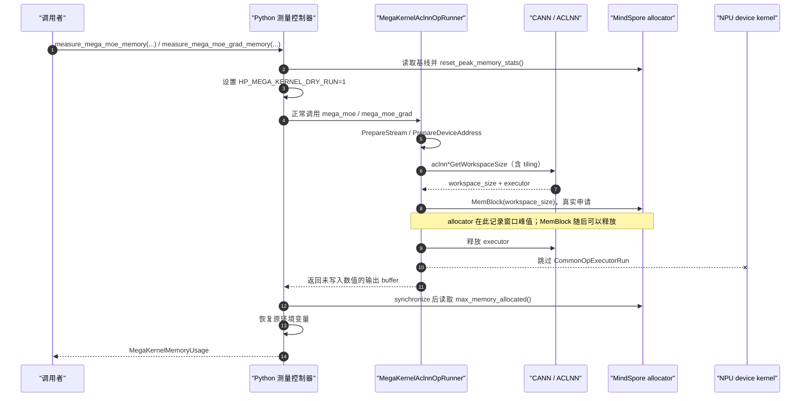
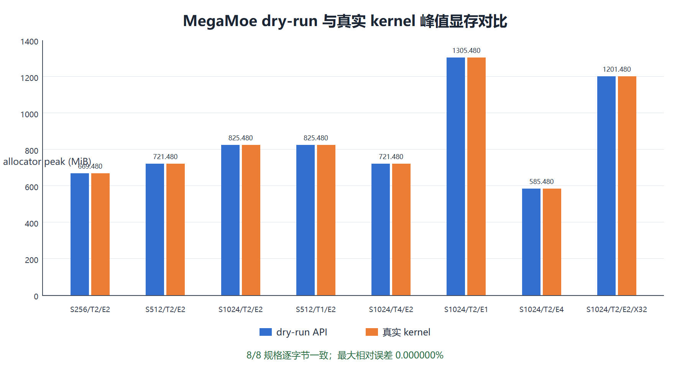
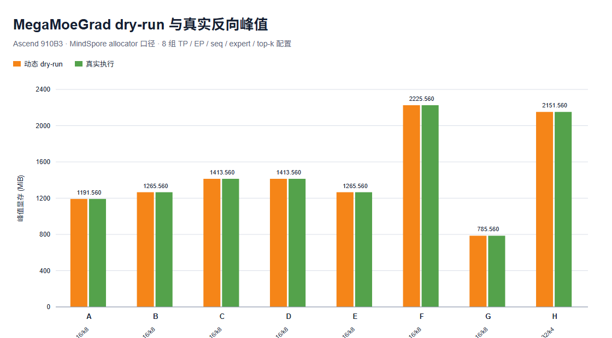

# Mega Kernel 动态 dry-run 显存评估设计与验证报告

## 1. 背景、目标与结论

静态 API 无需设备，适合部署前规划，但每增加一种 mega kernel 都要维护规格和计算公式。本方案为
`mega_moe` 前向与 `mega_moe_grad` 反向提供同一套算子级 dry-run 能力：真实执行 Python 前端、
MindSpore PyBoost 调度、Tensor device address 准备、ACLNN `GetWorkspaceSize`、tiling 和 workspace
分配，但在 `CommonOpExecutorRun` 前终止，不向 NPU 提交对应 MegaKernel device kernel。

正反向便捷接口为：

```python
from hyper_parallel.core.multicore import (
    measure_mega_kernel_memory,
    measure_mega_moe_grad_memory,
    measure_mega_moe_memory,
)

forward = measure_mega_moe_memory(*mega_moe_args)
backward = measure_mega_moe_grad_memory(*mega_moe_grad_args)

future = measure_mega_kernel_memory(
    "mega_xxx",
    lambda: mega_xxx(*kernel_args),
)
```

在 Ascend 910B3 上验证的前向 8 组和反向 8 组规格中，dry-run 返回的
`allocator_peak_bytes` 与随后真实执行对应 kernel 的
`mindspore.runtime.max_memory_allocated()` 全部逐字节一致，最大相对误差为 0%。

## 2. 方案选择与适用范围

MindSpore 全局编译模拟通过 `MS_SIMULATION_LEVEL` 跳过设备执行。MegaMoe 原型验证表明，该模式下
vendor `GetWorkspaceSize` 返回 0：前向会漏掉 95,421,440 B、反向会漏掉 99,615,744 B 的
ACLNN workspace。因此本方案采用更窄的“算子级 dry-run”：保留真实 host-side 规划与分配，只跳过
最终 device launch。

| 工具 | 是否需要 NPU/HCCL | 是否执行 MegaKernel | 新 kernel 是否写公式 | 主要用途 |
|---|---|---|---|---|
| 静态 `estimate_*` | 否 | 否 | 是 | 离线容量规划 |
| 动态 `measure_*` | 是 | 否 | 否，只接通通用 runner | 运行环境精确测量 |
| 真实执行 + `max_memory_allocated` | 是 | 是 | 否 | 最终验证基准 |

## 3. 正反向统一设计

### 3.1 核心思路：只剪掉最后一步

| 阶段 | 真实执行 | 动态 dry-run | 为什么 dry-run 必须保留 |
|---|---:|---:|---|
| Python 参数检查与输出创建 | 是 | 是 | 决定输出、runtime config 等常驻内存 |
| Stream 和 Tensor device address 准备 | 是 | 是 | 触发输入/输出地址物化 |
| ACLNN `GetWorkspaceSize`、tiling、executor 创建 | 是 | 是 | workspace 大小由真实规格和 CANN 版本决定 |
| 通过 MindSpore allocator 申请 workspace | 是 | 是 | 只有真实申请才能进入 allocator 峰值统计 |
| `CommonOpExecutorRun` / device kernel | 是 | **否** | 这是 dry-run 唯一主动跳过的核心步骤 |
| 读取 allocator 峰值 | 是 | 是 | 自动保留已经释放过的瞬时峰值 |



正反向使用同一个 `MegaKernelAclnnOpRunner` 和 `SET_MEGA_KERNEL_ACLNN_FUNC`：

```cpp
auto runner = std::make_shared<MegaKernelAclnnOpRunner>("MegaXxx");
SET_MEGA_KERNEL_ACLNN_FUNC(runner, aclnnMegaXxx, args...);
```

新增 mega kernel 时，Python 层可直接复用通用接口，不需要注册 Spec、枚举 `MemoryComponent` 或
维护显存公式。正反向便捷包装只负责固定名称和转发参数。

### 3.2 测量窗口与峰值语义

接口在输入、输出、显式 workspace、runtime config、tiling 等调用参数准备完成后开始测量：

1. 读取 dry-run 前 `memory_allocated()`；
2. 重置 peak 统计；
3. 执行一次 host planning-only dry-run；
4. 同步并读取 dry-run 后 live bytes 与窗口内 `max_memory_allocated()`；
5. 三者取最大值作为 `allocator_peak_bytes`。

因此 ACLNN workspace 即使随后被释放，也会被峰值计数器捕获。动态方案不是把所有申请简单相加，
而是由 allocator 按实际申请/释放时序计算峰值，天然适配正反向中途释放、buffer 复用和并行切分
导致的 workspace 变化。

### 3.3 对称内存口径

前向的 `dispatch_target`、`combine_target`，反向的 `dispatch_target`、`grad_x` 和公共
event counters 位于 ACLSHMEM 对称 heap。结果模型统一返回：

```text
allocator_peak_bytes                = MindSpore allocator 峰值
external_reservation_overhead_bytes = symmetric heap - 当前 live 对称 Tensor 逻辑字节
peak_bytes                          = 两者之和
```

这里的 live 不是“正在执行计算”，而是“Tensor 对象仍然存活、其 backing storage 尚未释放”。
对称 Tensor 用弱引用登记，Tensor 对象销毁后弱引用失效，统计前会将其清理，避免跨调用累积。
接口使用锁保护进程级 dry-run 开关，并在成功或异常路径恢复调用前环境变量。

### 3.4 正反向差异由运行时自动捕获

| 项目 | mega_moe 前向 | mega_moe_grad 反向 |
|---|---:|---:|
| 主要输出 | 5 个 | 7 个 |
| GMM tiling | 2 份 | 4 份 |
| SwiGLU-grad 显式 workspace | 无 | 16 MiB |
| ACLNN workspace 原始值 | 95,420,928 B | 99,615,232 B |
| ACLNN workspace 对齐值 | 95,421,440 B | 99,615,744 B |

这些差异都来自实际 Tensor 参数和 `GetWorkspaceSize`，动态 API 本身没有正向或反向内存公式。

### 3.5 限制

- 这是“kernel 不执行”，不是“完全不接触设备”：真实 allocator、ACLSHMEM 和 vendor workspace
  仍要求初始化 Ascend、HCCL 和 ACLNN；
- 测量窗口不包含调用参数构造峰值；整网峰值应在更外层重置并读取 runtime 统计；
- 当前支持 MindSpore，Torch 后端明确抛出 `NotImplementedError`；
- 不允许与 `MS_SIMULATION_LEVEL=0/1/2` 混用；
- dry-run 不验证数值，因为输出 buffer 未被 kernel 写入；
- 若未来 device kernel 内部直接申请 HBM，host planning 无法观察该部分，应把它暴露为 workspace
  或保留少量真实执行校准。

## 4. 代码实现逐步拆解

本节按一次调用从 Python 到 C++、再回到统计结果的顺序说明每处改动。每一步都回答三个问题：
“改了什么”“为什么需要”“缺少它会怎样”。

### 4.1 第一步：用零参数 callable 包住待测 kernel

文件：`hyper_parallel/core/multicore/__init__.py`

新增通用入口：

```python
measure_mega_kernel_memory(kernel_name, kernel_call)
```

其中 `kernel_call` 是一个尚未执行的零参数 callable。正反向便捷接口只是把原调用延迟到测量窗口内：

```python
def measure_mega_moe_memory(*args, **kwargs):
    return measure_mega_kernel_memory(
        "mega_moe",
        lambda: mega_moe(*args, **kwargs),
    )
```

| 设计点 | 目的 | 如果没有这一步 |
|---|---|---|
| 传 callable，而不是已计算的返回值 | 先打开统计窗口和 dry-run 开关，再执行 kernel 调用 | kernel 会在测量开始前已经执行，无法控制和计量 |
| 通用 `kernel_name + kernel_call` | 新 MegaKernel 复用同一控制器 | 每新增 kernel 都要复制一套测量代码 |
| `measure_mega_moe_*` 便捷包装 | 保持用户接口直观，并集中固定统计名称 | 每个调用者都要自己写 lambda 和名称，容易写错 |
| 通过 platform handler 分派 | core 层不直接导入 MindSpore/Torch | 破坏项目的平台抽象，也无法清楚表达后端能力差异 |

这里的“延迟执行”很关键：API 并不是先执行 `mega_moe` 再去读内存，而是先把门口的计数器归零，
再让被包装的调用从门内经过。

### 4.2 第二步：建立边界清楚、异常安全的测量窗口

文件：`hyper_parallel/platform/mindspore/multicore/__init__.py`

MindSpore handler 是 Python 侧的测量控制器，核心流程可简化为：

```python
with _dryrun_lock:
    before = memory_allocated()
    reset_peak_memory_stats()
    previous = os.environ.get("HP_MEGA_KERNEL_DRY_RUN")
    os.environ["HP_MEGA_KERNEL_DRY_RUN"] = "1"
    try:
        kernel_call()
        synchronize()
    finally:
        restore_environment(previous)

    after = memory_allocated()
    peak = max(before, after, max_memory_allocated())
```

各行并非样板代码，而是在定义测量的正确性边界：

| 改动 | 目的 | 如果没有这一步 |
|---|---|---|
| `_dryrun_lock` | 串行保护进程级环境开关和进程级 peak counter | 两个线程可能互相关闭开关或重置对方的峰值 |
| 读取 `before` | 保留调用前已存活的输入、输出和长期 buffer | `reset_peak_memory_stats()` 后某些 runtime 实现可能只关注窗口增量 |
| `reset_peak_memory_stats()` | 将历史峰值从本次结果中排除 | 前一次更大的用例会污染当前小规格结果 |
| 设置 `HP_MEGA_KERNEL_DRY_RUN=1` | 只让接通该 runner 的 MegaKernel 走 planning-only 分支 | 无法在正常框架流程中精确控制 launch 分叉点 |
| `try/finally` 恢复旧值 | 成功、kernel 异常、同步异常时都不泄漏 dry-run 状态 | 后续正常训练可能被误切到 dry-run，且这类错误很隐蔽 |
| `synchronize()` | 排空窗口前已有异步工作，并让框架侧记账稳定 | 读取 peak 时可能仍有异步分配/释放未完成 |
| `max(before, after, runtime_peak)` | 同时覆盖已有 live set、窗口瞬时峰值和调用后仍存活对象 | 无瞬时申请或延迟物化场景可能被低估 |

接口显式拒绝与 `MS_SIMULATION_LEVEL=0/1/2` 混用。原因不是两者概念重复，而是全局模拟模式会让
CANN `GetWorkspaceSize` 返回 0；继续返回一个看似正常的数字，比直接报错更危险。

### 4.3 第三步：把 C++ 分叉点放在“规划之后、执行之前”

文件：
`hyper_parallel/core/multicore/platform/mindspore/c_api/common/mega_kernel_aclnn_op_runner.h`

新增 `MegaKernelAclnnOpRunner`。它复用 PyBoost runner 的真实准备路径，分支逻辑可概括为：

```cpp
PrepareStream();
PrepareDeviceAddress();
MallocDeviceAddress();

if (IsMegaKernelDryRun()) {
  auto [workspace_size, executor, release] = GEN_EXECUTOR(aclnn_name, args...);
  auto workspace = MemBlock(device_context, workspace_size, stream);
  release(executor);
  return;  // 唯一被剪掉的是后续 launch
}

MallocWorkspace();
DispatchLaunchTask();
```

这里有三个刻意保留的层次：

1. `PrepareStream`、`PrepareDeviceAddress` 和 `MallocDeviceAddress` 保留框架对输入/输出地址的真实
   准备过程；如果 Python 层看到 dry-run 就直接返回，这部分内存会全部漏掉。
2. `GEN_EXECUTOR` 真实调用对应 ACLNN `GetWorkspaceSize`，CANN 会根据实际 tensor shape、TP/EP
   切分、expert 数和当前算子库版本完成 tiling，并返回 workspace 大小。
3. `MemBlock` 不是“把 workspace_size 加到结果”，而是通过 MindSpore allocator 做一次真实申请。
   它离开作用域时可以正常释放，但 runtime peak counter 已经记住它存活时的峰值。

最后的 `return` 阻止 `_DispatchLaunchTask()`，所以不会进入 `CommonOpExecutorRun`，也不会向 NPU
提交 MegaMoe/MegaMoeGrad device kernel。`LaunchKernel()` 被实现为空，避免基类默认路径额外发起一次
launch；正常模式统一由 runner 保存的 `launch_func` 执行。

内存生命周期可以直观看成：

```text
时间 ───────────>  调用前      地址准备       CANN 规划       dry-run 返回
输入/输出 live     █████████████████████████████████████████████████
runtime/tiling                  ████████████████████
ACLNN workspace                              ███████████
device kernel                                             （跳过）
allocator peak                                ▲ 记录这一刻的总量
```

这也解释了为什么中途释放不会导致低估：动态方案读的是“历史最高水位”，不是函数返回时还剩多少。

### 4.4 第四步：让正向和反向接入同一个 runner

文件：

- `hyper_parallel/core/multicore/platform/mindspore/c_api/mega_moe/mega_moe_pynative.cc`
- `hyper_parallel/core/multicore/platform/mindspore/c_api/mega_moe_grad/mega_moe_grad_pynative.cc`

两处改动的模式相同：把原 `AclnnOpRunner` 替换为 `MegaKernelAclnnOpRunner`，并用公共宏同时登记
正常 launch 函数和 dry-run planning 函数：

```cpp
auto runner = std::make_shared<MegaKernelAclnnOpRunner>("MoeFwd");
SET_MEGA_KERNEL_ACLNN_FUNC(runner, aclnnMegaMoe, aclnn_args...);
runner->Run(inputs, {});
```

这里的“接线”是工程上的形象说法，含义是：把通用 runner 的两个插槽连接到这个具体算子的
ACLNN API 和实际参数，并不涉及通信链路或硬件布线。公共宏实际完成两次注册：

```cpp
runner->SetLaunchFunc(
    LAUNCH_ACLNN_FUNC(aclnnMegaMoe, aclnn_args...));
runner->SetDryRunFunc(
    MEGA_KERNEL_DRYRUN_ACLNN_FUNC(aclnnMegaMoe, aclnn_args...));
```

必须同时设置两个回调，因为同一个 runner 要支持两种互斥运行模式。`_Run()` 在运行时读取
`HP_MEGA_KERNEL_DRY_RUN`：值为 `1` 时调用 `dryrun_func_`，否则调用 `launch_func_`。两个
回调都捕获同一组 ACLNN 参数，保证两条路径面对完全相同的 Tensor shape、属性和输出地址。

| 回调 | 内部关键动作 | 是否申请 ACLNN workspace | 是否提交 device kernel |
|---|---|---:|---:|
| `LAUNCH_ACLNN_FUNC` | 调用 MindSpore `LAUNCH_ACLNN`：获取/复用 executor、申请 workspace、dispatch launch，并处理同步或跨流地址 | 是 | **是** |
| `MEGA_KERNEL_DRYRUN_ACLNN_FUNC` | 调用 `GEN_EXECUTOR` 完成 `GetWorkspaceSize` 和 tiling，申请同尺寸 `MemBlock`，随后释放 executor | 是 | **否** |

若只设置 `SetLaunchFunc`，真实模式正常，但 dry-run 分支没有 planning callback；若只设置
`SetDryRunFunc`，测量能运行，但正常训练没有 launch callback。将分支判断放在 runner 中、将两种
具体动作分成两个 callback，可以原样复用 MindSpore 的正常 `LAUNCH_ACLNN_FUNC`，避免在其宏内部
侵入式修改。

反向仅把名称和 ACLNN 函数换成 `MoeBwd` / `aclnnMegaMoeGrad`。原有输入 Tensor 列表、输出创建、
属性参数和返回签名都保持不变，目的是确保正常执行行为不变，而且 dry-run 看到的 live set 与真实
调用一致。

对后续 `mega_xxx`，C++ 接入只需要使用公共 runner 和宏；Python 可以直接调用
`measure_mega_kernel_memory("mega_xxx", lambda: mega_xxx(...))`。新增 kernel 不需要增加显存公式，
但仍需做一次小而明确的 runner 接线，因为只有 kernel 封装层知道对应的 ACLNN 函数及参数列表。

### 4.5 第五步：返回可审计的结果，而不是一个黑盒整数

文件：`hyper_parallel/core/multicore/dryrun_memory.py`

`MegaKernelMemoryUsage` 是不可变结果对象，保留以下原始量：

| 字段 | 含义 |
|---|---|
| `allocated_before_bytes` | 测量窗口打开前的 allocator live bytes |
| `allocated_after_bytes` | dry-run 返回后的 allocator live bytes |
| `allocator_peak_bytes` | 窗口内实际 allocator 最高水位 |
| `external_reserved_bytes` | allocator 统计之外的对称 heap 总预留量 |
| `external_logical_bytes` | 对称 heap 中已被 live Tensor 使用的逻辑量 |

最终口径为：

```text
external_reservation_overhead_bytes = external_reserved_bytes - external_logical_bytes
peak_bytes = allocator_peak_bytes + external_reservation_overhead_bytes
```

保留分项的目的，是让测试、日志和调用者能够解释结果来源。若只返回 `peak_bytes`，数值不一致时
无法判断是 allocator workspace、常驻 Tensor，还是外部对称 heap 造成的。

### 4.6 第六步：补齐 allocator 看不到的对称内存

文件：`hyper_parallel/platform/mindspore/symmetric_memory/symmetric_memory.py`

这里需要区分“内存由谁提供”和“申请量由谁记账”：

1. 首次对称 Tensor 分配会调用 `Alloc` 并懒初始化 ACLSHMEM；初始化把 `SYMMETRIC_MEMORY_HEAP_SIZE` 作为 `local_mem_size` 传给 `aclshmemx_init_attr(...)`，由外部 `libhpshmem` 在内部预留一整块对称 heap，记为 `H`。
2. `MSSymmetricMemoryHandler.empty()` 进入 `ms.runtime.use_mem_pool(_mem_pool)`，只在当前线程、
   当前上下文内把 Tensor 分配路由到 ACLSHMEM 的 `PluggableAllocator`。因此该 Tensor 的实际
   backing storage 来自对称 heap。
3. MindSpore 仍然管理这个 Tensor 的逻辑分配记录，所以 `memory_allocated()` /
   `max_memory_allocated()` 能看到已切给 live 对称 Tensor 的逻辑字节，记为 `L`。
4. ACLSHMEM 在底层预留但尚未切给 Tensor 的 `H - L`，MindSpore 的 allocated 口径看不到。

这**不表示 MindSpore 默认 allocator 会复用对称 heap 的空闲部分**。普通 Tensor 仍使用默认
MindSpore 内存池；只有放在 `use_mem_pool(_mem_pool)` 上下文里的分配才会被路由到 ACLSHMEM。
对称 heap 的剩余部分继续由 ACLSHMEM 保留，不能直接拿给普通 Tensor 使用。

因此总物理占用不能把 `H` 整块再次加到 allocator peak 上，因为其中的 `L` 已经计过一次；正确
补量是：

```text
A = MindSpore allocator peak（其中已包含 live 对称 Tensor 的逻辑量 L）
H = ACLSHMEM 对称 heap 的完整物理预留
总峰值 = A + (H - L)
```

例如 `H = 1024 MiB`、live 对称 Tensor 共 `L = 128 MiB`，若 MindSpore 报告的 allocator peak
`A = 700 MiB` 已含这 128 MiB，则只补 `896 MiB`，总量为 `1596 MiB`。直接计算
`A + H` 会把 128 MiB 重复计算。

这里的 live 表示 Tensor 对象及其 backing storage 尚未释放，并不表示它此刻正在被 kernel 读写。
每次 `empty()` 创建对称 Tensor 时记录“弱引用 + 逻辑字节数”；统计前删除失效弱引用，再求 `L`。
弱引用不会延长 Tensor 生命周期，避免统计器自己造成显存无法释放。

该文件还为 compile simulation 保留普通 `mint.empty` 和 barrier no-op 保护，避免其他编译模拟
流程误初始化 ACLSHMEM。但动态测量 API 仍明确拒绝 simulation：这个保护只保证辅助模块可用，
不能让被全局模拟短路的 `GetWorkspaceSize` 恢复真实 workspace。

### 4.7 第七步：明确后端能力边界

文件：`hyper_parallel/platform/torch/multicore/__init__.py`

Torch handler 当前明确抛出 `NotImplementedError`，而不是悄悄执行真实 kernel、返回 0 或套用
MindSpore 逻辑。这样通用 Python API 可以保持跨平台入口稳定，同时让尚未实现的后端尽早、明确
失败。未来 Torch 若具备等价的 planning/allocator hook，只需在对应 handler 实现相同结果契约。

### 4.8 正常、异常与并发路径如何收口

| 场景 | 行为 |
|---|---|
| 正常 dry-run | 规划、申请、释放，恢复旧环境变量，返回结果 |
| `kernel_call` 抛异常 | `finally` 恢复环境变量，原异常继续抛出，不伪造测量结果 |
| `synchronize` 抛异常 | 同样恢复环境变量并传播异常 |
| 调用前已有同名环境变量 | 结束后恢复原值，而不是无条件删除 |
| 多线程同时测量 | `_dryrun_lock` 让完整测量窗口串行化 |
| 全局 simulation 已启用 | 在调用 kernel 前报错，避免返回 workspace 缺失的错误结果 |

### 4.9 改动、风险与测试的对应关系

| 改动 | 主要风险 | 对应测试 |
|---|---|---|
| 结果模型与对称 heap 修正 | 非法负数、重复计数、单位换算错误 | 构造、校验、派生属性测试 |
| 通用 API 与正反向包装 | 参数丢失、名称错误、提前执行 | 分派与 forward/backward 转发测试 |
| MindSpore 测量窗口 | peak 读取顺序错误、开关泄漏 | 正常调用、异常恢复、已有环境变量测试 |
| simulation 防护 | 返回 workspace=0 的假精确结果 | simulation 拒绝测试 |
| Torch 能力边界 | 误执行用户 callback | `NotImplementedError` 且 callback 未调用测试 |
| C++ planning-only runner | workspace 漏计或 kernel 偷跑 | 真实 16 组峰值对比与 CANN launch 日志验证 |

因此，代码改动不是简单地“增加一个环境变量判断”。它形成了一条闭环：Python 精确定义测量窗口，
C++ 在正确位置切断执行，allocator 记录真实时间线，对称内存补齐外部预留，最后用分项结果和真实
执行/CANN 日志共同验证。

## 5. 验证环境与方法

- 硬件：Ascend 910B3，20 个 Cube core；
- 软件：MindSpore 2.10、CANN 9.0；
- 固定维度：hidden=5120、intermediate=2048、BF16；
- 显式 workspace：GMM 32 MiB，反向另有 SwiGLU-grad 16 MiB；
- 对称 heap：1 GiB；
- dry-run：参数准备完成后调用对应 `measure_*`，读取 `allocator_peak_bytes`；
- 基准：在同一进程和相同参数上重置 peak，真实执行一次对应 kernel，同步后读取
  `max_memory_allocated()`；
- 每组比较 rank 0，多 rank 抽查结果一致。

## 6. 正反向多规格验证结果

### 6.1 mega_moe 前向

| ID | seq | TP | EP | experts | top-k | T/rank | dry-run (MiB) | 真实执行 (MiB) | 差值 |
|---:|---:|---:|---:|---:|---:|---:|---:|---:|---:|
| A | 256 | 2 | 2 | 16 | 8 | 1024 | 669.480 | 669.480 | 0 B |
| B | 512 | 2 | 2 | 16 | 8 | 2048 | 721.480 | 721.480 | 0 B |
| C | 1024 | 2 | 2 | 16 | 8 | 4096 | 825.480 | 825.480 | 0 B |
| D | 512 | 1 | 2 | 16 | 8 | 4096 | 825.480 | 825.480 | 0 B |
| E | 1024 | 4 | 2 | 16 | 8 | 2048 | 721.480 | 721.480 | 0 B |
| F | 1024 | 2 | 1 | 16 | 8 | 4096 | 1305.480 | 1305.480 | 0 B |
| G | 1024 | 2 | 4 | 16 | 8 | 4096 | 585.480 | 585.480 | 0 B |
| H | 1024 | 2 | 2 | 32 | 4 | 2048 | 1201.480 | 1201.480 | 0 B |



### 6.2 mega_moe_grad 反向

| ID | seq | TP | EP | experts | top-k | T/rank | dry-run (MiB) | 真实执行 (MiB) | 差值 |
|---:|---:|---:|---:|---:|---:|---:|---:|---:|---:|
| A | 256 | 2 | 2 | 16 | 8 | 1024 | 1191.560 | 1191.560 | 0 B |
| B | 512 | 2 | 2 | 16 | 8 | 2048 | 1265.560 | 1265.560 | 0 B |
| C | 1024 | 2 | 2 | 16 | 8 | 4096 | 1413.560 | 1413.560 | 0 B |
| D | 512 | 1 | 2 | 16 | 8 | 4096 | 1413.560 | 1413.560 | 0 B |
| E | 1024 | 4 | 2 | 16 | 8 | 2048 | 1265.560 | 1265.560 | 0 B |
| F | 512 | 2 | 1 | 16 | 8 | 2048 | 2225.560 | 2225.560 | 0 B |
| G | 512 | 2 | 4 | 16 | 8 | 2048 | 785.560 | 785.560 | 0 B |
| H | 512 | 2 | 2 | 32 | 4 | 1024 | 2151.560 | 2151.560 | 0 B |



正反向共 16 组均逐字节一致，最大相对误差 0%。B/E 和 C/D 的局部 shape 等价，得到完全一致
峰值；反向 EP 从 1 增加到 4 时，本地权重和权重梯度同时减小，峰值由 2225.560 MiB 降到
785.560 MiB。这些趋势由真实 allocation path 自动捕获，动态 API 中不存在对应关系式。

## 7. 正反向 CANN 日志验证

代表规格使用：

```bash
export ASCEND_GLOBAL_LOG_LEVEL=0
export ASCEND_PROCESS_LOG_PATH=/home/zxl/dump
```

| 日志证据 | mega_moe 前向 | mega_moe_grad 反向 |
|---|---:|---:|
| 选中 binary | MegaMoe 910B binary | MegaMoeGrad 910B binary |
| `PrintTensors ... workspace` | 95,420,928 B | 99,615,232 B |
| `UpdateOffset original/align` | 95,420,928 → 95,421,440 B | 99,615,232 → 99,615,744 B |
| host planning/tiling | 存在 | 存在 |
| dry-run 区间目标 `CommonOpExecutorRun` | 0 条 | 0 条 |
| dry-run 区间目标 device launch | 0 条 | 0 条 |

前向代表组的 dry-run peak 为 756,526,592 B，反向代表组为 1,249,440,768 B，分别与随后真实
执行对应 kernel 的 peak 完全相同。这证明峰值来自预期 Tensor 和 ACLNN workspace，而非偷跑 device
kernel。

## 8. 测试结果与后续扩展

- 可复现构建顺序：先 `python -m pip install -e .`，再
  `BUILD_MULTICORE_EXTENSION=mindspore bash scripts/build_multicore.sh`；
- 静态/动态显存相关 UT 合并执行：`20 passed`；
- 前向动态矩阵：8 组 dry-run 与真实执行全部一致；
- 反向动态矩阵：8 组 dry-run 与真实执行全部一致；
- CANN debug 日志同时验证正反向 host planning、workspace 和 launch 跳过；
- Python `compileall` 与本次新增文件的 `git diff --check` 通过。

动态接口解决的是“新增 kernel 不再维护显存公式”。建议保留静态与动态两条路径：静态 API 用于
无设备的快速容量搜索；新 kernel 或 CANN/MindSpore 升级时用动态 dry-run 校准；少量真实 kernel ST
作为最终基准。
