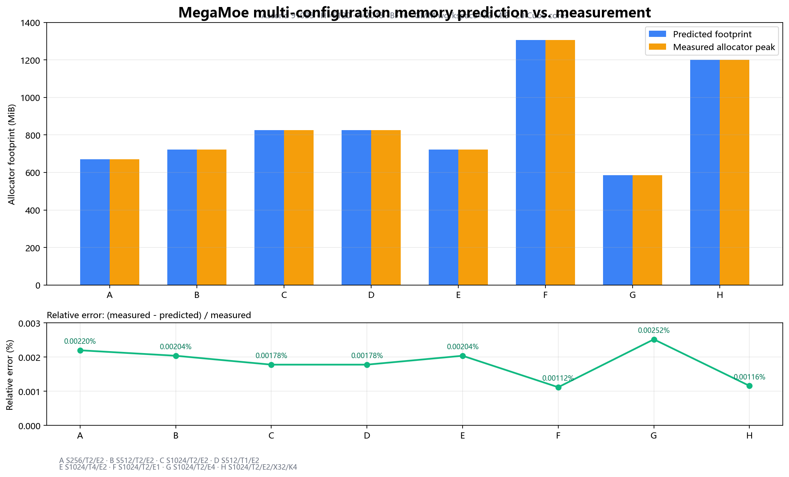
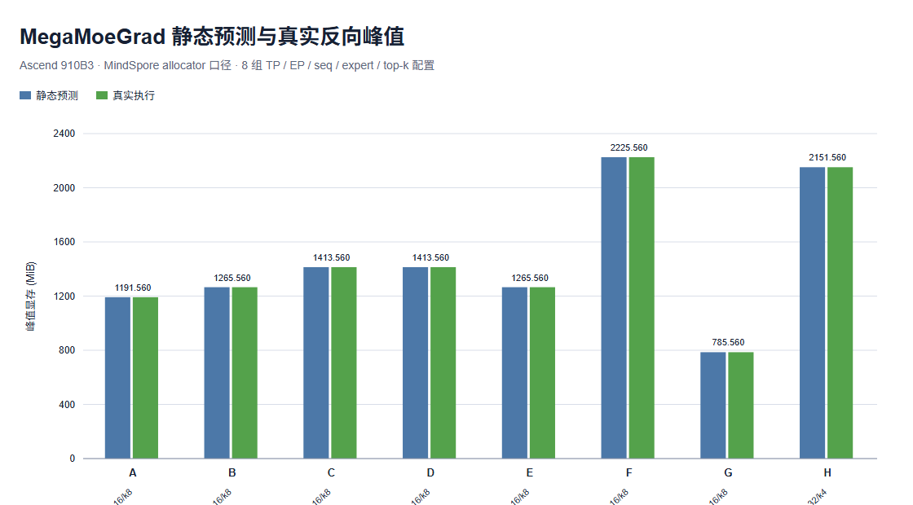

# Mega Kernel 峰值显存预测 API 方案设计与验证报告

## 1. 背景、目标与结论

`mega_moe` 前向将 Dispatch、GMM1、SwiGLU、GMM2 和 Combine 融合为一个 mega kernel；
`mega_moe_grad` 反向将梯度 Dispatch、两类激活梯度、SwiGLU-grad、两类权重梯度和梯度 Combine
融合为一个 mega kernel。两者在 launch 前都已持有输入、输出、中间张量、运行时配置和显式 workspace，
ACLNN executor 还会按 tiling 结果申请隐式 workspace。只统计某个子算子输出或 GMM workspace 会低估峰值。

本方案为正反向提供同一套纯 Python、只读取规格的预测 API：

```python
from hyper_parallel.core.multicore import (
    MegaMoeGradMemorySpec,
    MegaMoeMemorySpec,
    estimate_mega_moe_grad_peak_memory,
    estimate_mega_moe_peak_memory,
)

forward = estimate_mega_moe_peak_memory(MegaMoeMemorySpec(...))
backward = estimate_mega_moe_grad_peak_memory(MegaMoeGradMemorySpec(...))

print(forward.footprint_bytes, backward.footprint_bytes)
print(forward.peak_bytes, backward.peak_bytes)
print(backward.components)
```

调用过程不创建 Tensor、不初始化设备或通信后端、不查询 NPU，也不执行 kernel。在 Ascend 910B3
多规格验证中，前向静态预测最大相对误差为 0.00253%，反向为 0.00223%。

## 2. 设计原则

1. **纯规格计算**：只依赖整数规格，不依赖 MindSpore、PyTorch、CANN runtime 或设备状态。
2. **正反向统一模型**：共用结果类型、类别、注册表与统计口径，算子差异由各自 Spec 和 estimator 描述。
3. **结果可解释**：每项以 `MemoryComponent` 返回，可区分输入、输出、显式 workspace、运行时数据、
   隐式 workspace 和 reservation。
4. **统一入口、可扩展**：`estimate_mega_kernel_peak_memory(kernel_name, spec)` 通过注册表分发；
   新 mega kernel 只需提供规格类型和估算器。
5. **预留不重复计数**：对称 heap 中的逻辑张量仍归入对应类别，随后只补齐尚未使用的 slack。
6. **无导入副作用**：multicore 平台 handler 仅在真正执行 kernel 或动态 dry-run 时初始化。

## 3. API 模型

### 3.1 公共结果与扩展入口

`MegaKernelMemoryEstimate` 提供：

- `components`：逐项显存来源；
- `bytes_for(category)`：按类别汇总；
- `footprint_bytes`：与 MindSpore allocator 峰值直接比较；
- `peak_bytes`：补齐外部对称 heap reservation 后的完整设备占用；
- `peak_mib`：完整峰值的 MiB 表示。

正反向均注册在统一入口：

```python
estimate_mega_kernel_peak_memory("mega_moe", forward_spec)
estimate_mega_kernel_peak_memory("mega_moe_grad", backward_spec)
register_mega_kernel_memory_estimator("mega_xxx", estimator)
```

### 3.2 正反向输入规格

两种规格的公共字段包括：

- 并行参数：`tp`、`ep`；
- 模型/路由参数：`seq_size`、`expert_num`、`top_k`；
- 张量参数：`hidden_size`、`intermediate_size`、`dtype_size`；
- 运行参数：`gmm_workspace_bytes`、`num_cube_cores`；
- reservation 参数：`symmetric_heap_bytes`。

`MegaMoeGradMemorySpec` 继承 `MegaMoeMemorySpec`，仅增加反向专用的
`swiglu_grad_workspace_bytes`，默认 16 MiB。其余默认值为元素 2 B、GMM workspace 256 MiB、
Cube 核数 24、对称 heap 1 GiB。本次 910B3 实测 Cube 核数为 20，验证时显式传入。

规格统一校验正整数、非负容量、`expert_num % ep == 0`、`seq_size * top_k` 可被 `tp`
整除，以及对称 heap 能否容纳正向或反向的两个对称输出和 event counters。

### 3.3 测量口径

`mindspore.runtime.max_memory_allocated()` 统计 MindSpore allocator 管理的 Tensor 和 ACLNN
workspace，但不包含 `aclshmem_malloc` 建立的完整对称 heap。因此定义：

```text
allocator 口径：actual max_memory_allocated  vs. estimate.footprint_bytes
完整物理口径：actual + heap - 对称逻辑张量  vs. estimate.peak_bytes
```

完整口径扣除对称逻辑张量，避免 Tensor capacity 与 heap reservation 重复计数。通用 allocator
元数据、碎片和框架外缓存不能仅由输入规格稳定推导，未作为经验常数写入 API。

## 4. mega_moe 正反向计算模型

### 4.1 公共符号

单 rank 定义：

- `T = seq_size * top_k / tp`：单 rank routed-token buffer capacity；
- `E_local = expert_num / ep`：单 rank 持有的 expert 数；
- `H = hidden_size`；
- `I = intermediate_size`；
- `B = dtype_size`。

所有张量均按 capacity 统计，不依赖本次实际 token 路由分布。

### 4.2 前向 live set

| 类别 | Tensor/数据 | 字节数 |
|---|---|---:|
| 输入 | dispatch source | `T * H * B` |
| 输入 | up/down weights | `E_local * H * 2I * B + E_local * I * H * B` |
| 输入 | 路由 metadata | `expert_num * (4 * 8 + 2 * 4) + E_local * 2 * 8` |
| 输出 | dispatch target、GMM2 输出、combine target | `3 * T * H * B` |
| 输出 | GMM1 输出 | `T * 2I * B` |
| 输出 | SwiGLU 输出 | `T * I * B` |

### 4.3 反向 live set

| 类别 | Tensor/数据 | 字节数 |
|---|---|---:|
| 输入 | dy、permute_out | `2 * T * H * B` |
| 输入 | forward-saved hidden、gate | `T * I * B + T * 2I * B` |
| 输入 | w1、w2 | `E_local * H * 2I * B + E_local * I * H * B` |
| 输入 | 路由 metadata | `expert_num * (4 * 8 + 2 * 4) + E_local * 8` |
| 输出 | dispatch target、gate_dx、grad_x | `3 * T * H * B` |
| 输出 | act_grad_y、grad_gate | `T * I * B + T * 2I * B` |
| 输出 | hidden_dw、gate_dw | `E_local * I * H * B + E_local * H * 2I * B` |

两份权重梯度是预分配输出，不会覆盖权重输入；前向保存值也必须存活至反向完成。因此这些组件在
ACLNN workspace 到达峰值时同时存在。

### 4.4 workspace、运行时数据与对齐

| 内存来源 | mega_moe 前向 | mega_moe_grad 反向 |
|---|---:|---:|
| 显式 GMM workspace | Spec 中实际容量 | Spec 中实际容量 |
| 显式 SwiGLU-grad workspace | 无 | Spec 中实际容量，默认 16 MiB |
| RuntimeConfig | 15,077,472 B | 15,077,472 B |
| GMM tiling（20 Cube 核） | 2 × 40,320 B | 4 × 40,320 B |
| SwiGLU/SwiGLU-grad tiling | 3,936 B | 3,936 B |
| event counters | 4,096 B | 4,096 B |
| CANN workspace 原始值 | 95,420,928 B | 99,615,232 B |
| CANN workspace 对齐分配 | 95,421,440 B | 99,615,744 B |

RuntimeConfig 原始 `sizeof(RuntimeConfigC)=15,077,456 B`，设备 Tensor 按 32 B 对齐。
SwiGLU tiling 原始为 3,920 B，同样按 32 B 对齐。显式 workspace 是算子输入，CANN workspace
由 executor 另行申请，两者在峰值时重叠，必须同时统计。

### 4.5 对称内存

前向的 `dispatch_target`、`combine_target`，反向的 `dispatch_target`、`grad_x`，
以及两者的 `all_event_counters` 位于预留 heap。正反向均有：

```text
symmetric_tensor_bytes = 2 * T * H * B + 4096
reservation_overhead = symmetric_heap_bytes - symmetric_tensor_bytes
```

逻辑对称张量加 slack 恰好等于整个 heap，不会重复完整计入。

### 4.6 为什么 MemoryComponent 可以相加

这里相加的不是一次调用的全部历史分配，而是同一峰值时刻的 live set：

1. Python 前端仍持有输入、权重、输出、中间张量、显式 workspace、runtime 和 tiling；
2. 反向还必须持有 forward-saved tensors、权重梯度输出和 SwiGLU-grad workspace；
3. ACLNN executor 在上述 Tensor 已存在时申请隐式 workspace；
4. 对称 heap 在调用前已 reservation，始终与 allocator 内存重叠。

CANN workspace 在 kernel 完成后释放，但释放前已形成峰值。若未来 kernel 在 HBM 中分阶段申请、
复用或释放 buffer，则 estimator 应改为组件生命周期 `[start, end)` 的最大 live sum，而非简单求和。

多核切分当前只改变核上的任务数量、顺序和 tiling 内容，不改变由 `T`、`E_local` 决定的 Tensor
capacity；GMM tiling 只随 Cube 核数变化。TP 通过 `T`、EP 通过 `E_local` 间接影响显存。若未来
切分引入双缓冲、并行流临时区或动态 workspace，则应把相应策略参数加入 Spec。

## 5. 验证环境与方法

- 硬件：Ascend 910B3，20 个 Cube core；
- 软件：MindSpore 2.10、CANN 9.0；
- 源码：`/home/zxl/hyper-parallel`；
- 固定维度：`H=5120`、`I=2048`、BF16；
- 显式 workspace：GMM 32 MiB，反向另有 SwiGLU-grad 16 MiB；
- 对称 heap：1 GiB；
- 测量：输入准备完成后调用 `reset_peak_memory_stats()`，只执行一次对应 fused kernel，
  同步后读取 `max_memory_allocated()`；
- 排除：输入初始化、reference GMM/SwiGLU 和结果比对阶段的临时张量。

每组比较 rank 0；已抽查的多 rank 峰值一致。

## 6. 正反向多规格验证结果

### 6.1 mega_moe 前向

| ID | seq | TP | EP | experts | top-k | T/rank | 静态预测 (MiB) | 真实峰值 (MiB) | 差值 (KiB) | 相对误差 |
|---:|---:|---:|---:|---:|---:|---:|---:|---:|---:|---:|
| A | 256 | 2 | 2 | 16 | 8 | 1024 | 669.465 | 669.480 | 15.062 | 0.00220% |
| B | 512 | 2 | 2 | 16 | 8 | 2048 | 721.465 | 721.480 | 15.062 | 0.00204% |
| C | 1024 | 2 | 2 | 16 | 8 | 4096 | 825.465 | 825.480 | 15.062 | 0.00178% |
| D | 512 | 1 | 2 | 16 | 8 | 4096 | 825.465 | 825.480 | 15.062 | 0.00178% |
| E | 1024 | 4 | 2 | 16 | 8 | 2048 | 721.465 | 721.480 | 15.062 | 0.00204% |
| F | 1024 | 2 | 1 | 16 | 8 | 4096 | 1305.465 | 1305.480 | 14.938 | 0.00112% |
| G | 1024 | 2 | 4 | 16 | 8 | 4096 | 585.465 | 585.480 | 15.125 | 0.00252% |
| H | 1024 | 2 | 2 | 32 | 4 | 2048 | 1201.466 | 1201.480 | 14.312 | 0.00116% |



前向绝对误差为 14.312–15.125 KiB，最大相对误差 0.00253%。

### 6.2 mega_moe_grad 反向

| ID | seq | TP | EP | experts | top-k | T/rank | 静态预测 (MiB) | 真实峰值 (MiB) | 差值 (B) | 相对误差 |
|---:|---:|---:|---:|---:|---:|---:|---:|---:|---:|---:|
| A | 256 | 2 | 2 | 16 | 8 | 1024 | 1191.543 | 1191.560 | 18,304 | 0.001465% |
| B | 512 | 2 | 2 | 16 | 8 | 2048 | 1265.543 | 1265.560 | 18,304 | 0.001379% |
| C | 1024 | 2 | 2 | 16 | 8 | 4096 | 1413.543 | 1413.560 | 18,304 | 0.001235% |
| D | 512 | 1 | 2 | 16 | 8 | 4096 | 1413.543 | 1413.560 | 18,304 | 0.001235% |
| E | 1024 | 4 | 2 | 16 | 8 | 2048 | 1265.543 | 1265.560 | 18,304 | 0.001379% |
| F | 512 | 2 | 1 | 16 | 8 | 2048 | 2225.542 | 2225.560 | 18,240 | 0.000782% |
| G | 512 | 2 | 4 | 16 | 8 | 2048 | 785.542 | 785.560 | 18,336 | 0.002226% |
| H | 512 | 2 | 2 | 32 | 4 | 1024 | 2151.543 | 2151.560 | 17,600 | 0.000780% |



反向绝对误差为 17,600–18,336 B，最大相对误差 0.00223%。稳定的小差值来自 allocator
元数据和细粒度对齐，没有作为 magic number 加入公式。

### 6.3 并行规格趋势

B/E 与 C/D 分别具有相同的 `T`、`E_local`，所以正反向预测和实测均完全相同。seq 增大使激活
线性增长；EP 增大使本地权重缩小。反向还同时缩小权重梯度，因此 EP 的影响比前向更明显：
EP 从 1 增至 4 时，反向峰值从 2225.560 MiB 降至 785.560 MiB。

## 7. 正反向 CANN 日志分析

使用：

```bash
export ASCEND_GLOBAL_LOG_LEVEL=0
export ASCEND_PROCESS_LOG_PATH=/home/zxl/dump
```

代表规格的关键证据：

| 日志证据 | mega_moe 前向 | mega_moe_grad 反向 |
|---|---:|---:|
| `PrintTensors ... workspace` | 95,420,928 B | 99,615,232 B |
| `UpdateOffset original/align size` | 95,420,928 → 95,421,440 B | 99,615,232 → 99,615,744 B |
| executor Tensor 数量 | 22 inputs / 5 outputs | 30 inputs / 7 outputs |
| GMM tiling | 2 × 40,320 B | 4 × 40,320 B |
| SwiGLU tiling | 3,936 B | 3,936 B |
| Cube core | 20 | 20 |

前向代表组 `peak - post` 与 95,421,440 B workspace 仅差 3,584 B；反向八组静态值与实测
稳定相差约 18 KiB。两者都表明峰值主要来源与模型逐项一致，余量属于 allocator 元数据/对齐。

## 8. 测试、边界与使用建议

单元测试覆盖：

- 正反向逐类别精确字节数和设备对齐；
- TP/EP 对本地 shape 的影响；
- 非法整除关系、heap 容量和正反向 workspace；
- 前向 Spec 误传给反向 estimator；
- 注册表扩展和重复注册；
- 静态 API 不初始化平台 backend。

静态/动态显存相关 UT 合并执行结果为 `20 passed`。Python `compileall` 和本次新增文件的
`git diff --check` 通过。

已知边界：

- CANN workspace/tiling 来自当前实现，规则变化时必须同步；
- API 预测单次 forward 或 backward，不包含其他层、输入构造、reference、通信库全局缓存或 allocator 碎片；
- `max_memory_allocated()` 是 allocator 口径，不等于设备总物理占用；
- 默认 Cube 核数不是设备探测，精确预测应显式传入实际值；
- 新 kernel 存在互斥分支、HBM buffer 复用或动态 workspace 时，应按生命周期求峰值，或使用动态 dry-run 校准。
