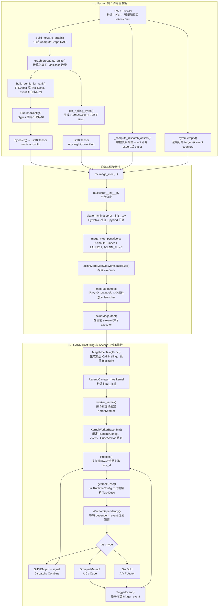

# MegaMoe 正向调用链与多核任务执行详解

本文以 `tests/mindspore/st/multicore/mega_moe.py` 中的 MindSpore 正向测试为主线，从
`mc.mega_moe(...)` 调用前的配置准备开始，一直追踪到 Ascend 设备上的 AIV/AIC worker 读取
`TaskDesc`、等待事件并执行通信、GMM 和 SwiGLU。

本文重点回答以下问题：

- Python 侧为什么要先构造 `ComputeGraph`，它和 MindSpore 计算图有什么区别；
- Dispatch、GMM 和 SwiGLU 的“task”分别代表什么；
- 为什么一个通信 task 处理 128 个 token，而 24 个 GMM task 不能理解成把 token 平均分成 24 份；
- `RuntimeConfig`、子算子 tiling 和顶层 CANN tiling 分别负责什么；
- offset、动态 `group_list` 和 symmetric memory 如何参与实际执行；
- `TaskDesc.tiling_data_position=17` 如何最终定位到某个 Cube 核自己的 GMM tiling；
- 当前实现为什么按 expert 建立跨算子流水，而不是按 128-token tile 建立流水。

> 说明：本文讲的是测试中已经排好 expert 顺序的 MoE-FFN 部分。Router、Top-K 选择、路由权重加权不在
> `mega_moe` 内部。

---

## 1. 一张图看完整函数调用与数据流



上图中有两条同时发生但职责不同的数据流：

1. **函数调用流**：`mc.mega_moe` 经 MindSpore、ACLNN、CANN 进入 AscendC kernel；
2. **配置数据流**：Python 生成 `RuntimeConfig` 和子算子 tiling，以 `uint8 Tensor` 的形式沿同一调用链传入设备。

最重要的分层是：

| 配置 | 回答的问题 |
|---|---|
| 顶层 CANN tiling | 这块设备有多少核、当前 rank/EP/expert/hidden 等顶层属性是什么 |
| `RuntimeConfig` | 哪个 worker 执行哪个 task、等哪个 event、读写哪个参数槽位 |
| 子算子 tiling | GMM 或 SwiGLU 进入底层计算核后，具体怎样分块和使用片上存储 |

---

## 2. 运行示例：先把所有数字算清楚

测试参数位于 `tests/mindspore/st/multicore/mega_moe.py`：

```python
_TP = 2
_EP = 2
_SEQ_SIZE = 1024
_ALL_EXPERT_NUM = 16
_TOP_K = 8
_HIDDEN_SIZE = 5120
_INTERMEDIATE_SIZE = 2048
```

`TaskSplitValue` 的派生值为：

```text
seq_all
= seq_size × ep × top_k / tp
= 1024 × 2 × 8 / 2
= 8192

per_rank_seq
= seq_all / ep
= 4096

single_rank_expert_num
= all_expert_num / ep
= 8

per_expert_seq
= seq_all / top_k
= 1024

per_expert_seq_to_other
= seq_all / (ep × top_k)
= 512
```

这里需要区分静态调度容量和本测试的实际均匀负载：

- 每个 rank 有 4096 条 routed-token 记录；
- 每个 rank 持有 8 个 expert；
- 测试平均向每个全局 expert slot 发送 `4096 / 16 = 256` 条记录；
- 一个本地 expert 从两个来源 rank 各收 256 条，因此实际收到 512 条；
- 调度却为“每个来源 rank、每个 expert slot”预留最多 512 条通信容量；
- SwiGLU 则为每个接收端 expert 预留最多 1024 条计算容量。

因此动态长度小于静态容量时，会有一部分静态 TaskDesc 在运行时发现长度为 0，然后跳过计算或执行零长度通信。
当前实现不会因为 expert 实际变长而自动创建更多 TaskDesc；生产系统必须保证实际负载不超过生成配置时的容量。

---


> 源码定位：端到端测试入口和参数准备集中在
> `tests/mindspore/st/multicore/mega_moe.py:450-540`；正向图定义在
> `hyper_parallel/core/multicore/modules/mega_moe/forward/graph.py:30-231`。

## 3. 调用前阶段：构造 ComputeGraph

测试首先创建：

```python
tsv = TaskSplitValue(...)
graph = build_forward_graph(tsv, ...)
graph.propagate_splits(tsv)
```

`build_forward_graph()` 位于：

```text
hyper_parallel/core/multicore/modules/mega_moe/forward/graph.py
```

它生成的 DAG 是：

```text
dispatch → up_proj → swiglu → down_proj → combine
```

这不是 MindSpore Graph Mode 的静态计算图。它是 HyperParallel 自己的**离线调度描述图**，用于生成
`RuntimeConfig`。

图中的三个基础结构是：

### 3.1 `TensorSpec`

描述一块张量或共享缓冲区：

```text
shape
dtype_size
在顶层 kernel 参数中的 param_position
是否动态长度
是否转置
切分维度
```

例如 `up_proj_y` 的 `param_position=7`，表示设备端可以通过 `input_list[7]` 找到它。

### 3.2 `OperatorNode`

描述一个逻辑算子：

```text
op_type
inputs / outputs
split_value
SplitSpec
tiling_position
FillConfig
```

它只描述“应该怎么生成任务”，还不是设备真正执行的 `TaskDesc`。

### 3.3 `SplitSpec`

描述：

- 上游张量在哪个维度被切分时，本节点可以继续切分；
- 本节点生成多少个 TaskDesc；
- 输出张量把切分信息沿哪个维度传播给下游。

`ComputeGraph.propagate_splits()` 按拓扑顺序计算每个节点的 `task_num`，并通过共享的 `TensorSpec`
把切分状态传给下游。

---

## 4. 五个阶段分别生成多少 TaskDesc

假设设备有 24 个 Cube 核。

### 4.1 Dispatch：64 个通信 TaskDesc

默认：

```text
dispatch_split_value = 128 token
```

一次通信 TaskDesc 最多搬 128 行 token。128 是调优参数，不是由 TP/EP 公式自动推导出的硬件常量。

一个发送 rank 的目标桶布局为：

```text
目标 rank 0：local expert 0～7
目标 rank 1：local expert 0～7
```

一个“目标 rank + 目标本地 expert”的组合称为一个 slot：

```text
slot = destination_rank × single_rank_expert_num + local_expert_id
```

本例总共有：

```text
EP × single_rank_expert_num = 2 × 8 = 16 个 slot
```

每个来源 rank 为每个 slot 预留：

```text
per_expert_seq_to_other / 128
= 512 / 128
= 4 个 task
```

因此当前来源 rank 总共生成：

```text
16 slot × 4 task/slot = 64 个 dispatch TaskDesc
```

如果只计算发往某一个目标 rank，则确实是：

```text
8 expert × 4 task = 32 task
```

代码乘 `all_expert_num=16`，是因为一次 AllToAll 包含发往 EP 组内所有 rank 的部分，也包含本地 rank。

测试的实际均匀负载每个来源 rank 只给一个 slot 发送 256 条，因此四个静态 task 中：

```text
task 0：128 token
task 1：128 token
task 2：0 token，但仍完成并发事件
task 3：0 token，但仍完成并发事件
```

### 4.2 Up projection：`8 × 24 = 192` 个 Cube TaskDesc

一个本地 expert 实际计算：

```text
X:  [512, 5120]
W1: [5120, 4096]
Y:  [512, 4096]
```

每个 expert 创建 24 个 GMM TaskDesc：

```text
expert 0：task 0～23
expert 1：task 24～47
...
expert 7：task 168～191
```

这里的 24 个 TaskDesc 不是 24 个独立 token tile，而是 24 个物理 Cube 核参与同一次 expert GMM 的
24 个工作席位。

它们共同处理完整的 `[512,5120] @ [5120,4096]`。每个核具体处理哪个 M/N/K 子块，由底层
`TCubeTiling` 和 `GetBlockIdx()` 决定，不能简单理解成 `512 / 24` 行。

### 4.3 SwiGLU：64 个 Vector TaskDesc

```text
swiglu_split_value = 128 token
```

调度为每个 expert 预留：

```text
per_expert_seq / 128 = 1024 / 128 = 8 task
```

八个 expert 共：

```text
8 × 8 = 64 task
```

实际每个 expert 只有 512 行，所以前四个有效，后四个根据动态 `group_list` 返回。

### 4.4 Down projection：192 个 Cube TaskDesc

同 Up projection，每个 expert 由 24 个 Cube worker 协作：

```text
[512, 2048] @ [2048, 5120] → [512, 5120]
```

### 4.5 Combine：64 个通信 TaskDesc

采用和 Dispatch 相同的 128-token 静态通信切分，将 expert 输出写回来源 rank。

### 4.6 总数

```text
dispatch    64
up_proj    192
swiglu      64
down_proj  192
combine     64
----------------
合计        576 个业务 TaskDesc
```

调度器还会在 Vector 队列尾部加入一个 `TASK_TERMINATE` 控制任务。

---


> 源码定位：`TensorSpec`、`SplitSpec`、`OperatorNode` 与 `propagate_splits()` 分别从
> `hyper_parallel/core/multicore/scheduler/graph.py:37`、`:53`、`:74`、`:133` 开始；三类任务填充器在
> `hyper_parallel/core/multicore/tasks/alltoall.py:51`、`gmm.py:31`、`swiglu.py:29`。

## 5. 从 ComputeGraph 生成 RuntimeConfig

测试调用：

```python
cfg = build_config_for_rank(graph, tsv, rank)
```

函数位于：

```text
hyper_parallel/core/multicore/modules/mega_moe/forward/gen_runtime_data.py
```

它按拓扑顺序遍历节点：

```python
for op in graph.topological_sort():
    op.fill_config.fill(cfg, op, tsv)
```

不同 `FillConfig` 将逻辑节点展开成实际的 `TaskDesc`：

| 文件 | 生成的任务 |
|---|---|
| `tasks/alltoall.py` | Dispatch / Combine 的 SHMEM put task |
| `tasks/gmm.py` | Up/Down projection 的 GroupedMatmul task |
| `tasks/swiglu.py` | SwiGLU task |

### 5.1 `RuntimeConfigC` 的主要内容

`RuntimeConfigC` 是一个 `ctypes.Structure`，布局和设备侧 C++ 解析逻辑一致：

```text
RuntimeConfigC
├── task_num
├── num_workers
├── queue_capacity
├── all_event_num_triggers[1024]
├── all_tasks[25600]                 # TaskDescC
├── all_events[1024]
├── task_index_num[4]
├── cube_task_indices[25600]
├── vector_task_indices[25600]
├── mix_task_indices[25600]
├── dynamic_data
├── grouped_matmul_group_list[512]
└── atomic_add_values[8]
```

一个 `TaskDesc` 主要包含：

```text
task_type
task_aicore_type
dependent_event
trigger_event
inputs[] / outputs[] 的 TensorDesc
tiling_data_position
tiling_data_offset
task_index
task_split_num
task_split_value
```

`TensorDesc` 则记录：

```text
input_position
base_ptr_offset
data_type
shape
transpose_flag
dynamic_shape
```

### 5.2 Cube 和 Vector 任务队列

`all_tasks[]` 保存全部 TaskDesc；另外两组数组只保存索引：

```text
cube_task_indices[]   → Cube worker 应取哪些 all_tasks 下标
vector_task_indices[] → Vector worker 应取哪些 all_tasks 下标
```

这样设备端 worker 不必扫描所有 task，只读取属于自己核类型的队列。

### 5.3 Event 依赖

每个 task 有：

```text
dependent_event：执行前必须达到阈值的事件
trigger_event：执行完成后需要增加的事件
```

事件阈值存放在：

```text
all_event_num_triggers[event_id]
```

这使得 RuntimeConfig 表达的是一个计数型依赖图，而不是简单的线性任务列表。

### 5.4 RATR 重排

`revise_task_queue()` 根据 `rank_id` 重排 Dispatch 和 Combine 在 Vector 队列中的顺序，使不同来源 rank
不要在同一时间集中写向同一个目标 rank。

RATR 只改变通信 task 的执行次序，不改变数据 offset、结果和 DAG 依赖。

---


> 源码定位：`RuntimeConfigC` 的二进制布局定义在
> `hyper_parallel/core/multicore/scheduler/config.py:93-150`；正向 `build_config_for_rank()` 在
> `hyper_parallel/core/multicore/modules/mega_moe/forward/gen_runtime_data.py:72-100`；RATR 重排入口是
> `hyper_parallel/core/multicore/scheduler/scheduler.py:24`。

## 6. RuntimeConfig 如何变成二进制 Tensor

测试中：

```python
runtime_cfg = _bytes_to_ms(bytes(cfg))
```

### 6.1 `bytes(cfg)`

`cfg` 是固定布局的 `ctypes.Structure`。`bytes(cfg)` 会把结构体的完整内存布局原样复制成 Python
`bytes`：

```text
字段头 + event 阈值 + TaskDesc 数组 + 任务索引队列 + 动态数据 + ...
```

### 6.2 `_bytes_to_ms()`

它把二进制内容包装为：

```text
NumPy uint8 数组 → MindSpore uint8 Tensor
```

设备端看到的是一个连续的 Global Memory 地址。`runtime_config.hpp` 中的 `getTaskDesc()`、
`getCubeTaskIndexsOffset()` 等函数按固定字节偏移解析它。

因此 RuntimeConfig 是一种 Python 与 AscendC 之间的二进制 ABI。

---


> 源码定位：测试在 `tests/mindspore/st/multicore/mega_moe.py:488` 执行 `bytes(cfg)`，
> `_bytes_to_ms()` 定义在同文件 `:191`；离线生成脚本的同一路径在
> `hyper_parallel/core/multicore/modules/mega_moe/forward/gen_runtime_data.py:173`。

## 7. 子算子 tiling 的生成与含义

正向显式生成三个子算子 tiling：

```text
up_proj_tiling
swiglu_tiling
down_proj_tiling
```

它们分别由：

```python
get_up_proj_tiling_bytes(...)
get_swiglu_tiling_bytes(...)
get_down_proj_tiling_bytes(...)
```

生成，然后也被包装成 `uint8 Tensor`。

### 7.1 为什么是二进制

最终消费者是设备侧 C++/AscendC 结构体，而不是 Python。二进制具有：

- 固定字段布局；
- 可直接复制到设备；
- 设备端可以 `reinterpret_cast` 为 C++ tiling 结构；
- 可以提前生成 `.bin`，运行时直接加载。

### 7.2 GMM tiling table 从哪里来

`GMM1_TABLE` 是一份预计算的 `GMMTilingData` 序列化结果。源码注释保留了旧 helper 名称：

```text
get_tiling_data_gmm_x_7168_g2(split_value)
```

从当前仓库能确认：

- 它与 CANN GroupedMatmul 的 `GMMTilingData` ABI 对应；
- 它在首次引入多核 MoE 时就以常量表形式存在；
- 当前仓库没有保留生成整串数字的完整工具或命令；
- Python 只对 hidden、intermediate、expert 数和 core 数等少数字段做 patch。

它不是适合手工修改的普通配置。

### 7.3 一大串数字表示什么

一份 `GMMTilingData` 包含：

```text
GMMBaseParams
├── groupNum
├── coreNum
├── groupType
├── m
├── workspaceSize
└── ...

GMMArray
├── mList[128]
├── kList[128]
└── nList[128]

TCubeTiling
├── M / N / K
├── singleCoreM / N / K
├── baseM / N / K
├── stepM / N
├── buffer / depth / format
└── ...

A8W4HPTiling
└── 量化模板相关字段
```

仅 `mList/kList/nList` 就有 384 个 `int32`，未使用位置为 0，所以字符串中会出现大量连续的 0。

`GMM1_TABLE[4096]` 当前有：

```text
504 个 uint32 × 4 bytes = 2016 bytes
```

这 2016 字节就是一份 GMM tiling 记录的当前序列化步长。

### 7.4 为什么重复 24 份

`_expand_gmm_string(..., repeat=num_cube_cores)` 将一份 2016 字节记录重复 24 次：

```text
offset 0 × 2016  → core 0
offset 1 × 2016  → core 1
...
offset 23 × 2016 → core 23
```

每个物理 Cube 核有独立副本，因为运行时会把当前 expert 的真实 M 写进本核记录，避免多个核同时修改
同一份 tiling。

### 7.5 新增 GMM 是否需要新 table

当前架构下通常需要：

- 形状、dtype、transpose、group type 和计算语义完全相同，可以考虑复用现有 tiling；
- 只改变少数维度，可能使用现有模板 patch，但必须验证正确性和性能；
- 如果 GMM 语义或 M/K/N 模板显著不同，通常需要一份新的 tiling table/getter；
- 还需要为它分配 kernel 参数槽，并让新 `OperatorNode` 的 `tiling_position` 指向该槽。

当前实现是“离线预计算模板 + 少数字段替换”，不是运行时完整 autotiling。

---


> 源码定位：正向 tiling getter 在
> `hyper_parallel/core/multicore/modules/mega_moe/forward/tiling_tables.py:116-190`；测试生成/加载三个
> 子算子 tiling Tensor 的位置在 `tests/mindspore/st/multicore/mega_moe.py:467-486`；图中的 tiling
> 参数槽 17/18/19 定义在 `hyper_parallel/core/multicore/modules/mega_moe/forward/graph.py:24-26`。

## 8. Offset：真实路由布局与 task 内偏移

测试调用：

```python
_compute_dispatch_offsets(flat_tokens_per_expert, ep_group)
```

它根据真实 token count 生成 expert/slot 级 offset，而不是为每个 128-token task 单独生成完整地址。

> 源码定位：offset 元数据计算在
> `tests/mindspore/st/multicore/mega_moe.py:212`；调用前把 token 行 offset 乘
> `hidden_size` 的位置在同文件 `:295-306`；设备端叠加 task 内偏移的位置在
> `hyper_parallel/core/multicore/ops/mega_moe/op_kernel/worker_kernel.cpp:193-227`。

可以把这里的三个对象理解成同一条数据通路上的三样东西：

```text
expert/slot offset：收件地址——数据在整块 Tensor 中应该落在哪里
symm.empty target：远端收件箱——允许其他 rank 的设备 kernel 直接写入
event counter：到货计数牌——记录某一阶段已有多少个生产 task 完成
```

“expert 级 offset”是便于理解的简称。实现中的 offset 数组通常为每个
“来源 rank → 目标 expert”通信 slot 保存一个 base offset，而不是每个 expert 只有一个 offset。

### 8.1 Dispatch 源 offset

若当前来源 rank 均匀发送：

```text
counts = [256, 256, ..., 256]
```

则 exclusive prefix sum 为：

```text
dispatch_src_off = [0, 256, 512, 768, ...]
```

输入 `dispatch_src` 已按全局 expert slot 排好。

### 8.1.1 为什么需要 expert/slot 级 offset

`dispatch_target` 是一整块连续 Tensor，并没有为每个 expert 单独创建一个 Tensor。多个来源 rank 发给
不同 expert 的 token 都要写入这块内存，因此 offset 用来划分各 slot 的区域，既避免相互覆盖，也保证
同一个 expert 的 token 连续排列，方便 Grouped MatMul 使用 `group_list` 找到专家边界。

例如，一个 rank 上有本地 expert E0、E1，实际接收量为：

| 目标 expert | 来自 rank0 | 来自 rank1 |
|---|---:|---:|
| E0 | 3 | 2 |
| E1 | 1 | 3 |

接收端按“expert 优先、来源 rank 次之”组织后，可以得到：

```text
行 0～2：E0，来自 rank0，共 3 token    base offset = 0
行 3～4：E0，来自 rank1，共 2 token    base offset = 3
行 5  ：E1，来自 rank0，共 1 token    base offset = 5
行 6～8：E1，来自 rank1，共 3 token    base offset = 6

E0：dispatch_target[0:5]
E1：dispatch_target[5:9]
group_list = [5, 9]
```

### 8.2 Dispatch 目标 offset

接收端按：

```text
expert 优先，来源 rank 次之
```

排列数据：

```text
expert0/rank0：offset 0
expert0/rank1：offset 256
expert1/rank0：offset 512
expert1/rank1：offset 768
...
```

来源 rank 原本不知道接收端为它分配的位置，因此通过元数据 AllToAll 把目标 offset 交换回去。

### 8.3 Combine offset

Combine 是 Dispatch 的反向数据搬运：

- `combine_src_off` 指向 expert 计算结果在接收端 expert-major 布局中的位置；
- `combine_target_off` 指向结果在来源 rank 原始 token 布局中的位置。

四种 offset 可以归纳为：

| offset | 含义 |
|---|---|
| `dispatch_src_off` | Dispatch 从本 rank 的哪里读 |
| `dispatch_target_off` | Dispatch 写到 expert 所在 rank 的哪里 |
| `combine_src_off` | Combine 从 expert 计算结果的哪里读 |
| `combine_target_off` | Combine 写回原始 rank 的哪里 |

Dispatch offset 负责“把 token 按 expert 聚起来”，Combine offset 负责“把计算结果送回来源布局”。

### 8.4 task 内 tile offset

Python 只传 slot 级 base offset 和实际 size。设备端根据：

```text
task_index
task_split_value=128
```

计算当前通信 task 的 tile：

```text
slot_index = task_index // 4
tile_index = task_index % 4
tile_start = tile_index × 128

final_src = dispatch_src_off[slot_index] + tile_start
final_dst = dispatch_target_off[slot_index] + tile_start
```


框架层只需为每个通信 slot 提供 base offset，设备端再根据 task 在 slot 内的编号生成小块偏移：

```text
task_start = slot 内 task 编号 × task_split_value × hidden_size
final_src  = slot_src_base + task_start
final_dst  = slot_dst_base + task_start
```
如果 `tile_start >= actual_size`，发送长度为 0；如果是尾块，只发送剩余长度。

offset 单位沿调用链会发生变化：

```text
Python offset helper：token 行
调用 mega_moe 前：乘 hidden_size，变成 BF16 元素偏移
设备寻址时：再乘 dtype_size，变成字节地址
```

---

## 9. Symmetric Memory 与单边通信

以下缓冲区使用 `symm.empty()`：

```text
dispatch_target
combine_target
all_event_counters
```

对称内存使一个 rank 的设备 kernel 能根据本地基地址和目标 PE，获得另一 rank 的对应远端地址。

> 源码定位：测试中的三块对称内存分配在
> `tests/mindspore/st/multicore/mega_moe.py:504-530`；对称内存 Python 接口在
> `hyper_parallel/core/symmetric_memory/__init__.py`；MegaMoe 单边写实现在
> `hyper_parallel/core/multicore/ops/mega_moe/op_kernel/worker_kernel.cpp:193-241`。

这里的 `target` 不是“目标 expert 对象”，而是整个接收 Tensor；`target_offset` 才决定数据落入其中的
哪个 expert/slot 区域。对称内存也不是所有 rank 真正共享同一份物理内存，而是每个 rank 按相同顺序、
相同尺寸分配并注册一块对应内存，通信层可以从本地句柄定位到目标 rank 的对应地址。可以把它想成
“每个 rank 都有一个位置相同、可被远端投递的收件箱”。

例如 rank0 使用 `target_pe=rank1`、`target_offset=3 × hidden_size` 发起单边写，表示把数据直接写入
rank1 的 `dispatch_target` 第 3 个 token 行；rank1 不需要先显式调用一次 `recv`。

Dispatch/Combine 使用：

```text
put_mem_signal(target, target_offset,
               src, src_offset,
               size,
               signal, event_id,
               target_pe)
```

底层流程为：

1. 通过 symmetric memory 获取远端 target 指针；
2. 使用 UB ping-pong buffer 分段搬数据；
3. 执行 fence 保证远端写完成；
4. 原子增加目标 rank 的 event counter。

AllToAll 因此被拆成许多设备内单边 put，而不是在顶层再次启动一个独立 HCCL AllToAll kernel。

### 9.1 `all_event_counters`：任务依赖的“到货计数牌”

`all_event_counters` 不保存 token，只记录某个事件已被触发多少次。使用 counter 而不是布尔值，是因为
一个阶段可能有多个生产 task：一个 expert 的数据来自多个 rank，每个 slot 又会切成多个 128-token
Dispatch task；一个 GMM 也可能由 24 个 Cube task 共同完成。

每个 `TaskDesc` 包含 `dependent_event` 和 `trigger_event`。worker 的执行逻辑是：

```text
等待 event[dependent_event] >= all_event_num_triggers[dependent_event]
执行当前 task
原子执行 event[trigger_event] += 1
```

> 源码定位：`TaskDesc` 的事件字段在
> `hyper_parallel/core/multicore/ops/runtime/runtime_config.hpp:99-116`；等待、执行、触发的主循环在
> `hyper_parallel/core/multicore/ops/runtime/worker_kernel.h:129-189`；Dispatch 的事件编号和阈值由
> `hyper_parallel/core/multicore/tasks/alltoall.py:74-133` 填入 RuntimeConfig。

假设 E0 完整到货需要 16 个通信 task，那么 E0 的 GMM1 会等待对应 counter 从 0 累加到 16。通信
task 使用 `put_mem_signal`，保证先写完远端数据、再增加目标 rank 的 counter，避免 GMM 看到事件已经
完成却读到尚未写完的数据。

`all_event_counters` 也必须位于 symmetric memory，因为 rank0 把数据写到 rank1 后，需要递增的是
rank1 上的到货 counter。测试分配 4096 字节的 `uint8` 缓冲区，worker 在
`hyper_parallel/core/multicore/ops/runtime/worker_kernel.h:44` 将其解释成 1024 个 `int32` counter。

### 9.2 三者如何共同完成一次 Dispatch

```text
1. dispatch_src_off：确定本地 slot 从哪里读
2. task_index：计算当前 128-token 小块在 slot 内的 task_start
3. dispatch_target_off：确定目标 rank 的 expert/slot 区域
4. symmetric dispatch_target：执行单边远端写
5. 写完后，原子执行目标 rank 的 event[expert] += 1
6. event[expert] 达到预期次数后，该 expert 的 GMM1 才解除依赖
```

这也限定了当前实现中 Dispatch → GMM1 的主要流水粒度：Dispatch 按 128-token 小 task 搬运和到达，
但 GMM1 等待的是该 expert 的汇总完成事件。不同 expert 可以先到齐先计算；同一个 expert 通常要等
相关 Dispatch 小 task 全部到齐后，才启动它的 24 个 Cube task，而不是每到一个通信块便启动对应 GMM。

---

## 10. 正式调用 `mc.mega_moe`

测试最终传入：

```python
mc.mega_moe(
    dispatch_target,
    dispatch_target_off,
    dispatch_src,
    dispatch_src_off,
    dispatch_size,
    up_proj_weight,
    up_proj_glist,
    up_proj_y,
    swiglu_out,
    down_proj_weight,
    down_proj_glist,
    down_proj_y,
    combine_target,
    combine_target_off,
    combine_src_off,
    combine_size,
    gmm_workspace,
    up_proj_tiling,
    swiglu_tiling,
    down_proj_tiling,
    runtime_config,
    all_event_counters,
    rank_id,
    ep,
    expert_num,
    hidden_size,
    seq_size,
)
```

子算子 tiling 和 RuntimeConfig 都是显式输入，不是在 `mega_moe` 的设备 kernel 内临时生成的。

---


> 源码定位：测试调用点在 `tests/mindspore/st/multicore/mega_moe.py:295-310`，平台无关入口在
> `hyper_parallel/core/multicore/__init__.py:24`。

## 11. Python API 到 ACLNN 的调用链

### 11.1 平台无关入口

```text
hyper_parallel/core/multicore/__init__.py
```

`mega_moe()` 将所有参数交给当前平台的 multicore handler。

### 11.2 MindSpore adapter

```text
hyper_parallel/core/multicore/platform/mindspore/__init__.py
```

它：

1. 检查当前是 PyNative Mode；
2. 延迟加载 `hyper_parallel_mega_moe_ms` 扩展；
3. 调用扩展中的 `mega_moe`。

当前 Graph Mode 只有 stub，不能执行这个算子。

### 11.3 PyBoost bridge

```text
platform/mindspore/c_api/mega_moe/mega_moe_pynative.cc
```

它创建：

```cpp
AclnnOpRunner("MoeFwd")
```

然后通过：

```cpp
LAUNCH_ACLNN_FUNC(aclnnMegaMoe, ..., runtime_config, ...)
```

把 22 个 Tensor 和 5 个标量属性传给 ACLNN。

### 11.4 ACLNN 两阶段接口

第一阶段：

```cpp
aclnnMegaMoeGetWorkspaceSize(..., runtime_config, ..., &executor)
```

它检查/准备连续 Tensor，通过 `l0op::MegaMoe()` 把输入和属性记录到 executor，并获得 workspace 大小。

第二阶段：

```cpp
aclnnMegaMoe(workspace, workspaceSize, executor, stream)
```

它执行 executor。第二个函数参数中看不到 `runtime_config`，是因为该 Tensor 已在第一阶段记录进 executor。

### 11.5 L0 launcher

```text
ops/mega_moe/op_host/op_api/mega_moe.cpp
```

`ADD_TO_LAUNCHER_LIST_AICORE` 将：

- 所有输入 Tensor；
- 五个原地输出 Tensor；
- `rank_id/ep/expert_num/hidden_size/seq_size` 属性；

加入 CANN kernel launcher。

---


> 源码定位：MindSpore adapter 在
> `hyper_parallel/core/multicore/platform/mindspore/__init__.py:151`；PyBoost bridge 在
> `hyper_parallel/core/multicore/platform/mindspore/c_api/mega_moe/mega_moe_pynative.cc:89-129`；
> ACLNN 两阶段入口在 `hyper_parallel/core/multicore/ops/mega_moe/op_host/op_api/aclnn_mega_moe.cpp:32-99`；
> L0 launcher 在同目录 `mega_moe.cpp:38-56`。

## 12. 顶层 CANN tiling

在 kernel launch 前，CANN host 侧执行：

```text
ops/mega_moe/op_host/mega_moe_tiling.cpp::TilingFunc()
```

它完成：

```text
读取设备 Cube 核数
设置 blockDim
根据 dtype 选择 tiling key
把 rankId/ep/expertNum/hiddenSize/seqSize/coreNum 写入 MegaMoeTilingData
申请顶层 workspace
```

这个顶层 CANN tiling 不是 `up_proj_tiling`。它描述的是整个 MegaMoe kernel 的启动环境。

设备 worker 使用它读取：

```text
rank_id
ep
expert_num
hidden_size
core_num
```

---


> 源码定位：顶层 `TilingFunc()` 在
> `hyper_parallel/core/multicore/ops/mega_moe/op_host/mega_moe_tiling.cpp:26-78`；顶层 tiling 结构
> `MegaMoeTilingData` 在 `mega_moe_tiling.h:254-267`。

## 13. AscendC kernel 入口与 `input_list`

设备入口位于：

```text
ops/mega_moe/op_kernel/mega_moe.cpp
```

顶层 kernel 收到所有 Tensor 的 Global Memory 地址，以及 CANN 隐式传入的 `workspace` 和 `tiling`，然后
构造 `input_list[]`。

与本文主线有关的槽位是：

| 槽位 | 地址 |
|---:|---|
| 0 | `dispatch_target` |
| 1 | `dispatch_target_off` |
| 2 | `dispatch_src` |
| 3 | `dispatch_src_off` |
| 4 | `dispatch_size` |
| 5 | `up_proj_weight` |
| 6 | `up_proj_glist` |
| 7 | `up_proj_y` |
| 8 | `swiglu_out` |
| 9 | `down_proj_weight` |
| 10 | `down_proj_glist` |
| 11 | `down_proj_y` |
| 12 | `combine_target` |
| 13～15 | Combine offset/size |
| 16 | 显式传入的 `gmm_workspace` |
| 17 | `up_proj_tiling` |
| 18 | `swiglu_tiling` |
| 19 | `down_proj_tiling` |
| 20 | `runtime_config` |
| 23 | CANN 隐式顶层 tiling |
| 24 | `all_event_counters` |

`input_list` 的作用是建立一个统一的“地址槽位表”。`TaskDesc` 不需要保存 64 位设备指针，只需保存：

```text
input_position = 7
tiling_data_position = 17
```

worker 即可通过 `input_list[7]`、`input_list[17]` 找到实际地址。

> 注意：这些槽位是当前正向 kernel ABI 的一部分。新增输入、删除输入或改变顺序时，Python graph、
> MindSpore/ACLNN 签名、AscendC `input_list` 和 worker 中的常量必须同步修改。

---


> 源码定位：AscendC 入口和 `input_list[]` 构造在
> `hyper_parallel/core/multicore/ops/mega_moe/op_kernel/mega_moe.cpp:23-48`；正向 worker 对槽位
> `TILING_IDX=23`、`EVENT_IDX=24`、`WORKSPACE_IDX=11` 的约定在 `worker_kernel.cpp:27-30`。

## 14. Worker 初始化与任务循环

每个物理核调用：

```cpp
worker_kernel(GetBlockIdx(), runtime_config, input_list)
```

`KernelWorkerBase::Init()` 完成：

1. 保存物理 `worker_id`；
2. 绑定 `all_event_counters`；
3. 从 `runtime_config` 的固定 offset 绑定 Cube/Vector task 索引队列；
4. 读取 Cube/Vector task 总数；
5. 从顶层 CANN tiling 读取 `core_num`；
6. 保存 `input_list`。

### 14.1 Cube worker

Cube 核从：

```text
cube_task_indices[worker_id]
```

开始，之后每次加 `core_num`：

```text
Cube core 5：队列位置 5、29、53、77、...
```

### 14.2 Vector worker

Vector 核从 `vector_task_indices` 读取通信和 SwiGLU task。不同核按固定步长遍历自己的队列位置。

### 14.3 通用执行框架

对每个 task：

```cpp
getTaskDesc(runtimeConfigPtr, &task_desc, task_id);
WaitForDependency(task_desc.dependent_event);
ExecuteComputeKernel(task_desc);
TriggerEvent(task_desc.trigger_event);
```

SHMEM put task 自己把完成信号写到目标 rank，所以公共框架不会再重复 `TriggerEvent()`。

---


> 源码定位：通用 worker 的初始化、Cube/Vector 队列循环在
> `hyper_parallel/core/multicore/ops/runtime/worker_kernel.h:37-99`；读取 `TaskDesc`、等待依赖和触发
> 事件在同文件 `:129-189`；RuntimeConfig 二进制反序列化 helper 在 `runtime_config.hpp:140-238`。

## 15. 一个 Dispatch TaskDesc 如何执行

假设当前 task 是来源 rank 0 发给目标 expert slot 2 的第 1 个 128-token tile。

### 15.1 从 TaskDesc 得到 slot 和 tile

每个 slot 有四个 task：

```text
slot_index = task_index // 4
tile_index = task_index % 4
```

当前 `tile_index=1`：

```text
tile_start = 1 × 128 = 128 token
```

### 15.2 读取 base offset 与 size

TaskDesc 的 metadata `TensorDesc.base_ptr_offset` 指向 `offset/size` 数组中的 slot 项：

```text
src_base    = dispatch_src_off[slot_index]
target_base = dispatch_target_off[slot_index]
actual_size = dispatch_size[slot_index]
```

### 15.3 得到最终地址

```text
src_offset    = src_base + tile_start × hidden_size
target_offset = target_base + tile_start × hidden_size
send_size     = min(128, actual_size - tile_start) × hidden_size
```

### 15.4 远端写与事件

`put_mem_signal_kernel()` 把数据写入目标 rank 的 symmetric memory，然后原子增加该 expert 对应的 Dispatch
事件计数器。

---


> 源码定位：一个 Dispatch task 的完整设备执行函数是
> `hyper_parallel/core/multicore/ops/mega_moe/op_kernel/worker_kernel.cpp:193-241`；其中最终 offset
> 叠加在 `:223-224`，`put_mem_signal_kernel()` 调用从 `:227` 开始。

## 16. 为什么 GMM 等完整 expert 的 Dispatch

每个来源 rank 为一个目标 expert slot 创建四个静态 Dispatch task。EP=2 时，接收端该 expert 的事件阈值为：

```text
4 task/source × 2 source ranks = 8
```

因此当前 expert 的 24 个 Up projection TaskDesc 都等待同一个事件达到 8。

当前 GMM 的契约是一次处理完整 expert 矩阵：

```text
[M, 5120] @ [5120, 4096]
```

设备从 `group_list` 得到本例的真实 `M=512`。如果仅收到第一个 128-token tile 就启动 GMM，它仍会按
M=512 读取后面的 384 行，而这些行可能尚未写完。

因此当前顺序是：

```text
expert e 的全部静态 Dispatch task 完成
                  ↓
expert e 的 24 个 Cube worker 开始完整 GMM
```

而不是：

```text
Dispatch tile 0 → GMM tile 0
Dispatch tile 1 → GMM tile 1
```

要实现后一种流水，必须同时把 GMM、event、输出 offset、SwiGLU、GMM2 和 Combine 全部改造成对齐的
token-tile 级任务，并接受更多 TaskDesc、event 和更小 GMM 带来的调度开销。

---

## 17. 一个 Up projection GMM TaskDesc 如何执行

假设当前物理 Cube 核为 core 5，正在处理 expert 2。

### 17.1 从 Cube 队列取 task

Up projection 的概念 task index 为：

```text
task_index = expert_index × core_num + core_id
= 2 × 24 + 5
= 53
```

`tasks/gmm.py` 中通过：

```python
data_index = task_index // num_cube_cores
```

恢复 `expert_index=2`。

### 17.2 TaskDesc 等待 Dispatch event

core 5 与同 expert 的另外 23 个 Cube task 都等待相同的 expert Dispatch event。事件达到 8 后，24 个
Cube worker 才能继续。

### 17.3 通过 `tiling_data_position` 找到 Up projection tiling

构图时定义：

```python
_TILING_POS_UP_PROJ = 17
```

GMM FillConfig 写入：

```text
task_desc.tiling_data_position = 17
```

设备执行时：

```cpp
input_list[task_desc.tiling_data_position]
```

等价于：

```cpp
input_list[17]
```

而 `input_list[17]` 正是 `up_proj_tiling` Tensor 的设备起始地址。

`17` 不是第 17 个 task，也不是 tiling 表中的第 17 个数字，而是顶层 kernel 地址槽位编号。

### 17.4 通过 `2016 × core_id` 找到本核记录

当前一份 GMM tiling 记录为：

```text
504 uint32 × 4 bytes = 2016 bytes
```

因此 core 5 使用：

```cpp
tiling_data_addr = input_list[17] + 2016 * GetBlockIdx();
```

代入：

```text
up_proj_tiling_base + 2016 × 5
= up_proj_tiling_base + 10080 bytes
```

随后：

```cpp
reinterpret_cast<GMMTilingData *>(tiling_data_addr)
```

将原始字节解释为结构体。

`2016` 是当前 GMM tiling ABI 的硬编码步长。若 CANN 的 `GMMTilingData` 布局变化，Python table、重复逻辑
和 C++ 步长必须同步更新。

### 17.5 根据真实 `group_list` 修改 M

设备读取 expert 2 的累计 group list：

```text
start = group_list[1]
end   = group_list[2]
M     = end - start = 512
```

然后修改 core 5 自己的 tiling 副本：

```cpp
gmmBaseParams.m = 512;
mmTilingData.M = 512;
mmTilingData.singleCoreM = 512;
```

同时把输入输出地址移动到 expert 2 的实际起点。

### 17.6 调用内联 GroupedMatmul

```cpp
grouped_matmul(
    expert_input_ptr,
    expert_weight_ptr,
    ...,
    expert_output_ptr,
    workspace_ptr,
    tiling_data_addr,
    ...
);
```

底层 GMM 根据：

```text
当前物理 GetBlockIdx()
GMMBaseParams
M/K/N 与 group list
TCubeTiling
```

确定 core 5 负责矩阵的哪一个 M/N/K 子块，以及数据如何在 GM、L1、L0A/L0B/L0C 间搬运。

### 17.7 触发 GMM 完成事件

该 expert 的 24 个 Cube task 触发同一个事件，阈值为 24：

```text
core 0 完成  → counter=1
...
core 23 完成 → counter=24
```

达到 24 后，该 expert 的 SwiGLU task 才可执行。

---


> 源码定位：正向 GMM 执行在
> `hyper_parallel/core/multicore/ops/mega_moe/op_kernel/worker_kernel.cpp:130-190`；
> `tiling_data_position` 从 RuntimeConfig 读取的位置在 `runtime_config.hpp:221`；
> `2016 × core_id` 选本核记录在 `worker_kernel.cpp:168`，最终 `grouped_matmul()` 调用在 `:182-189`。

## 18. SwiGLU、Down projection 与 Combine

### 18.1 SwiGLU

该 expert 的八个静态 SwiGLU task 都等待 GMM1 的 24-core 聚合事件。

每个 task 根据：

```text
expert_index
tile_index
group_list 的 start/end
split_value=128
```

计算自己的行范围。实际 512 行时，前四个 task 执行，后四个返回。

八个静态 task 完成后触发该 expert 的 SwiGLU 完成事件。

### 18.2 Down projection

24 个 GMM2 Cube task 等待该 expert 的 SwiGLU 事件，随后共同执行完整的：

```text
[512, 2048] @ [2048, 5120]
```

同样使用 `down_proj_tiling` 的 24 份 per-core 记录。

### 18.3 Combine

Combine task 等待对应 expert 的 GMM2 完成事件，然后使用 `combine_src_off`、`combine_target_off` 和
`combine_size` 将结果写回来源 rank。

所有 Combine task 最终触发全局完成事件，`TASK_TERMINATE` 等待该事件后结束 worker 调度。

---


> 源码定位：SwiGLU、GMM 和 SHMEM 三类任务的设备分派入口分别位于
> `hyper_parallel/core/multicore/ops/mega_moe/op_kernel/worker_kernel.cpp:69`、`:130`、`:193`；
> 对应 TaskDesc 的生成分别在 `tasks/swiglu.py`、`tasks/gmm.py`、`tasks/alltoall.py`。

## 19. 当前实际流水粒度

单个 expert 内部的跨阶段顺序是：

```text
全部 Dispatch task
        ↓
24 个 GMM1 Cube task
        ↓
全部 SwiGLU task
        ↓
24 个 GMM2 Cube task
        ↓
Combine task
```

因此当前跨算子 event 粒度是 **expert/event-group 级**，不是 128-token tile 级。

真正的重叠来自不同 expert 处于不同阶段：

```mermaid
gantt
    title 概念性多 expert 流水（非精确时长）
    dateFormat X
    axisFormat %L

    section Vector/AIV
    expert 0 Dispatch :d0, 0, 4
    expert 1 Dispatch :d1, 4, 8
    expert 0 SwiGLU   :s0, 8, 11
    expert 2 Dispatch :d2, 11, 15
    expert 1 SwiGLU   :s1, 15, 18

    section Cube/AIC
    expert 0 GMM1     :g01, 4, 9
    expert 1 GMM1     :g11, 9, 14
    expert 0 GMM2     :g02, 14, 19
    expert 2 GMM1     :g21, 19, 24
```



例如 expert 0 的 GMM1 已开始时，Vector 核可以继续执行 expert 1/2 的 Dispatch；expert 0 执行 SwiGLU
时，Cube 核可以执行其他 expert 的 GMM。

同一阶段内部也存在多 task、多核并行，但不同阶段之间尚未实现：

```text
expert 0 Dispatch tile 0 → expert 0 GMM tile 0
```

这样的 token-tile 级流水。

---

## 20. 三类配置与 task 的最终对应关系

| 数据 | 生成位置 | 传入方式 | 设备端用途 |
|---|---|---|---|
| offset/size | `_compute_dispatch_offsets()` | 普通 Tensor | 确定真实 slot 布局和实际长度 |
| `RuntimeConfig` | `build_config_for_rank()` | 显式 `uint8 Tensor` | TaskDesc、event、Cube/Vector 队列、参数槽位 |
| Up/Down GMM tiling | `tiling_tables.py` | 显式 `uint8 Tensor` | 每个 Cube 核的 GMM M/N/K 与片上分块 |
| SwiGLU tiling | `tiling_tables.py` | 显式 `uint8 Tensor` | Vector 微内核的行列、UB 与双缓冲参数 |
| 顶层 CANN tiling | `mega_moe_tiling.cpp` | CANN 隐式 kernel 参数 | blockDim、rank/EP/expert/hidden/core 等顶层信息 |
| event counters | `symm.empty()` | 显式 symmetric Tensor | 本 rank 和远端 rank 间的任务完成计数 |

一次 Up projection TaskDesc 的关键字段可以概括为：

```text
task_type             = TASK_GROUPED_MATMUL
task_aicore_type      = CUBE
task_index            = expert_id × 24 + core_id
dependent_event       = 该 expert 的 Dispatch 完成事件
trigger_event         = 该 expert 的 GMM1 完成事件
inputs                = input_list[0], [5], [6]
output                = input_list[7]
tiling_data_position  = 17
task_split_value      = 4096
```

这里的 `4096` 用来选择/记录 GMM 静态模板，不代表当前 expert 一定有 4096 个 token。实际 M 由运行时
`group_list` 覆盖为 512。

---


> 源码定位：任务依赖来自 `tasks/alltoall.py:110-133`、`tasks/gmm.py:130-155` 和
> `tasks/swiglu.py:74-88`；真正的等待条件 `current >= needed` 在
> `hyper_parallel/core/multicore/ops/runtime/worker_kernel.h:141-185`。

## 21. 新增一个融合子算子时需要修改哪些层

若往 megakernel 中新增一个新的 GMM，一般需要同时处理：

1. **图层**：增加 `TensorSpec`、`OperatorNode` 和 DAG edge；
2. **任务层**：复用或扩展 `GmmFillConfig`，定义 task 数和 event 依赖；
3. **RuntimeConfig**：让新 task 进入 Cube 队列；
4. **子算子 tiling**：复用合法模板，或增加新 GMM tiling table/getter；
5. **参数 ABI**：为新权重、输出或 tiling 分配 `input_list` 槽位；
6. **MindSpore/ACLNN API**：同步增加参数签名和 launcher 输入；
7. **AscendC worker**：让新 task type/参数槽位调用正确的计算核；
8. **事件设计**：明确它等待谁、完成后通知谁，避免死锁或提前读取；
9. **测试**：用独立参考 GMM 验证中间输出与最终输出。

若只是增加一个与现有 Up projection 完全同形状、同 dtype、同 transpose、同 group type 的 GMM，可能
复用 tiling；否则不能仅复制 `GMM1_TABLE` 后修改几个显眼数字。

---

## 22. 推荐的源码阅读顺序

按照本文调用链阅读，可以避免在 Python 调度、框架桥接和 AscendC 内核之间来回跳转：

1. `tests/mindspore/st/multicore/mega_moe.py`
   - 参数、offset、tiling/RuntimeConfig 生成、最终调用和参考校验；
2. `hyper_parallel/core/multicore/modules/mega_moe/forward/graph.py`
   - 五个节点、task 数、参数槽位和 tiling 槽位；
3. `hyper_parallel/core/multicore/scheduler/graph.py`
   - `ComputeGraph` 与 `propagate_splits()`；
4. `hyper_parallel/core/multicore/tasks/alltoall.py`
   - Dispatch/Combine TaskDesc 与 event；
5. `hyper_parallel/core/multicore/tasks/gmm.py`
   - 24-core GMM TaskDesc；
6. `hyper_parallel/core/multicore/tasks/swiglu.py`
   - 128-token Vector task；
7. `hyper_parallel/core/multicore/modules/mega_moe/forward/gen_runtime_data.py`
   - RuntimeConfig 完整生成；
8. `hyper_parallel/core/multicore/modules/mega_moe/forward/tiling_tables.py`
   - 子算子 tiling 二进制；
9. `hyper_parallel/core/multicore/platform/mindspore/c_api/mega_moe/mega_moe_pynative.cc`
   - MindSpore 到 ACLNN；
10. `hyper_parallel/core/multicore/ops/mega_moe/op_host/op_api/aclnn_mega_moe.cpp`
    - ACLNN executor；
11. `hyper_parallel/core/multicore/ops/mega_moe/op_host/mega_moe_tiling.cpp`
    - 顶层 CANN tiling；
12. `hyper_parallel/core/multicore/ops/mega_moe/op_kernel/mega_moe.cpp`
    - AscendC 入口和 `input_list`；
13. `hyper_parallel/core/multicore/ops/runtime/worker_kernel.h`
    - 通用 worker 循环和 event；
14. `hyper_parallel/core/multicore/ops/mega_moe/op_kernel/worker_kernel.cpp`
    - Dispatch、GMM、SwiGLU 的最终执行。

---

## 23. 用一句话重新概括

`mega_moe` 在 Python 侧把 MoE-FFN 编译成一份按 rank 定制的 `RuntimeConfig`，同时准备各计算子核的
二进制 tiling 和真实路由 offset；MindSpore/ACLNN 将这些 Tensor 一次性送入一个 AscendC megakernel，
设备上的 Cube/Vector worker 再依据 TaskDesc 和 event 计数器执行 expert 级通信计算流水，而底层 GMM
tiling 负责把每个完整 expert 矩阵乘分配给 24 个 Cube 核。
