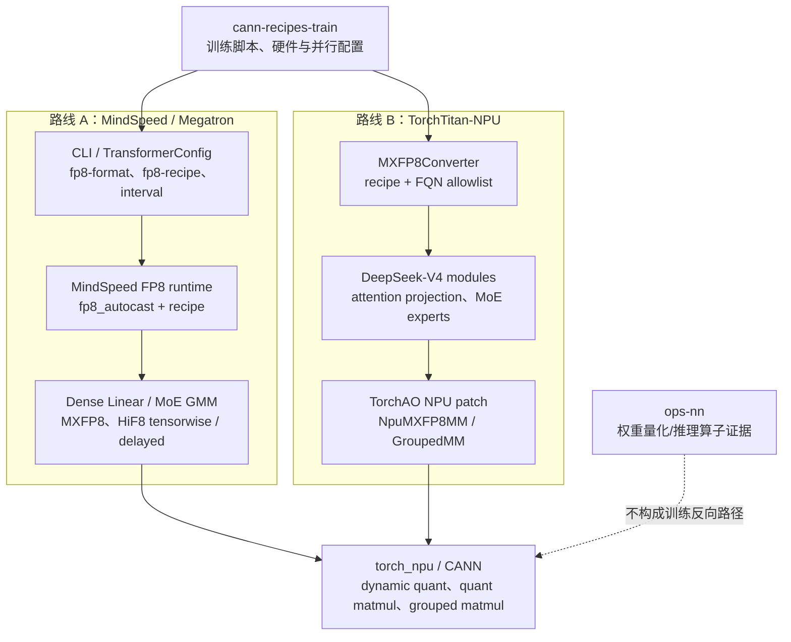
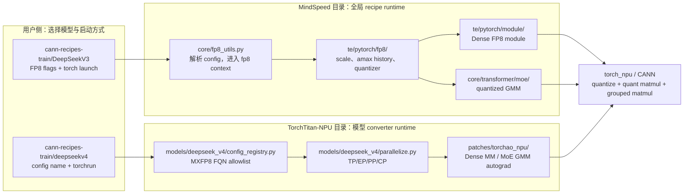
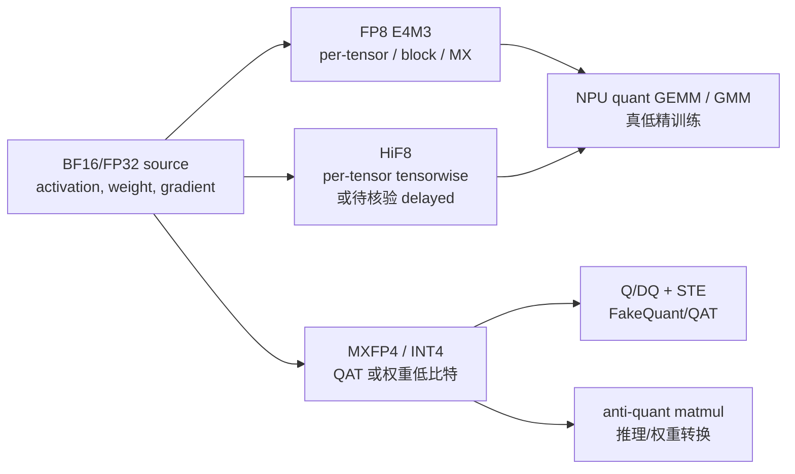
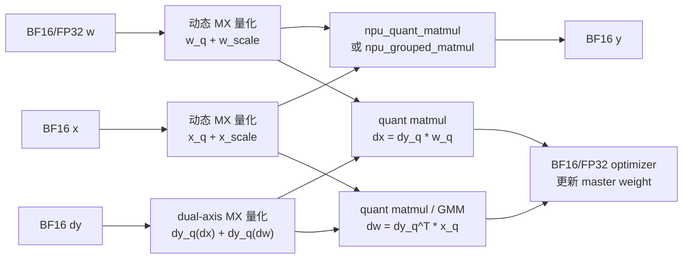
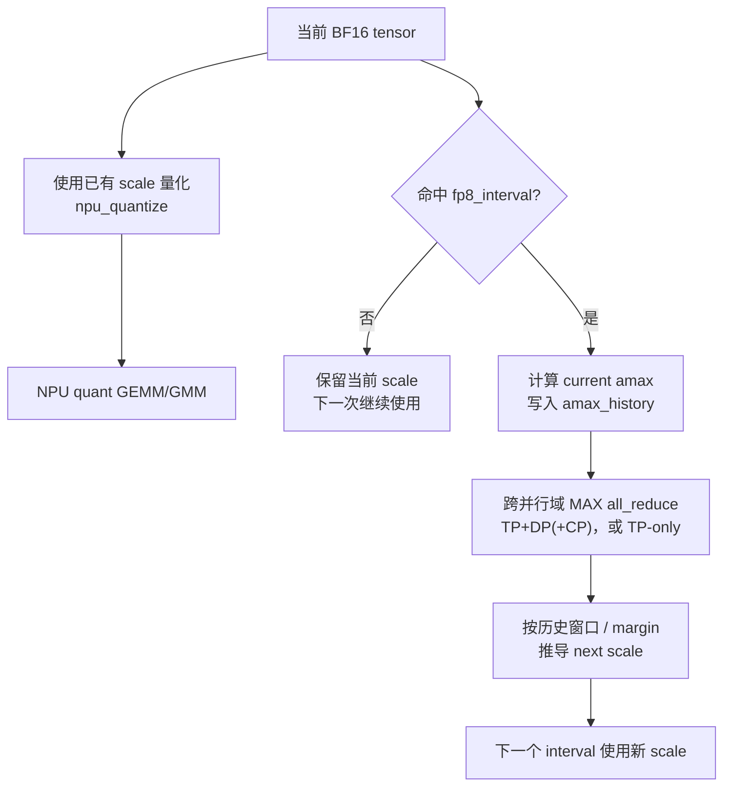
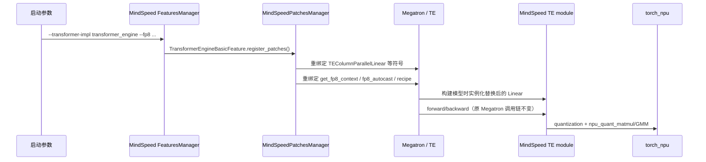

# NPU 低精训练调研报告

> 调研范围：`npu/` 下的 MindSpeed、torchtitan-npu、cann-recipes-train 和 ops-nn 源码快照。
>
> 结论依据以源码与训练 recipe 为准；“支持”指当前目录中能找到训练入口、实现链路或测试证据，不等同于所有模型、所有硬件版本均已验证。

## 1. 结论摘要

NPU 上已有两条应作为正式能力看待的低精训练路径：

| 路线 | 框架与模型 | 低精方式 | 训练实证 | 建议定位 |
| --- | --- | --- | --- | --- |
| MindSpeed FP8 | Megatron / MindSpeed-LLM，DeepSeek-V3 | E4M3 MXFP8、HiF8 tensorwise；另有 delayed recipe 实现 | A5 8 卡 DeepSeek-V3 recipe | 适合 Megatron 生态，格式与 scaling 选择较完整 |
| TorchTitan-NPU MXFP8 | TorchTitan-NPU，DeepSeek-V4 | E4M3 MXFP8，FQN 级模型转换 | A5 V4 Flash MXFP8 recipe | 适合 TorchTitan 模型集成，支持定点替换关键模块 |

两条路线都是真正的低精 GEMM/GMM 训练：前向、输入梯度和权重梯度都调用 `torch_npu` 的量化算子与量化矩阵乘，而不是“量化后反量化、再做 BF16 GEMM”的 FakeQuant。

以下能力不应与上述主路径混淆：

- MindSpeed 的 W8A16/W4A16/W4A4 QAT：用于模拟量化误差、使用 STE，主线 Linear 最终仍执行高精 `torch.matmul`。
- `ops-nn` 的 `WeightQuantBatchMatmulV2`：权重低比特 anti-quant matmul；目录中的系统测试输入均标为 `backward: false`，应按推理/权重量化算子看待。
- `torchtitan_npu/experiments/ao_npu`：实验性 TorchAO wrapper 方案，不是 DeepSeek-V4 recipe 所走的正式 MXFP8 路径。

如果目标是“仅支持 NPU 的低精训练”，建议先把 **MXFP8/E4M3** 作为共同的第一优先级能力；再视 Megatron 用户需求支持 **HiF8 tensorwise** 与 delayed scaling。后者要先解决当前源码校验和训练脚本的版本冲突后再承诺。不建议一开始承诺通用 INT4 真低精训练、全部算子低精化，或将 QAT 表述为硬件低精加速训练。

## 2. NPU 仓库与职责地图

| 目录 | 与低精训练的关系 | 结论 |
| --- | --- | --- |
| `npu/MindSpeed` | Megatron 适配、TE 风格 FP8 runtime、NPU Linear/GMM、QAT、FSDP 量化 | 低精训练主实现 |
| `npu/cann-recipes-train` | DeepSeek-V3 和 V4 的环境、启动和并行配置 | 训练可用性证据与操作入口 |
| `npu/torchtitan-npu` | TorchTitan 的模型、并行、NPU kernel converter、TorchAO MXFP8 patch | DeepSeek-V4 MXFP8 主实现 |
| `npu/ops-nn` | CANN 底层 operator 实现与测试 | 核对算子能力，不是训练框架入口 |

### 2.1 架构图：两条正式训练路径



图中两条实线是当前应优先支持的训练链路。它们的上层集成不同，但最终都落到 `torch_npu` 的量化与矩阵乘算子。`ops-nn` 是底层算子能力参考，不能替代训练框架的 autograd、并行或状态管理。

### 2.2 目录结构与运行架构的对应关系

```text
npu/
├── cann-recipes-train/                 # 用户执行入口：训练脚本、环境和并行参数
│   └── llm_pretrain/
│       ├── DeepSeekV3/                 # MindSpeed/Megatron: MXFP8、HiF8 recipe
│       └── deepseekv4/                 # TorchTitan-NPU: A5 MXFP8 / 多机训练 recipe
├── MindSpeed/                          # 路线 A 的训练 runtime
│   └── mindspeed/
│       ├── core/fp8_utils.py           # CLI/TransformerConfig -> FP8 context/recipe
│       ├── te/pytorch/fp8/             # scale state、quantizer、FP8 tensor
│       ├── te/pytorch/module/          # Dense Linear 等模块接入
│       ├── core/transformer/moe/       # MoE quantized GMM forward/dgrad/wgrad
│       ├── core/qat/                   # FakeQuant/QAT，非真低精 GEMM 主线
│       └── fsdp/quantization/          # FSDP 的模型转换式 MXFP8 分支
├── torchtitan-npu/                     # 路线 B 的训练 runtime
│   └── torchtitan_npu/
│       ├── models/deepseek_v4/         # V4 模型、FQN allowlist、并行化配置
│       ├── patches/torchao_npu/        # TorchAO MXFP8 -> NPU autograd/kernel patch
│       ├── converters/                 # NPU 模块/算子转换器
│       └── experiments/ao_npu/         # 实验性 wrapper，不是 V4 正式主线
└── ops-nn/                             # CANN 算子源码与测试；主要用作能力核对
```



读图方式：`cann-recipes-train` 决定用户怎样启动；MindSpeed 或 TorchTitan-NPU 决定模型如何进入低精计算；最后共同调用 `torch_npu/CANN`。因此设计或排障时应从 recipe -> 框架 runtime -> NPU kernel 逐层定位，而不是只在一个目录中寻找全部逻辑。

### 2.3 业界量化格式与当前 NPU 落点

需要先区分三个概念：**数值格式**（如 E4M3）、**缩放策略/粒度**（如 per-tensor、MX block）和**训练执行方式**（真低精 GEMM、FakeQuant、权重量化推理）。`MXFP8` 不是一种新的 8-bit 浮点编码，而是“FP8 数值 + 微块共享 scale”的格式体系；HiF8 是 Ascend NPU 的专有 8-bit 浮点 dtype。

| 格式或体系 | 数值编码 / scale 语义 | 当前 NPU 中的落点 | 依赖的核心算子或计算 | 证据与成熟度 |
| --- | --- | --- | --- | --- |
| BF16 | 8-bit exponent、7-bit fraction；无额外量化 scale | 两条主训练路线的参数、output、optimizer 基线 | `torch.matmul`、`npu_grouped_matmul` 的 BF16 output，optimizer | 已用于训练，但不是量化格式 |
| FP16 | IEEE half；无额外量化 scale | FSDP recipe dtype、`ops-nn` 输入/输出 | 高精 matmul 或 `WeightQuantBatchMatmulV2` 的 FP16 input/output | 间接出现；不是本次低精训练主推格式 |
| FP8 E4M3 | 4 exponent + 3 fraction；依 recipe 配套动态 scale | MindSpeed `e4m3`；TorchTitan-NPU `float8_e4m3fn` | `npu_dynamic_quant`、`npu_dynamic_mx_quant`、`npu_quant_matmul`、`npu_grouped_matmul` | 真训练主线；具体粒度由 tensorwise/MX/block recipe 决定 |
| FP8 E5M2 | 5 exponent + 2 fraction；范围更大、有效精度更低 | MindSpeed `hybrid` 的 gradient dtype；FSDP recipe parser | 与 E4M3 共用 `npu_dynamic_quant` / `npu_quant_matmul` 接口，dtype 由 `get_quant_dtype()` 选择 | 代码可配置；当前 V3/V4 recipe 未发现独立启用 |
| FP8 Hybrid | forward/weight 为 E4M3，gradient 为 E5M2 | MindSpeed `config.fp8 == "hybrid"`、`get_quant_dtype()` | tensorwise/delayed GMM 用 `npu_dynamic_quant` + `npu_grouped_matmul`；Dense 依相应 FP8 recipe | **可配置，实证弱**：`fp8_utils.py` 与 `utils.py` 有实现；检索 CANN V3/V4 训练脚本、toml 未找到 `hybrid`，而命中 MXFP8/HiF8 |
| MXFP8 | 通常 E4M3 data + E8M0 shared scale；典型 block 32 或 32x32 | MindSpeed `mxfp8` / `mxfp8_32x32`；TorchTitan `MXFP8Converter(mxfp8_rceil)` | `npu_dynamic_mx_quant`、`npu_dynamic_mx_quant_with_dual_axis`、`npu_dynamic_block_mx_quant`、`npu_quant_matmul`、`npu_grouped_matmul`、可选 `npu_add_quant_gmm_` | 真低精 Dense 与 MoE GMM 主线；V3/V4 recipe 均有对应证据 |
| Block FP8 | FP8 data + 显式 block scale，如 1x128/128x128 | MindSpeed `blockwise` / `Float8BlockScaling` | `npu_dynamic_block_quant` + `npu_quant_matmul` | Dense forward/dgrad/wgrad 有实现；MoE GMM 未实现，代码明确 fallback 高精 |
| HiF8 | Ascend `torch_npu.hifloat8`；可配 per-tensor current/tensorwise，delayed 代码路径也存在 | MindSpeed `hif8` format；V3 脚本写为 `hif8 + delayed` | tensorwise：`npu_dynamic_quant` + `npu_quant_matmul`/`npu_grouped_matmul`；delayed：`npu_quantize` + `npu_quant_matmul` | **tensorwise 有源码校验；delayed 需版本核验**：当前 feature 明确限制 HiF8 仅 tensorwise，但 V3 script 使用 delayed，二者冲突 |
| MXFP4 E2M1 | 2 exponent + 1 fraction；通常 block 32 + shared scale | MindSpeed W4A4 QAT、W4A16 FakeQuant、W4A8 GMM 辅助路径 | Python Q/DQ 模拟、`npu_dynamic_mx_quant`、特定 `npu_grouped_matmul` 路径 | FakeQuant/特定模块；未证实为通用真低精训练主线 |
| FP4 E1M2 | 1 exponent + 2 fraction，packed dtype | MindSpeed FSDP recipe dtype parser | 当前未找到对应训练 GEMM 组合；仅 dtype 映射 | 仅能说明格式可解析，不能表述为训练支持 |
| INT8 / W8A8 | 整数权重/activation + scale/zero point 或 antiquant scale | `ops-nn` WeightQuantBatchMatmul；DeepSeek-V3.2 权重转换脚本 | `WeightQuantBatchMatmulV2/V3`、anti-quant；权重转换脚本 | 主要推理/权重转换；测试 `backward: false`，不能当作 W8A8 训练证据 |
| INT4 / W4A8 | 低比特整数或 FP4 weight + scale | `ops-nn`、MindSpeed QAT/W4A8 专用代码 | `WeightQuantBatchMatmulV2/V3`、W4A4/W4A16 FakeQuant、特定 GMM | QAT 或推理相关；不应承诺为通用训练能力 |

格式在主路径中的位置可概括为：



从产品能力角度，推荐将“当前支持”分级表达：

- **已具备真低精训练路径**：E4M3 MXFP8；MindSpeed HiF8 tensorwise 的实现路径。
- **有实现但需要逐模型验证**：E5M2/Hybrid、Block FP8、FSDP 的 MXFP8 量化分支。
- **仅 FakeQuant、特定模块或推理证据**：MXFP4、FP4、INT8、INT4；不要表述为已通用支持的低精训练。

Hybrid 的证据边界具体如下：`npu/MindSpeed/mindspeed/core/fp8_utils.py` 将 `config.fp8 == "hybrid"` 映射到 `Format.HYBRID`，`npu/MindSpeed/mindspeed/te/pytorch/utils.py` 将其量化 dtype 配为 x/weight 的 E4M3 与 gradient 的 E5M2；但本次在 `npu/cann-recipes-train` 的 V3/V4 脚本、以及 `npu/torchtitan-npu` 的 toml 中搜索 `hybrid`，没有找到训练启用项。相对地，V3 recipe 明确启用 `mxfp8` 和 `hif8/delayed`。因此“实证弱”仅表示缺少当前目录内的 recipe 级训练证据，并不表示该代码路径一定不可运行。

HiF8 还存在必须说明的源码冲突：`TransformerEngineBasicFeature.validate_args()` 当前要求 `args.fp8 == 'hif8'` 时 recipe 必须是 `tensorwise`；而 V3 的 CANN 脚本传入 `--fp8-format hif8 --fp8-recipe delayed --fp8-interval 10`，且 `get_fp8_context()` 的确能按 `delayed` 创建 `TEDelayedScaling`。这可能意味着脚本对应的 MindSpeed 版本与当前源码不同，或校验规则尚未和 recipe 同步。报告据此只把 **HiF8 tensorwise** 记为当前源码自洽的能力；HiF8 delayed 必须在目标版本上实际启动验证。

### 2.4 scaling recipe 支持矩阵

`delayed` 不在上一节的“格式”表中，是因为它不是格式，而是 scale 的更新算法。它与 format 的关系应按下表看：

| recipe | scale 的来源与更新方式 | 量化算子 | Dense 计算算子 | MoE GMM | format 组合与当前结论 |
| --- | --- | --- | --- | --- | --- |
| `tensorwise` / current | 每次从当前 tensor 计算 per-tensor scale | `npu_dynamic_quant` | `npu_quant_matmul` | `npu_grouped_matmul` | E4M3、Hybrid、HiF8 都有代码路径；HiF8 是当前 feature 校验明确允许的组合 |
| `delayed` | 维护 `amax_history`；每 `fp8_interval` 次更新后续 scale | `npu_quantize` | `Float8Tensor.quant_matmul()` -> `npu_quant_matmul` | `TensorwiseGMMFunction` -> `npu_dynamic_quant` + `npu_grouped_matmul` | `get_fp8_context()` 支持 delayed；E4M3/Hybrid 代码上可构造。HiF8 delayed 与当前 feature 校验冲突，待目标版本验证 |
| `mxfp8` | 当前 MX 微块 scale，典型 block 32 | `npu_dynamic_mx_quant` / dual-axis 版本 | `npu_quant_matmul` | `npu_grouped_matmul` | 当前 E4M3 MXFP8 主线；MindSpeed V3 与 TorchTitan-NPU V4 都有 recipe 证据 |
| `mxfp8-32x32` | MX block 32x32；weight 使用 block MX quant | `npu_dynamic_block_mx_quant` 及 MX quant | `npu_quant_matmul` | `npu_grouped_matmul` | MindSpeed 有实现；需要按模型/硬件验证 |
| `blockwise` | 显式 block scale，例如 1x128 / 128x128 | `npu_dynamic_block_quant` | `npu_quant_matmul` | 当前会 fallback BF16 | Dense 有实现；GMM 未实现 |

**HiF8 能否走普通量化 matmul？可以。** 在 `CurrentScalingRecipe`/`TensorwiseMatMul` 路径中：

```python
# 1. 量化：dst_type 是 torch_npu.hifloat8
x_quant, x_scale = torch_npu.npu_dynamic_quant(
    x, dst_type=qdtype.x, quant_mode="pertensor",
    dst_type_max=FormatEnum.HIF8_15.value.max)

# 2. GEMM：仍是普通 npu_quant_matmul，只额外声明两个 operand dtype
output = torch_npu.npu_quant_matmul(
    x_quant, w_quant.t(), w_scale,
    pertoken_scale=x_scale,
    output_dtype=x.dtype,
    x1_dtype=torch_npu.hifloat8,
    x2_dtype=torch_npu.hifloat8)
```

其中 `x1_dtype/x2_dtype` 来自 `get_quant_dtype().mm_kwargs`；GMM 对应通过 `gmm_kwargs` 把相同 dtype 传给 `npu_grouped_matmul`。因此 HiF8 不是不能用 quant matmul，而是 NPU kernel 需要根据入参知道量化数据按 HiF8 解释；E4M3 路径通常由 tensor dtype 自身即可区分，不额外传这两个 kwargs。

“同一算子支持多格式”的实现方式正是如此：**quantizer 的 `dst_type` 选择量化数据格式，scale/dst_type_max 描述该格式的范围或缩放，matmul/GMM 再从量化 tensor dtype 和显式 dtype kwargs 选择正确的计算分支。** 但上层仍会限制有效组合，例如 TorchTitan-NPU 现有 MX patch 将 `dst_type` 固定为 `torch.float8_e4m3fn`，所以不能仅靠改某个 kernel 参数就让 V4 MXFP8 路径变成 HiF8。

MindSpeed 的 dtype 分派代码等价于：

```python
# mindspeed/te/pytorch/utils.py，逻辑简化
if args.fp8 == "hif8":
    return QuantDtype(torch_npu.hifloat8,
                      torch_npu.hifloat8,
                      torch_npu.hifloat8)
elif args.fp8 == "hybrid":
    return QuantDtype(torch.float8_e4m3fn,
                      torch.float8_e4m3fn,
                      torch.float8_e5m2)
else:
    return QuantDtype(torch.float8_e4m3fn,
                      torch.float8_e4m3fn,
                      torch.float8_e4m3fn)
```

`QuantDtype` 在 HiF8 情况下生成 `mm_kwargs={"x1_dtype": ..., "x2_dtype": ...}` 和对应的 `gmm_kwargs`；因此调用点的函数名不变，真正选择格式的是 quantizer 的 `dst_type` 与 matmul/GMM 的 dtype 入参组合。

## 3. 共用的 NPU 执行模型

低精训练的关键不是仅把参数存成 FP8，而是在每个需要的 GEMM/GMM 边界执行：

```text
BF16/FP32 x, w, grad
  -> NPU quantize：量化数据 + scale
  -> NPU quant matmul / grouped matmul
  -> BF16/FP32 output 或 grad
```

典型数据流如下：

```text
forward:  x_q * w_q^T       -> y
dgrad:    dy_q * w_q        -> dx
wgrad:    dy_q^T * x_q      -> dw
```

MXFP8 的 scale 是 NPU 动态 MX quant op 为当前张量/块计算出来的，不维护 delayed amax 历史；delayed recipe 则维护每个量化器的 `amax_history`、按 interval 更新 scale，并在需要时跨并行域做最大值归约。HiF8 是否能和 delayed recipe 组合，要以目标 MindSpeed 版本的 feature 校验为准；当前源码快照与 V3 脚本对此存在冲突。

### 3.1 数据流图：MXFP8 真低精训练



要点：量化数据与 scale 一起直接送给 NPU quant GEMM/GMM；输出和 optimizer state 仍是 BF16/FP32 语义。训练路径是否成立，必须同时验证 forward、dgrad 和 wgrad 三段，而不是只看到 forward 的 FP8 kernel。

### 3.2 数据流图：Delayed scaling 与分布式同步



这里需要区分“本次计算”和“为后续计算更新状态”：本次通常使用旧 scale；命中 interval 后得到的 amax 与 scale 用于后续量化。分布式同步归约的是 amax 的最大值，不是对各 rank 已计算的 scale 求平均。MXFP8 是当前动态量化，因此没有这一套 delayed amax history 更新流程。该图描述的是 delayed **recipe** 的通用机制，不等同于“只有 HiF8 才能使用 delayed”。

### 3.3 format、recipe 与 kernel：三个独立维度

低精配置至少由下面三个维度共同决定，不能把其中任意一个当成另一个的别名：

| 维度 | 例子 | 回答的问题 | 在代码中的主要入口 |
| --- | --- | --- | --- |
| format | E4M3、E5M2、Hybrid、HiF8 | 8-bit 数值怎样编码，x/w/grad 分别使用什么 dtype | `Format`、`FormatEnum`、`get_quant_dtype()` |
| recipe / scaling | tensorwise/current、delayed、mxfp8、mxfp8-32x32、blockwise | scale 怎样计算、是当前值还是历史值、一个 scale 覆盖多大区域 | `Fp8Recipe`、`get_fp8_context()`、各 `*ScalingRecipe` |
| kernel / 执行路径 | `npu_dynamic_quant`、`npu_quantize`、`npu_dynamic_mx_quant`、`npu_quant_matmul` | 调用哪个 NPU 算子完成量化和 GEMM/GMM | recipe 的 `quantization()`、`Float8Tensor.quant_matmul()` |

例如：

```text
HiF8 + tensorwise  -> npu_dynamic_quant(dst_type=hifloat8)
                     -> npu_quant_matmul(..., x1_dtype=hifloat8, x2_dtype=hifloat8)

E4M3 + mxfp8       -> npu_dynamic_mx_quant(dst_type=float8_e4m3fn)
                     -> npu_quant_matmul(..., E8M0 block scale)

E4M3 + delayed     -> npu_quantize(scales=历史 amax 推导的 scale)
                     -> Float8Tensor.quant_matmul() -> npu_quant_matmul
```

同一个 GEMM 算子可以接收不同 format，因为 format 和 scale 作为量化 tensor 的 dtype/scale，以及部分显式 dtype 入参传入；但不是任意组合都保证可用。具体限制由上层 feature 校验、recipe 实现和底层 NPU kernel 共同决定。对 HiF8，`get_quant_dtype()` 会额外传入 `x1_dtype`、`x2_dtype`；对 MXFP8，scale layout 和 `scale_dtype`/`pertoken_scale_dtype` 要符合 MX kernel 的 E8M0 约定。

## 4. 路线一：MindSpeed / Megatron FP8

### 4.1 用户配置与真实训练样例

MindSpeed 在 `get_fp8_context()` 中，将 Megatron `TransformerConfig` 的 `fp8` 和 `fp8_recipe` 映射为具体 recipe，并通过 `fp8_autocast()` 使模型执行进入 FP8 运行时。支持：

| `fp8_recipe` | 含义 | 主要量化算子 |
| --- | --- | --- |
| `delayed` | 历史 amax 驱动的 delayed scaling | `npu_quantize` |
| `tensorwise` | 当前值 per-tensor scaling | TE `Float8CurrentScaling` |
| `mxfp8` | MX 动态缩放 | `npu_dynamic_mx_quant` |
| `mxfp8_32x32` | 32x32 MX block 变体 | `npu_dynamic_block_mx_quant` |
| `blockwise` | block FP8 | `npu_dynamic_block_quant` |

源码：`npu/MindSpeed/mindspeed/core/fp8_utils.py` 的 `get_fp8_context()`。

注意：上表中的 `delayed` 是 recipe，不是格式；它可与 E4M3/Hybrid/HiF8 这样的 format 组合，但最终是否允许该组合要经过 feature 校验与目标版本验证。当前源码中 HiF8 的 feature 校验仅允许 `tensorwise`，详见 2.3 节的冲突说明。

CANN recipe 给出了两条 A5 8 卡 DeepSeek-V3 裁剪模型的训练入口：

```bash
# MXFP8：E4M3 + 当前动态 MX scale
--fp8-format e4m3
--fp8-recipe mxfp8
--transformer-impl transformer_engine
--te-gmm-mode performance

# V3 recipe 写为 HiF8 delayed；与当前 MindSpeed feature 校验冲突，需按版本实机核验
--fp8-format hif8
--fp8-recipe delayed
--fp8-interval 10
--transformer-impl transformer_engine
--te-gmm-mode performance
```

对应文件：

- `npu/cann-recipes-train/llm_pretrain/DeepSeekV3/run_pretrain_dsk3_A5_8P_mxfp8.sh`
- `npu/cann-recipes-train/llm_pretrain/DeepSeekV3/run_pretrain_dsk3_A5_8P_hif8.sh`

该 README 明示目标硬件为 Atlas A5 950DT、最少 8 卡，且样例为 8K 序列预训练。因此它是很强的“该组合已被实际拉起”证据，但不代表其他卡型或模型自动可用。

### 4.2 MXFP8 Dense Linear 的计算机制

`MXFP8MatMul` 的 forward 在需要反传时对 x 和 weight 做 dual-axis 动态 MX 量化，保留适合反传方向的量化结果；然后调用 `torch_npu.npu_quant_matmul`。backward 对 `grad_output` 做 dual-axis 量化，分别调用 quant matmul 求 `dx` 与 `dw`。

这说明：

- 量化对象包括 activation、weight 和 gradient；不是权重-only。
- 输出仍以原输入 dtype 输出，通常为 BF16；低精发生在 GEMM operand 与乘法计算路径。
- weight 可通过 `reuse_or_quantize()` 复用当前 step 内相同量化方向的结果，避免重复量化。

实现位置：`npu/MindSpeed/mindspeed/te/pytorch/fp8/recipes/mxfp8_scaling_recipe.py`。

### 4.3 Delayed scaling 的状态与更新

`ScaleData` 持有：

- `scale`：当前量化 scale；
- `amax_history`：长度由 `fp8_amax_history_len` 决定；
- `amax`：根据历史窗口、算法计算得到的 amax；
- `current_interval`：每调用一次量化器递增，到达 `fp8_interval` 才更新。

首次使用当前张量 amax 直接初始化；之后先使用已有 scale 量化，只有命中 interval 时才在独立 stream 上计算新 amax、归约并更新未来 scale。其 scale 的存储语义与 NPU `npu_quantize` 所需参数相反，因此代码用：

```text
stored_scale = amax * 2^margin / fp8_max
```

而不是常见论文中的 `fp8_max / amax / 2^margin`。

实现位置：`npu/MindSpeed/mindspeed/te/pytorch/fp8/scale_data.py`、`.../delayed_scaling_recipe.py`。

这段状态机属于 delayed recipe，不专属于 HiF8。HiF8 的实际可用组合需要以目标 MindSpeed 版本的 `validate_args()` 为准：当前快照允许 HiF8 tensorwise，但与 V3 recipe 中的 HiF8 delayed 写法冲突，因此不能仅由脚本推导为“HiF8 delayed 已稳定支持”。

### 4.4 MoE GMM 与能力边界

MindSpeed 在 MoE 中按 recipe 选择 `MXFP8GMMFunction`、`MXFP832x32GMMFunction` 或 `TensorwiseGMMFunction`。MXFP8 的 forward/dgrad/wgrad 都使用：

- `npu_dynamic_mx_quant` / `npu_grouped_dynamic_mx_quant`；
- `npu_grouped_matmul`；
- 在梯度融合时可用 `npu_add_quant_gmm_` 直接累加量化 GMM 的 weight gradient。

实现位置：`npu/MindSpeed/mindspeed/core/transformer/moe/grouped_matmul_util.py`。

重要边界：同文件明确写明 `blockwise` FP8 的 GMM 尚未实现，会退回高精路径。因此发布能力时应按“Dense / MoE、recipe、hardware”细分，不应只标注“已支持 FP8”。

### 4.5 分布式 amax 归约

Delayed scaling 需要相同量化器在并行副本间使用一致的 amax。MindSpeed 通过 `parallel_state.get_amax_reduction_group()` 提供归约域：

| 配置 | 返回的归约域 |
| --- | --- |
| 默认且无 CP | TP + DP |
| 默认且有 CP | TP + DP + CP |
| `tp_only_amax_red=True` 且无 CP | TP |
| `tp_only_amax_red=True` 且有 CP | TP + CP |

更新时对最新 amax 做 `ReduceOp.MAX`，绝不是平均 scale。MXFP8 当前动态量化不依赖历史 amax state，但并行后仍需要确认每种模块和分片布局使用的量化方向、scale layout 是否与 NPU kernel 和通信语义一致。

实现位置：

- `npu/MindSpeed/mindspeed/te/pytorch/fp8/scale_data.py`
- `npu/MindSpeed/mindspeed/core/multi_modal/dist_train/dist_parallel_state.py`

### 4.6 MindSpeed FSDP 量化分支

MindSpeed 还存在一个基于 model converter 的 FSDP 量化模块：`QuantizeConfig(recipe_name, apply_modules, ignored_modules, quant_converters)`。其中 `MXLinear` 使用 `npu_quant_matmul` 完成 forward/dgrad/wgrad，并支持在 optimizer step 后缓存/更新低精 weight。

这个分支目前实际实现了 `mxfp8` 与 `mxfp8-32x32`，不要因 `QuantRecipe` 的枚举中出现 delayed/HiF8 就假定所有组合均已打通。

实现位置：`npu/MindSpeed/mindspeed/fsdp/quantization/`。

## 5. 路线二：TorchTitan-NPU / DeepSeek-V4 MXFP8

### 5.1 训练实证与软件版本

CANN recipe 的 DeepSeek-V4 README 明确以 TorchTitan-NPU 为训练框架，覆盖 DeepSeek-V4-Flash 与 DeepSeek-V4-Pro：

- A3：使用 `v0.2.2-dev`；
- A5：使用 `master`；
- A5 另有 `run_train_dsv4_flash_A5_MXFP8_pretrain.sh`，默认使用 `deepseek_v4_flash_debug_16_experts_43_layers_mxfp8`。

这不是仅仅“能在 NPU 上 import TorchTitan”，而是存在模型配置、启动脚本和 NPU backend 的完整训练交付。

对应文件：

- `npu/cann-recipes-train/llm_pretrain/deepseekv4/README.md`
- `npu/cann-recipes-train/llm_pretrain/deepseekv4/run_train_dsv4_flash_A5_MXFP8_pretrain.sh`

### 5.2 配置方式：FQN 级的 model converter

DeepSeek-V4 的 MXFP8 配置构造为：

```python
MXFP8Converter.Config(
    recipe_name="mxfp8_rceil",
    fqns=[...],
)
```

其 `fqns` 只包含关键投影和专家模块，例如：

- `pre_attention.wq_a`、`wq_b`、`wkv`；
- `post_attention.wo_a`、`wo_b`；
- indexer 投影；
- `moe.experts`、`moe.shared_experts`；
- `e_proj`、`h_proj`。

含义是：模型未被笼统地“全局 FP8 化”，而是在 model construction 后，根据稳定的模块全限定名精确替换指定计算模块。这非常适合逐步扩大量化范围、对异常层做 BF16 回退，也使配置与模型结构强绑定。

实现位置：`npu/torchtitan-npu/torchtitan_npu/models/deepseek_v4/config_registry.py`。

### 5.3 TorchAO 与 NPU backend 的关系

TorchTitan 的 `MXFP8Converter` 与 TorchAO 提供上层模型转换和 recipe 语义；`torchtitan_npu` 在 import 时对相关 TorchAO 函数打 patch，把 CUDA/Blackwell 假设替换为 NPU 真实实现：

```text
MXFP8Converter
  -> TorchAO _to_mxfp8_then_scaled_mm / grouped_mm
  -> torchtitan_npu monkey patch
  -> NpuMXFP8MM / NpuMXFP8GroupedMM autograd.Function
  -> torch_npu dynamic MX quant + quant matmul/grouped matmul
```

它不是“TorchAO fake quant 跑在 NPU 上”：

- `NpuMXFP8MM.forward()` 调用 `npu_dynamic_mx_quant[_with_dual_axis]` 和 `npu_quant_matmul`；
- `backward()` 对梯度再量化，并用 `npu_quant_matmul` 求 dx/dw；
- `NpuMXFP8GroupedMM` 对 MoE 专家使用 `npu_grouped_matmul`，也覆盖 forward/dgrad/wgrad；
- capability patch 仅改 MXFP8 的 CUDA capability gate，因为上游 TorchAO 原本限制 MXFP8 在 CUDA Blackwell 之后。

相关实现：

- `npu/torchtitan-npu/torchtitan_npu/__init__.py`
- `npu/torchtitan-npu/torchtitan_npu/patches/torchao_npu/mx_capability_check.py`
- `npu/torchtitan-npu/torchtitan_npu/patches/torchao_npu/mx_linear.py`
- `npu/torchtitan-npu/torchtitan_npu/patches/torchao_npu/mxfp8_grouped_mm.py`

### 5.4 Activation Checkpoint 对量化的影响

普通训练前向可以保存反传所需的 dual-axis quant 结果。开启 activation checkpoint 后，原前向会在反传时重算；NPU patch 为避免在重算路径产生不一致或重复量化，使用 context/stack bridge 保存或传递后向方向需要的 `x/weight` 量化数据与 scale。

因此，MXFP8 的工程集成不能只处理前向的模块替换；还必须验证：

- 无 checkpoint 与 full/selective checkpoint；
- 重算顺序和 quant cache 的配对；
- `dgrad/wgrad` 所用量化方向；
- FSDP/DTensor 分片下 weight 的真实布局。

### 5.5 当前已知限制

DeepSeek-V4 的并行代码明确拒绝未测试的 float8 tensorwise TP。这不影响其 MXFP8 recipe，但说明“float8”并非对所有 scaling/TP 组合都是可用能力。

实现位置：`npu/torchtitan-npu/torchtitan_npu/models/deepseek_v4/parallelize.py`。

## 6. FakeQuant、低比特 QAT 与权重量化

### 6.1 MindSpeed QAT

MindSpeed 的 W8A16、W4A16、W4A4 fake quant 在前向将值量化再恢复到原 dtype，反向直接返回原 gradient（STE）。例如 W8A16 的 quant block 为 32，使用 E4M3 类离散值模拟。

它的 QAT Linear 会将 weight（可选 activation）fake quant 后执行标准 `torch.matmul`。所以它的价值是：

- 在 BF16/FP32 算法路径中注入目标格式误差；
- 用于研究量化容忍度或训练低比特权重；
- 不等同于让 NPU GEMM 以 FP8/FP4 运算而获得相同的性能收益。

实现位置：`npu/MindSpeed/mindspeed/core/qat/`。

### 6.2 TorchTitan-NPU experiments

`npu/torchtitan-npu/torchtitan_npu/experiments/ao_npu` 包含：

- FP8 row-wise FakeQuant wrapper；
- MX/Block 真低精 wrapper；
- `quantize_`、参数包装、FSDP2 hook 的探索。

它可以参考“如何按参数或 module filter 接入量化”，但其目录名、测试属性以及 `torch.compile` 未验证提示表明，不应与 DeepSeek-V4 的正式 converter/NPU patch 主线混为同一成熟度等级。

### 6.3 ops-nn WeightQuantBatchMatmulV2

该算子输入包括低比特 `weight`、`antiquantScale`、可选 `antiquantOffset`，体现的是权重低比特存储与算子内反量化计算。测试工件中所有输入都标为 `backward: false`，未见训练反向接口。

结论：可以作为推理或权重格式能力的下层依据，不能作为“已支持 QAT/低精训练”的证据。

实现位置：`npu/ops-nn/matmul/weight_quant_batch_matmul_v2/`。

## 7. 两条主训练路线的比较

| 维度 | MindSpeed / Megatron | TorchTitan-NPU |
| --- | --- | --- |
| 已验证模型样例 | DeepSeek-V3 裁剪模型 | DeepSeek-V4 Flash/Pro，A5 有 MXFP8 debug recipe |
| 上层配置入口 | CLI `--fp8-format`、`--fp8-recipe` | `MXFP8Converter.Config(recipe_name, fqns)` |
| 覆盖范围 | FP8 context 中的 TE 模块；MoE 按 recipe 分派 | 明确 FQN 白名单，按模块精确转换 |
| scaling | delayed、tensorwise、MX、block 等 | 当前正式路径聚焦 MXFP8 |
| 格式 | E4M3、Hybrid、HiF8 | 当前路径 E4M3 MXFP8 |
| NPU kernel | `npu_quantize`、`npu_quant_matmul`、`npu_grouped_matmul` | 同类 `torch_npu` kernels，经 TorchAO patch 进入 |
| 分布式重点 | delayed amax reduction group | DTensor/TP/EP + AC quant cache；MX 无 delayed amax history |
| 核心风险 | recipe 和 MoE 实现覆盖不完全 | 上游 TorchAO API/patch 版本耦合、FQN 随模型演进 |

二者底层都依赖 `torch_npu` 的量化与 matmul/GMM 能力，但上层集成风格不同：MindSpeed 是全局 FP8 runtime recipe；TorchTitan 是模型 converter + 定点 FQN 选择。

### 7.1 生态定位与关键代码

可以把两条路线理解为同一套 NPU kernel 上的两个生态适配层：

```text
Megatron / MindSpeed-LLM                 TorchTitan / TorchAO
        |                                        |
TransformerConfig + fp8_autocast        MXFP8Converter + FQN allowlist
        |                                        |
MindSpeed FP8 recipe/runtime             torchtitan_npu TorchAO patch
        |                                        |
          -------- torch_npu quant / GEMM / GMM --------
```

**MindSpeed 更接近 Megatron 生态。** 用户通过 Megatron 的 `TransformerConfig` 或命令行的 `--fp8-format`、`--fp8-recipe` 选择全局 FP8 运行时策略；模型层在进入 FP8 context 时读取全局 recipe。关键分发代码如下：

```python
# mindspeed/core/fp8_utils.py
if config.fp8_recipe == Fp8Recipe.delayed:
    fp8_recipe = TEDelayedScaling(
        config=config,
        fp8_format=fp8_format,
        override_linear_precision=(False, False, not config.fp8_wgrad),
    )
elif config.fp8_recipe == Fp8Recipe.mxfp8:
    fp8_recipe = MXFP8BlockScaling(fp8_format=fp8_format)

fp8_group = parallel_state.get_amax_reduction_group(
    with_context_parallel=True,
    tp_only_amax_red=config.tp_only_amax_red,
)
fp8_context = fp8_autocast(
    enabled=True, fp8_recipe=fp8_recipe, fp8_group=fp8_group)
```

这里的关键是“**一个 context/recipe 统领其范围内的 TE 模块**”。因此格式、scale policy、amax 归约域是全局运行时概念；模块层主要负责根据当前 recipe 选择 quantizer 和 NPU kernel。完整实现见 `npu/MindSpeed/mindspeed/core/fp8_utils.py`。

**TorchTitan-NPU 更接近 TorchTitan/TorchAO 生态。** 用户在模型配置中向 converter 容器加入 MXFP8 配置，并用 FQN 选择哪些模块转换：

```python
# torchtitan_npu/models/deepseek_v4/config_registry.py
model_converters=ModelConvertersContainer.Config(
    converters=base.model_converters.converters
    + [MXFP8Converter.Config(
        recipe_name="mxfp8_rceil",
        fqns=list(_MXFP8_FQNS),
    )]
)
```

这里的关键是“**converter 只作用于 FQN 命中的模型模块**”。它天然支持先只量化 attention projection/MoE，再按模块扩大或回退范围；格式和 kernel 选择随 converter 的 recipe 与 NPU backend 一起生效。完整实现见 `npu/torchtitan-npu/torchtitan_npu/models/deepseek_v4/config_registry.py`。

### 7.2 MindSpeed 如何替换 Megatron/Transformer Engine

MindSpeed 的方式可以概括为：**在 Megatron 构建模型之前，改写 Megatron 将要查找的类/函数符号；之后 Megatron 按原流程构建模型，但拿到的是 MindSpeed 的 NPU 实现。** 用户不需要逐层改模型代码。



具体分三步：

1. **选中 feature。** `TransformerEngineBasicFeature.validate_args()` 要求启用 FP8 时使用 `--transformer-impl transformer_engine`；`FeaturesManager` 对启用 feature 依次调用 `register_patches()`，最后执行 `MindSpeedPatchesManager.apply_patches()`。
2. **重绑定 Megatron/TE 的名字。** `TransformerEngineBasicFeature.register_patches()` 在 `args.fp8_format` 存在时注册例如：

```python
# mindspeed/features_manager/megatron_basic/transformer_engine_basic.py
patch_manager.register_patch(
    'megatron.core.extensions.transformer_engine.TEColumnParallelLinear',
    TEColumnParallelLinear,
)
patch_manager.register_patch(
    'megatron.core.extensions.transformer_engine.TERowParallelLinear',
    TERowParallelLinear,
)
patch_manager.register_patch(
    'megatron.core.fp8_utils.get_fp8_context', get_fp8_context,
)
patch_manager.register_patch(
    'transformer_engine.pytorch.fp8_autocast', fp8_autocast,
)
patch_manager.register_patch(
    'transformer_engine.common.recipe.MXFP8BlockScaling',
    MXFP8BlockScaling,
)
```

这不是给某个现成 `nn.Linear` 打 hook，而是把 Megatron 的模块规格中会引用的 `TEColumnParallelLinear`、`TERowParallelLinear` 等类替换为 MindSpeed 类。因此必须在 Megatron 根据 `ModuleSpec` 创建 transformer layer **之前**完成 patch。

3. **替换后的 module 在运行时读取全局 FP8 state。** Megatron 的训练/重算入口调用已经被替换的 `get_fp8_context()`；该函数根据 `config.fp8` 和 `config.fp8_recipe` 构造 recipe，进入 MindSpeed `fp8_autocast()`。`fp8_autocast` 将 `enabled`、recipe 和 amax group 写到 `FP8GlobalStateManager`。每个 `TEColumnParallelLinear` 内部的 `FP8Metadata.is_fp8_enable()` 读取这份 state；启用时走 `fp8_matmul()`，否则仍走普通 `torch.matmul`。

```python
# mindspeed/te/pytorch/module/linear.py，逻辑简化
if fp8_meta is None or not fp8_meta.is_fp8_enable():
    output = torch.matmul(input_, weight.t())
else:
    output, fp8_input, fp8_weight = fp8_matmul(
        input_, weight, fp8_meta, MatmulKey.forward)
```

`fp8_matmul()` 再通过 `FP8Metadata.quantization()` 分别为 inputs、weight、grads 创建对应 recipe 的量化 tensor；实际调用 `recipe.quantization()`，最后由该量化 tensor 的 `quant_matmul()` 调用 NPU kernel。简化链路：

```text
Megatron TransformerBlock.forward
  -> MindSpeed TEColumn/RowParallelLinear
  -> FP8Metadata.quantization(key, tensor)
  -> Delayed / Current / MX / Block recipe.quantization(...)
  -> Float8Tensor / MXFP8Tensor.quant_matmul(...)
  -> torch_npu.npu_quant_matmul（或通信融合 quant MM）
```

所以 MindSpeed 同时替换了三个层面：**Megatron 的模块类、Megatron/TE 的 FP8 context/recipe API、以及部分 TransformerBlock/checkpoint/MoE 辅助函数**。这就是它与 Megatron 生态耦合较深的原因。

### 7.3 TorchTitan-NPU 如何替换 TorchTitan/TorchAO

TorchTitan-NPU 的替换分为两层，顺序也很重要：

```text
第 1 层：导入 torchtitan_npu 时，注入/替换 TorchTitan 模型模块和基础能力
第 2 层：同一导入过程中，将 TorchAO MX 函数入口改指向 NPU autograd 实现
第 3 层：训练 config 的 MXFP8Converter 按 FQN 转换实际模型模块
```

其启动入口 `torchtitan_npu.entry` 首先 `import torchtitan_npu`。包的 `__init__.py` 立即执行 `_apply_patches()`，且通过 `_initialized` 保证进程中仅执行一次。它做两类替换：

```python
# torchtitan_npu/__init__.py，逻辑简化
from .models import deepseek_v4
_inject_module('torchtitan.models.deepseek_v4', deepseek_v4)

from .patches.torchao_npu import (
    mx_capability_check, mx_linear, mxfp8_grouped_mm)
```

`_inject_module()` 实际是：

```python
sys.modules['torchtitan.models.deepseek_v4'] = deepseek_v4
```

这意味着后续任何 `import torchtitan.models.deepseek_v4` 取得的是 NPU 适配后的 DeepSeek-V4 模型、并行化和配置注册，而不是上游同名模块。注意：这一步只替换 **模型实现/注册**，还没有让任意 Linear 自动 MXFP8 化。

接着，config 中的 `MXFP8Converter.Config(recipe_name, fqns)` 由上游 TorchTitan/TorchAO 的 converter 机制处理。它只把 FQN 命中的 module/weight 转为 MXFP8 training wrapper/调用路径；未命中的模块继续按 BF16 跑。因此“是否低精”首先由 FQN allowlist 决定。

### 7.4 TorchTitan-NPU patch 如何替换 TorchAO

TorchTitan-NPU 没有 fork 一份完整 TorchAO，而是在导入 `torchtitan_npu` 时加载 patch 模块。Python import 会执行模块顶层代码，因此下面的 import 本身就是安装动作：

```python
# torchtitan_npu/__init__.py
from .patches.torchao_npu import (
    mx_capability_check,
    mx_linear,
    mxfp8_grouped_mm,
)
```

`mx_linear.py` 的实际替换是直接修改 TorchAO 模块对象上的函数引用：

```python
# torchtitan_npu/patches/torchao_npu/mx_linear.py
import torchao.prototype.mx_formats.mx_linear as target_module

# 保留原函数，便于调试或回退。
target_module._original_to_mxfp8_then_scaled_mm = \
    target_module._to_mxfp8_then_scaled_mm

# 将 TorchAO 的 MX Linear 入口换成 NPU autograd 实现。
target_module._to_mxfp8_then_scaled_mm = \
    _patched_to_mxfp8_then_scaled_mm
```

替换后的函数不再执行原始 CUDA path，而是调用 `NpuMXFP8MM.apply(input_hp, weight_hp)`；该 `autograd.Function` 内部依次执行 `npu_dynamic_mx_quant[_with_dual_axis]`、`npu_quant_matmul`，并在 backward 中以同类算子求 dx/dw。

MoE 的 patch 同理，但多做了一步：除了替换具体子模块 `torchao.prototype.moe_training.mxfp8_grouped_mm` 的函数，也替换父包导出的同名引用：

```python
# torchtitan_npu/patches/torchao_npu/mxfp8_grouped_mm.py
target_module._to_mxfp8_then_scaled_grouped_mm = \
    _patched_to_mxfp8_then_scaled_grouped_mm
moe_training_pkg._to_mxfp8_then_scaled_grouped_mm = \
    _patched_to_mxfp8_then_scaled_grouped_mm
```

原因是 TorchAO 的其他代码可能使用 `from torchao.prototype.moe_training import ...` 提前绑定父包的导出符号；只改子模块会留下旧引用，导致部分 MoE 调用仍误入原路径。NPU patch 同时保留原函数到 `_original_*` 属性，但当前代码没有提供自动选择原函数的 fallback；缺少 `torchao` 时会记录 warning，MXFP8 功能不可用。

还有一个独立的 capability patch：上游 TorchAO 用 CUDA SM100/Blackwell capability gate 限制 MXFP8，NPU 没有 CUDA capability；`mx_capability_check.py` 仅替换 MX 模块内的这个检查，使 A5/Ascend950 可进入 NPU MXFP8 实现。它不改变普通 FP8、attention 等其他 TorchAO capability 判断。

## 8. 面向 NPU-only 产品的能力定义建议

### 8.1 第一阶段：可交付最小集合

1. **MXFP8 E4M3 真低精训练**：Dense Linear 和 MoE GMM 均要求 forward/dgrad/wgrad 使用 NPU quant kernel + quant matmul。
2. **模块选择**：支持 FQN allowlist/denylist，使用户能先量化 attention/MLP/MoE，再逐层扩大范围或回退异常层。
3. **模型与并行兼容矩阵**：按 hardware、模型、TP/PP/CP/EP、AC、FSDP 逐项记录已验证组合，而非只写“支持 FP8”。
4. **可观测最小指标**：每个量化 operand 的 amax、scale、format/granularity、异常值比例，以及实际命中的 kernel/模块清单。

### 8.2 第二阶段：Megatron 用户所需能力

1. **Delayed scaling（先以 E4M3/Hybrid 等目标组合验证）**：暴露 `interval`、`margin`、amax history length、amax 算法与 reduction group 范围；HiF8 delayed 在当前源码快照中需先解决校验冲突。
2. **跨 rank 语义**：明确 amax 用 MAX reduce；记录 group 拓扑和参与 rank，避免 scale 不一致无法定位。
3. **recipe 约束校验**：例如 first/last layers BF16 与 delayed scaling 的不兼容、MoE blockwise fallback。

### 8.3 当前不宜承诺的内容

- 通用 INT4/FP4 真低精 forward+dgrad+wgrad；
- 所有 MoE recipe 都有低精 GMM；
- 所有 `torch.compile`、checkpoint、分片策略组合已验证；
- 将 QAT、权重量化推理和真低精训练混作同一个 capability。

## 9. 验证清单

每新增模型或 recipe 至少执行以下验证：

| 类别 | 必测项 |
| --- | --- |
| 运行路径 | 日志/trace 确认每个目标 FQN 实际进入 `npu_quant_matmul` 或 `npu_grouped_matmul` |
| 数值 | BF16 baseline 对比 loss、梯度范数、关键层输出误差；分别覆盖 warmup 和稳定阶段 |
| 反传 | 断言 dgrad 与 wgrad 都走低精 path，且 optimizer 更新后参数可继续训练 |
| 并行 | 单卡、TP、EP MoE；如启用 CP/PP/FSDP 必须逐项加入矩阵 |
| 重算 | 无 AC、full AC、selective AC；确保 quant cache/重算顺序正确 |
| 容错 | 空 expert token、shape 非 32 对齐、NaN/Inf、保存与恢复 checkpoint |
| 性能 | 单独统计 quant、GEMM/GMM、通信和重算时间；不能只看总吞吐 |

## 10. 后续调研与实现优先级

1. 在实际目标 NPU/CANN 环境跑通 DeepSeek-V4 A5 MXFP8 recipe 的最小模型，采集 kernel trace，确认代码路径与本地源码一致。
2. 以 TorchTitan-NPU 的 `MXFP8Converter + FQN` 作为模型集成接口参考，以 MindSpeed 的 recipe/state/reduction group 作为 scaling 和分布式状态参考。
3. 在统一抽象中把“格式、granularity、scale policy、目标模块、并行约束、kernel backend”分开；不要把它们塞进一个泛化的 `precision=fp8` 开关。
4. 只有在真低精三段 GEMM、数值与并行验证均通过后，才把某一模型/模块标为“支持低精训练”。

## 11. 主要源码索引

- MindSpeed FP8 context：`npu/MindSpeed/mindspeed/core/fp8_utils.py`
- MindSpeed delayed state：`npu/MindSpeed/mindspeed/te/pytorch/fp8/scale_data.py`
- MindSpeed MXFP8 Linear：`npu/MindSpeed/mindspeed/te/pytorch/fp8/recipes/mxfp8_scaling_recipe.py`
- MindSpeed MoE GMM：`npu/MindSpeed/mindspeed/core/transformer/moe/grouped_matmul_util.py`
- MindSpeed QAT：`npu/MindSpeed/mindspeed/core/qat/`
- TorchTitan-NPU V4 recipe：`npu/torchtitan-npu/torchtitan_npu/models/deepseek_v4/config_registry.py`
- TorchTitan-NPU Dense MXFP8 patch：`npu/torchtitan-npu/torchtitan_npu/patches/torchao_npu/mx_linear.py`
- TorchTitan-NPU MoE MXFP8 patch：`npu/torchtitan-npu/torchtitan_npu/patches/torchao_npu/mxfp8_grouped_mm.py`
- DeepSeek-V3 recipes：`npu/cann-recipes-train/llm_pretrain/DeepSeekV3/`
- DeepSeek-V4 recipes：`npu/cann-recipes-train/llm_pretrain/deepseekv4/`
