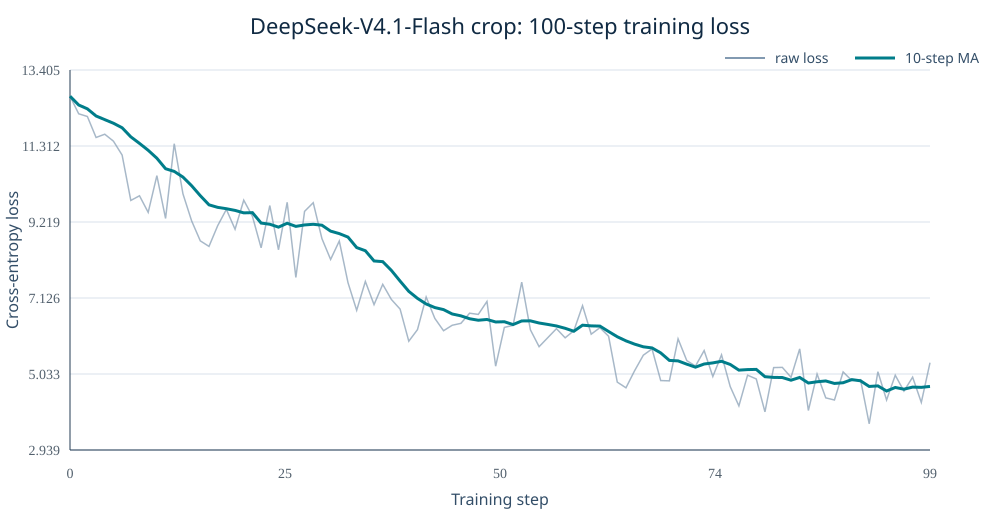

# DeepSeek-V4.1-Flash × HyperParallel：16 卡昇腾 100 Step 多模态训练测试报告

## 测试结论

HyperParallel 已完成 DeepSeek-V4.1-Flash 裁剪版的原生多模态训练接入。在不改变通用 Trainer 主流程的前提下，
模型通过 adapter、模块替换和声明式并行计划接入 V4.1 特有的 Vision Tower、3×3 Aligner、mHC、Engram、
共享压缩 DSA、图文路由及 Online 数据处理，并在 **16 张 Ascend 910** 上完成 **100/100 个优化器 step**。

本次选用 `TP1 + CP1 + EP16 + FSDP16`：100 step 的 loss 全部有限，前 10 step 平均 loss 为
`11.1937`，后 10 step 平均 loss 为 `4.6901`，下降 `58.10%`；稳态平均 step 时间为 `4.9602s`，
单卡峰值已分配显存为 `38.8125 GiB`。结果表明，从公开模型结构到昇腾多卡训练闭环，HyperParallel
可以用模型侧扩展快速承接新架构，而无需为每个模型重写训练框架。

> 本报告验证的是随机初始化裁剪模型的训练工程闭环、数值稳定性和并行执行能力，不代表完整预训练权重的
> 下游精度或全量 40 层模型的性能结论。

## 验证对象

裁剪模型保留发布版的核心张量维度和算法路径，仅缩小层数、专家数、Engram 表和单图视觉 token 上限，
使新结构能在较短时间内完成多步训练验证。

| 项目 | DeepSeek-V4.1-Flash 发布配置 | 本次验证裁剪 | 保留的结构语义 |
| --- | ---: | ---: | --- |
| Decoder 层数 | 40 | 4 | layer 2 发布共享压缩状态，layer 3 执行 Reindex/Reuse |
| Vision 层数 | 32 | 1 | 2D-RoPE、双向视觉注意力、视觉 MLP、末端 RMSNorm |
| Routed Experts | 384 | 16 | learned routing、Top-6、共享专家和图文独立校正 bias |
| LLM hidden size | 5120 | 5120 | 不变 |
| Attention heads / head dim | 64 / 512 | 64 / 512 | 不变 |
| Vision hidden / heads | 1024 / 16 | 1024 / 16 | 不变 |
| Vision patch / downsample | 14 / 3×3 | 14 / 3×3 | 不变 |
| Engram embedding | 384,006,168 行 | 100,776 行 | 3 个 n-gram 阶数、8 个 hash head、256 维表宽不变 |
| LLM 序列长度 | 最长 1,048,576 | 4,096 | 本次固定 4K 训练序列 |
| 单图 image token | 最多 1,024 | 最多 128 | 保留相同缩放、patch 和 3×3 unshuffle 规则 |

模型配置和 tokenizer 直接读取本地 DeepSeek-V4.1-Flash 仓库；由于当前 Transformers 不提供可训练的
V4.1 原生实现，模型结构由 HyperParallel 的 V4.1 model adapter 承接，并复用 Transformers DeepSeek-V4
中未变化的基础组件。这样既保留 Hugging Face 配置生态，也允许 V4.1 新模块使用昇腾亲和实现。

## 测试环境与策略

| 类别 | 配置 |
| --- | --- |
| 硬件 | 16 × Ascend 910，单卡 64 GiB HBM |
| CANN | 8.5.1 |
| PyTorch / torch-npu | 2.9.0 / 2.9.0 |
| Transformers | 5.13.0 独立环境 |
| 参数与前向精度 | BF16 |
| 梯度通信 | FP32 reduce |
| 优化器主参数 | FP32 main parameters，Muon + AdamW |
| 并行拓扑 | TP=1，CP=1，EP=16，dense FSDP=16，PP=1 |
| Batch | micro batch=1，global batch=16 |
| 序列 | 每样本 4096 个序列槽位，单图最多 128 个 post-aligner token |
| 数据 | Online OpenAI-messages JSONL，512 条训练记录、128 条验证记录 |
| 调度 | 100 step cosine decay，最大梯度范数 1.0 |

选择这一拓扑的原因是：裁剪后的 16 个 routed expert 可以天然映射为每卡一个 expert；EP16 同时切分
Engram 大表，FSDP16 则切分视觉、aligner、decoder 稠密权重及优化器状态。4K 序列在当前显存内可直接运行，
因此 TP1/CP1 避免了本次性能验证不需要的 TP/CP 通信，能够集中验证 EP 与 FSDP 的主训练路径。

### 参数所有权与显存切分

| 模块区域 | 并行处理 |
| --- | --- |
| Vision block、Aligner | 独立 dense FSDP16 单元 |
| Decoder、mHC、DSA | dense FSDP16 |
| Engram WKV | Engram 内嵌 dense FSDP16 单元 |
| Engram embedding 表 | EP16 按行切分并执行稀疏跨卡查询 |
| Routed experts | EP16，每卡持有一个本地 expert |
| mHC 系数、图像边界向量 | TP 维保持完整，仍由 FSDP 切分参数与优化器状态 |

模型 adapter 声明真实 forward 顺序和 12 个 child FSDP unit，通用 FSDP manager 负责 mesh 选择、嵌套包装、
all-gather/reduce-scatter 以及 prefetch。视觉分支、Engram 和 decoder 的边界均来自模型侧规格，框架中没有
DeepSeek 类名分支。

## 昇腾亲和的高性能模块替换

### Pipelined mHC

V4.1 的跨子层多流残差由 `PipelinedMhcModule` 接管。系数投影和归一化在 FP32 中完成，NPU 路径直接调用
自定义 `npu_sinkhorn`，并使用 HyperParallel 的融合式 mHC post 路径完成多流回写，减少 Python 级小算子组合。

### Engram

Engram 使用向量化 n-gram hash、裁剪后的同步质数桶和稀疏表查询。表权重按 EP16 行切分，查询请求按 owner
排序后通过 all-to-all 路由到目标卡，再按原 token 顺序恢复；WKV 融合投影单独由 FSDP16 管理。该实现同时
保留 packed 样本边界、TP sequence slice 和 CP 左侧 n-gram 上下文的语义。

### 共享压缩 DSA / CSA2

高性能模块实现 Full、Reindex、Reuse 三种跨层角色，支持共享 compressed KV、index key、层次化 candidate
block 以及 Indexer 训练辅助 loss。昇腾稀疏注意力执行可落到 Omni sparse FlashAttention；CP 实现采用
query 本地保留、raw KV / compressed KV / index key 异步 all-gather 的方式，为通信与计算重叠保留空间。
本次最优 100-step 拓扑使用 CP1，因此不产生额外 CP 通信；CP2 路径另有 4K 单步结构验证。

### 原生多模态链路

图像经过发布版语义一致的 resize/pad、BF16 归一化和 14×14 patch 化，进入 DeepSeek-ViT 的 2D-RoPE
双向注意力，再由 3×3 pixel-unshuffle 和两层 aligner 映射到 5120 维 LLM 空间。图像 start/newline/end
向量及视觉特征被写入对应 token span，随后与文本一起进入 mHC、Engram、DSA 和图文感知 MoE routing。
整个流程由 Online dataset transform、collator 和通用 VLM get-batch 串成端到端训练链路。

## 100 Step 实测结果

状态：**PASS**。100 个 step 连续、loss 和 grad norm 全部有限，16 个 rank 均完成结束同步并生成 success marker。

| 指标 | 实测值 |
| --- | ---: |
| 完成 step | 100 / 100 |
| 消费样本 | 1,600 |
| 消费监督 token | 7,929 |
| 首 step loss | 12.6836 |
| 最后 step loss | 5.34375 |
| 最低 loss | 3.66113 |
| 前 10 step 平均 loss | 11.193749 |
| 后 10 step 平均 loss | 4.690136 |
| 前后 10-step 均值降幅 | 58.10% |
| grad norm 范围 | 33.2585 ～ 128.487，全部有限 |
| 稳态平均 step 时间（排除首步） | 4.9602s |
| 稳态 P50 / P95 step 时间 | 4.9572s / 5.0126s |
| 4K padded sequence slots 吞吐 | 13,212 slots/s |
| Trainer 监督 token 吞吐均值 | 15.9068 target tokens/s |
| 单卡峰值 allocated / reserved | 38.8125 / 48.502 GiB |
| 100 step 纯训练耗时 | 504.47s |

`4K padded sequence slots` 按 `16 × 4096 / 稳态 step 时间` 计算，用于反映固定长度模型负载；Trainer 原生
`tokens_per_second` 只统计参与 loss 的 assistant target token，两者口径不同。由于 Online batch 的答案长度和
图像内容不同，单步 loss 有自然波动，应结合 10-step 均线观察整体趋势。



完整的 100 个数据点见
[deepseek_v41_flash_vlm_100step_metrics.csv](assets/deepseek_v41_flash_vlm_100step_metrics.csv)。

### 并行策略验证矩阵

| 路径 | 策略 | 结果 |
| --- | --- | --- |
| 原生多模态 Online | TP1 + CP1 + EP16 + FSDP16 | 100 step 通过，本报告主结果 |
| 文本 Online | TP1 + EP16 + FSDP16 | 4K 单步 forward/backward/optimizer 通过 |
| 文本 Online | TP2 + sequence parallel + EP16 + FSDP8 | 4K 单步 forward/backward/optimizer 通过 |
| 文本 Online | TP1 + CP2 + EP16 | 4K 单步异步 KV-all-gather CP 通过 |

这组矩阵说明同一个 V4.1 adapter 可以组合 FSDP、EP、TP、sequence parallel 和 CP。100-step 测试选择当前
裁剪多模态负载下通信开销更小的策略，单步策略测试则覆盖额外并行维度的结构正确性。

## 数据与可复现入口

训练数据由本地 ChartQA/DocVQA 图片导出为标准 OpenAI messages JSONL：

- 训练集：512 条；SHA256 `4728da3cc64ce744b6921f368cd306d87703482dd8620471e455f536bbc85a0f`
- 验证集：128 条
- 模型配置 SHA256：`8be45ce0476004a3f529fd896115a4a2e800a129ad2d3ec05b16050f52e21879`

按[环境说明](current_hf_model_environment.md)准备 Transformers 5.13.0 后执行：

```bash
export RUN_NAME=vlm_tp1_ep16_100steps
bash examples/training_demo/run_deepseek_v41_vlm_online.sh \
    /home/ma-user/work/y00512198/DeepSeek-V4.1-Flash \
    --training.train_iters=100
```

产物位置：

- Recipe：`examples/training_demo/train_deepseek_v41_vlm_online.yaml`
- 启动脚本：`examples/training_demo/run_deepseek_v41_vlm_online.sh`
- 完整日志：`output/training_demo/deepseek_v41/run_vlm_tp1_ep16_100steps.log`
- 成功标记：`output/training_demo/deepseek_v41/vlm_tp1_ep16_100steps.success`
- 曲线生成：`examples/training_demo/summarize_deepseek_v41_vlm_run.py`

日志 SHA256：`cff834f39307811e8719a80b53c50d4331864ea5238182341dfb083848a93d2a`。

## 总结

这次验证展示了 HyperParallel 对前沿新结构的接入方式：以模型 adapter 保存架构知识，以模块替换承接昇腾
高性能实现，以声明式 placement/FSDP 边界组合 TP、CP、EP 和 FSDP，再复用统一 Trainer、Online 数据集和
优化器链路。对于 DeepSeek-V4.1-Flash 这类同时引入原生视觉、mHC、Engram 和共享压缩注意力的新模型，
HyperParallel 已经能够从结构适配快速推进到 16 卡、4K、100-step 的稳定训练闭环。
