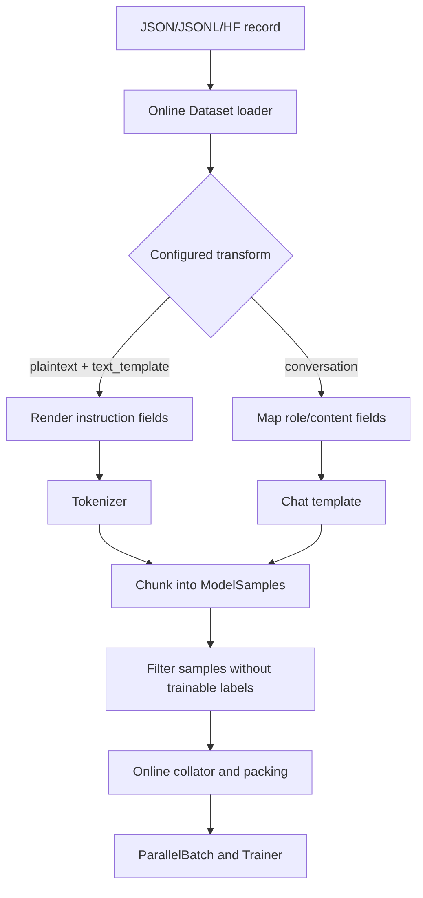

# Online Dataset Format Conversion

Online text datasets are loaded as raw records and transformed lazily when a
sample is requested. The conversion layer supports ordinary plaintext records,
Instruction/Alpaca records, and ShareGPT conversations without changing the
Trainer entry points.

## Runtime Flow



The source dataset remains un-tokenized. Tokenization, role normalization,
chunking, and label validation happen at the transform boundary and are
performed lazily.

## Instruction / Alpaca

Use `text_template` to render source fields into plaintext:

```yaml
dataset:
  model_assets:
    tokenizer:
      _target_: hyper_parallel.data.text.build_tokenizer.AutoTokenizer.from_pretrained
      pretrained_model_name_or_path: /path/to/model
  data_transform:
    _target_: hyper_parallel.data.text.build_data_transform.build_llm_data_transform
    data_type: plaintext
    text_template: "Instruction: {instruction}\nInput: {input}\nOutput: {output}"
    max_seq_len: 4096
  _target_: hyper_parallel.data.text.build_dataset.build_online_text_dataset
  data_path: /path/to/instruction.jsonl
  data_config:
    dataset_type: mapping
```

The template uses Python `str.format_map` semantics. Missing fields and
non-string rendered values fail at the transform boundary with a descriptive
error. When a template is configured, the loader does not apply the default
`text`-field pre-filter before rendering.

## ShareGPT

ShareGPT records can be converted by configuring their source field names:

```yaml
dataset:
  model_assets:
    chat_template: tokenizer
    tokenizer:
      _target_: hyper_parallel.data.text.build_tokenizer.AutoTokenizer.from_pretrained
      pretrained_model_name_or_path: /path/to/model
  data_transform:
    _target_: hyper_parallel.data.text.build_data_transform.build_llm_data_transform
    data_type: conversation
    text_keys: conversations
    role_key: from
    content_key: value
    max_seq_len: 4096
```

The transform emits the standard `role`/`content` message contract. Built-in
aliases include `human -> user`, `gpt`/`bot`/`model -> assistant`, and
`function`/`observation -> tool`. A `role_map` can override or extend these
aliases. Message metadata is preserved.

## Output Contract

Both transforms return a list of model samples containing `input_ids` and
`labels`. A single source record may produce multiple samples when it exceeds
`max_seq_len`. The online wrapper filters samples whose labels contain no
trainable token, and the online collator packs the resulting samples while
preserving document boundaries.

Runnable smoke-test configurations are provided in:

- `examples/training_demo/train_online_instruction.yaml`
- `examples/training_demo/train_online_sharegpt.yaml`

The matching demo records are under `examples/training_demo/data/`.
