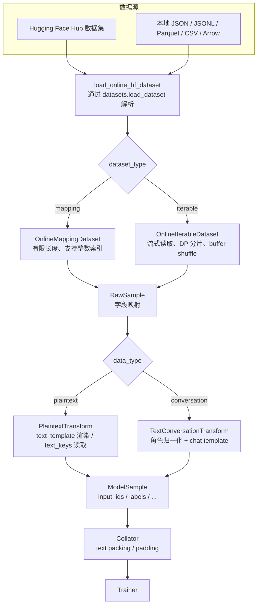
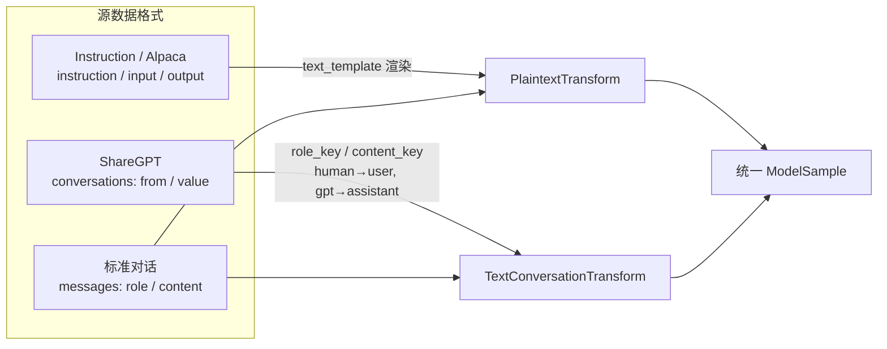

# Online Dataset 数据转换设计

本文说明 Online Dataset 的在线数据转换（transform）运行流程，以及本期补齐的格式转换能力。使用方式见
[online_dataset.md](online_dataset.md)。

## 1. 运行流程与设计

Online Dataset 把「数据读取」与「数据转换」解耦：读取阶段只产生字段映射形式的 `RawSample`，transform 阶段再把
它转换为包含 `input_ids`、`labels` 等字段的 `ModelSample`。

设计要点：

1. 读取层（`online_dataset.py` / `online_mapping_dataset.py` / `online_iterable_dataset.py`）只负责把 HF 数据
   变成 `RawSample`，不感知具体格式语义。
2. 转换层（`build_data_transform.py`）按 `data_type` 选择 plaintext / conversation 两类 transform，各自输出
   统一的 `ModelSample`。
3. 包装层（`transform_dataset.py`）在读取层之上套接 transform，同时负责跳过 causal shift 后无可训练 label 的
   无效样本。

## 2. 在线转换能力补齐

本期在原有 plaintext / conversation 基础上，补齐了常见开源数据的直接接入能力：

| 源数据格式 | 转换方式 | 本期状态 |
|---|---|---|
| 纯文本（`text` / 候选字段） | `PlaintextTransform` + `text_keys` | 已有 |
| Instruction / Alpaca（`instruction` / `input` / `output`） | `PlaintextTransform` + `text_template` | 补齐 |
| 标准对话（`messages` 的 `role` / `content`） | `TextConversationTransform` + chat template | 已有 |
| ShareGPT（`conversations` 的 `from` / `value`） | `TextConversationTransform` + `role_key` / `content_key` | 补齐 |
| 角色别名（`human` / `gpt` / `bot` / `model`） | 内置别名归一化 + `role_map` 扩展 | 补齐 |
