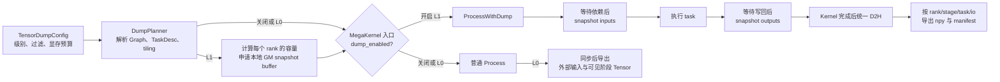
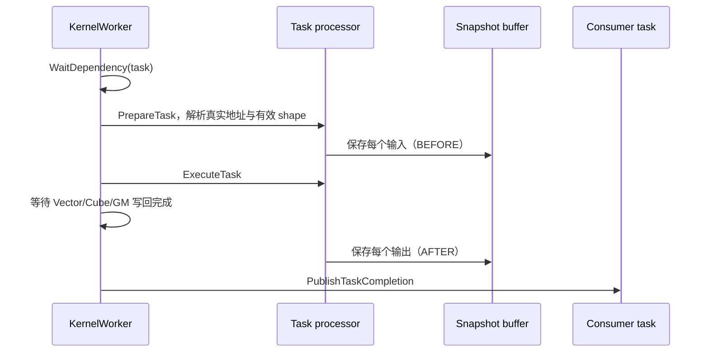

# MegaKernel 内部数据 Dump 设计

## 1. 背景与目标

MegaKernel 将通信、计算和依赖等待融合在一个设备 Kernel 中，框架侧通常只能看到整体输入输出，难以定位
某个内部阶段或 task 的数值问题。本方案提供通用的内部 Tensor dump 能力，覆盖：

- **L0 阶段级 dump**：保存 MegaKernel 外部输入、各内部阶段输出和最终输出；
- **L1 瞬时 task/tile dump**：在 task 实际执行前后，保存其输入和输出；
- 通过计算图、`TaskDesc` 和 task 执行上下文适配不同 MegaKernel，而不是绑定 MegaMoe；
- 使用同一个 Kernel 入口和同一个编译包，运行时启停，关闭时不申请 dump 显存、不进入 task 级采集逻辑。

L1 直接采集 task 执行瞬间的数据。Dump 用于数值调试，不用于性能测量；L1 引入的数据搬运和同步会改变
原始执行时序。

## 2. 能力分级

| 级别 | 采集内容 | 采集位置 | 适用场景 |
|---|---|---|---|
| L0 | 外部输入、阶段输出、最终输出 | 正式 Kernel 前后，由 Host 导出可见 Tensor | 判断错误出现在哪个阶段 |
| L1 | 选中 task/tile 的每个输入和输出 | 设备侧 task 执行前后写入快照区 | 定位具体 expert、task 或 core 的数值错误 |

L0 通过计算图中显式声明的 `OperatorNode.inputs/outputs` 识别阶段边界，`param_position` 负责把逻辑
Tensor 映射到外层算子参数。`param_position` 本身不表示输入或输出。原地更新或内存复用导致中间结果
在 Kernel 结束前被覆盖时，应升级为 L1 采集。

## 3. 总体架构



设备侧使用一块连续快照区，减少小块 D2H 和频繁同步。连续缓冲区只是传输格式；Host 解析 record 后，
仍会把每个 task 的每个输入、输出分别保存为独立文件。

## 4. 前端接口与运行时启停

建议提供独立的调试上下文，不改变 MegaKernel 的业务调用方式：

```python
config = TensorDumpConfig(
    level="L1",  # "L0" 或 "L1"
    output_dir="./dump",
    device_memory_budget_mb=512,
    filters=[
        DumpFilter(rank=0, stage="GMM1", expert=2, task=[52, 53], io="both"),
    ],
)

with tensor_dump(config):
    output = mega_moe(*inputs)
```

环境变量可以作为 ST 脚本的快捷入口，但不应成为唯一接口。Host wrapper 根据上下文生成计划、申请隐藏
workspace 并导出数据；未开启时不申请快照显存。

Kernel 保持单一入口，只在入口判断一次：

```cpp
if (runtime_config->dump_enabled) {
    worker.ProcessWithDump(dump_context);
    return;
}
worker.Process();
```

普通路径和 Dump 路径在同一次构建中生成。运行时切换不重新编译；普通 task 循环中没有 dump 判断、
快照拷贝或额外同步。关闭状态仅增加一次所有核取值一致的入口分支。

## 5. L0 阶段级采集

### 5.1 子Kernel的中间输出就在算子的入参中

框架语义和设备 Kernel ABI 对“参数”的理解不同：框架 API 区分输入和输出，但发射设备 Kernel 时，
输入地址、输出地址和内部缓冲区地址最终都以指针参数传入。MegaKernel 内部的多个阶段又必须共享 GM
Tensor，例如：

```text
dispatch_target ──► GMM1 ──► up_proj_y ──► SwiGLU ──► swiglu_out
      阶段输出/下一阶段输入        阶段输出/下一阶段输入
```

这些中间 Tensor 由 Host 提前创建并取得稳定地址，调度器再通过 `param_position` 让不同 task 找到同一块
内存。因此它们会出现在扁平化的 Kernel 参数列表中，但并不等于它们都是用户输入。


图中标出的 `y`、`swiglu_out` 和 `down_proj_y` 分别承载 GMM1、SwiGLU 和 GMM2 的阶段输出；它们同时
作为后续阶段的数据源，因此需要以稳定的 GM 地址传入 MegaKernel。

### 5.2 如何识别和采集

不能根据参数位置或参数名称猜测方向。通用判断依据是计算图中的生产者和消费者关系：

| 图关系 | Tensor 角色 |
|---|---|
| 没有内部生产者，只有消费者 | MegaKernel 外部输入 |
| 由一个阶段产生，又被后续阶段消费 | 阶段中间输出 |
| 由内部阶段产生，并暴露给调用者 | MegaKernel 最终输出 |

`OperatorNode.outputs` 给出阶段输出，`TensorSpec.param_position` 再将其映射到实际 Kernel 参数。同一
Tensor 作为前一阶段输出和后一阶段输入时只保存一次，manifest 同时记录两种关系。

L0 不修改设备 task 的执行过程，采集流程为：

```text
Kernel 前：保存图的外部输入和 READ_WRITE Tensor 初始值(若有需要)
    ↓
使用普通 Process 执行 MegaKernel
    ↓
Kernel 完成并同步
    ↓
保存仍可见的阶段输出和最终输出，生成 graph/param_position 映射清单
```

L0 通常不需要额外设备快照显存，只增加 Host 内存和落盘空间。它要求目标中间 Tensor 在 Kernel 结束后
仍然存活且没有被覆盖；若使用 workspace 临时存储、原地更新或内存复用，无法在结束后恢复的版本必须使用
L1 瞬时采集。

## 6. L1 瞬时 task/tile 采集

### 6.1 采集时序与数据范围



输入必须在依赖满足后采集，避免读到尚未到达的远端数据；输出必须在写回完成后、发布完成事件前采集，
避免消费者提前覆盖或复用缓冲区。

`TaskDesc` 已能枚举逻辑输入输出，并提供参数位置和基础偏移，但动态 offset/size、group list 和 GMM
tiling 等信息只有具体 task 处理器能够准确解释。因此，各处理器应在 `PrepareTask` 中形成实际执行视图，
Dump 和 Execute 共用同一份地址、dtype、shape 与 stride，避免维护第二套地址推导逻辑。

```text
TaskDesc + runtime metadata + tiling
                 │
                 ▼
        TaskExecutionContext
        ├── input_views[]
        └── output_views[]
```

这里采集的是 task 的逻辑操作数。若要观察 GMM 库内部更小的 M/N/K 搬运块，需要在相应底层实现中另设
采集点，不属于通用 KernelWorker 层能力。

### 6.2 显存预算、生命周期与过滤

每个 rank 的额外显存近似为：

```text
控制区 + record 表 + Σ align(选中输入/输出的 payload) + 对齐空间
```

DumpPlanner 在构图、`TaskDesc` 和 tiling 就绪并应用过滤后计算容量；快照区在正式 Dump Kernel 发射前
申请，在 Kernel 完成、D2H 和文件导出后释放或缓存。动态 shape 优先按运行时上界预留，并由设备记录
实际字节数。若用例包含 warmup，warmup 走普通路径，正式采集前再准备快照区。

为防止权重等共享输入被每个 task 重复保存，可将明确不可变的 Tensor 在设备侧保存一次，各 task 在
manifest 中引用它；需要独立文件时再由 Host 展开。可变输入和 `READ_WRITE` Tensor 必须按采集时刻
分别保存。接口必须提供显存预算和溢出策略，默认预算不足时报错，不静默丢弃数据。

过滤表达式由 Host 解析并编译为设备可直接索引的计划，设备侧不解析字符串。建议支持：

```text
iteration, rank, stage/task_type, expert, task_id,
core_type/core_id, tensor/param_position,
io=input|output|both, when=before|after|both,
max_rows/max_elements/max_bytes
```

设备侧以稳定的逻辑 `task_index` 查找 record，不能使用 RATR 重排后的队列位置。每条选中记录预分配
独立 slot，可以避免多核争抢全局写指针；动态数据只需填写 `actual_bytes`。建议支持正式执行前调用
`estimate_dump_size()`，便于用户先检查预计显存。

### 6.3 产物组织与边界

```text
dump/
└── rank_0/
    ├── manifest.json
    └── GMM1/
        └── task_0052/
            ├── input_00_activation.npy
            ├── input_01_weight.npy
            ├── input_02_group_list.npy
            ├── output_00_up_proj_y.npy
            └── task.json
```

`task.json` 记录 stage、expert、task/core、Tensor 名称、dtype/shape、采集时刻、截断状态以及与
timeline 的 task id 对应关系。

跨 rank 通信需要按数据所在地采集：Dispatch 发送端在发送前保存本地输入，接收端在依赖满足后保存
目标区域。当前 SHMEM 主要服务于 NPU rank 间访问，不作为 Device-to-Host dump 通道；每个 rank 写入
自己的 GM 快照区，最后分别 D2H 和汇总。

L1 为保证数值完整性会增加 GM 流量和同步，所得 timeline 不能代表无 Dump 时的真实性能。性能分析应
关闭数据 Dump 单独运行，数值产物则通过稳定的 task id 与正常 profiling 结果关联。
