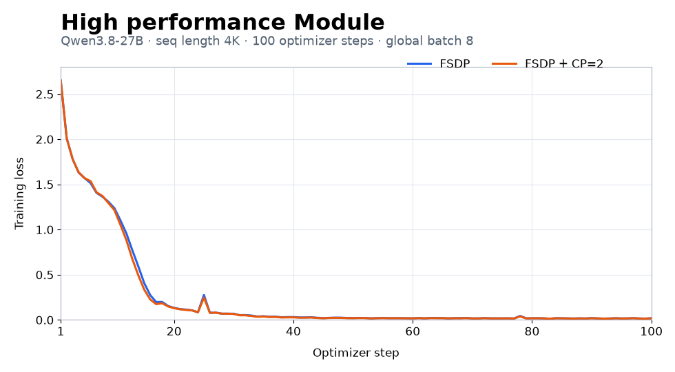

# Qwen3.8-27B on Ascend：FSDP / CP / 高性能融合算子

本目录使用 Hugging Face 的 Qwen3.8-27B 模型、HyperParallel 的 FSDP/CP，以及仓库内的高性能
GDN 融合算子。两个训练 YAML 通过 `plan_overrides[*].replace_module` 选择
[`TritonGDN`](../../hyper_parallel/components/modules/gdn_triton.py) 模块映射，把原模型的
`chunk_gated_delta_rule` 绑定到仓库内的
[`components/functional/gated_delta_net.py`](../../hyper_parallel/components/functional/gated_delta_net.py)。

- [`launch_1node_8dies.sh`](launch_1node_8dies.sh) **只启动 online** `train_online.yaml`，接受 Trainer 的
  `--section.field=value` 覆盖参数。
- [`launch_32nodes_256dies.sh`](launch_32nodes_256dies.sh) 启动 32 节点、256 卡的 online 训练。
- [`train.yaml`](train.yaml) 是 offline Indexed Dataset 配置，默认 FSDP+CP=2、4096 token；直接用
  `torchrun` 启动。
- [`train_online.yaml`](train_online.yaml) 是 online conversation 配置，默认 FSDP+CP=2、每条样本最多
  4096 token、`micro_batch_size=1`，**不做跨样本 packing**。

## 1. 实测环境与安装

硬件：8 卡 Ascend 910B3。

| 组件 | 实测版本 |
| --- | --- |
| Python | 3.11 |
| CANN | 9.1.0 |
| PyTorch / torch-npu | 2.9.0 / 2.9.0.post6 |
| Triton-Ascend | 3.2.2 |
| Transformers | 5.13.0 |
| Tokenizers | 0.22.2 |
| Hugging Face Hub | 1.22.0 |
| Safetensors | 0.8.0 |
| TorchData | 0.11.0 |
| Datasets | 4.5.0 |
| NumPy | 1.26.4 |
| Einops | 0.8.1 |
| PyYAML | 6.0.3 |

运行高性能 GDN 融合算子需要 Ascend 驱动、固件和 CANN 9.1.0；Python 3.11 中安装匹配的
PyTorch、torch-npu、算子编译依赖及本仓库。版本组合见
[Triton-Ascend v3.2.2 release notes](https://github.com/triton-lang/triton-ascend/releases/tag/v3.2.2)。

先加载 CANN 环境，再安装 Python 包（下面的 CANN 路径按服务器实际安装位置填写）：

```bash
cd /path/to/hyper-parallel
source /home/chaoran/cann/cann-9.1.0/set_env.sh
export HYPER_PARALLEL_PLATFORM=torch

python3 -m pip install -r examples/qwen3_8/requirements.txt \
  --extra-index-url=https://mirrors.huaweicloud.com/ascend/repos/pypi
python3 -m pip install -e . --no-deps
```

`requirements.txt` 固定了 PyTorch 2.9.0、torch-npu 2.9.0.post6、Triton-Ascend 3.2.2、
Transformers 5.13.0 等 Python 依赖。`pip install -e . --no-deps` 安装当前仓库，避免根目录可选
`[torch]` extra 的不同 PyTorch 版本覆盖本示例的版本组合。融合算子源码已在
[`components/functional/_gdn_triton`](../../hyper_parallel/components/functional/_gdn_triton)；不需要另装 FLA、
AscendC GDN 扩展或 `causal-conv1d`。Triton-Ascend 与普通 Triton 共用 `triton` 包路径，安装后不要再
单独升级普通 Triton；相关说明见[官方安装指南](https://github.com/triton-lang/triton-ascend/blob/main/docs/en/installation_guide.md)。

依次检查 NPU、PyTorch/torch-npu 和算子依赖：

```bash
npu-smi info
python3 -c 'import torch, torch_npu; x = torch.ones(8, device="npu"); print("NPU sum:", x.sum().item())'
python3 -c 'import triton.backends.ascend, importlib.metadata as m; print("triton-ascend:", m.version("triton-ascend"))'
python3 -c 'import hyper_parallel; from hyper_parallel.components.functional.gated_delta_net import chunk_gated_delta_rule; print(hyper_parallel.__file__, chunk_gated_delta_rule.__module__)'
```

导入成功只说明 Python 模块可加载，**不代表融合算子已在 NPU 上执行**。`train.yaml` 和
`train_online.yaml` 都以 `*.linear_attn` 匹配 Hugging Face 的 `Qwen3_5GatedDeltaNet`，通过
`plan_overrides[*].replace_module` 启用高性能 GDN 融合算子。模型模块类型或名称不匹配时，
替换阶段会报错；使用这两个 YAML 跑完首个训练 step（可将 `--training.train_iters` 设为 1），
才能同时验证算子的编译及反向计算。首次启动包含算子编译，耗时不要计入稳定步时。

## 2. Online conversation：启动脚本

`train_online.yaml` 默认使用服务器上的模型 `/home/chaoran/models/Qwen3.8-27B` 和
`/home/chaoran/datasets/decif-30k.jsonl`。数据为 JSONL，每行提供 `messages` 列，例如：

```json
{"messages":[{"role":"user","content":"你好"},{"role":"assistant","content":"你好！"}]}
```

其他机器请显式覆盖模型、tokenizer 和数据路径：

```bash
cd /path/to/hyper-parallel
source /home/chaoran/cann/cann-9.1.0/set_env.sh
export MODEL_DIR=/path/to/Qwen3.8-27B
export ONLINE_JSONL=/path/to/decif-30k.jsonl

bash examples/qwen3_8/launch_1node_8dies.sh \
  --model.pretrained_model_name_or_path="$MODEL_DIR" \
  --dataset.model_assets.tokenizer.pretrained_model_name_or_path="$MODEL_DIR" \
  --dataset.data_path="$ONLINE_JSONL" \
  --training.train_iters=100
```

脚本默认使用 8 张 NPU、`MASTER_ADDR=127.0.0.1`、`MASTER_PORT=29500`；可用同名环境变量覆盖。
它还设置 `HYPER_PARALLEL_PLATFORM=torch`、`ASCEND_RT_VISIBLE_DEVICES=0,1,2,3,4,5,6,7`
以及 HCCL 超时变量；均可在启动前用环境变量覆盖。YAML 中 FSDP shard size=8、CP=2、TP=1、
global batch=8。Online 的 `max_seq_len: 4096` 是**单条样本的截断上限**，不是固定 4096 token；
标签右移后模型输入最多 4095 token，`micro_batch_size=1` 时每次只有一条样本。

256 卡时，在 32 个节点上分别加载 CANN，并执行相同命令；`MASTER_ADDR` 填所有节点都能访问的
主节点地址，`RDZV_ID` 在各节点保持一致：

```bash
cd /path/to/hyper-parallel
source /home/chaoran/cann/cann-9.1.0/set_env.sh
export MASTER_ADDR=YOUR_MASTER_IP
export MASTER_PORT=29500
export RDZV_ID=qwen3_8_256card
export MODEL_DIR=/path/to/Qwen3.8-27B
export ONLINE_JSONL=/path/to/decif-30k.jsonl

bash examples/qwen3_8/launch_32nodes_256dies.sh \
  --model.pretrained_model_name_or_path="$MODEL_DIR" \
  --dataset.model_assets.tokenizer.pretrained_model_name_or_path="$MODEL_DIR" \
  --dataset.data_path="$ONLINE_JSONL" \
  --training.train_iters=100
```

多节点脚本使用每节点 8 卡、FSDP size=256、CP=4、global batch=64；
`micro_batch_size=1`，每步 1 个 micro-batch。

## 3. Offline 4096：数据和 FSDP/CP 对照启动

Offline 配置读取 Megatron Indexed Dataset 的 `.bin`/`.idx` 文件，`data_path` **不带扩展名**。
准备数据时可以用仓库的[离线预处理工具](../../docs/guide/data/offline_preparation_guide.md)：

```bash
python3 -m hyper_parallel.data.tools.offline_preparation \
  --dataset-name-or-path /path/to/train.jsonl \
  --json-keys text \
  --tokenizer-name-or-path "$MODEL_DIR" \
  --output-prefix /path/to/parallel_offline_text_document \
  --append-eod true \
  --pack-to-seq-len 4096
```

这会生成每个 document 4097 token 的 Indexed Dataset，供训练时构造 4096 个 input token 和右移标签。
用于曲线对照时，两组必须使用**同一模型权重、同一 Indexed Dataset、同一 seed 和训练超参数**。
下面的 `cp_size=1` 是纯 FSDP，`cp_size=2` 是 FSDP+CP；两组使用同一套高性能 GDN 融合算子。

```bash
export OFFLINE_PREFIX=/path/to/parallel_offline_text_document
export MODEL_DIR=/path/to/Qwen3.8-27B
export HYPER_PARALLEL_PLATFORM=torch

# 纯 FSDP：8 卡、CP=1。
torchrun --standalone --nproc_per_node=8 \
  -m examples.qwen3_8.train_text examples/qwen3_8/train.yaml \
  --training.train_iters=100 --accelerator.cp_size=1 \
  --model.pretrained_model_name_or_path="$MODEL_DIR" \
  --dataset.model_assets.tokenizer.pretrained_model_name_or_path="$MODEL_DIR" \
  --dataset.data_path="$OFFLINE_PREFIX"

# FSDP+CP：8 卡、CP=2。上一组退出后再启动；不要同时占用同一批 NPU。
torchrun --standalone --nproc_per_node=8 \
  -m examples.qwen3_8.train_text examples/qwen3_8/train.yaml \
  --training.train_iters=100 --accelerator.cp_size=2 \
  --model.pretrained_model_name_or_path="$MODEL_DIR" \
  --dataset.model_assets.tokenizer.pretrained_model_name_or_path="$MODEL_DIR" \
  --dataset.data_path="$OFFLINE_PREFIX"
```

## 4. Offline 4096 训练结果



两组均在 8 卡 Ascend 910B3 上完成 **64 层、100 step**
运行。使用同一模型 checkpoint、同一份 Indexed Dataset、seed=42、AdamW、global batch=8、
`micro_batch_size=1` 和同一高性能 GDN 融合算子，仅 CP 从 1 改为 2。

性能参考（steps 11–100 平均）：FSDP + CP + 高性能 GDN 融合算子为 10.04 s/step。
