# FSDP 架构归一与 dim-0 非均匀切分 RFC

> 状态：方案设计中
>
> HyperParallel 分析基线：`5ff346786cb835eb1b5860e327e28f1fc94691bd`
>

## 1. 基本信息与阅读约定

| 项目 | 内容 |
| --- | --- |
| 作者 | MengXiangyu |
| 相关模块 | `coreMengXiangyu/fully_shard`、`platform/torch/fully_shard`、`platform/mindspore/fully_shard`、`core/dtensor`、`core/distributed_checkpoint` |
| 适用后端 | PyTorch、MindSpore |
| 对外接口 | 不删除现有公开参数；收紧非法输入；新增内部元数据和调试视图 |
| 相关文档 | [`grad_comm_overlap.md`](grad_comm_overlap.md) |


业界实现分析

- [PyTorch 2.9 FSDP `_fully_shard.py`](https://github.com/pytorch/pytorch/blob/v2.9.0/torch/distributed/fsdp/_fully_shard/_fully_shard.py)

## 2. 背景、目标与总体决策

### 2.1 当前问题

| 问题 | [Hyper 当前] 行为 | 影响 |
| --- | --- | --- |
| 参数类型按单参数分支 | `FullyShardParamMode` 包含 `LOCAL_PARAM`、`DTENSOR_COMPAT`、`DTENSOR_UNIFIED` | 同一 FSDP unit 可进入不同生命周期和梯度路径 |
| 缺少同构输入拦截 | `fully_shard()` 只计算 `any(is_dtensor_managed_param(...))` | 普通 Tensor 与 DTensor 混用与当前的反向精度机制不兼容 |
| `MeshInfo` 所有权过粗 | `HSDPState` 持有 unit 级 `MeshInfo`，param/param-group 再从 state 侧信息推导通信 | `replicate_params` 与普通 shard 参数难以拥有不同 DP 通信语义，TP group 也容易被混入 FSDP/HSDP group 决策 |
| replicate 有第二套状态机 | `hsdp_params`、`sharded_hsdp_params`、`replicate_params`，以及 `is_shard`、`is_replicate_shard` | hook 必须携带 `unshard_replicate` 等配套 flag |
| 无通信路径仍复制 | `shard_size == 1` 或 `replicate_params` 仍创建 `all_gather_output` 并 copy | 增加显存、copy 和对象切换 |
| backward 路径过多 | compat、direct compat、replicate side path、融合和非融合各有队列 | 很难证明缩放、wait 和尾部 drain 等价 |
| dim-0 uneven 链路不完整 | FSDP 参数、`ReduceScatterPlan`、Hyper DTensor global shape、DCP offset 均存在整除假设 | 不能形成可保存、可加载、可训练的完整能力 |

准确类名是 `DTENSOR_COMPAT`，本文不使用 `DTensor_Compact` 等错误写法。

### 2.2 目标

1. 先固定 hook 宏观触发顺序和无条件 root drain 契约。
2. 初始化只有一次参数类型拦截：一个 FSDP unit 只能全普通 Tensor 参数或全 DTensor 参数。
3. 删除 `DTENSOR_COMPAT`、`DTENSOR_UNIFIED` 对生命周期和梯度通信的控制。
4. 将 `MeshInfo` 从 `HSDPState` 下沉到每个 `HSDPParam`，且只表达 FSDP/HSDP 的 shard/replicate 通信；`HSDPParam` 从原 Parameter DTensor placements 提供 TP 通信元数据，TP AR 只由根反向钩子在 FSDP/HSDP/DP 完成后触发，不再将 HSDP AR 与 TP AR 合并成笛卡尔积 group 做一次通信。
5. `replicate_params` 与 `shard_size == 1` 归一为无需 AllGather 的参数生命周期。
6. backward 始终消费普通 Tensor gradient；模块反向阶段执行可选的 FSDP RS 和 HSDP/DP AR，根反向钩子最后执行由原参数 DTensor replicate placement 决定的 TP AR。
7. 支持 FSDP shard dim 为 0 的非均匀切分，包括零长度 actual shard；非 dim-0 uneven 在初始化阶段拒绝。
8. 不均匀切分要适配好meta_init, DCP等流程（依赖乙得RaggedShard表达不均匀切分的placments给sharded_param挂上。不影响FSDP的主要功能）
9. 均匀场景不因支持 uneven 而无条件增加 padding、allocation 或 copy。

### 2.3 非目标

1. 本期不支持非 dim-0 uneven。
2. 本期不支持 MindSpore fully_shard CPUOffload。
3. 本期不把集合通信替换为单边通信。
4. 本期不重写 TP/EP DTensor 算子传播。
5. 本期不通过继续增加 lifecycle flag 兼容旧分支。


## 3. Hook 触发顺序与状态机

本章先回顾“FSDP 流程如何被触发”。参数如何 unshard、梯度如何通信分别在第 5、6 章展开。

### 3.1 Hook 注册与宏观调用链
ww
**[Hyper 当前]** Torch 与 MindSpore 都由 scheduler 注册 forward pre/post hook；forward 输入经 `PostBackwardFunction` 包装，forward 输出注册 backward pre-hook。输出 grad hook 还会把 root final callback 放入 autograd 引擎队列。

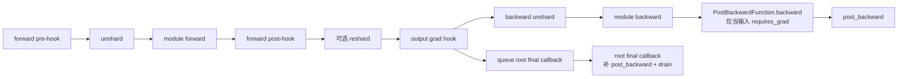

`PostBackwardFunction` 是否执行取决于该 FSDP unit 的输入中是否存在 `requires_grad=True` Tensor：

- 输入不可求导时，不插入 `PostBackwardFunction`，root callback 负责补执行 `post_backward()`。
- 输入可求导时，`PostBackwardFunction.backward()` 可能先把 state 置为 `BACKWARD`，但这只表示 post-backward hook 已触发，不表示所有异步通信已完成。
- 因此 root callback 必须始终执行幂等 drain，不能用 `scheduler_state == BACKWARD` 推断“无需收尾”。

### 3.2 状态定义

| 状态 | 进入点 | 含义 |
| --- | --- | --- |
| `None` | 尚未 forward | 参数处于持久 sharded/local 状态 |
| `PRE_FORWARD` | forward pre-hook | 本 unit 的 forward unshard 已完成 |
| `FORWARD` | forward post-hook | forward 已结束，按配置完成或跳过 reshard |
| `PRE_BACKWARD` | output grad hook | backward 参数已 materialize，root callback 已入队 |
| `BACKWARD` | `PostBackwardFunction` 或 root fallback | `post_backward()` 已触发；pending reduction 仍可能未完成 |

### 3.3 正常 forward → backward

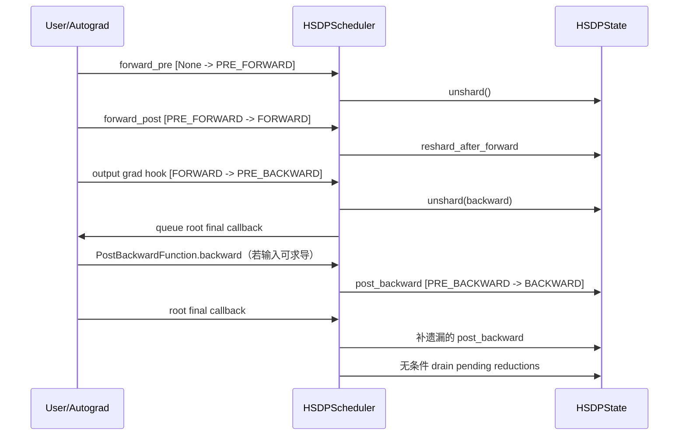

实测关键顺序：

```text
forward_pre: None -> PRE_FORWARD
forward: PRE_FORWARD -> FORWARD
backward_pre: FORWARD -> PRE_BACKWARD
root_backward_enter: PRE_BACKWARD
backward: PRE_BACKWARD -> BACKWARD
root_backward_exit: BACKWARD
```

### 3.4 不可重入重计算

不可重入 checkpoint 的 backward 先触发输出 grad hook，状态已经进入 `PRE_BACKWARD`，随后 checkpoint 重算再次进入 forward pre-hook。该 hook 必须幂等跳过；early-stop 下重算 forward post-hook 可能根本不触发。

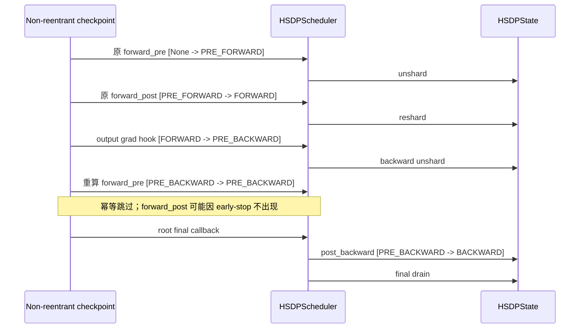

### 3.5 可重入重计算

可重入 checkpoint 的第一次 forward 在 `no_grad` 下运行；backward 时完整重算 forward，所以 backward 期间会再次出现一对 forward hook。

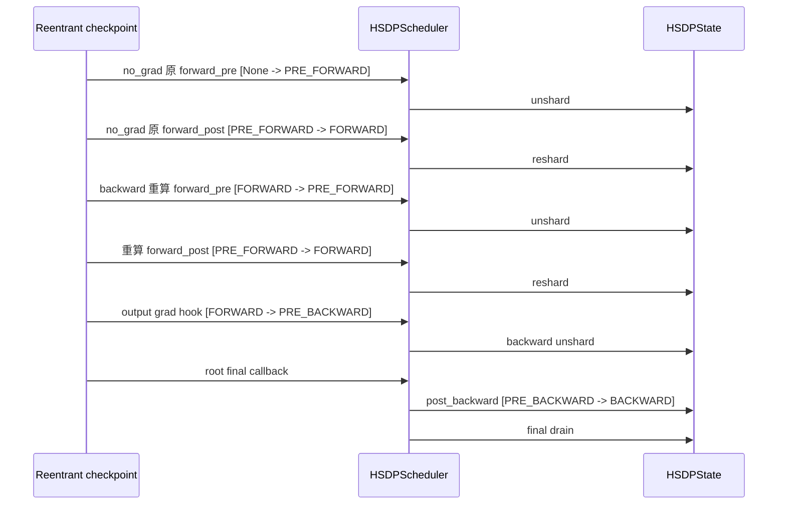

### 3.6 测试与日志证据

现有真实两 rank CPU/Gloo autograd 探针：

- worker：`tests/torch/fully_shard/_test_fully_shard_hook_state_machine.py`
- launcher：`tests/torch/fully_shard/test_fully_shard_hook_state_machine.py`

已执行命令：

```bash
HP_LOG_CONFIG=FSDP:DEBUG HYPER_PARALLEL_PLATFORM=torch \
python -m torch.distributed.run --nproc-per-node=2 \
  --log-dir=./logs/fsdp_hook_state_machine -r 3 \
  --master-addr=127.0.0.1 --master-port=12397 \
  -m pytest -s \
  tests/torch/fully_shard/_test_fully_shard_hook_state_machine.py::test_torch_fully_shard_hook_state_machine
```

结果：两个 rank 均 `1 passed`。日志：

```text
logs/fsdp_hook_state_machine/none_4ffd18x4/attempt_0/0/stdout.log
logs/fsdp_hook_state_machine/none_4ffd18x4/attempt_0/1/stdout.log
```


## 4. 初始化层拦截：只允许全 DTensor 或全普通 Tensor

### 4.1 唯一的参数类别拦截

**[Hyper 当前]** `fully_shard()` 在过滤 ignored/already-managed 参数后只计算 `has_dtensor_param = any(...)`，没有拒绝混用。

**[目标]** 在同一位置增加一次、且仅一次 managed-param 同构校验：

```text
managed_params = collect_managed_params_after_filtering()
plain = [(fqn, p) for p in managed_params if not is_dtensor_managed_param(p)]
dtensor = [(fqn, p) for p in managed_params if is_dtensor_managed_param(p)]

if plain and dtensor:
    raise ValueError(
        "fully_shard requires all managed parameters to be all Tensor or all DTensor; "
        "plain=[fqn:type...], dtensor=[fqn:type...]"
    )
```

`replicate_params` 仍属于 managed params，不能绕过该检查。嵌套 FSDP unit 各自校验，父 unit 不重复检查子 unit 已管理的参数。后续代码不得再次按单参数推导 `LOCAL_PARAM/DTENSOR_COMPAT/DTENSOR_UNIFIED`。

### 4.2 全 DTensor 的初始化约束

**[PyTorch 2.9]** `fully_shard(mesh=None)` 创建 default process group 上的 1-D WORLD mesh，不会从 DTensor 参数的 TP mesh 推导 DP mesh。FSDP mesh 与 TP/EP mesh 必须：

1. device type 一致；
2. 共享同一个具名 root mesh；
3. 使用不同的子 mesh 轴；
4. DP/FSDP 和 TP/EP 子 mesh 均具有 dim name。

标准二维 TP 场景中，`mesh=None` 创建的 WORLD mesh 与 TP root mesh 不同，PyTorch 在初始化阶段失败，不会进入 forward/backward，也不能声称会在 TP 轴执行重复通信。

**[目标]**：

- 全普通 Tensor：`mesh=None` 保留默认 WORLD FSDP mesh 行为。
- 全 DTensor 参数：要求显式传入与原 layout 共享 root 的 DP/FSDP 子 mesh；`mesh=None` 在 API 边界 `ValueError`。
- 初始化时在参数被替换前保存原 Parameter/DTensor 参数对象、logical tensor meta、mesh 和 placements。
- 原参数含 `Partial` placement 时本期拒绝。
- 原 layout 存在多个彼此独立、都要求参数梯度归约的 TP replicate 轴时本期拒绝；不能静默合并为笛卡尔积 group。

正确调用：

```python
root_mesh = init_device_mesh(
    "npu",
    (dp_size, tp_size),
    mesh_dim_names=("dp", "tp"),
)
parallelize_module(module, root_mesh["tp"], parallelize_plan)
fully_shard(module, mesh=root_mesh["dp"])
```

HSDP + TP 使用 `("replicate", "fsdp", "tp")` 三维 root mesh，传给 `fully_shard()` 的是 `root_mesh[("replicate", "fsdp")]`。

错误调用：

```python
parallelize_module(module, root_mesh["tp"], parallelize_plan)
fully_shard(module, mesh=None)          # DTensor 参数不能隐式推导 DP mesh
fully_shard(module, mesh=root_mesh["tp"])  # 不能复用 TP 轴作为 FSDP 轴
```

初始化拦截只负责输入合法性和静态元数据构造，不参与每次 unshard、reshard 或 backward 的动态分支。

## 5. Unshard/reshard 流程重构

### 5.1 [Hyper 当前] 参数集合、状态与 flag

| 项目 | 当前职责 |
| --- | --- |
| `hsdp_params` | 普通 FSDP/HSDP sharded 参数 |
| `sharded_hsdp_params` | unshard/reshard 时真正执行 AllGather 的参数子集 |
| `replicate_params` | 不做 FSDP shard、但仍进入 HSDPParam 生命周期的参数 |
| `is_shard` | `sharded_hsdp_params` 当前是否处于 sharded 状态 |
| `is_replicate_shard` | `replicate_params` 的第二套名义 sharded 状态 |
| `unshard_replicate` | 本次 `unshard()` 是否处理 replicate 参数的对象/storage 切换 |
| `shard_replicate` | 本次 `shard()` 是否把 replicate 参数切回持久对象 |
| `wait_for_replicate` | `wait_for_unshard()` 是否等待并安装 replicate 的 unsharded Parameter |

这些 flag 不决定参数属于哪类，也不直接决定梯度通信。参数是否切分由 `_init_hsdp_params()` 的 `enable_fsdp_shard` 决定；梯度通信由 `post_backward()` 的 compat/replicate/group 路径决定。

### 5.2 [Hyper 当前] `init_hsdp_params`

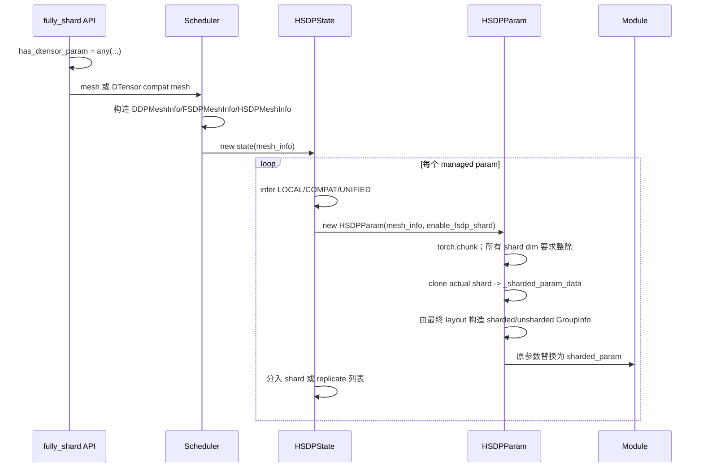

`replicate_params` 使用 `shard_world_size=1` 创建与原 local 参数同 shape 的 `sharded_param`。它不是 FSDP shard，只是通用状态机中的持久 Parameter。

### 5.3 [Hyper 当前] unshard 细粒度顺序

以 `reshard_after_forward=True` 为例：

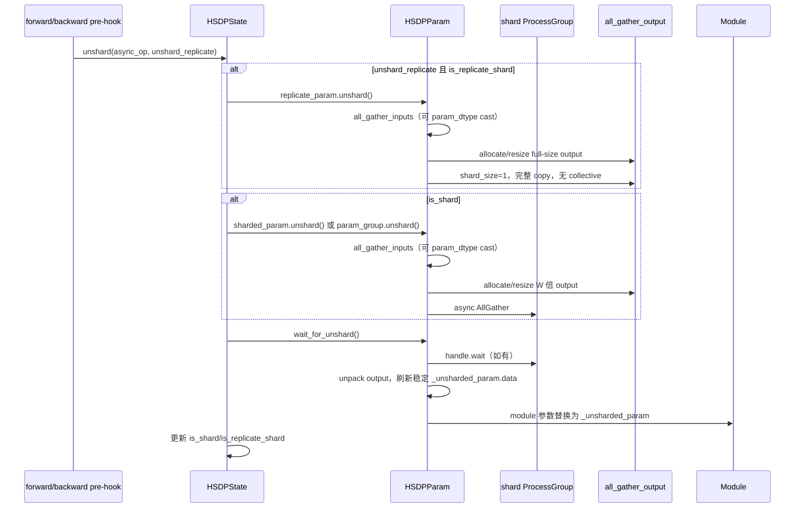

`shard_size == 1` 和 `replicate_params` 当前都不会发 AllGather collective，但仍创建 `all_gather_output` 并执行完整 copy。forward post-hook 调用 `shard(shard_replicate=False)`：真正 shard 参数切回，replicate 参数保留 unsharded，供 backward 直接复用。backward prefetch 同样传 `unshard_replicate=False`。

### 5.4 [Hyper 当前] reshard 细粒度顺序

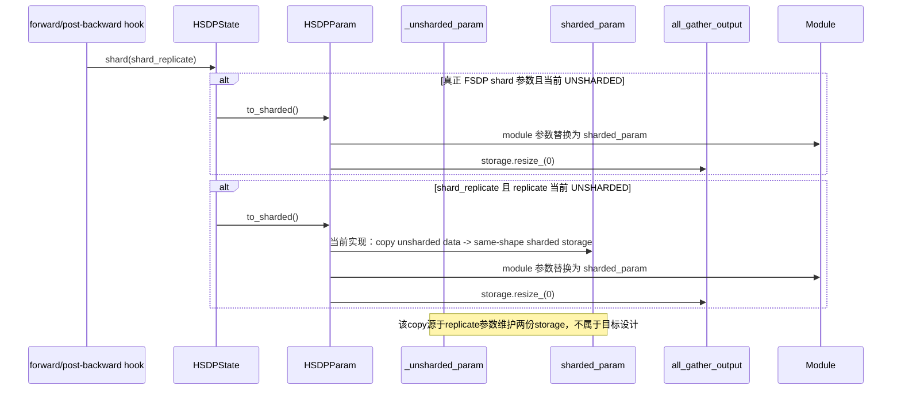

这次 copy 只是当前实现为两份同 shape storage 补充的回写：如果 forward 原地修改了 unsharded 参数，它试图在切回对象前把值同步到持久 storage。真正 FSDP shard 参数不需要该 copy，因为 sharded storage 始终是 master owner，unsharded AllGather output 只是计算视图。目标方案不支持依赖 forward 原地改参的语义，因此该 copy 没有保留价值；它还可能在 mixed precision 下把 cast 后的低精度计算副本错误覆盖回 master。归一后 no-cast 路径直接 alias sharded storage，cast 路径释放计算副本且禁止 copy-back，两条路径都只切换 Parameter 映射。

### 5.5 目标决策：将 `mesh_info` 下沉到 `HSDPParam`

`MeshInfo` 的所有权从 state 下沉到 param，不等于每个参数都要深拷贝一份对象：普通 shard 参数若拓扑相同可以共享同一个不可变 `FSDPMeshInfo/HSDPMeshInfo` 引用；但 state、param group 和 executor 不得再假设一个 unit 内所有参数的 DP 通信拓扑都相同。

1. `HSDPParam.mesh_info`：只描述 FSDP/HSDP 数据并行拓扑，包括 shard rank/size/group 和 replicate rank/size/group；
2. `HSDPParam` 保存的原 DTensor layout：只描述 TP/EP 等模型并行拓扑、placements 和 logical tensor meta；
3. storage 事实：actual/padded shape、storage owner、是否需要 AllGather、dtype policy。


参数场景对应的 `MeshInfo`：

| 参数场景 | 参数持有的 `MeshInfo` | FSDP/HSDP 通信 |
| --- | --- | --- |
| 普通 FSDP 参数 | `FSDPMeshInfo` | shard group 上 AllGather/RS |
| 普通 HSDP 参数 | `HSDPMeshInfo` | shard group 上 AllGather/RS，replicate group 上 AR |
| shard size 1 的 HSDP 参数 | `HSDPMeshInfo` | shard group identity，replicate group 上 AR |
| 1-D FSDP `replicate_params` | 基于完整 DP ranks 的 `DDPMeshInfo` | full DP group 上 AR |
| 2-D HSDP `replicate_params` | 基于展平 `R*S` DP ranks 的 `DDPMeshInfo` | flattened DP group 上 AR，而不是只在 R 维 AR |

约束：

- `HSDPState` 不再保存 `self.mesh_info`；它只遍历参数并提交生命周期或梯度操作。
- 当前HSDPParamGroup，仅支持所有参数都在同一个桶，如果多个桶就拦截住，讲清楚当前参数MeshInfo的配置情况。
- AllGather、ReduceScatter 和 HSDP/DP AllReduce 分别读取参数 `mesh_info` 中的 shard/replicate group。
- group 为 `None` 或 size 1 时，对应 FSDP/HSDP collective 是 identity/no-op。
- TP group 不写入 `MeshInfo`，也不由 `MeshInfo` 推导；第 6.4 节由 `HSDPParam` 从初始化时保存的原 Parameter DTensor mesh/placements 提取 replicate 轴并缓存 group，根反向钩子统一发起 TP AR。
- `MeshInfo` 不保存 gradient、dtype、buffer、Work、Event 或 TP placement 等动态/模型并行状态。

### 5.6 目标 `init_hsdp_params`

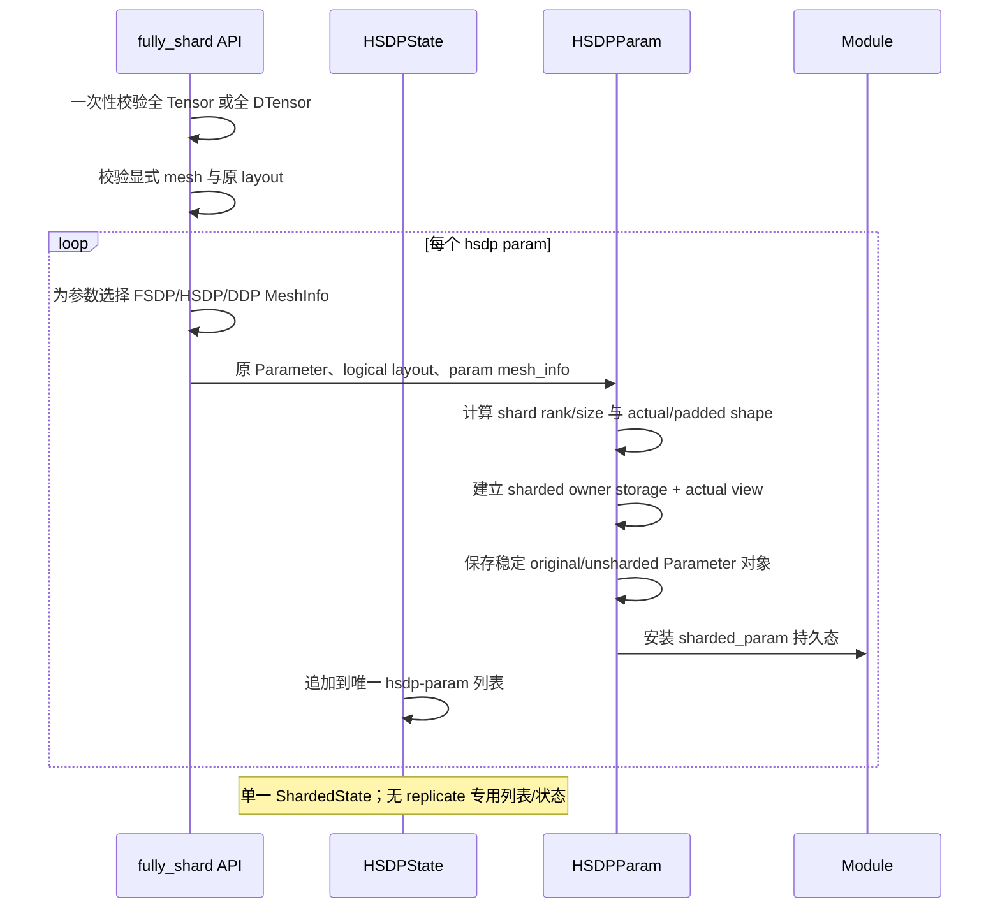

参数场景只改变事实，不改变 API：

| 场景 | `shard_world_size` | `needs_all_gather` | 参数 `mesh_info` |
| --- | ---: | ---: | --- |
| 普通 FSDP/HSDP，shard size > 1 | `> 1` | 是 | `FSDPMeshInfo/HSDPMeshInfo` |
| shard size == 1 | `1` | 否 | shard group size 1；HSDP replicate group 保留 |
| `replicate_params` | `1` | 否 | 基于显式完整 DP mesh 的 `DDPMeshInfo` |

唯一判定为：

```text
needs_all_gather = shard_world_size > 1
```

不保留 `uses_param_shard`：它同时重复了 `MeshInfo` 拓扑和 `shard_world_size` 通信规模，容易与其他状态 flag 组合膨胀。是否在 logical layout 上安装 FSDP `Shard` placement，从参数 `mesh_info` 是否具有 `shard_mesh_dim` 推导；是否执行 AllGather/ReduceScatter，只看 `shard_world_size`；参数当前处于 sharded 还是 unsharded，则只由 `ShardedState` 表达。这样 shard size 1 仍保留 FSDP logical layout，而 `replicate_params` 仍是 `DDPMeshInfo`，两者不会因 world size 都为 1 而混淆。

### 5.7 目标 unshard：通信路径与本地 alias 路径归一

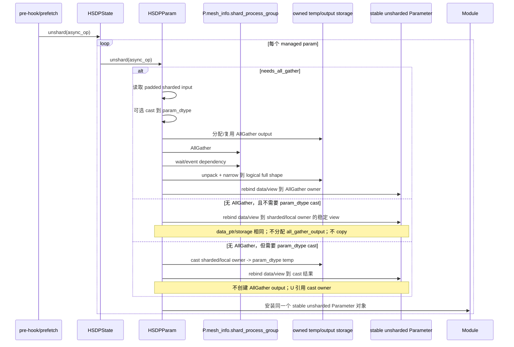

对 `replicate_params` 和 `shard_size == 1`：

- 无 cast：`unsharded_param` 必须直接引用 `sharded_param` local storage 的 view。
- 有 cast：`unsharded_param` 必须引用 cast 结果；融合路径中可引用共享 flat cast buffer 的对应 slice。
- 两种情况都不得执行“本地输入 copy 到同 shape output”。
- 原 DTensor 参数的 unsharded 对象继续用保存的原 layout 包装该 local view；layout 不从运行时 gradient 推导。

### 5.8 目标 reshard 与 storage ownership

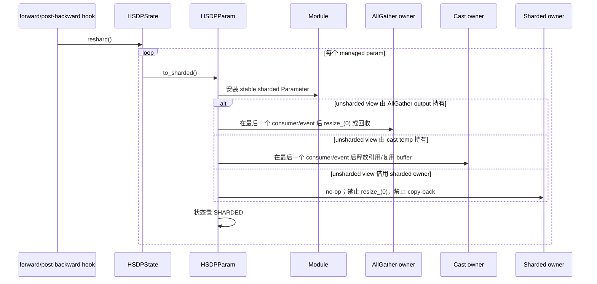

建议显式记录 storage ownership，而不是从 `is_sharded` 猜测：

| owner | 典型场景 | reshard 行为 |
| --- | --- | --- |
| `SHARDED_STORAGE` | no-AG、no-cast alias | 只切换 Parameter 映射，不释放、不复制 |
| `CAST_STORAGE` | no-AG + `param_dtype` | 完成 backward consumer 后释放或归还 flat cast buffer |
| `ALL_GATHER_STORAGE` | shard size > 1 | 完成 consumer 后释放/resize output storage |
| `FUSED_BUFFER_STORAGE` | comm fusion | 由 param group/context 在最终 Event 后统一回收 |

optimizer 只更新 sharded owner。mixed-precision cast view 是计算副本，不在 reshard 时反向覆盖 master 参数；forward 内原地修改 mixed-precision 参数不属于本期支持语义，必须通过用例或显式报错固定，不能隐式把低精度值 copy 回 master。

完成该归一后，删除 `unshard_replicate`、`shard_replicate`、`wait_for_replicate`、`is_replicate_shard`，并让 prefetch 遍历同一 managed-param 列表；无通信参数自然是幂等 no-op/alias。

### 5.9 `ReduceScatterPlan` 的当前作用与目标扩展

**[Hyper 当前]** `platform/*/fully_shard/pack_utils.py::ReduceScatterPlan` 不是通信 group 或调度计划。它只描述一个参数在“module/grad 的原始 local full layout”与“集合通信要求的 row-major packed layout”之间如何转换：

| 字段/函数 | 当前作用 |
| --- | --- |
| `pack_kind` | `identity_dim0`、`same_dim_strided_identity_dim0` 或 `chunk_cat_non_dim0` |
| `shard_dim`、`world_size` | pack/unpack 的切分维和份数 |
| `unpacked_shape` | forward/backward 看到的 TP-local full shape |
| `packed_tensor_shape` | AllGather 输出恢复前的 packed tensor shape |
| `packed_shape` | ReduceScatter 输入的二维 `(world_size, per_rank_numel)` view |
| `pack_for_reduce_scatter()` | dim-0 直接 view；非 dim-0 先 chunk，再沿 dim-0 concat |
| `unpack_from_all_gather()` | 上述变换的逆变换 |

当前 plan 还承担 AllGather output 的逆 pack，所以名称虽然是 `ReduceScatterPlan`，职责实际是“单参数 AG/RS layout plan”。它不选择 ProcessGroup、reduce op、dtype、stream、bucket 或 Work 生命周期。当前实现对所有 uneven 拒绝，并要求输入 contiguous。

**[目标]** 保留这个边界。`ReduceScatterPlan` 不选择 `MeshInfo`、TP replicate group 或 ProcessGroup，只补充或可推导以下信息：

| 字段 | 含义 |
| --- | --- |
| `unpacked_shape` | logical TP-local full shape |
| `actual_sharded_shape` | 本 rank optimizer/DCP 可见 shape |
| `padded_sharded_shape` | 每个 shard rank 相同的通信 shape |
| `padded_unsharded_shape` | RS input/AG output 的补齐 full shape |
| `packed_shape` | `(world_size, padded_sharded_numel)` |
| `actual_sharded_numel` | grad apply、optimizer、DCP 使用 |
| `padded_sharded_numel` | AG/RS buffer offset 使用 |
| `pack_kind` | dim-0 even/padded、非 dim-0 even、same-dim strided 等 |

均匀 dim-0 的 `actual == padded`，继续走无额外 padding 的 view 快路径。非 dim-0 uneven 在 `build_rs_plan()` 前的初始化校验中拒绝。

### 5.10 去除HSDPState级 dtype强制要求一致的约束
```
    def _init_mp_dtypes(self):
        """init mp dtypes for hsdp parameters and replicate parameters"""
        for hsdp_param in self.hsdp_params:
            hsdp_param.init_dtype_attrs(self.mp_policy)
        for replicate_param in self.replicate_params:
            replicate_param.init_dtype_attrs(self.mp_policy)
        trainable_params: list[TorchHSDPParamV2] = [
            p for p in self._iter_managed_params() if p.sharded_param.requires_grad
        ]
        orig_dtypes = {p.orig_dtype for p in trainable_params}
        reduce_dtypes = {p.reduce_dtype for p in trainable_params}
        if len(trainable_params) > 0 and len(orig_dtypes) != 1:
            raise AssertionError(
                f"hsdp expects uniform original parameter dtype but got {orig_dtypes}"
            )
        self._orig_dtype = next(iter(orig_dtypes)) if trainable_params else None
        if len(trainable_params) > 0 and len(reduce_dtypes) != 1:
            raise AssertionError(
                f"hsdp expects uniform reduce dtype but got {reduce_dtypes}"
            )
        self._reduce_dtype = next(iter(reduce_dtypes)) if trainable_params else None
```
当前HSDPState在初始化流程会会有一个初始化state级别的param_dtype, reduce_dtype的流程。并且要求所有HSDPParam的相关混合精度配置要完全一致。
对于comm_fusion=True的路径来说，当前保持该约束。
对于comm_fusion=False的路径来说，当前可以去掉这个约束。因为通信行为的粒度更小。此外MindFormer有场景是网络中初始化后参数的dtype较就混合着FP32与BF16。不原生支持这种方式的话，一个TransformerLayer要包7个fully_shard。造成比较大的host开销。

## 6. 反向梯度通信重构

### 6.1 重构前后对比

| 维度 | [Hyper 当前] | [目标] |
| --- | --- | --- |
| 梯度来源 | `unsharded_param.grad`、兼容路径下的 `sharded_param.grad`、累积梯度 | 统一从稳定的 `unsharded_param.grad` 或其累积缓冲区取得普通 Tensor |
| 通信语义 | `param_mode`、状态对象的 `mesh_info`、`GroupInfo`、重复参数标记和最终布局共同决定 | FSDP/HSDP 只读取 `HSDPParam.mesh_info`；TP 只读取原 Parameter DTensor 的 `placements` |
| 模块反向Hook | 兼容、直接兼容、重复参数和融合路径分别写一条通信的流程 | ReduceScatter + Optional_Allreduce(HSDP) + Optional_AllReduce(TP Replicate)|
| 队列所有权 | 状态类级队列和全局 `CommContext` 混合 | 一次 `fully_shard` 调用树共享的根调度上下文持有队列、桶、句柄和最终收尾状态 RL场景中如果有一个进程内给多个模型包fully_shard，类级别变量可能会有问题。|
| DTensor 梯度 | 存在 `reduce_partial()/redistribute()` 兼容路径 | 梯度通信只消费普通 Tensor，不调用 DTensor 梯度重分布 |
| 收尾 | Torch 条件式清空队列，MindSpore 无条件清空队列 | 两端根反向钩子统一无条件、幂等收尾 |

TP 域内需要参数梯度全归约的是配置为 `Replicate` 的少量参数，主要是归一化层权重和偏置。大权重通常已经按 TP
切分，不进入这一阶段。因此本期不把 TP AR 插入逐模块流水，也不让它改变现有 FSDP/HSDP 的通信重叠路径。

### 6.2 当前 `root_backward_hook` 的收尾顺序与 TP 插入点

Torch 当前 `_root_backward_hook()` 先调用 `self._backward_hook()`，保证当前单元遗漏的
`post_backward()` 得到补执行，然后在最终归约分支中依次处理：

```text
1. `CommContext.all_reduce_param_group`：等待融合 HSDP AR 并应用梯度。
2. `CommContext.pre_param_group`：等待最后一组融合 RS，完成其 HSDP AR 并应用梯度。
3. `TorchHSDPStateV2.pre_all_reduce_groups`：等待非融合路径最后一组 RS，发起普通 HSDP AR。
4. `reduce_scattered_params()`：应用只需要 RS 的 FSDP 梯度。
5. `delay_apply_reduce_grads()`：等待并应用普通 HSDP AR。
6. `reduce_params()`：等待并应用当前兼容/重复参数旁路的 DP AR。
```

TP 通信只能放在第 6 步之后、根反向钩子返回之前：

```python
def _root_backward_hook(self, force_reduce=False):
    self._backward_hook()
    if apply_final_reduce or force_reduce:
        # 保持当前 FSDP/HSDP 收尾逻辑及其顺序。
        self._finalize_comm_fusion_reductions()
        self._launch_last_hsdp_allreduce()
        self.hsdp_state.reduce_scattered_params()
        TorchHSDPStateV2.delay_apply_reduce_grads(self.hsdp_state.device)
        self.hsdp_state.reduce_params()

        # 新增位置：上述 FSDP/HSDP/DP 通信全部完成后才进入 TP 阶段。
        self._allreduce_tp_replicated_param_grads()
```


- TP 阶段从根调度上下文的全部状态中遍历 `HSDPParam`，不能只遍历当前 `self.hsdp_state`。
- 没有原 Parameter DTensor、原 `placements` 中没有 `Replicate`、参数被冻结、当前没有梯度或本轮关闭梯度同步时直接跳过。
- 不改动 `post_backward()` 中 RS/AR 的等待点、发起顺序和现有桶；纯 FSDP/HSDP 场景在新增位置是空操作。
- 开启参数或梯度下沉时，具有 TP AR 的参数必须把设备侧 DP 归约结果保留到 TP AR 完成，再执行最终下沉；
  “FSDP/HSDP 已结束”指对应集合通信已完成，不表示可以提前释放或下沉其结果缓冲区。

当前 Torch 仍用 `scheduler_state != BACKWARD` 控制是否进入最终归约分支。第 3.6 节要求的最终形态仍是根回调无条件执行
空队列安全的收尾；TP 阶段随该无条件收尾执行。

目标路径：

| 场景 | 模块反向阶段 | 根回调 TP 阶段 |
| --- | --- | --- |
| 纯 FSDP | `RS(S)` | 无 |
| 普通 HSDP `(R,S)` | `RS(S) -> AR(R)` | 无 |
| 普通 HSDP `(8,1)` | `AR(8)` | 无 |
| 1-D FSDP `replicate_params` | `AR(flat S)` | 无 |
| 2-D HSDP `replicate_params` | `AR(flat R*S)` | 无 |
| FSDP + TP，原参数为 TP `Shard` | `RS(S)` | 无 |
| FSDP + TP，原参数含 TP `Replicate` | `RS(S)` | `AR(TP)` |
| HSDP + TP，原参数含 TP `Replicate` | `RS(S) -> AR(R)` | `AR(TP)` |
| `replicate_params` + TP `Replicate` | `AR(flat DP)` | `AR(TP)` |

TP 阶段接收已经完成 FSDP/HSDP/DP 归约的本地梯度。通信输入必须是普通 Tensor；若内部参数梯度以 DTensor
形式挂载，只能取得其实际本地张量参加通信，不能调用 `reduce_partial()` 或 `redistribute()`。TP AR 使用参数的
`self.reduce_op_type`，不重复应用 `gradient_scaling_factor`。

TP 参数数量较少时可由根回调逐参数调用 `hsdp_param.reduce_tp_grad(reduced_grad)`。如果后续需要减少小通信发起次数，再按
`(tp_replicate_group, self.reduce_op_type, dtype, device)` 建立独立 TP 桶；无论是否融合，都不能写入普通
HSDP 的 `AllReduceParamGroup`，也不能提前到 `post_backward()` 中。

### 6.3 FSDP/HSDP 跨模块流水保持不变

非融合主路径继续保持“等待上一组 RS → 发当前 RS → 发上一组 AR”，用更早模块的反向计算掩盖通信：

当前队列与目标归一关系：

- `pre_reduce_scatter_params`：仅需要 RS 的参数，下一反向钩子或根回调等待后应用。
- `pre_all_reduce_groups`：RS 已发起，下一反向钩子的 `launch_prev_allreduce()` 等待 RS 后发起对应 AR。
- `pending_all_reduce_groups`：AR 已发起，根回调等待后应用。
- `pre_all_reduce_params`、`pre_direct_all_reduce_grads`：目标删除；`replicate_params` 与普通 HSDP 参数一起按各自
  ProcessGroup 进入统一的多组 AR 调度。
- `CommContext.pre_param_group/all_reduce_param_group`：融合路径的同类流水，TP 阶段不写入这两个字段。

一次 `post_backward()` 支持多个 AR 组即可，不需要为普通 HSDP 和 `replicate_params` 再建立固定的两类调度结构。
分组键至少包含 ProcessGroup、归约类型、数据类型和设备；每个组独立持有融合缓冲区与通信句柄。
`launch_prev_allreduce()` 按稳定顺序遍历全部非空组，根回调等待全部句柄。普通 HSDP 的输入仍依赖 RS 完成，
`replicate_params` 仍跳过 RS；统一的是调度入口，不是二者的数据依赖。

立即在 `M_i.post_backward()` 等待 RS 再发 AR 会失去 `RS(M_i)` 与 `backward(M_i-1)` 的重叠。详细的流和事件方案见
[`grad_comm_overlap.md`](grad_comm_overlap.md)；本次调整只把少量 TP 复制参数的 AR 移到根回调尾部，不改变
FSDP/HSDP 流水。对于这批已确认主要为归一化层权重和偏置的小参数，本 RFC 采用该分析文档中的“根回调尾部同步”
方案；分析文档对大规模 TP 梯度尾部同步的性能风险仍然成立。


### 6.4 归约类型、缩放和梯度累积

FSDP RS、HSDP/DP AR 和根回调中的 TP AR 使用同一个参数级 `self.reduce_op_type`：

- DP/FSDP/HSDP 的逻辑 `AVG`：纯 FSDP 在分片组平均；HSDP 在分片组和重复组各平均一次，最终除数为 `S × R`。
- DP 逻辑 `SUM`：各 DP 通信阶段使用 SUM，不隐式平均。
- `replicate_params` 的展平 DP AR 使用用户选择的 DP SUM/AVG 语义。
- TP AR 使用 `self.reduce_op_type`，不从梯度或 `Partial` 放置策略推导另一种归约类型。
- `gradient_scaling_factor` 只在整条反向归约链的第一个实际集合通信前应用一次；根回调中的 TP AR 不再缩放。
- 关闭同步或进行梯度累积时只保存普通 Tensor；真正同步的反向轮次先完成 FSDP/HSDP/DP，再由根回调完成 TP AR。

### 6.6 目标 `post_backward()` 与根回调固定流程

`post_backward()` 只负责 FSDP/HSDP/DDP：

```text
1. 从稳定的未分片 Parameter 取得普通 Tensor 梯度；无梯度或冻结参数跳过。
2. 合并关闭同步期间保存的梯度并明确缓冲区所有权。
3. 读取 `hsdp_param.mesh_info`，只解析 FSDP/HSDP 的分片组和重复组。
4. 使用 `ReduceScatterPlan` 打包实际输入和补齐输入，在第一个实际通信前应用一次梯度缩放。
5. 普通 FSDP/HSDP 参数发起可选 RS；`replicate_params` 跳过 RS。
6. 按每个 `HSDPParam.mesh_info.replicate_process_group` 组织需要 AR 的参数；普通 HSDP 与
   `replicate_params` 可以在同一次 `post_backward()` 中形成不同通信组。
7. `launch_prev_allreduce()` 发起上一模块已组织好的全部 AR 组。
8. 清理未分片完整梯度并按配置重新分片；不在这里发起 TP AR。
```

根反向钩子负责最终收尾：

```text
1. 幂等补执行遗漏的 `post_backward()`。
2. 发起最后一组 RS 和普通 HSDP/`replicate_params` AR。
3. 等待全部 FSDP/HSDP/DP 句柄，并使对应本地归约结果可用；无 TP 通信的参数继续沿用当前梯度应用路径。
4. 遍历根调度上下文中的全部 `HSDPParam`，筛选原 TP 布局含 `Replicate` 的参数。
5. 对筛选结果的设备侧本地梯度原地发起并等待 TP AR。
6. 完成这些 TP 参数尚未执行的梯度挂载、累加或下沉，并释放为 TP 阶段延长生命周期的缓冲区。
```

`comm_fusion=True` 时普通 HSDP 参数仍走 `HSDPParamGroup.foreach_reduce()`；`replicate_params` 不执行 RS，
但其 AR 仍由同一次 `post_backward()` 按自身 ProcessGroup 组织和发起。全部 FSDP/HSDP/DP 组在根回调完成后，
再统一执行同一个 TP 尾部阶段。

## 7. 支持参数在 dim-0 非均匀切分

### 7.1 三层数据模型

必须区分：

1. **logical global tensor**：模型语义上的完整参数；shape/stride/dtype 不包含 padding。
2. **actual logical shard**：本 rank 真正拥有、optimizer/state dict/DCP 可见的 local shard，可为零长度。
3. **padded communication storage**：为等长 AllGather/ReduceScatter 准备的私有 storage；padding 不进入 placement 或 logical tensor meta。

对参与 FSDP 切分的 local full parameter 定义：

```text
D0 = local full parameter 的 dim-0 长度
W  = FSDP shard world size
C  = ceil(D0 / W)

actual_len(rank) = max(min(D0 - rank * C, C), 0)
actual_shape(rank) = (actual_len(rank), *shape[1:])
padded_sharded_shape = (C, *shape[1:])
padded_unsharded_shape = (C * W, *shape[1:])
```

这里采用 PyTorch `torch.chunk`/`Shard._local_shard_size_and_offset()` 语义，不采用“前 remainder 个 rank 多一个”的 balanced split。两者在部分 shape 上不同，例如 `D0=10,W=4` 的 PyTorch chunk 为 `3,3,3,1`。

### 7.2 [PyTorch 2.9] 标杆行为

`FSDPParam._init_sharded_param()`：

- dim-0 使用 `_chunk_with_empty()`，支持 `D0 < W`；
- `sharded_size` 记录 actual shape；
- `padded_sharded_param_size` 取 rank 0 chunk shape；
- 创建统一 padded storage，把 actual shard copy 到前缀；
- `sharded_param._local_tensor` 是 padded storage 的 actual narrow view；
- `DTensorSpec.tensor_meta` 仍描述 logical global tensor；padding 不进入 placement/tensor_meta。

`foreach_reduce()`：

- 按 `_get_dim0_padded_size()` 构造 RS input；
- `fsdp.chunk_cat` 把尾部自动补零；
- RS output offset 按 padded shard numel 前进；
- 最终 grad view 的 size 使用 actual `sharded_size`。

`reset_sharded_param()`：

- load 或 `_apply` 后若 local tensor 是 actual shape，则重新构造 padded storage；
- 更新 `_sharded_param_data`；
- 重新把 DTensor local tensor 指向 actual narrow view。

PyTorch 当前即使均匀也执行 `new_zeros + copy`。Hyper 选择只在 uneven 时创建 padding，以保留均匀快路径；收益是减少 allocation/copy，风险是 executor 必须正确处理两种 storage owner，测试矩阵不能只覆盖 uneven。


### 7.4 `_init_sharded_param()` 与 `reset_sharded_param()`

这里必须区分参数对象与通信存储区，二者不能再统称为“分片参数”：

| 变量 | 含义 |
| --- | --- |
| `self.sharded_param` | 模块中真实注册的 `nn.Parameter`，也是优化器必须持有和更新的参数。它是 DTensor，其 `_local_tensor` 只表示当前进程的实际分片，实际第 0 维允许为 0，不包含补齐元素。 |
| `sharded_param` | `_init_sharded_param()` 中构造实际本地分片的局部变量；非均匀切分时最终改为补齐存储区上的 `narrow` 视图，再用于创建 `self.sharded_param`。 |
| `self.sharded_size` | 当前进程实际分片的形状，用于参数、梯度、优化器和分布式检查点。 |
| `self.padded_sharded_param_size` | 分片组内所有进程统一使用的通信形状，取第 0 个分片的形状。 |
| `padded_sharded_param` | `_init_sharded_param()` 在非均匀切分时创建的全零补齐存储区。 |
| `self._sharded_param_data` | 全收集通信读取的一维张量。均匀切分时指向 `sharded_param.view(-1)`；非均匀切分时指向 `padded_sharded_param.view(-1)`。它不是模块参数，也不能交给优化器。 |

当前实现中的：

```python
self._sharded_param_data = sharded_param.view(-1)
```

只适用于 `self.sharded_size == self.padded_sharded_param_size` 的均匀切分。当前
`all_gather_inputs` 直接读取 `self._sharded_param_data`，`_get_unsharded_param_data()` 又把
`all_gather_inputs[0]` 作为全收集输入。因此非均匀切分不需要在每次通信前临时补齐，但初始化时必须让
`self._sharded_param_data` 指向补齐后的存储区，保证各进程的输入元素数相同。

目标 `_init_sharded_param()` 的核心存储关系如下。实际实现先按当前逻辑完成
`offload_to_cpu` 和 `pin_memory` 处理，再进入下面的存储分支，保证实际分片和补齐存储区位于同一设备：

```python
chunks = _chunk_with_empty(param_data, shard_world_size, dim=shard_dim)
sharded_param = chunks[shard_rank].clone().contiguous()

self.sharded_size = sharded_param.size()
self.contiguous_sharded_stride = make_contiguous_strides_for(self.sharded_size)
self.padded_sharded_param_size = chunks[0].size()

length = sharded_param.size(shard_dim) if sharded_param.numel() > 0 else 0
if self.sharded_size == self.padded_sharded_param_size:
    # 均匀切分：实际分片本身就是通信存储区。
    self._sharded_param_data = sharded_param.view(-1)
else:
    # 非均匀切分：通信存储区统一补齐，参数只暴露实际前缀。
    padded_sharded_param = sharded_param.new_zeros(
        self.padded_sharded_param_size
    )
    if sharded_param.numel() > 0:
        padded_sharded_param.narrow(
            dim=shard_dim,
            start=0,
            length=length,
        ).copy_(sharded_param)
    self._sharded_param_data = padded_sharded_param.view(-1)
    sharded_param = padded_sharded_param.narrow(
        dim=shard_dim,
        start=0,
        length=length,
    )

self.sharded_param = nn.Parameter(self.to_sharded_dtensor(sharded_param))
self.sharded_param.requires_grad_(param.requires_grad)
self._setattr_on_modules(self.sharded_param)
```

`self.to_sharded_dtensor(sharded_param)` 使用 `self._sharding_spec` 中显式保存的逻辑全局
`shape`、`stride`、`dtype`，以及 `self._spmd_mesh` 和 `self._spmd_placements`。其中
`sharded_param.size()` 只用于实际本地形状，不能用于反推逻辑全局形状。非均匀切分时，
`self.sharded_param._local_tensor` 与 `self._sharded_param_data` 共享底层存储区，但前者只覆盖实际前缀，
后者覆盖包含补齐元素的完整通信存储区。

`reset_sharded_param()` 在 `load_state_dict(assign=True)`、元设备初始化或模块 `_apply` 后按以下顺序重建：

1. `new_param = self._resolve_reset_param()` 取得模块当前注册的参数，并要求它是 DTensor；
   `local_tensor = new_param.to_local()` 取得检查点或 `_apply` 提供的实际本地视图。第 0 维长度为 0 是合法输入。
2. 用 `self._sharding_spec` 校验 `new_param` 的显式逻辑全局 `shape`、`stride` 和 `dtype`，用
   `self._spmd_placements` 校验 `new_param.placements`，用 `self.sharded_size` 校验
   `local_tensor.size()`。补齐形状只由 `self.padded_sharded_param_size` 决定。
3. 若 `self.sharded_size == self.padded_sharded_param_size`，令
   `local_tensor = local_tensor.contiguous()`、
   `self._sharded_param_data = local_tensor.view(-1)` 和
   `local_view = local_tensor.detach()`；三者共享同一个实际分片存储区。
4. 若二者不相等，创建
   `padded_local_tensor = local_tensor.new_zeros(self.padded_sharded_param_size)`，把
   `local_tensor` 复制到 `padded_local_tensor` 的实际前缀，再令
   `self._sharded_param_data = padded_local_tensor.view(-1)`，并令 `local_view` 为
   `padded_local_tensor.narrow(dim=shard_dim, start=0, length=length).detach()`。
5. 执行 `self.sharded_param._local_tensor = local_view`，再执行
   `self._sharding_spec = self.sharded_param.layout` 和
   `self._setattr_on_modules(self.sharded_param)`。不需要新增含义不清的 `storage_owner` 字段；
   `self._sharded_param_data` 对完整通信存储区的强引用负责保持该存储区存活。
6. 分布式检查点只保存 `local_tensor` 表示的实际分片，不保存补齐元素。非均匀分支必须每次通过
   `new_zeros()` 重建补齐存储区，不能读取 `local_tensor` 实际范围之外的内存，也不能把旧补齐区中的内容
   当作已加载数据。

### 7.5 Unshard/AllGather

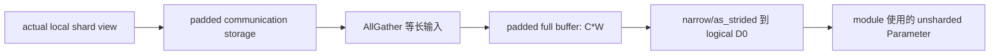

even 场景 `actual == padded`，`A` 可直接作为通信输入；uneven 场景 padding 在参数 init/reset 时准备，不在每次 AllGather 前重复分配。若 `param_dtype` 需要 cast，cast 的对象是 padded communication input，保证每个 rank input numel 一致。

### 7.6 `reduce_scatter_grad()`

1. 输入是 logical TP-local full gradient，shape 为 `unpacked_shape`。
2. dim-0 even：现有 view 快路径。
3. dim-0 uneven：pack 到 `padded_unsharded_shape`，尾部 `[D0, C*W)` 必须置 0。
4. RS output 每 rank固定为 `padded_sharded_numel`。
5. HSDP/TP 后续 AR 若零拷贝消费该 output，仍保留 padded slot。
6. 最终只用 `actual_sharded_shape` 建 grad view，padding 不挂到 optimizer grad。
7. 每次 buffer 复用前清零 padding，避免上一步残值污染 SUM/AVG。

`global dim-0 < W` 时，后部 rank actual grad 为 `(0, *rest)`，但 collective input/output 仍使用统一 `C`。所有 `numel==0` 分支必须保留非 shard 维 shape，不能退化为无维度 empty tensor。

### 7.7 示例

#### 示例 A：global `(5,3)`，FSDP world size 2

| rank | actual shape | global dim-0 offset | padded shape | padding numel |
| ---: | --- | ---: | --- | ---: |
| 0 | `(3,3)` | 0 | `(3,3)` | 0 |
| 1 | `(2,3)` | 3 | `(3,3)` | 3 |

#### 示例 B：global `(2,3)`，FSDP world size 4

| rank | actual shape | global dim-0 offset | padded shape |
| ---: | --- | ---: | --- |
| 0 | `(1,3)` | 0 | `(1,3)` |
| 1 | `(1,3)` | 1 | `(1,3)` |
| 2 | `(0,3)` | 2（标准 empty offset） | `(1,3)` |
| 3 | `(0,3)` | 2（标准 empty offset） | `(1,3)` |

#### 示例 C：TP-local dim-0 再被 FSDP uneven

global `(10,2)`，root mesh `(dp=2,tp=2)`，TP 与 FSDP 都切 dim-0。每个 TP-local `D0=5`，再按 FSDP 切成 3 和 2：

| `(dp,tp)` | actual shape | global dim-0 offset | padded shape |
| --- | --- | ---: | --- |
| `(0,0)` | `(3,2)` | 0 | `(3,2)` |
| `(0,1)` | `(3,2)` | 5 | `(3,2)` |
| `(1,0)` | `(2,2)` | 3 | `(3,2)` |
| `(1,1)` | `(2,2)` | 8 | `(3,2)` |

最终 placement 为 `(_StridedShard(dim=0, split_factor=2), Shard(0))` 的等价 Hyper `StridedShard` 表达。`split_factor` 和 offset 只描述 logical shard 顺序，不描述 padding。

PyTorch 2.9 的 shape/offset helper限制 `_StridedShard` 段结束后不能再对同一 tensor dim 继续 sharding；Hyper 应复用同等校验。二维 TP+FSDP 可支持，更高维连续同 dim sharding必须有独立用例，不能从二维结果外推。

#### 示例 D：均匀快路径

global `(8,3)`、W=2：两 rank actual/padded 都是 `(4,3)`。不得创建独立 padding storage，不增加 zero/copy。

### 7.8 DCP 与 state dict

**[PyTorch 2.9]** DCP 使用 DTensor logical shape、placements 和 `compute_local_shape_and_global_offset()` 生成 `ChunkStorageMetadata`，`__get_tensor_shard__()` 返回 actual `to_local()`。load planner按 saved chunk 与目标 actual chunk 的交集生成 read items；FSDP load post-hook 再重建 padded storage。

**[Hyper 当前]**：

- `StandardSavePlanner` 和 `create_chunk_list_for_tensor()` 使用 `distributed_checkpoint/reshard.py::infer_slice_area_by_rank()`；该函数对任何非整除直接抛 `ValueError`。
- `core/dtensor/layout.py::_infer_slice_area_by_rank()` 则使用 floor，可能静默丢 remainder。
- 两套算法与 `core/utils/shape_utils.py` 并不一致。

**[目标]**：

- 后续依赖RaggedShard layout处理不均匀切分的DCP场景


## 8. 验证设计

### 8.1 用例分层

| 级别 | 覆盖 | 通过标准 |
| --- | --- | --- |
| UT | 类型拦截、logical meta、actual offset、plan、storage owner、错误边界 | 精确断言 shape、offset、data_ptr、owner 和错误信息 |
| CPU/Gloo Level0 | Hook、纯 FSDP even/uneven、DCP planner | 与单进程 reference 一致，无 pending handle |
| NPU Level1 | HSDP、TP、fusion、mixed precision、offload、recompute、PP | loss/grad/参数更新一致，无 hang/OOM/stream race |
| MindFormers E2E | 混合并行、断点续训、性能显存 | loss 曲线、吞吐和峰值显存符合门槛 |

### 8.2 Hook 状态机用例

保留第 3.7 节已有三种场景，并新增：

1. FSDP unit 输入 `requires_grad=True`，验证 `PostBackwardFunction` 先进入 `BACKWARD` 后 root 仍 drain。
2. 多输出注册多个 output grad hook，backward pre/post 仍幂等一次。
3. non-reentrant early-stop 缺少重算 forward post-hook，最终状态仍正确。
4. PP `force_reduce` 与自然 root callback 重复到达时不重复应用 grad。
5. 无 grad、冻结参数、分支未执行 unit 时空队列 no-op。
6. 两个独立 model 串行及可构造的重叠 backward，context 互不污染。

### 8.3 支持参数在 dim-0 非均匀切分的测试用例

本小节是 uneven 功能的独立验收集，不能被普通 FSDP 精度用例替代。

#### 8.3.1 Shape、offset 与 logical meta UT

| 输入 | 断言 |
| --- | --- |
| `(5,3)`, W=2 | actual `(3,3)/(2,3)`；offset `0/3`；两 rank logical global shape 都是 `(5,3)` |
| `(2,3)`, W=4 | actual `(1,3)/(1,3)/(0,3)/(0,3)`；empty offset 为 2 |
| `(10,3)`, W=4 | chunk 语义 `3/3/3/1`，防止误实现 balanced `3/3/2/2` |
| `(8,3)`, W=2 | even fast path，actual==padded，无额外 padding owner |
| 非 dim-0 uneven | 初始化阶段统一错误，包含 FQN、shape、dim、world size |
| scalar/empty parameter | scalar 明确拒绝；合法 `(0,N)` 行为有固定契约 |

#### 8.3.2 参数 storage 与生命周期

- `_init_sharded_param()`：actual view/padded owner/data_ptr/尾部 0。
- `reset_sharded_param()`：load actual view 后重新 padding，重复调用幂等。
- AllGather/unshard：每个 rank恢复相同 logical full tensor。
- ReduceScatter：actual grad与 reference一致，padding不进入 grad。
- fusion on/off：offset按 padded numel，最终 actual view相同。
- `param_dtype=None`：no-AG路径的 unsharded/sharded storage data_ptr相同。
- `param_dtype!=orig_dtype`：no-AG路径引用 cast结果，不创建 AllGather output；reshard后master未被低精度覆盖。
- `replicate_params` 和 shard size 1：无 AllGather allocation/copy；2-D HSDP replicate group为 flattened `R*S`。

#### 8.3.3 TP 组合

- TP-local dim-0可整除/不可整除FSDP W。
- TP-local `D0 < W`。
- TP与FSDP切同 dim-0：校验 `StridedShard`、split factor、actual shape、global offset和DCP metadata。
- TP与FSDP切不同维：FSDP dim-0 uneven可用。
- FSDP指定非 dim-0且TP-local不能整除：早期拒绝。

#### 8.3.4 训练结果

- forward、backward、gradient clipping、optimizer step后与未切分 reference一致。
- FP32、FP16/BF16 param dtype、FP32 reduce dtype。
- gradient accumulation、no-sync、`main_grad`。
- requires_grad=False、shared parameter、deferred/meta init。
- 连续多 step后padding仍为0，未出现上一步残值。

所有新增 uneven 用例在实现前均标记为“待实现/待执行”，不得写成已通过。

### 8.4 DCP/state dict 用例

至少覆盖：

1. W=2 uneven save → W=2 load。
2. W=2 save → W=4 load，目标包含零长度 shard。
3. W=4 save → W=2 load。
4. empty shard metadata去重与无 read-item越界。
5. TP+FSDP 同 dim `_StridedShard` save/load。
6. sharded state dict、full state dict、`assign=True`、meta/deferred init。
7. 参数和 optimizer state 同时 save/load；恢复后再训练一步与 reference一致。
8. load 后 `_sharded_param_data` padded size正确、尾部全0，checkpoint中无 padding payload。

现有均匀 DCP reshard用例可复用框架，但不能替代上述 uneven断言。

### 8.5 通信与混合并行矩阵

| 维度 | 必测项 |
| --- | --- |
| 参数路径 | FSDP、HSDP、`(8,1)`、`replicate_params`、shard size 1 |
| 混合并行 | TP+FSDP、TP+HSDP、TP+replicate、PP+FSDP/HSDP |
| 重计算 | reentrant、non-reentrant、TP+recompute |
| 通信执行 | fusion on/off、zero-copy on/off、不同参数MeshInfo、原DTensor shard/replicate placements、group size 1 |
| 梯度行为 | SUM/AVG、gradient scaling、accumulation/no-sync、clip-grad |
| 参数边界 | frozen、shared、无 grad、空参数、optimizer-before/after-fully_shard |

每个参数的 debug view 要与实际 profiler collective group、op 和 payload 对上。

TP 路径至少单独断言：gradient 始终是普通 Tensor；原 Parameter DTensor 无 replicate placement 时根反向钩子不发 TP 通信；有 replicate placement 时在对应 group 上以 `self.reduce_op_type` 发起 AR；多 replicate 轴按约定顺序处理；TP AR 只在全部 FSDP/HSDP/DP 通信完成后执行，且不重复应用 gradient scaling。纯 FSDP/HSDP 用例必须断言 TP 阶段为空操作，原有 RS/HSDP AR 的桶数、发起顺序和负载不变。

多通信组至少单独断言：普通 HSDP 与 `replicate_params` 同时存在且使用不同 ProcessGroup 时，同一次
`post_backward()` 能完成分组，`launch_prev_allreduce()` 对每个非空组各发起一次 AR 并分别保存句柄；根回调等待
全部组后才允许发起 TP AR。

### 8.6 性能与显存验收

每次性能记录必须包含：

- baseline commit 与目标 commit；
- 卡型、卡数、驱动、PyTorch/MindSpore/后端版本；
- 模型、global/micro batch、sequence length、并行配置；
- warmup 至少 20 step，measurement 至少 100 step；
- step time中位数/P90、throughput、多次运行方差；
- peak allocated/reserved memory；
- actual bytes、padding bytes、alignment waste；
- AG/RS/HSDP-DP AR payload和bucket数，以及从原DTensor placements解析出的TP AR group、op和payload；
- allocation/copy次数、buffer复用率；
- profiler中backward/RS/AR overlap和root tail。

初始阻断门槛：已有均匀场景 throughput 不低于 baseline 97%，且无稳定回退趋势；峰值显存不高于 baseline。最终门槛应根据目标NPU环境方差收紧。均匀场景不得出现为uneven新增的padding allocation/copy；shard size 1和replicate路径不得出现AllGather或同shape output copy。

MindFormers E2E至少覆盖 FSDP、HSDP、TP+FSDP、TP+HSDP、recompute组合、PP组合和checkpoint续训。无法执行的多卡用例必须保留准确命令和“待执行”状态，不填造性能数据。

## 9. 实现拆分与代码改动点

### 9.1 建议 PR 顺序

| PR | 内容 | 主要验证 |
| --- | --- | --- |
| PR0 | 固化三类 hook状态机；Torch root无条件幂等drain；context化root状态 | CPU/Gloo hook、differentiable input、双model |
| PR1 | 唯一参数同构拦截；保存原对象/layout/logical meta；删除执行mode | 初始化错误、TP+FSDP mesh、对象身份 |
| PR2 | 将`MeshInfo`从state下沉到param；按参数分配FSDP/HSDP mesh_info；保存原DTensor TP replicate group | shard/replicate group、flattened DP group、原DTensor replicate group路径dump |
| PR3 | 归一 replicate/shard-size-1 alias生命周期；删除replicate flags | data_ptr、cast owner、无AG/copy、optimizer/state dict |
| PR4 | DTensor explicit logical meta与统一actual shape/offset helper | shape/offset、empty、StridedShard、DTensor基础能力 |
| PR5 | Torch dim-0按需padding；init/reset/unshard/RS/fusion | 第8.3节完整矩阵 |
| PR6 | DCP/state dict/optimizer uneven save-load与跨world reshard | 第8.4节完整矩阵 |
| PR7 | 模块反向固定FSDP RS→HSDP/DP AR；单次post_backward支持多个AR组；root尾部执行TP AR；删除compat/direct旁路 | 精度、多ProcessGroup、placements/group/op/payload、root tail、纯FSDP/HSDP无回退 |
| PR8 | MindSpore按同一契约对齐 | Torch/MS行为表、MS UT/ST |
| PR9 | MindFormers E2E、性能显存验收 | 第8.6节归档 |

每个 PR 必须可运行。迁移适配层应局限在一个模块并在对应 PR 内删除，不能先删旧路径、后续 PR 才恢复正确性。

### 9.2 模块改动

| 模块 | 目标改动 |
| --- | --- |
| `core/fully_shard/api.py` | 参数同构、mesh/layout/placement早期校验 |
| `core/fully_shard/hsdp_scheduler.py` | context化全部state与root finalization；删除replicate hook flag |
| `core/fully_shard/hsdp_state.py` | 单一managed-param列表；统一shard/unshard；移除state级mesh_info所有权 |
| `core/fully_shard/hsdp_param.py` | 参数持有FSDP/HSDP mesh_info；保存原DTensor TP replicate group并提供根回调使用的TP梯度通信接口 |
| `platform/torch/fully_shard/param.py` | 参数级mesh_info、从原DTensor placements解析TP replicate group、普通Tensor grad AR、logical meta、actual/padded storage、no-AG alias、reset |
| `platform/torch/fully_shard/pack_utils.py` | `ReduceScatterPlan` dim-0 padding与actual/padded信息；非dim-0 uneven拒绝 |
| `platform/torch/fully_shard/param_group.py` | 按参数mesh_info和实际ProcessGroup组织多个AR组；padded offset、buffer owner、alignment统计、共享DP executor |
| `platform/torch/fully_shard/state.py` | 固定模块反向RS→HSDP/DP AR；一次post_backward按参数ProcessGroup组织多个AR组并由`launch_prev_allreduce()`发起；删除compat/direct旁路 |
| `platform/torch/fully_shard/scheduler.py` | 无条件root drain；等待全部FSDP/HSDP/DP后发起TP AR；最终Event等待 |
| `core/dtensor/*` | explicit logical tensor meta；统一shape/offset；empty和StridedShard支持 |
| `core/distributed_checkpoint/*` | planner/chunk/reshard统一使用actual shape/offset |
| `platform/mindspore/fully_shard/*` | Torch契约稳定后对齐数据不变量和通信语义 |

## 10. 兼容性与方案取舍

| 决策 | 选择 | 原因 |
| --- | --- | --- |
| 参数输入 | 全普通或全DTensor | 在边界消除深层mode组合 |
| `mesh=None + DTensor` | 早期报错 | 对齐PyTorch，不把TP mesh隐式当DP mesh |
| `MeshInfo` 所有权 | 下沉到每个`HSDPParam`，只管FSDP/HSDP | 支持同unit参数使用不同DP拓扑，不把TP塞入MeshInfo |
| no-AG路径 | sharded view或cast view alias | 消除output allocation/copy |
| uneven padding | 仅uneven创建 | 保留Hyper均匀快路径 |
| DTensor global shape | 显式logical meta | actual local shape无法反推uneven global shape |
| DP/TP通信 | FSDP/HSDP读参数MeshInfo；TP读原Parameter DTensor placements并在root尾部执行 | 梯度保持普通Tensor，TP group不进入MeshInfo，也不改变逐模块DP流水 |
| 通信overlap | FSDP/HSDP使用共享显式Stream+Event/Work；少量TP复制参数在root尾部同步 | 保持现有FSDP/HSDP流水，TP不进入逐模块关键路径 |
| DCP | checkpoint只保存actual logical shard | padding是运行时通信细节 |

公开 `fully_shard()` 签名不变。行为变化包括：混合参数和 `mesh=None + DTensor` 从深层/隐式行为变为初始化早期错误；这是有意收紧。

## 11. 风险与待确认项

| 风险/问题 | 状态与关闭证据 |
| --- | --- |
| Hyper DTensor explicit logical meta影响范围 | **待实现**；DTensor shape/full_tensor/redistribute/DCP基础UT全部通过后关闭 |
| `_StridedShard` 三维以上同dim顺序 | **待确认**；固定layout的shape/offset和DCP跨world用例通过后关闭 |
| 原Parameter与sharded Parameter的optimizer identity | **待确认**；optimizer在fully_shard前后构建、shared param、save/load用例通过后关闭 |
| no-AG cast storage生命周期 | **待确认**；data_ptr、allocator、stream Event和连续step显存用例通过后关闭 |
| alias storage被错误`resize_(0)` | **目标有owner模型**；逐owner free断言和ASAN等价行为测试通过后关闭 |
| 原Parameter DTensor replicate轴解析错误 | **风险**；单轴/多轴、Shard+Replicate和具名submesh group用例通过后关闭 |
| 同一`reduce_op_type`重复缩放 | **风险**；RS/HSDP AR完成后root TP AR不重复缩放的组合用例通过后关闭 |
| uneven zero-copy使AR payload包含padding | **待profiling**；比较直接padded AR与compact-copy AR后决定是否优化 |
| class-level queue跨模型污染 | **已识别**；队列迁移root context并通过双model测试后关闭 |
| MindSpore storage/view语义不同 | **待Torch契约稳定**；只对齐可观察行为，不复制Torch私有API |
| 性能阈值97%是否足够严格 | **待目标环境数据**；至少三次运行方差和团队门槛确认后固化 |

已确定、无需重新讨论的方向：Hook无条件root drain、单次类型拦截、删除执行mode、MeshInfo下沉到参数且只管FSDP/HSDP、梯度始终是普通Tensor、单次post_backward支持按实际ProcessGroup处理多个AR组、TP通信只在root尾部按原Parameter DTensor replicate placements触发、no-AG alias、只支持dim-0 uneven、按需padding、logical/actual/padded分离、DCP不保存padding。

## 12. Definition of Done

- [ ] 三类 hook顺序有自动化断言；Torch/MindSpore root callback均无条件、幂等drain。
- [ ] pending queue、root backward和通信context按fully_shard调用树隔离，无class-global跨model状态。
- [ ] 一个FSDP unit只允许全普通Tensor参数或全DTensor参数；混用错误包含FQN和实际类型。
- [ ] `mesh=None + DTensor参数`早期报错；合法TP+FSDP/HSDP使用同一具名root的兄弟submesh。
- [ ] `FullyShardParamMode.DTENSOR_COMPAT/DTENSOR_UNIFIED`不再驱动生命周期或梯度通信。
- [ ] `HSDPState`不再持有unit级`mesh_info`；每个`HSDPParam`持有只描述FSDP/HSDP通信的`MeshInfo`。
- [ ] `HSDPParamGroup`按参数`mesh_info`分桶，不假设同一state内所有参数共享DP group。
- [ ] 不新增`HSDPParamCommMetaInfo`；`HSDPParam`从原Parameter DTensor placements解析/缓存TP replicate group，root尾部使用`self.reduce_op_type`发起AR。
- [ ] 2-D HSDP上的`replicate_params`使用flattened `R*S` DP group，不误用普通R维replicate group。
- [ ] 单次`post_backward()`可按实际ProcessGroup组织多个AR组；`launch_prev_allreduce()`对各非空组各发起一次通信，并分别等待和应用。
- [ ] `unshard_replicate`、`shard_replicate`、`wait_for_replicate`、`is_replicate_shard`和replicate第二套列表/状态删除。
- [ ] `replicate_params`和shard size 1无AllGather output、无同shape copy；no-cast引用sharded view，cast时引用cast结果。
- [ ] storage owner明确；borrowed alias不会被`resize_(0)`，owned buffer在最终Event后释放。
- [ ] backward gradient始终是普通Tensor，不调用DTensor gradient的`reduce_partial()/redistribute()`。
- [ ] 模块反向只执行optional FSDP RS→optional HSDP/DP AR；root等待其全部完成后再执行optional TP AR；三者均使用参数的`self.reduce_op_type`且gradient scaling只应用一次。
- [ ] `ReduceScatterPlan`只负责layout pack/unpack，并完整表达dim-0 actual/padded尺寸。
- [ ] Hyper DTensor可显式保存logical tensor meta；所有rank的uneven DTensor global shape一致。
- [ ] 唯一actual shape/global offset helper支持PyTorch chunk语义、零长度和受支持的`StridedShard`。
- [ ] dim-0 uneven在init/reset/unshard/RS/fusion/grad apply中正确；非dim-0 uneven早期拒绝。
- [ ] `(5,3)/W2`、`(2,3)/W4`、TP-local uneven、TP/FSDP同dim和均匀快路径用例通过。
- [ ] DCP同world save/load、跨world reshard、empty shard、TP+FSDP和optimizer state通过；checkpoint不含padding。
- [ ] load后padded storage按目标mesh重建且尾部为0；继续训练一步与reference一致。
- [ ] 均匀场景无新增padding allocation/copy；shard size 1/replicate copy消除有profiler或allocation证据。
- [ ] Torch完整矩阵通过后，MindSpore公开行为对齐。
- [ ] MindFormers端到端精度、吞吐、峰值显存、通信payload和分rank日志完成归档。
