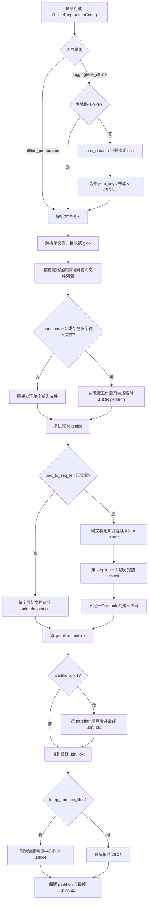
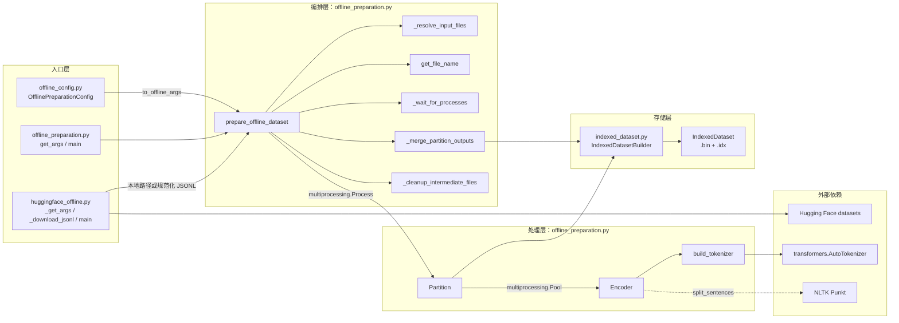
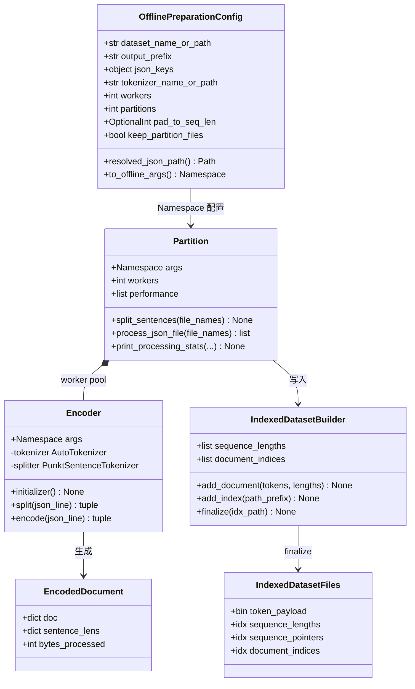
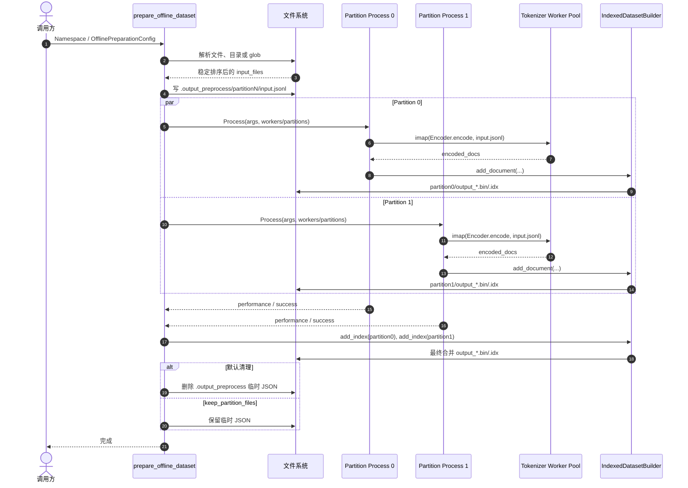
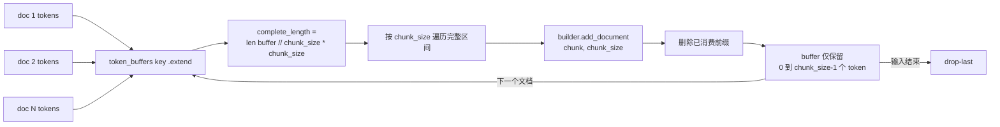
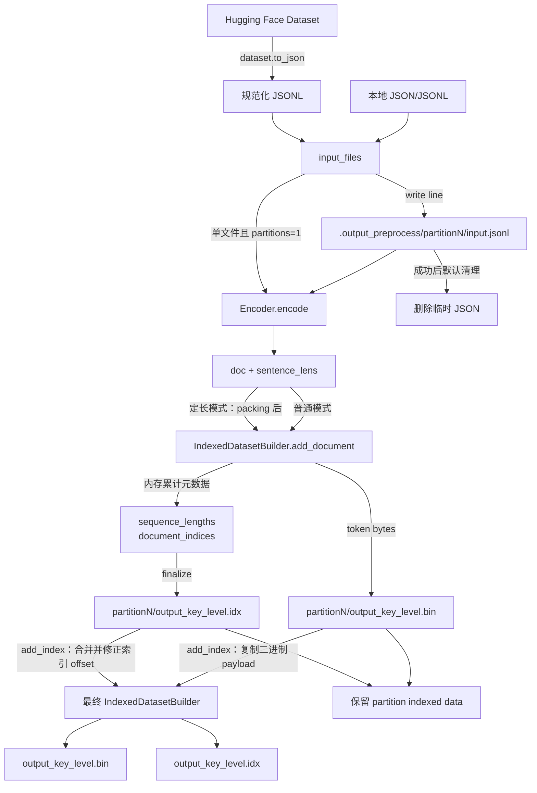
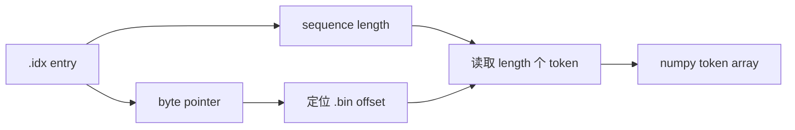
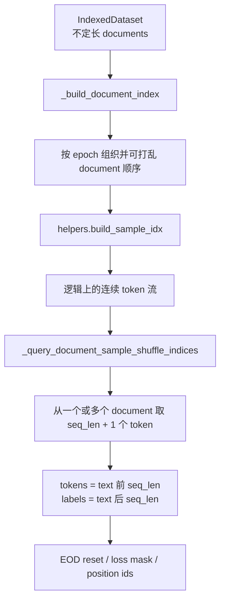
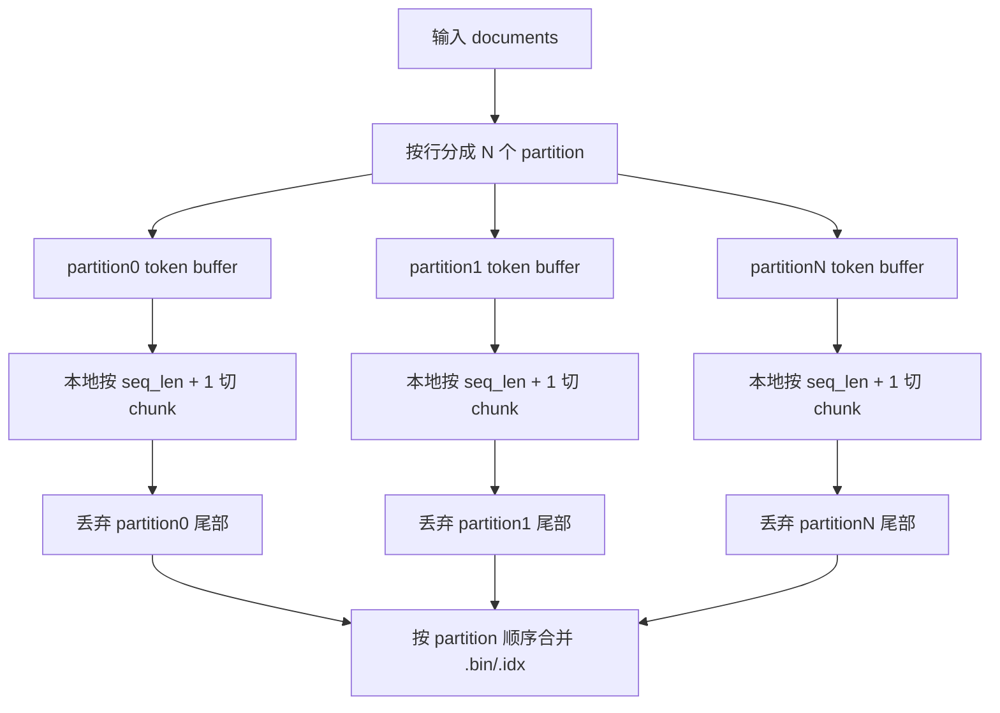
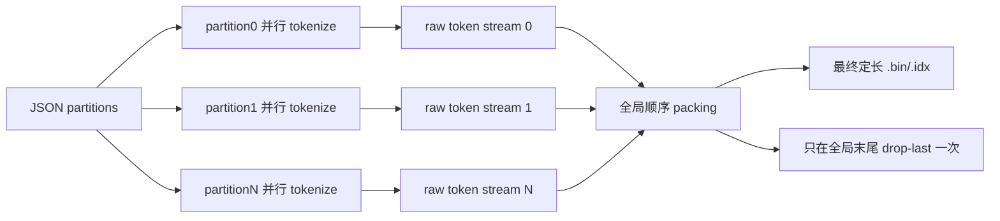

# 离线数据预处理技术说明

本文说明 `hyper_models/components/data/tools` 下的离线数据预处理工具，包括本地 JSON/JSONL、Hugging Face
数据集、并行分区、Megatron indexed dataset 输出，以及可选的定长样本预切分功能。

## 1. 功能概览

工具提供两条命令行入口：

- `offline_preparation.py`：处理已经存在的本地 JSON/JSONL 文件、目录或 glob。
- `huggingface_offline.py`：接受 Hugging Face dataset ID；也接受本地 JSON/JSONL 文件或目录。本地路径存在时
  不执行下载，否则通过 `datasets.load_dataset()` 下载并规范化为 JSONL。

两条入口最终都会调用：

```python
prepare_offline_dataset(args: argparse.Namespace) -> None
```

输出格式兼容 Megatron indexed dataset：

```text
<output-prefix>_<json-key>_<document|sentence>.bin
<output-prefix>_<json-key>_<document|sentence>.idx
```

## 2. 总体流程



### 2.1 代码模块架构



架构职责：

- 入口层只负责参数来源、本地/Hugging Face 判定及配置转换。
- 编排层负责输入解析、分区进程生命周期、结果合并和临时文件清理。
- 处理层负责分句、tokenize、EOD 追加和定长 packing。
- 存储层只处理 Megatron `.bin/.idx` 格式，不感知 Hugging Face 或 JSON 输入来源。

### 2.2 核心类与数据模型



`EncodedDocument` 是概念数据类型，对应 `Encoder.encode()` 的实际返回值：

```python
(
    {"text": [token_id, ...]},
    {"text": [sentence_length, ...]},
    bytes_processed,
)
```

### 2.3 多 Partition 执行时序



### 2.4 定长 Packing 内部状态



该设计保证常规情况下 buffer 只长期保留不足一个 chunk 的尾部。单个超长文档到达时会暂时扩展 buffer，写出所有
完整 chunk 后立即删除已消费前缀。

### 2.5 文件写入架构

文件写入分为四个阶段：Hugging Face JSONL 落盘、临时 JSON 分区、partition indexed dataset 写入和最终合并。



#### 2.5.1 调用位置

| 写入内容 | 文件和函数 | 核心操作 |
|---|---|---|
| Hugging Face 规范化 JSONL | `huggingface_offline.py::_download_jsonl` | `dataset.to_json(..., lines=True)` |
| 临时 partition JSON | `offline_preparation.py::prepare_offline_dataset` | `partitioned_input_files[index].write(line)` |
| partition `.bin/.idx` | `offline_preparation.py::Partition.process_json_file` | 创建 builder、`add_document()`、`finalize()` |
| indexed dataset 二进制实现 | `indexed_dataset.py::IndexedDatasetBuilder` | token bytes、索引元数据和文件关闭 |
| 最终合并 `.bin/.idx` | `offline_preparation.py::_merge_partition_outputs` | `add_index()` 后 `finalize()` |
| 临时 JSON 清理 | `offline_preparation.py::_cleanup_intermediate_files` | 删除生成的 JSON，不删除 `.bin/.idx` |

#### 2.5.2 `add_document()` 写入语义

每个 JSON key 拥有独立的 `IndexedDatasetBuilder`。builder 初始化时立即以二进制写模式打开 `.bin`：

```python
self.data_file = open(bin_path, "wb")
self.sequence_lengths = []
self.document_indices = [0]
```

调用 `add_document(tokens, lengths)` 时执行三件事：

```python
np_array = numpy.array(tokens, dtype=self.dtype)
self.data_file.write(np_array.tobytes(order="C"))
self.sequence_lengths.extend(lengths)
self.document_indices.append(len(self.sequence_lengths))
```

- `.bin` 只保存连续 token payload，不包含 JSON、文档名或 Python 对象。
- `sequence_lengths` 记录每个 sequence 的 token 数量。
- `document_indices` 使用 sequence index 标记 document 边界，并以 `0` 作为起始哨兵。
- 普通模式的 `lengths` 来自 tokenizer 产生的 `sentence_lens`。
- 定长模式固定传入 `[chunk_size]`，因此每个写入 document 包含一个定长 sequence。

空文档可能调用 `add_document([], [])`：`.bin` 不增加 token，`sequence_lengths` 不增加元素，但
`document_indices` 仍追加当前 sequence index。这也是某些数据集出现 documents 多于 sequences 的原因。

#### 2.5.3 `.idx` 逻辑结构

`finalize(idx_path)` 首先关闭 `.bin`，然后由 `_IndexWriter` 写入 `.idx`。除格式 magic、version 和 dtype
等头部信息外，核心索引 payload 为：

```text
.idx
├── sequence_count: uint64
├── document_index_count: uint64
├── sequence_lengths: int32[sequence_count]
├── sequence_pointers: int64[sequence_count]
└── document_indices: int64[document_index_count]
```

其中 `sequence_pointers` 根据累计 sequence length 和 token dtype 字节数计算，表示每个 sequence 在 `.bin` 中的
起始字节偏移。读取指定 sequence 时，reader 使用 pointer 定位 `.bin`，再根据 length 读取对应数量的 token。



#### 2.5.4 Partition 合并

最终合并不会重新 tokenize，也不会解析 token 内容。`add_index(partition_prefix)` 执行：

1. 读取 partition `.idx`。
2. 将 partition 的 `sequence_lengths` 追加到最终 builder。
3. 使用当前 sequence 数量作为 offset，修正并追加 `document_indices`。
4. 按 partition 顺序将 `.bin` payload 直接复制到最终 `.bin`。
5. 所有 partition 添加完成后，通过 `finalize()` 生成最终 `.idx`。

因此，在输入分配稳定且按 `partition0`、`partition1` 顺序合并时，最终文件保持对应的 partition 顺序。各 partition
的 `.bin/.idx` 是有效且独立的 indexed dataset，合并成功后仍然保留；只有隐藏工作目录中的临时 JSON 默认删除。

## 3. 输入接口

### 3.1 本地预处理入口

```bash
python -m hyper_models.components.data.tools.offline_preparation \
    --dataset-name-or-path ./download_datasets/wikitext \
    --output-prefix ./offline_datasets/wikitext/output \
    --json-keys text \
    --tokenizer-name-or-path Qwen/Qwen3-30B-A3B \
    --workers 8 \
    --partitions 2 \
    --keep-sequential-samples \
    --append-eod
```

`--dataset-name-or-path` 支持：

| 输入形式 | 示例 | 行为 |
|---|---|---|
| 单文件 | `./data/train.jsonl` | 直接读取文件 |
| 目录 | `./data` | 非递归读取目录内受支持的文件，并按路径排序 |
| glob | `"./data/*.jsonl"` | 展开匹配文件并按路径排序；建议使用引号防止 shell 提前展开 |

支持的文件扩展名为 `.json`、`.jsonl`、`.json.gz` 和 `.jsonl.gz`。每行必须是一个 JSON 对象，
`--json-keys` 指定的字段应为字符串或句子字符串列表。

### 3.2 Hugging Face 入口

```bash
python -m hyper_models.components.data.tools.huggingface_offline \
    --dataset Salesforce/wikitext \
    --dataset-subset wikitext-103-raw-v1 \
    --dataset-split train \
    --output-prefix ./offline_datasets/wikitext/output \
    --json-keys text \
    --tokenizer Qwen/Qwen3-30B-A3B \
    --workers 8 \
    --partitions 2 \
    --keep-sequential-samples \
    --append-eod
```

`--dataset` 的判定顺序如下：

1. 已存在的本地目录：直接进入本地目录处理。
2. 本地 JSON/JSONL 文件：直接处理，不下载。
3. 其他值：作为 Hugging Face dataset ID 传给 `load_dataset()`。

本地路径优先。因此，如果当前工作目录恰好存在与 dataset ID 同名的目录，该目录会被解释为本地输入。

### 3.3 程序化接口

```python
from hyper_models.components.data.tools.offline_config import OfflinePreparationConfig
from hyper_models.components.data.tools.offline_preparation import prepare_offline_dataset

config = OfflinePreparationConfig(
    dataset_name_or_path="./download_datasets/wikitext",
    output_prefix="./offline_datasets/wikitext/output",
    tokenizer_name_or_path="Qwen/Qwen3-30B-A3B",
    json_keys=["text"],
    workers=8,
    partitions=2,
    append_eod=True,
    keep_sequential_samples=True,
)
prepare_offline_dataset(config.to_offline_args())
```

## 4. 主要参数

| 参数 | 默认值 | 说明 |
|---|---:|---|
| `--json-keys` | `text` | 需要 tokenize 的 JSON 字段，可传多个 |
| `--append-eod` | 关闭 | 在每个非空原始文档末尾追加 tokenizer EOS；无 EOS 时尝试 SEP |
| `--split-sentences` | 关闭 | 使用 NLTK Punkt 先进行分句 |
| `--keep-newlines` | 关闭 | 分句时保留换行边界 |
| `--workers` | 入口相关 | tokenizer worker 总数，必须能被 partitions 整除 |
| `--partitions` | `1` | 输入及输出分区数量 |
| `--keep-sequential-samples` | 关闭 | 连续地分配输入记录；关闭时按 round-robin 分配 |
| `--pad-to-seq-len` | `None` | 启用定长预切分，存储长度为该值加一的 document |
| `--keep-partition-files` | 关闭 | 成功后保留临时 JSON partition；不影响 `.bin/.idx` 保留策略 |
| `--log-interval` | `1000` | 每处理多少个原始文档输出一次进度 |

`workers` 是所有 partition 的总 worker 数。例如 `--workers 8 --partitions 2` 会启动两个 partition
处理进程，每个 partition 使用四个 tokenizer worker。每个 worker 都会初始化 tokenizer，内存不足时应先降低并发。

## 5. 定长预切分

通过以下参数启用：

```bash
--pad-to-seq-len 4096
```

实际写入的 indexed document 长度为：

```text
chunk_size = pad_to_seq_len + 1 = 4097
```

多出的一个 token 用于构造右移标签：

```python
tokens = chunk[:-1]
labels = chunk[1:]
```

### 5.1 Token 流语义

每个 partition、每个 JSON key 都维护独立 buffer：

```text
document 1: [A, B, EOD]
document 2: [C, D, E, EOD]

连续 token 流: [A, B, EOD, C, D, E, EOD]
```

随后按 `seq_len + 1` 切分。chunk 可以跨越原始文档边界，且最后一个 token 不要求是 EOD。EOD 的作用是标记
原始文档边界，供下游的 position reset、attention reset 或 EOD loss mask 使用。

不足一个完整 chunk 的 partition 尾部采用 drop-last，不填充 pad token。未传 `--pad-to-seq-len` 时完全保留
原行为：一个原始 JSON 文档对应一个 indexed document，并保留原始 sentence lengths。

### 5.2 与标准 Megatron GPTDataset 的关系

预切分输出适用于直接将每个 indexed document 读取为一条训练样本的 loader：

```python
text = indexed_dataset[index]
tokens = text[:-1]
labels = text[1:]
```

标准 Megatron `GPTDataset` 默认还会执行 `build_sample_idx`，按连续 token 流重新构造样本，并让相邻训练样本
共享一个用于标签右移的 token。因此，把已经预切分的 document 直接交给标准 `GPTDataset`，不能保证
`document_count == sample_count`，也可能跨预切分 document 再次拼接。若要求“一 document 一 sample”，下游需要
绕过 `build_sample_idx`，或实现显式的 pre-packed dataset 模式。

### 5.3 Megatron GPTDataset 如何读取

标准 Megatron 的离线 `.bin/.idx` 通常保存原始不定长文档。训练侧再由 `GPTDataset` 将文档组织成训练样本：



`sample_index` 的每一项记录训练样本在 `document_index` 中的起始 document 和 document 内 offset。一个样本可以：

- 完全位于单个 document 内；
- 从一个 document 的中间开始；
- 跨越多个 document；
- 在最后一个 document 的中间结束。

当 `add_extra_token_to_sequence=True` 时，每条样本读取 `sequence_length + 1` 个 token，但相邻样本的步长是
`sequence_length`。也就是说，前一条样本最后用于 label 的 token，会成为后一条样本的第一个 input token：

```text
逻辑 token 流:  t0 t1 t2 t3 t4 t5 t6 t7 t8 ...

seq_len = 4
sample 0 text: [t0 t1 t2 t3 t4]
sample 0 input: [t0 t1 t2 t3]
sample 0 label: [t1 t2 t3 t4]

sample 1 text: [t4 t5 t6 t7 t8]
sample 1 input: [t4 t5 t6 t7]
sample 1 label: [t5 t6 t7 t8]
```

训练 split 默认设置 `drop_last_partial_sequence=True`。因此，Megatron 会先把这个 `GPTDataset` 的 document
组织成一条逻辑流，再只处理整条逻辑流最后一个不足长度的尾部。通常一个训练 split、一个 dataset prefix、一个
`GPTDataset` 最多发生一次尾部丢弃；如果配置了多个彼此独立的 dataset 或 split，则每个实例分别处理自己的尾部。

验证 split 可以配置 `drop_last_partial_validation_sequence=False`。此时 `_query_document_sample_shuffle_indices()`
会在运行时使用内部 pad token 补足最后一条短样本，随后 `__getitem__()` 根据 pad token 将对应 label 的 loss mask
置零。这是训练侧动态 padding，不是把 pad token 固化进离线 `.bin`。

### 5.4 本工具多 Partition 的定长行为

本工具当前采用 partition-local packing。每个 `Partition.process_json_file()` 都创建自己的 token buffer：



合并阶段只拼接已经生成的 `.bin` payload 并修正 `.idx` offset，不会重新切分 token。因此，partition0 的残余
token 不会与 partition1 的开头组成新 chunk。

设训练序列长度为 `S`，离线 chunk size 为 `S + 1`。每个 partition 最多丢弃 `S` 个 token，`N` 个 partition
理论上的最大丢弃量为：

```text
max_dropped_tokens = N * S
```

例如：

```text
pad_to_seq_len = 4096
partitions = 16
最大可能丢弃 = 16 * 4096 = 65536 tokens
```

实际丢弃量取决于各 partition 的 token 总数对 `4097` 的余数。partition 越多，token 利用率与全局 packing 的
偏差通常越大。因此使用 `--pad-to-seq-len` 时，不建议仅为提高 tokenizer 并发而设置大量 partition：

- 数据量较小时优先使用 `partitions=1`；
- 数据量较大时使用满足吞吐需求的最少 partition 数；
- 增加 tokenizer 并发时优先评估增加每个 partition 的 worker，而不是无上限增加 partition；
- 同时关注内存，因为每个 tokenizer worker 都会初始化 tokenizer。

### 5.5 为什么当前不能设置 drop-last 为 False

`--pad-to-seq-len` 的接口约定是：每个 indexed document 都已经是长度严格等于 `seq_len + 1` 的训练样本。
在这个约束下，简单地设置 `drop_last=False` 没有唯一且安全的语义。

#### 方案一：直接写入短 document

如果把最后不足 `seq_len + 1` 的 token 直接写入：

```text
正常 document: 4097 tokens
最后 document: 1732 tokens
```

直接读取后得到的 input/label 只有 1731 个 token，无法与长度 4096 的样本直接组成常规 batch。下游必须额外实现
动态 padding、attention mask 和 loss mask；否则会在 stack/collate 阶段报 shape 不一致。

#### 方案二：离线写入 pad token

如果预处理阶段补足到 4097，需要同时解决：

- tokenizer 是否定义了独立且合法的 pad token；
- `.bin` token dtype 是否能表示所选 pad ID；
- 下游如何区分真实 token 和 pad token；
- 如何生成 attention mask，并保证 pad label 的 loss 为零；
- pad token 是否会被错误当作普通 token、EOS 或 EOD；
- 每个 partition 都产生一个 padded tail，导致最多出现 `N` 条含 padding 的样本。

当前 indexed dataset 只保存 token、sequence length 和 document boundary，不保存每个 token 的 loss mask。若使用普通
词表 token 充当 pad 而下游没有专门识别并 mask，它会参与训练 loss，给模型引入人工噪声。若使用负数等内部哨兵，
还可能与 `DType.optimal_dtype()` 选择的无符号 token dtype 不兼容。

Megatron 的 `drop_last_partial_validation_sequence=False` 不存在这个问题，是因为它在 `GPTDataset.__getitem__()` 中
动态补内部 pad token，并立即构造 `loss_mask`；离线文件本身仍然不包含这个 padded sample。把这种配置直接照搬到
离线预切分阶段，会丢失运行时 mask 语义。

因此当前实现只提供 drop-last：它保证所有 indexed documents 长度一致，不要求下游额外理解 padding。若未来增加
`drop_last=False`，接口必须同时定义 `pad_token_id`、attention/loss mask 生成方式及 loader 消费协议，不能只增加一个
布尔开关。

### 5.6 全局只丢弃一次的可选架构

若需要严格接近 Megatron 的全局 token 利用率，可以采用“两阶段”架构：



不能只在合并阶段拼接各 partition 的尾部。只要前一个 partition 存在余数，下一个 partition 的所有 chunk 边界都会
发生偏移，已经生成的本地定长 chunk 无法原样复用。正确实现需要：

1. 各 partition 并行 tokenize，但先输出未切分的 raw token stream；
2. 主合并阶段按 partition 顺序流式读取 raw token；
3. 使用一个全局 buffer 按 `seq_len + 1` 重新切分；
4. 仅在所有 partition 结束后丢弃一次尾部；
5. 再生成最终 indexed dataset。

这种方案保留 tokenizer 并行能力，但增加一次临时 token 写入和一次顺序读取；partition-local `.bin/.idx` 也不再天然
等同于最终定长训练产物。当前实现选择 partition-local packing，是在实现复杂度、独立 partition 产物和 token 利用率
之间的权衡。

## 6. Partition 与文件生命周期

以输出前缀 `./offline_datasets/demo/output`、两个 partition 为例：

```text
offline_datasets/demo/
├── .output_preprocess/                 # 临时 JSON 工作目录
│   ├── partition0/input.jsonl
│   └── partition1/input.jsonl
├── partition0/                         # 保留
│   ├── output_text_document.bin
│   └── output_text_document.idx
├── partition1/                         # 保留
│   ├── output_text_document.bin
│   └── output_text_document.idx
├── output_text_document.bin            # 合并后保留
└── output_text_document.idx
```

生命周期规则：

- 成功：默认删除 `.output_preprocess` 中的临时 JSON，保留各 partition 和最终 `.bin/.idx`。
- 失败或进程被系统杀死：清理阶段不会执行，临时 JSON 保留以便排查。
- 添加 `--keep-partition-files`：成功后也保留临时 JSON。
- 默认重新运行：重新生成临时 JSON，不复用上次失败留下的不完整分区。
- 原始输入文件永远不会被清理。

早期版本可能在原始输入旁生成 `<input>_0`、`<input>_1` 或 `<input>_0.jsonl`。新版本不会继续使用这些路径，
但也不会自动删除历史文件，需要确认无任务使用后手动清理。

## 7. 一致性比较

比较本工具与 Megatron `tools/preprocess_data.py` 的产物时，至少保证以下配置一致：

- 输入文件内容和文件顺序；
- JSON key；
- tokenizer 名称、revision、fast/slow 选项及自定义代码设置；
- `append_eod`、sentence splitting 和 special tokens；
- partition 数量和 sequential/round-robin 分配策略。

不同 tokenizer（例如 GPT-2 与 Qwen）必然产生不同 token ID、sequence length 和 `.bin` 内容。比较 partition
产物时，应将 Megatron `_0`、`_1` 分别对应到本工具的 `partition0`、`partition1`；完整输出则应与合并产物比较。

## 8. 故障排查

### 8.1 只有 `Killed`，没有 Python traceback

通常表示进程收到 `SIGKILL`，最常见原因是系统或容器 OOM。可以检查：

```bash
dmesg -T | tail -n 50
cat /sys/fs/cgroup/memory.events
```

先降低为 `--workers 1 --partitions 1` 验证，再逐步增加并发。

### 8.2 Hugging Face 未认证警告

未设置 `HF_TOKEN` 不影响公开模型的正确性，但下载限额更低。`307 Temporary Redirect` 是 Hub 缓存重定向，
可选资源的 `404`（例如不存在额外 chat templates）通常也不影响 tokenizer 加载。

### 8.3 Documents 多于 sequences

indexed dataset 的 document 边界可以对应空文本，而 sequence 只记录实际写入的 token sequence。包含大量空文本记录的
数据集可能出现 `document_count > sequence_count`，这不一定表示数据损坏。

## 9. 示例脚本

- `demo_local_jsonl.sh`：本地输入，保留原始不定长 document。
- `demo_local_jsonl_pad.sh`：本地输入，启用定长预切分。
- `demo_huggingface_offline.sh`：下载 Hugging Face 数据集并生成不定长 document。
- `demo_huggingface_offline_pad.sh`：下载 Hugging Face 数据集并启用定长预切分。
