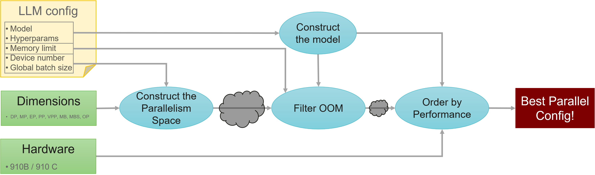
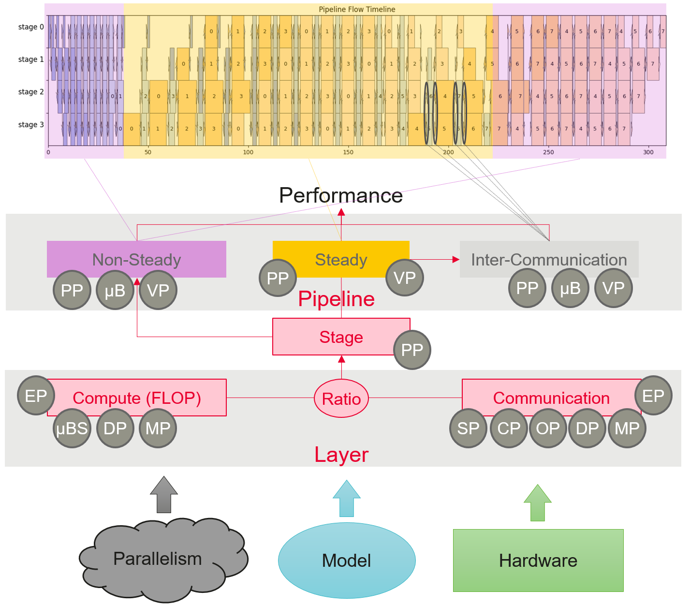
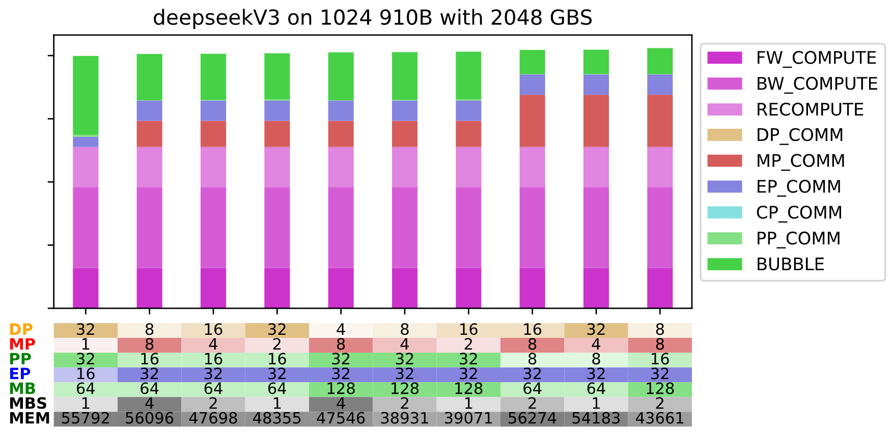

# ND: Parallelizing N Dimensions with Symbolic Estimation

ND provides symbolic search over N parallelism dimensions. It generates candidate parallel strategies, filters out-of-memory configurations with memory estimation, and ranks the remaining configurations with performance estimation.

Because both estimations are analytic, ND does not require online profiling during search. This enables exhaustive exploration, fast CPU-only search, and no dependency on the execution cluster during planning.



## Inputs

- Large language model type.
- Model hyperparameters.
- Parallel dimensions to explore.
- Hardware type and device count.
- Global batch size and memory budget.

## Workflow

1. Construct the model.

   ND selects the model and layer types from the framework configuration by default, or from the `--model` option. Tensor shapes, data types, and model-specific features are filled from the model hyperparameters.

2. Construct the parallelism space.

   The search space is constructed from the dimensions passed with `-l`. Each dimension must satisfy its own constraints and must be compatible with the device number passed with `-d` and global batch size passed with `-b`.

3. Filter out-of-memory configurations.

   Memory filtering is delegated to `memory_estimation/`. See `memory_estimation/README.md` for the memory estimator interface and supported model details.

4. Rank configurations by performance.

   Remaining configurations are ranked by `perf_estimation/`.



## Usage

Run the ND entrypoint as a Python module from the repository root:

```bash
python -m hyper_parallel.auto_parallel.sapp_nd.nd.run_nd \
    -y <mindformers_yaml> \
    -l DP MP PP EP MB MBS \
    -d 1024 \
    -b 2048 \
    -t 10
```

This example varies data parallelism, model or tensor parallelism, pipeline parallelism, expert parallelism, micro-batch number, and micro-batch size. The `-d` option fixes the total number of devices, `-b` fixes the global batch size, and `-t` controls how many top configurations are printed.

In HyperParallel, the ND module should be imported as:

```python
from hyper_parallel.auto_parallel.sapp_nd import nd
```

The command prints valid configurations, the subset fitting the memory budget, the top ranked strategies, and timing for search and ordering. From verbosity level 2, ND can also generate debug CSV files and plots.



## Command Options

```text
python -m hyper_parallel.auto_parallel.sapp_nd.nd.run_nd
    -y YAML_CONFIG
    [-d DEVICES]
    [-b GLOBAL_BATCH_SIZE]
    [-m MODEL]
    [-l [DIMENSIONS ...]]
    [-v VERBOSITY]
    [-A DEVICE_TYPE]
    [-mppb | --manual_pipeline_balance]
    [-t TOP_CONFIG_NUMBER]
    [-mem MEM_FOR_PPB]
```

- `-y`, `--yaml_config`: path to the framework yaml configuration file.
- `-d`, `--devices`: number of devices. If omitted, ND uses the yaml value.
- `-b`, `--global_batch_size`: global batch size. If omitted, ND uses the yaml value.
- `-m`, `--model`: model name. If omitted, ND uses the yaml value.
- `-l`, `--dimensions`: parallel dimensions to vary.
- `-v`, `--verbosity`: verbosity in range `[0, 6]`.
- `-A`, `--device_type`: device type, such as `A2` or `A3`.
- `-mppb`, `--manual_pipeline_balance`: read offset and recompute from yaml.
- `-t`, `--top_config_number`: number of top configurations to print and plot.
- `-mem`, `--mem_for_ppb`: memory reserved for pipeline balancing.

## Structure

```text
sapp_nd/
|-- README.md
|-- figures/
|-- memory_estimation/
|-- nd/
|   |-- common/
|   |   |-- framework_parsers/
|   |   |-- _cost_model_variables.py
|   |   |-- arch_hooks.py
|   |   |-- config.py
|   |   |-- cost_model_preprocess.py
|   |   |-- generate_partitions.py
|   |   |-- hardware.py
|   |   `-- layer_type.py
|   |-- balancing_adapter.py
|   |-- debug.py
|   |-- dimensions.py
|   |-- global_config.py
|   |-- logger.py
|   |-- parallelize.py
|   `-- run_nd.py
`-- perf_estimation/
```

## Supported Scope

### Framework Configurations

- MindSpore and MindFormers yaml configurations.
- Megatron json configurations.
- TorchTitan toml configurations are planned but not complete in this PR.

### Models

- Transformer dense models, including Llama-series and Qwen-series up to Qwen 2.5.
- Mixture-of-Experts models, including DeepSeekV3.
- Multimodal models are in progress.

### Hardware

- Ascend A2.
- Ascend A3.
- Other Ascend variants and GPU support are future work.

### Parallel Dimensions

- `DP`: data parallelism.
- `MP`: model or tensor parallelism.
- `SP`: Megatron sequence parallelism.
- `EP`: expert parallelism.
- `PP`: pipeline parallelism.
- `OP`: optimizer or ZeRO-DP parallelism.
- `MB`: micro-batch number.
- `MBS`: micro-batch size.
- `VPP`: virtual pipeline parallelism.
- `CP`: context parallelism is planned.

## Notes

The original toolkit also contains validation scripts, result CSV files, yaml examples, DSL utilities, regression utilities, and PPB code. Those assets are not part of this SAPP-ND PR2 package. Pipeline balancing is maintained separately in the SAPP-PPB module.
