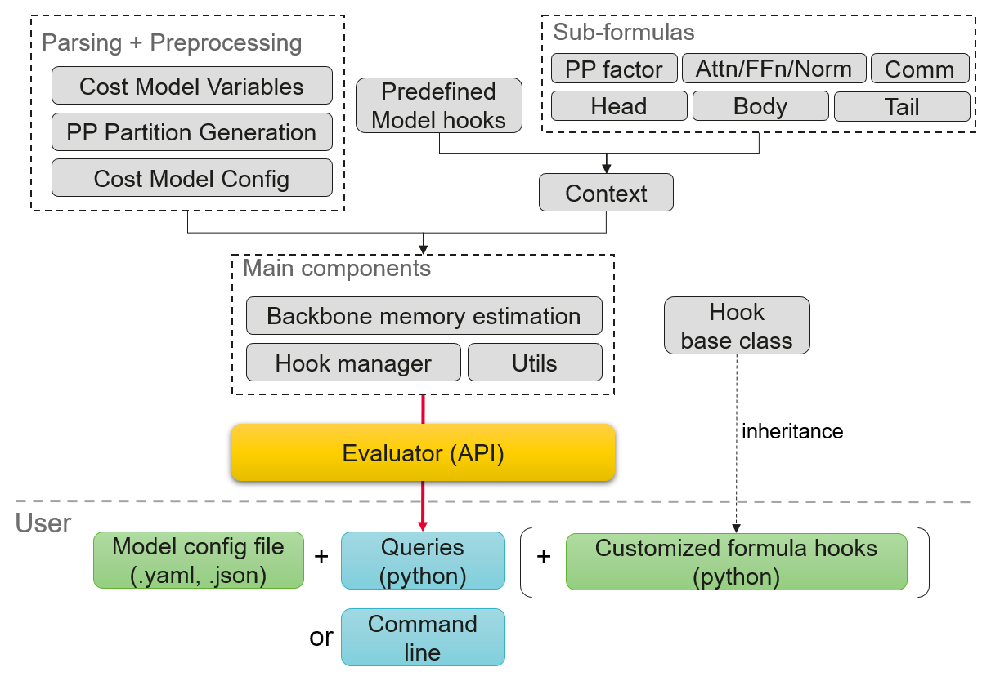
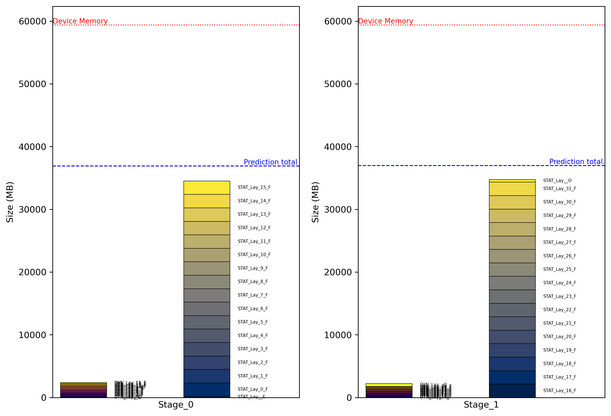

# MemEst: Symbolic Memory Estimation for LLM Training

## 1. Overview

MemEst estimates memory usage for large language model training under common
parallelism settings. It predicts static and dynamic memory, reports stage-level
details, and can generate plots for pipeline stages.

The module is used by SAPP-ND and PPB, and can also run as a standalone tool.
It supports a customizable cost model for fast, explainable estimates.



### Supported Features

- Transformer-style models such as Llama, Mixtral, and DeepSeek.
- MHA, GQA, MQA, Flash Attention, and MLA attention variants.
- Standard FFN and MoE feedforward blocks.
- DP, TP, SP, CP, EP, PP, VPP, and ZeRO-DP parallelism.
- 1F1B, SeqPipe, and DualPipeV-style pipeline scheduling.

### Inputs

The main input is an LLM configuration. MindFormers YAML, MindSpeed JSON, and
HyperParallel TOML formats are supported by parser modules.

### Workflow

- Parse the input config and initialize cost model variables.
- Generate pipeline stage and chunk partitions.
- Estimate forward peak memory and backward overhead for each stage.
- Answer memory fit, insight, plot, and layer-description queries.

## 2. Usage

### Installation

The runtime requires Python 3.9 and `pyyaml`. Plotting additionally requires
`matplotlib` and `pillow`.

Before running examples from source, add the repository root to `PYTHONPATH`.

```bash
cd <hyper-parallel>
export PYTHONPATH=$(pwd):${PYTHONPATH}
```

### Command Line Example

```bash
cd <hyper-parallel>
export PYTHONPATH=$(pwd):${PYTHONPATH}
python -m hyper_parallel.auto_parallel.sapp_nd.memory_estimation.estimate_v2 \
  hyper_parallel/auto_parallel/sapp_nd/memory_estimation/test_cases/mixtral/default.yaml \
  --verbose --plot
```

Example output:

```text
memory_estimation [_backbone.py:129] - INFO - Process config file: default.yaml
memory_estimation [_backbone.py:458] - INFO - Partition of layers:
memory_estimation [cost_model_preprocess.py:100] - INFO - stage _0 : [['1E', '16F']]
memory_estimation [cost_model_preprocess.py:100] - INFO - stage _1 : [['16F', '1O']]
memory_estimation [_backbone.py:665] - INFO - stage _0 : 39475 MB
memory_estimation [estimate_v2.py:76] - OUTPUT - model_name: mixtral-8x7b, peak memory : 39474 MB
```



### Python API Example

Refer to `demo.py` for a full script.

```bash
cd <hyper-parallel>
export PYTHONPATH=$(pwd):${PYTHONPATH}
python hyper_parallel/auto_parallel/sapp_nd/memory_estimation/demo.py
```

### Command Line Help

```text
python -m hyper_parallel.auto_parallel.sapp_nd.memory_estimation.estimate_v2 --help
usage: estimate_v2.py [-h] [--verbose] [--plot] [--fit] [--stage STAGE]
                      [--hook HOOK] [--tracefun TRACEFUN] [--ppb]
                      [--ctx] [--ccfg] [--warnings] model_config_path
```

## 3. Structure

```text
memory_estimation/
|-- configs_eval/        Evaluator configs
|-- evaluators/          Cost formulas
|-- hooks/               Hook templates and extensions
|-- plots/               Generated plots
|-- test_cases/          Small demo model configs
|-- tests/               Smoke tests
|-- _backbone.py         Base evaluator
|-- _bwd_overhead.py     Backward overhead estimation
|-- _context.py          Runtime context
|-- _func_tracer.py      Formula trace helper
|-- _hook_manager.py     Hook manager
|-- _utils.py            Getters, setters, and printers
|-- demo.py              Example script
|-- estimate_v2.py       Main API
|-- hook_base.py         Abstract hook class
|-- logger.py            Logger setup
`-- score.py             Cost model quality helpers
```

## 4. Core Objects

`EvaluatorV2` is the main API.

```python
e = EvaluatorV2(config, log_level, eval_yml, hook_cls)
```

Arguments:

- `config`: model config path or parsed config object.
- `log_level`: `1` or `0` to toggle warning logs.
- `eval_yml`: evaluator config path; defaults to `configs_eval/default.yaml`.
- `hook_cls`: `MemEvalHook` object or string; defaults to `None`.

`EvaluatorV2` relies on two internal objects:

- `ccfg`: `CostModelConfig`, holding parsed cost model variables.
- `ctx`: `Context`, holding current formula pointers and temporary logs.

Layer partitions are represented with `LayerType` values:

- `LayerType.NOT_REC_LAYER`
- `LayerType.SEL_REC_LAYER`
- `LayerType.FULL_REC_LAYER`
- `LayerType.EMBEDDING_LAYER`
- `LayerType.OUTPUT_LAYER`

Before estimating memory, the evaluator automatically generates each pipeline
stage's layer partitions from the parsed recomputation, offset, and pipeline
scheduling settings. A partition is represented as `layers[stage][chunk]`, where
`stage` is in the PP range, `chunk` is in the VPP range, and each element is a
`LayerType`.

## 5. Parser Integration

Parser modules convert a framework-specific config file into a normalized
`CostModelConfig` object. The memory evaluator only depends on the normalized
fields, so a new framework parser should keep all framework-specific names and
validation inside `nd/common/framework_parsers/`.

The default parser lookup is based on the input suffix:

| Suffix | Parser |
| --- | --- |
| `.yaml` | `CostModelParserMindformers` |
| `.json` | `CostModelParserMindspeed` |
| `.toml` | `CostModelParserHyperparallel` |

`EvaluatorV2` also accepts an explicit framework name:

```python
e = EvaluatorV2("model_config.toml", framework="hyperparallel")
```

To add a parser for a new input format:

1. Create `cost_model_parser_<name>.py` under
   `nd/common/framework_parsers/`.
2. Define a parser class that inherits `_CostModelParser`.
3. Register the parser in `framework_parsers/mapping.yaml`.
4. Implement `parse()` and assign normalized values to `self.ccfg`.
5. Run the common post-processing helpers after parsing strategy fields:
   `config_dp_tp_exp()`, `config_optimizer_shard()`, and
   `config_comm_flag()`.

The parser is responsible for validating user input before it reaches memory
formulas. At minimum, it should normalize model metadata, model hyperparameters,
parallel strategy, recomputation settings, precision bytes, and device capacity.

Parser skeleton:

```python
from hyper_parallel.auto_parallel.sapp_nd.nd.common.framework_parsers._cost_model_parser import _CostModelParser


class CostModelParserNewFramework(_CostModelParser):
    def parse(self):
        ccfg = self.ccfg
        cfg = self.config

        ccfg.config_format = "new_framework"
        ccfg.model_name = cfg.model_name
        ccfg.d = cfg.parallel.dp
        ccfg.t = cfg.parallel.tp
        ccfg.p = cfg.parallel.pp

        self.config_dp_tp_exp(ccfg)
        self.config_optimizer_shard(ccfg)
        self.config_comm_flag(ccfg)
```

### Parser Output Contract

| Area | Required output |
| --- | --- |
| Model metadata | `model_name`, `device_capacity`, `config_format`, optional multimodal metadata |
| Parallel strategy | `d`, `t`, `p`, `cp`, `ep`, `sp`, `vp`, `os_max_shard`, `pp_sched` |
| Pipeline layout | `offset`, `pp_partition`, `full_rec`, `sel_rec`, `rec_op` |
| Model size | `n_lay`, `n_mtp`, `h`, `hff`, `v`, `s`, `s_fa`, `a`, `n_kv`, `dh` |
| MoE | `n_exp`, `n_chosen_exp`, `n_shared_exp`, `hff_exp`, `cap_fact`, `etp` |
| Precision | `bytes_p`, `bytes_compute`, `bytes_softmax`, `bytes_grad`, `bytes_os`, `bytes_norm` |
| Batch | `b`, `m`, `gbs` |
| Hooks | `layer_custom_config`, `overwrite_eval_functions` |

## 6. CostModelConfig Fields

`ccfg` is the normalized backend configuration consumed by all memory formulas.
Parser authors should treat it as the interface between framework input files
and the memory module.

| Group | Fields | Notes |
| --- | --- | --- |
| Input | `config`, `config_format`, `parser` | Original config object, normalized source format, and active parser instance |
| Model | `model_name`, `device_capacity` | Model identifier and per-device memory capacity |
| Multimodal | `multimodal`, `mm_ccfgs`, `mm_order` | Used when one config is split into multiple model components |
| Strategy | `d`, `t`, `p`, `cp`, `ep`, `sp`, `vp`, `os_max_shard`, `op_weight_shard` | DP, TP, PP, CP, EP, SP, VPP, and optimizer sharding settings |
| Pipeline | `offset`, `pp_partition`, `pp_sched`, `n_s_split`, `cp_algo` | Pipeline partition, scheduling, and context-parallel algorithm metadata |
| Recompute | `full_rec`, `sel_rec`, `rec_op` | Full and selective recomputation controls |
| Model shape | `n_lay`, `n_mtp`, `h`, `hff`, `v`, `s`, `s_fa`, `a`, `n_kv`, `dh`, `dc_kv`, `dc_q`, `dhr` | Layer count, hidden sizes, sequence sizes, attention heads, and MLA-related dimensions |
| FFN shape | `k_1st_dense`, `multiple_of`, `fdm` | Feedforward hidden-size derivation helpers |
| MoE shape | `n_exp`, `n_chosen_exp`, `n_shared_exp`, `hff_exp`, `cap_fact`, `etp`, `t_exp`, `d_exp` | Expert count, expert selection, capacity factor, expert TP, and derived expert DP |
| Optimizer shard | `shard_p_os_non_exp_partial`, `shard_p_os_non_exp`, `shard_grad_non_exp` | Non-expert parameter, optimizer-state, and gradient sharding factors |
| Expert shard | `shard_p_os_exp_partial`, `shard_p_os_exp`, `shard_grad_exp` | Expert parameter, optimizer-state, and gradient sharding factors |
| Communication | `comm_d_non_exp`, `comm_d_exp`, `comm_t`, `comm_ep`, `comm_cp` | Formula switches for DP, TP, EP, and CP communication memory |
| Feature flags | `has_op`, `has_grad_shard`, `freeze`, `has_fa`, `has_clip`, `gmm`, `vocab_emb_dp`, `tie_emb_out`, `emb_out_in_offset` | Optional model and training behavior switches |
| MTP flags | `n_mtp`, `is_mtp_in_offset`, `is_shard_mtp_param` | Multi-token prediction layer placement and sharding controls |
| Batch | `b`, `m`, `gbs` | Micro batch size, number of micro batches, and global batch size |
| Activation shard | `shard_embed`, `shard_output_activ`, `shard_recompute_input` | Embedding, output activation, and recompute input sharding factors |
| Precision | `bytes_p`, `bytes_compute`, `bytes_softmax`, `bytes_grad`, `bytes_os`, `bytes_norm` | Byte widths for parameters, compute, softmax, gradients, optimizer states, and norm |
| Customization | `layer_custom_config`, `overwrite_eval_functions` | Heterogeneous layer hooks and function overrides resolved by the hook manager |

Strategy fields should be updated through `e.set_strategy()` after evaluator
construction. Non-strategy fields can be changed in hooks with `e.set_ccfg()`.

## 7. Formula Context

`ctx.eval` points to the formulas for the current layer type.

| Formula | Return |
| --- | --- |
| `ctx.eval.num_p()` | Parameter counts |
| `ctx.eval.stat.p()` | Model parameter memory |
| `ctx.eval.stat.os()` | Optimizer state memory |
| `ctx.eval.stat.grad()` | Accumulated gradient memory |
| `ctx.eval.dyn.activation()` | Activation memory |
| `ctx.eval.dyn.comm.dp()` | DP communication memory |
| `ctx.eval.dyn.comm.tp()` | TP communication memory |
| `ctx.eval.dyn.comm.cp()` | CP communication memory |
| `ctx.eval.dyn.comm.ep()` | EP communication memory |

For Transformer layers, these formulas rely on finer-grained formulas for the
attention, FFN, and normalization blocks:

| Block | Formula pointers |
| --- | --- |
| Attention | `attn_num_p`, `attn_qkv_activ`, `attn_score_activ`, `attn_proj_activ` |
| FFN | `ffn_num_p`, `ffn_activ`, `ffn_moe_activ` |
| Normalization | `norm_num_p`, `norm_activ` |

The broader `ctx` object holds runtime formula pointers and temporary state:

| Group | Fields | Notes |
| --- | --- | --- |
| Current node | `current_node`, `current_stage_id`, `current_chunk_id`, `current_lay_id` | Layer identity used while evaluating a stage |
| Node registry | `node_eval`, `head_node`, `tail_node` | Mapping from `LayerType` to parameter, static, dynamic, and communication formulas |
| Pass controls | `vpp_less_mem`, `swap_os`, `dropless_tok_factor`, `micro_factor`, `default_micro_factor` | Runtime behavior toggles and current pipeline schedule factor |
| Attention formulas | `attn_num_p`, `attn_qkv_activ`, `attn_score_activ`, `attn_proj_activ` | Formula pointers for attention parameter and activation estimates |
| FFN formulas | `ffn_num_p`, `ffn_activ`, `ffn_moe_activ` | Formula pointers for dense and MoE feedforward estimates |
| Norm formulas | `norm_num_p`, `norm_activ` | Formula pointers for normalization estimates |
| Pipeline formulas | `pp_micro_eval` | Pipeline schedule to micro-batch memory factor mapping |
| Temporary logs | `enable_node_log`, `accu_mem_type`, `node_compute_log`, `real_lay_ids` | Per-stage formula traces and memory-type accumulation |

## 8. Evaluator API

| Function | Argument types | Description |
| --- | --- | --- |
| `e.update_config(new_config)` | `str` or config object | Reinitialize with a config path or object |
| `e.reset_config()` | None | Reset the current config |
| `e.load_hook_cls(hook_cls)` | `MemEvalHook` | Load a hook class |
| `e.estimate_peak(stages, verbose, spec_stage_id, plot)` | `List[List[LayerType]]`, `bool`, `int`, `bool` | Estimate peak stage memory; all arguments are optional |
| `e.estimate_peak_insight(stages)` | `List[List[LayerType]]` | Return stage memory insights; layer partitions are optional |
| `e.estimate_layer_memory(stages, device_type)` | `List[List[LayerType]]`, device type | Return PPB-style layer memory |
| `e.mem_fit(mem, tolerance, margin)` | `int` or `float` | Check whether memory in MB fits in device capacity |
| `e.static_mem_stage(stage_id)` | `int` | Static memory for one stage |
| `e.dynamic_mem_stage(stage_id)` | `int` | Dynamic memory for one stage |
| `e.logs_mem_stage(stage_id)` | `int` | Formula trace logs for one stage |
| `e.static_mem_layer(node, stage_id)` | `LayerType`, `int` | Static memory for one layer type in one stage |
| `e.dynamic_mem_layer(node, stage_id)` | `LayerType`, `int` | Dynamic memory for one layer type in one stage |
| `e.all_stage_micro_factors()` | None | Print computed micro-batch memory factors for all stages |
| `e.mb(val)` | `int`, `float`, `dict`, or `tuple` | Convert bytes to MB |
| `e.print_ccfg()` | None | Print normalized cost model variables |
| `e.print_ctx()` | None | Print runtime context variables |
| `e.print_stages(stages, spec_stage_id)` | `List[List[LayerType]]`, `int` | Print generated pipeline stage partitions |
| `e.get_model_name()` | None | Model name |
| `e.get_strategy()` | None | Parallelism and recompute settings |
| `e.get_max_device_memory()` | None | Device memory capacity |
| `e.get_num_layers()` | None | Number of layers |

## 9. Hooks

Hooks can override cost model variables and formulas for a model family.

```python
class MyHookClass(MemEvalHook):
    @hook_runner("my model name")
    def run_hooks(e):
        ...
```

Every new hook class inherits from `MemEvalHook`. Each hook must implement
`run_hooks(e)` and decorate it with `@hook_runner("model name")`. The model name
must match the parsed `ccfg.model_name`.

Common hook APIs:

| Function | Description |
| --- | --- |
| `e.set_passes(vpp_less_mem, swap_os, dropless_tok_factor)` | Toggle feature flags |
| `e.set_head_eval_fun(KW)` | Override head formulas |
| `e.set_tail_eval_fun(KW)` | Override tail formulas |
| `e.set_body_eval_fun(lay_type, KW)` | Override body formulas |
| `e.set_attn_eval_fun(num_p, qkv, score, proj)` | Override attention formulas |
| `e.set_ffn_eval_fun(num_p, activation, moe_activ)` | Override FFN formulas |
| `e.set_norm_eval_fun(num_p, activation)` | Override normalization formulas |
| `e.set_pp_micro_factor_eval_fun(sched_name, fun)` | Override pipeline schedule micro-batch factors |
| `e.set_strategy(...)` | Override parallelism variables |
| `e.set_ccfg(fun)` | Override cost model variables |

`KW` may include `num_p`, `stat_p`, `stat_os`, `stat_grad`, `dyn_activ`,
`dyn_comm`, `dyn_dp_comm`, `dyn_tp_comm`, `dyn_cp_comm`, and `dyn_ep_comm`.

Formula hooks can use one of these forms:

```python
def custom_formula(ccfg, ctx):
    return 0


def custom_ccfg(ccfg):
    ccfg.has_clip = True
```

It is possible to directly set the total layer memory to `0`, the total static
memory to `stat=0`, or the total dynamic memory to `dyn=0`. Other constant
values are ignored for layer categorization.

For heterogeneous layers, `ccfg.layer_custom_config` is a list of pairs
`(occurrence, subhook)`. For each pair, `subhook` is a callable and `occurrence`
is an `int` indicating how many consecutive layers are affected. The sum of all
occurrences must match `n_lay + n_mtp` for non-multimodal models.

When calling hooks, the following input function signatures are expected:

```python
def formula(ccfg, ctx):
    ...


def ccfg_hook(ccfg):
    ...


def run_hooks(e):
    ...
```

## 10. Validation

The smoke tests in this repository focus on parser and evaluator integration.

## 11. Future Work

- Visualization improvements.
- Additional parser coverage.
