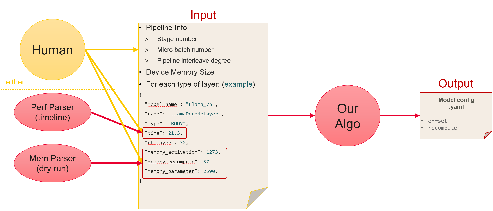
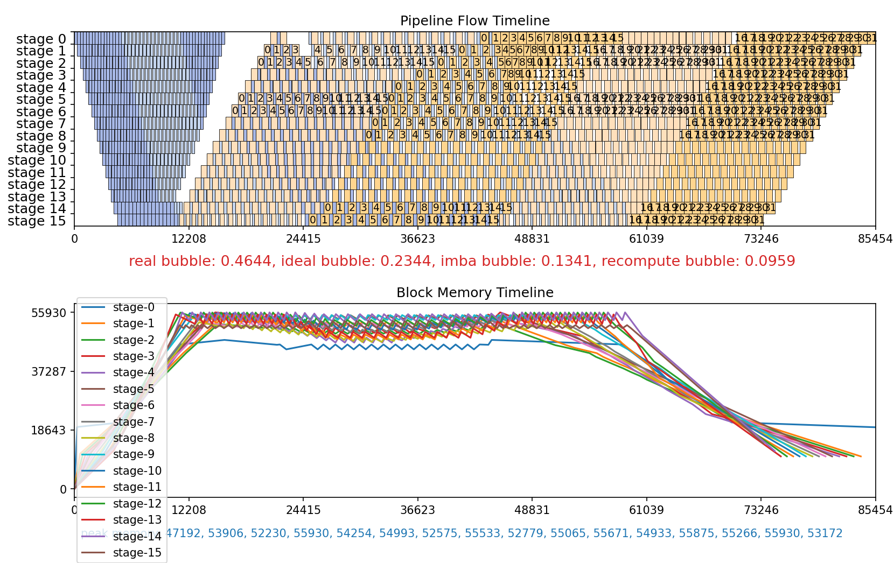

# SAPP-PPB: Symbolic Automatic Parallel Planner - Pipeline Parallelism Balancing

## 1. Overview

Pipeline parallelism can divide a neural network model into different parts and map them to different stages, with each stage deployed on different nodes in a cluster. This allows the cluster to accommodate larger models. However, the current pipeline parallelism orchestration methods often lead to imbalances in computation and memory overhead across different devices. To achieve optimal performance, it is essential to balance both computation and memory loads simultaneously.
During the training and fine-tuning phases, when large models need to be divided into four or more pipeline stages, it is difficult to manually find the optimal solution in a short time. If pipeline interleaving technology is introduced, the optimization becomes even more challenging. In such cases, the SAPP pipeline load balancing tool is required to automatically generate the optimal strategy.



### A. Inputs

- Layer description with memory and time information of each recomputation or swap strategy considered
- Pipeline configuration, including number of stages, micro batches, interleaving, and pipeline schedule

### B. Steps

1. Parse inputs to generate an integer linear programming problem
2. Solve by a third party solver
3. Return the balancing solution to the user and view it in a pipeline simulator

## 2. How to use

### A. Installation

- This software is intended to be used with Python 3.9.
- Packages required may be quickly installed with `pip install -r requirements.txt`.
- Optional: install `gurobipy` to use the Gurobi solver (requires a commercial license). PuLP (open-source) is used by default.
- The parent directory of the `sapp_ppb` package must be on the Python path. For example:

```bash
export PYTHONPATH=<path_to>/hyper_parallel/auto_parallel:${PYTHONPATH}
```

### B. Example

We start from the following layer file, saved as `layers/llama2_70b.json`.

```json
{
    "name": "llama2_70b_prof",
    "pre_defined_layer": {
      "LlamaEmbedding": 0,
      "LlamaRMSNorm": -1
    },
    "auto_partition_layer": {
      "LLamaDecodeLayer": 96
    },
    "layers_description": [
      {
        "name": "LlamaEmbedding",
        "model_name": "llama2_70b_prof",
        "type": "HEAD",
        "time": 13,
        "nb_layer": 1,
        "memory_parameter": 9236
      },
      {
        "name": "LLamaDecodeLayer",
        "model_name": "llama2_70b_prof",
        "type": "BODY",
        "time": 100,
        "nb_layer": 96,
        "memory_parameter": 1710,
        "memory_activation": 994,
        "memory_select_rec": 739,
        "memory_both_comm_select": 403,
        "memory_recompute": 32

      },
      {
        "name": "LlamaRMSNorm",
        "model_name": "llama2_70b_prof",
        "type": "TAIL",
        "time": 113,
        "nb_layer": 1,
        "memory_parameter": 5794
      }
    ]
  }
```

Then we run pipeline balancing on this file for 16 stages, 32 micro batches and 2 interleaved vpp.

```bash
python run_pipeline_balance.py -m llama2_70b -s 16 -mb 32 -i 2 -O2
```

It outputs this plot



and this configuration

```yaml
offset:    [[0,0,0,0, 0,0,0,0, 0,0,0,0, 0,0,1,1], [0,0,0,0, 0,0,0,0, 0,0,0,0, 0,0,0,-2]]
recompute: [[3,1,1,1, 1,0,0,0, 0,0,0,0, 0,0,0,0], [0,0,0,0, 0,0,0,0, 0,0,0,0, 0,0,0, 0]]
```

### C. Complete Usage

```bash
python run_pipeline_balance.py \
    -auto -m <model_name> -mb <micro_batch_num> -mem <max_mem> -s <stage_num> \
    -i <vpp_num> -seq <seq_split_num> -lm <1/0> -t <time_limit> -o <output_path>
```

Parameter descriptions:

| Parameter | Description | Value Range |
| :----: |----|:----:|
| `-auto` | Enable the fully automatic mode. | |
| `-m` | Model name (user-defined). After analysis by auto_ppb_config, a JSON file with the same name is generated and provided to the algorithm interface. | str, default is "model_name" |
| `-mb` | Number of micro batches. | int, default is 4 |
| `-mem` | Maximum available GPU memory, in MB. | int, default is 56000 |
| `-s` | Number of pipeline stages. | int, default is 4 |
| `-seq` | Number of sequence splits in the sequence pipeline. | int, default is 1 |
| `-i` | Number of pipeline interleaves. | int, default is 1 |
| `-lm` | Large or small memory. This parameter is only effective when pipeline interleave > 1. 0 indicates large memory, and 1 indicates small memory. These two options represent two different pipeline scheduling methods, with the small memory option potentially saving more peak memory. Default is large memory. | 0 or 1, default is 0|
| `-t` | Upper limit of the solver search time, in seconds. The solver stops searching once the time limit is reached. | int, default is 90 |

## 3. Structure to use

```bash
sapp_ppb/
├── cfgs/                       # Directory containing manual configurations
├── figures/                    # Directory containing figures for this document
├── layers/                     # Directory containing layer description files
├── output/                     # Directory containing output files, including plots and problem files (gitignored)
├── README.md                   # This file
├── requirements.txt            # File containing python packages. Used for installation
├── run_pipeline_balance.py     # Root python script used to call and run PPB
├── sapp/                       # Core python files (problem construction, ILP solver)
├── simulator/                  # Pipeline simulator (block-level scheduler + plots)
└── utils/                      # Shared utilities (layer/stage modeling, config, logging)
```
