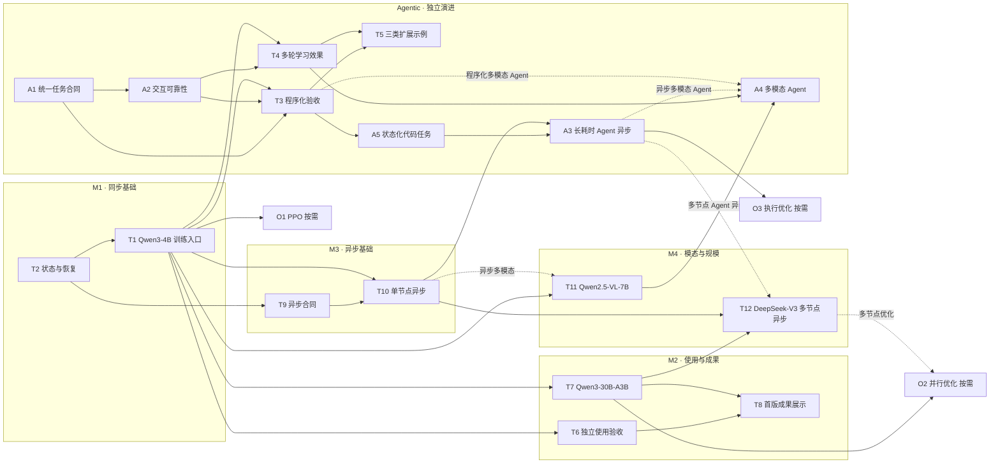

# Hyper-RL 交付计划

**目标：以精简、可扩展的核心，支持从基础强化学习到多轮 Agent、多模态与大规模异步训练。**

本文维护 LLM/VLM 在线 RL 的任务、依赖与验收标准。Agentic 作为框架的重要能力单独规划，按实际依赖推进。设计取舍见 [design](design.md)，当前实现见 [architecture](architecture.md)，已验证能力见 [README](../README.md#支持范围)。以下数字是拟定的交付门槛，不是已取得的结果；阶段不承诺日期或模型规模。

## 验收口径

满足本项及适用的公共标准后勾选，附 PR、测试与结果链接；缺少验证则保持未完成。结果维护在对应产品文档中。

| 维度 | 公共标准 |
| --- | --- |
| 可复现 | 固定代码、环境、模型、硬件/拓扑、配置、数据与 seed，提供完整命令；未说明的操作或配置覆盖为 0。 |
| 正确性 | 所列正常与失败场景全部通过；非法样本入训、错误版本接纳、同一持久化提交边界内的重复提交均为 0；数值比较注明精度与容差。 |
| 学习与效果 | 每个 recipe 预先冻结训练/评估预算、seed 数、留出集、主指标、增益门槛 δ > 0 及统计判定规则（含置信水平）；报告参数更新、奖励、各 seed 评估结果与不确定性，按冻结门槛判定。默认至少 3 个 seed、100 个独立评估样本；预算调整须事先说明依据，证据不足仅标探索结果。 |
| 性能与成本 | 固定模型、硬件总量、任务与质量目标，比较达到同等质量的墙钟时间、加速卡时及工具/评测成本。预先固定预热、测量窗口和重复次数（默认至少 3 次）；附有效 token/s、episode/s、显存、发布耗时及丢弃率解释瓶颈。 |
| 精简与扩展 | 任务/奖励扩展不修改训练基础设施，兼容现有角色的算法不新增 Trainer，同步 recipe 无需启动 Ray；提供 diff，新增配置须有实际用途。 |

所有任务相关预算、阈值与测量窗口须在验收前填写具体数值并评审；调整时保留原因与原结果，不得事后降低门槛判定通过。T1、T4、T7、T11、T12、A4、A5、O1 须通过学习与效果标准，纯接入检查不要求学习收益。性能对照须控制数据、生成配置和评估协议；任一模式未达到目标质量时，仅报告预算内结果，不给出达到同等质量的加速比。

## 代表模型与能力证明

采用少量代表模型覆盖不同技术边界，以完整 recipe 和结果证明能力。每项能力对应明确的模型、任务和结果，不扩展为模型与后端的全组合支持矩阵。

| 代表模型 | 任务与关联 TODO | 要证明的能力 | 起点与交付目标 |
| --- | --- | --- | --- |
| **Qwen3-4B** | GSM8K 单轮 GRPO；计算器与状态化代码任务。T1、T2、T3、T4、T5、T6、T10、A3、A5；O1 按需复用 | 基础训练可复现，任务可局部定制，同步与异步共用任务实现 | 已有同步入口；补齐学习效果、恢复、程序化接入及同步/异步对照结果。 |
| **Qwen3-30B-A3B** | 数学推理 GRPO。T7 | MoE 真实学习、专家权重发布与 TP/EP 组合 | 从已有四卡 TP2/EP4 验证路径起步；补齐完整学习、恢复及性能结果。 |
| **[Qwen2.5-VL-7B-Instruct](https://huggingface.co/Qwen/Qwen2.5-VL-7B-Instruct)** | 图像数学问答；加入工具反馈的多轮版本。T11、A4 | 视觉输入能进入训练，媒体/动作对齐，多模态 Agent 可复用训练栈 | 规划适配；先通过单轮视觉 RL，再通过多轮交互。固定数据版本和留出集，分别报告答案准确率与工具指标。 |
| **[DeepSeek-V3](https://huggingface.co/deepseek-ai/DeepSeek-V3)** | 数学推理 GRPO。T12；Agent 异步组合额外依赖 A3 | 完整大模型的多节点学习、分布式权重发布与异步吞吐 | 规划适配；使用完整 checkpoint，完成同步基线与多节点异步对照。硬件规模由容量测算确定，不以缩层模型或仅加载成功作为通过。 |

每个模型只固定一个主要训练/推理实现和代表拓扑；具体 checkpoint revision、精度、上下文长度、训练参数范围及硬件预算在验收前冻结。新增模型适配优先落在 HyperParallel / HyperAutoModel 与 vLLM 的模型边界，不能为其复制 RL Trainer。

接口合同与故障测试可使用可控测试替身，但不能替代真实模型验收。**Moonlight-16B-A3B-Instruct** 保留为已有 MLA/MoE 路径的回归与大模型适配前置调试模型，其 Native 学习缺口继续由 [MoE 文档](moe_models.md#验证范围与限制) 跟踪；它不能代替 DeepSeek-V3 的规模验收。后两项为规划目标，不代表当前已支持。

## 路线图与依赖

实线表示必须先完成的任务；虚线表示启用该组合时才需要的额外依赖。依赖以任务中的“依赖”字段为准，图随之更新；阶段是发布分组，不要求上一阶段全部完成后才能开工。

| 发布阶段 | 必须完成的任务 | 用户获得的可验证结果 |
| --- | --- | --- |
| M1 同步基础版本 | T1、T2 | 按文档完成基础强化学习训练、评估及恢复，并提供学习收益证据。 |
| M2 首版成果 | T6、T7、T8 及其前置任务 | 独立用户完成奖励定制；公开运行入口、扩展 diff 与 MoE 学习结果。 |
| M3 最小异步版本 | T9、T10 及其前置任务 | 单节点采样/学习重叠，版本、背压与恢复可验证。 |
| M4 模态与规模扩展 | T11、T12 分别验收 | 多模态训练与 DeepSeek-V3 多节点异步分别发布，Agent 组合另做验收。 |
| Agentic 独立演进 | 按任务依赖分别验收 | 多轮学习、程序化接入、状态化任务、长耗时异步与多模态交互逐项交付。 |

基础路径为 **T2 → T1 → T6 / T7 → T8**；Agentic 可并行推进 **A1 → A2**，在 T1 完成后验收 T3、T4。异步基础不依赖多轮 Agent，Agent 异步适配才依赖 T10；多模态训练不依赖工具扩展示例，多模态 Agent 才依赖多轮任务。先完成基础学习及诊断，再验收有限滞后异步；状态化任务 A5 先证明交互与学习，再由 A3 验证异步组合。各能力达到验收标准即可发布，无需等待所有主线完成。

## M1：可运行、可定制的同步基础版本

本阶段交付基础训练入口与状态恢复；Agentic 接入按独立主线推进。

- [ ] **T2 状态与恢复核对 · M1**
  - **依赖：** 无新增前置任务，基于现有同步实现。
  - **交付：** 明确 step、epoch、实际消费样本/token、数据位置与策略身份，补齐消费计数更新。
  - **验收：** 连续运行与中断恢复两条路径各完成至少 10 个已提交 step，覆盖至少 1 次 epoch 边界；对照提交记录核验所有计数与下一批数据位置，差错为 0。保存中断、缺少完成标记、world size 不匹配、发布失败、恢复后首次采样前发布共 5 类场景全部通过；半成品 checkpoint 被接纳数为 0。

- [ ] **T1 完整训练入口 · M1**
  - **依赖：** T2；配置和文档可提前开发，恢复通过后完成验收。
  - **交付：** 使用 Qwen3-4B + GSM8K，分开维护单步检查与完整训练 recipe，补全数据/模型准备、启动、评估、保存和恢复；记录有效 GRPO group、零奖励方差、截断及训推 logprob 差异。
  - **验收：** 在 1 个新建运行环境中，仅按文档完成至少 10 个已提交 step、2 次评估、1 次保存及进程重启后的至少 2 个 step；启动脚本中未说明的训练参数覆盖为 0。以上为流程检查下限，完整 recipe 还须通过公共学习与效果标准。完整组、缺失成员、零方差组共 3 类数据测试全部通过；列出的诊断指标均有定义、分母及结果，不把零优势批次计作有效学习证据。

## M2：可证明的易用性、扩展性与 MoE 能力

本阶段验证基础使用、奖励定制与 MoE 学习效果，交付 T6、T7、T8。

- [ ] **T6 独立使用验收 · M2**
  - **依赖：** T1。
  - **交付：** 由至少 2 名未参与实现的开发者，分别完成运行、恢复、奖励替换 3 项任务，并提供可复用的奖励替换 diff 与命令。
  - **验收：** 6 次任务均完成；维护者代改代码和未文档化操作均为 0。记录每项主动操作时间、训练等待时间、求助次数、配置项及修改文件数；首次发现阻塞后修正文档，由未参与该修复的使用者复验，不删除首次记录。

- [ ] **T7 一个 MoE 完整验证路径 · M2**
  - **依赖：** T1。
  - **交付：** 固定 Qwen3-30B-A3B，从已有四卡 TP2/EP4 路径选择 1 个主要后端，完成数学推理 GRPO 的学习、评估、发布与恢复。
  - **验收：** 通过公共学习与效果标准；至少 1 次进程重启恢复并继续 2 个 step，完整参数 manifest 发布校验通过；按公共性能口径提供时间、成本及吞吐结果；固定策略和 token 上报告训推概率差异、专家负载与路由一致性，无法直接获取路由时明确诊断缺口及替代实验。若超出预设容差，选择校正、路由控制或 replay 并做开关对照，不由参数 manifest 通过推断概率一致。Moonlight Native 的非零学习缺口单独跟踪，见 [MoE 验证范围](moe_models.md#验证范围与限制)，不能由其他后端结果代替。

- [ ] **T8 首版成果展示 · M2**
  - **依赖：** T6、T7。
  - **交付：** README 提供完整训练命令、恢复说明、评估结果、奖励扩展 diff 与 MoE 结果入口；Agentic 成果按实际验收状态补充。
  - **验收：** 上述 5 类入口齐全且链接有效；已实现能力声明的证据覆盖率为 100%，计划能力全部显式标注。至少 1 名未参与文档编写的读者能在 5 分钟内找到这 5 类信息；代码量、性能数字均注明统计范围。

## M3：最小 Ray 异步版本

本阶段交付通用异步合同与单节点实现；长耗时 Agent 由 A3 独立验收。

- [ ] **T9 异步合同与编排设计 · M3**
  - **依赖：** T2。
  - **交付：** 按架构中的学习合同选定一种有限滞后方案，明确生成/更新策略概率、GRPO 分组及样本处置；定义资源划分、发布边界、背压和恢复状态。
  - **验收：** 正常、慢任务、队列满、发布失败、进程重启、group 成员缺失共 6 类时序图或状态表通过实现前评审。冻结最大 policy lag L、队列容量 Q、清理超时、样本丢弃上限 D、质量退化容差 ε、目标质量 q，以及达到 q 的加速比目标 R（同步耗时 / 异步耗时，R > 1）；均填写具体数值、单位和依据，并确认所选部署具备采样/学习重叠的资源条件。完整/不完整/零方差 group，以及完成未消费、消费未提交、已提交和在途数据均有处置规则，未定义转移为 0；明确持久化提交边界、重采身份及有限滞后的校正依据。

- [ ] **T10 单节点异步实现与验证 · M3**
  - **依赖：** T9、T1。
  - **交付：** Ray 负责异步资源、任务和队列，复用任务、算法与模型组件，保留同步入口。
  - **验收：** 复用 T1 的 Qwen3-4B + GSM8K recipe，按冻结的评估预算验证同步与异步，两者均达到 q；达到 q 的耗时比不低于 R；另在相同生成预算下检查质量退化不超过 ε。报告概率差异、校正权重分布、有效 group 比例及按任务难度/时长分组的接纳率，解释采样选择偏差。时间线证明采样/学习重叠；lag、队列、丢弃率不超过 L、Q、D，T9 的 6 类场景全部通过，同一持久化提交边界内重复提交为 0。功能与效率分别记录，未达到冻结的效率门槛时保留功能结果，整项不勾选。

## M4：多模态与规模扩展

本阶段交付多模态训练与多节点能力，两项可分别验收、发布；多模态 Agent 交互由 A4 独立验收。

- [ ] **T11 单一多模态训练闭环 · M4**
  - **依赖：** T1；若声明异步多模态支持，额外依赖 T10 并验收组合。
  - **交付：** 适配 Qwen2.5-VL-7B-Instruct，完成图像数学问答 GRPO，复用既有训练与轨迹合同；完成视觉模块和投影层适配，明确可训练/冻结范围及发布内容。
  - **验收：** 通过公共学习与效果标准；预处理对齐、媒体/token 位置、截断、混合长度 batch、序列化、checkpoint 恢复共 6 类检查全部通过；所有可训练模块的发布 manifest 校验通过，冻结模块身份保持一致。至少 10 条完整样本记录媒体、动作及奖励对应关系；既有文本 recipe 完成至少 2 个训练 step，新增模态专属 Trainer 数为 0。

- [ ] **T12 DeepSeek-V3 多节点异步 · M4**
  - **依赖：** T7、T10；多节点 Agent 异步额外依赖 A3 并验收组合。
  - **交付：** 适配完整 DeepSeek-V3 checkpoint，在容量测算所需的多节点资源上验证（至少 2 个节点）；开跑前冻结目标拓扑、参数/优化器/KV cache/传输缓冲预算、峰值显存上限和有效吞吐下限。所需模型适配、并行/offload 与 MoE 异步部署纳入本任务；先完成加载、一次真实更新及发布的容量检查，再开展完整学习验收。
  - **验收：** 通过公共学习、效果及性能标准，实测满足资源与吞吐预算；同一模型和硬件下比较同步与异步达到目标质量的时间/成本，另以相同生成预算核验质量容差，均达到预先冻结的门槛，并记录 lag、队列峰值及丢弃率。至少 1 次完整参数 manifest 校验、1 次进程重启恢复及随后 2 个 step。注入单个 worker 退出和跨节点通信超时共 2 类故障，全部相关进程在约定超时内退出或恢复，无部分提交。新增拓扑各自给出结果；模型无法在小拓扑运行时不宣称线性加速。

## Agentic 原生演进主线

Agentic 是框架原生支持的重要能力，与基础强化学习共用任务接口和轨迹合同。当前已具备 Environment、多轮工具交互，以及通过 ProgramAgentRunner 接入的 Codex / DeepSeek Harness；现有范围见 [Agentic RL](agentic_rl.md)。以下任务完善扩展方式和交付验收，未勾选不表示已有组件不存在。本主线独立验收，按任务需要依赖训练入口、异步或多模态基础能力。每项勾选状态只在本节维护。

- [ ] **A1 统一任务接入合同**
  - **依赖：** 无新增前置任务，基于现有任务与轨迹合同。
  - **交付：** 明确 Environment 的 reset/step/close 与 AgentProgram 的 run 对应的输入输出、配置、生成服务及资源生命周期。
  - **验收：** 单轮 Environment、多轮 Environment、程序化 Agent 共 3 类接口示例通过同一 Trajectory 合同检查；单轮示例无需编写工具循环，新增任务名判断分支数为 0。程序化端到端入口由 T3 验收。

- [ ] **A2 交互边界验证**
  - **依赖：** A1。
  - **交付：** 明确奖励归属、episode 终止、截断和资源释放语义；记录工具/环境/评分版本，区分任务失败、工具故障和评分缺失。
  - **验收：** 非法动作、工具超时、工具异常、轮次上限、截断、取消共 6 类场景全部有自动化验证；token/logprob/mask 错位、工具反馈进入 policy loss、错误样本静默入训均为 0。在配置的清理超时内释放全部任务资源；连续执行 100 个终止/取消 episode 后，待处理请求和任务资源数回到基线。上述 3 类结果均有可追踪案例与明确入训处置，未标注的故障转负奖励次数为 0。

- [ ] **T3 程序化 Agent 接入与验证**
  - **依赖：** A1、A2、T1。
  - **交付：** 基于已接入的 Codex / DeepSeek Harness，完善程序化入口的配置、生命周期和端到端验证；给出新增程序的最小适配示例，复用生成服务、轨迹和 batch 构建。
  - **验收：** Environment 与选定的 1 条内置程序化路径各用 1 个示例完成至少 2 个采样→非零更新→发布循环；未知 prompt、错误策略身份、非法 mask 共 3 类输入全部拒绝；追加式上下文与生成时输入对齐测试通过，未支持的历史改写/分支输入明确拒绝。两条路径均通过 A2 的适用失败场景，新增任务专属 Trainer 数为 0。

- [ ] **T4 代表性多轮学习任务**
  - **依赖：** A2、T1；首个学习示例可采用 Environment。
  - **交付：** 使用 Qwen3-4B，优先复用计算器任务，提供完整 recipe、固定留出集与可查看的交互轨迹。
  - **验收：** 通过公共学习与效果标准；每个 seed 至少保存 10 个完整评估 episode，并包含实际发生的成功、失败和多轮案例（某类未发生时注明数量为 0）。轨迹包含工具输入输出、奖励、终止原因与策略版本；报告成功率、工具调用次数、平均轮次及截断率。工具调用通过、参数更新与效果提升分别报告。

- [ ] **T5 三类扩展示例**
  - **依赖：** T3、T4。
  - **交付：** 奖励替换、工具增加、兼容现有角色的学习目标扩展各 1 例。
  - **验收：** 3 例均提供 diff、配置、命令、代表测试，并各完成至少 2 个采样→更新→发布循环；全部满足公共精简与扩展标准。奖励变化、工具反馈进入后续交互、学习目标改变梯度各有对应验证，不以注册成功作为完成。奖励替换复用 T6 已有示例（若已完成），不维护两份实现。

- [ ] **A5 状态化代码任务**
  - **依赖：** T3。
  - **交付：** 使用 Qwen3-4B 实现 1 个最小代码修复任务：读取任务文件、修改代码、运行测试并依据反馈继续；复用程序化 Agent，不另建应用平台。
  - **验收：** 通过公共学习与效果标准；至少 10 条完整轨迹展示两次及以上状态相关工具调用，记录文件状态标识、测试反馈、奖励与策略版本。正常完成、测试失败、工具超时、取消、环境重置共 5 类场景通过；跨 episode 状态污染为 0。报告任务成功率、主动修改文件数、交互轮次及执行成本，任务接入不修改训练基础设施。

- [ ] **A3 长耗时 Agent 异步适配**
  - **依赖：** A5、T10；先完成任务与通用异步，再验收组合。
  - **交付：** 多轮 episode 并发、在途权重发布、超时/取消与过期样本处理。
  - **验收：** A5 的同一任务及奖励代码在同步和异步运行，差异仅限执行配置；完成至少 100 个 episode，覆盖至少 2 个并发 episode、3 次在途权重发布和 1 个耗时达到正常工具中位数 10 倍的慢工具。超时、取消、过期 episode 均单独注入验证；队列不超过 T9 容量，同一持久化边界内的重复提交与未经许可的版本混合为 0，资源清理满足 A2；基于该任务另行冻结质量目标及时间/成本门槛并通过对照验收，不沿用 GSM8K 的效果阈值。至少 1 次重启验证训练消费与工具副作用的不同恢复边界。

- [ ] **A4 多模态 Agent 交互**
  - **依赖：** T4、T11；程序化实现额外依赖 T3，异步实现额外依赖 A3，均须验收组合。
  - **交付：** 复用 T11 的 Qwen2.5-VL-7B-Instruct 与图像数学数据，增加计算工具反馈和多轮交互，复用 Environment 或 AgentProgram。
  - **验收：** 通过公共学习与效果标准；至少 10 条完整轨迹展示媒体观察、工具输入输出、后续动作及奖励的对应关系。多轮拼接、媒体截断、取消共 3 类场景全部通过；异步组合另执行 A3 的并发、发布、背压、版本与恢复验收；媒体错位、观察进入 policy loss 和资源泄漏均为 0，新增任务专属 Trainer 数为 0。

## 按实际需求启动

以下任务不阻塞 M1–M4。每次只选择一个具体目标，完成其验收后再引入下一项；不将整个候选列表视为一个可勾选目标。

- [ ] **O1 PPO 端到端**
  - **依赖：** T1；启动条件为明确的用户任务。
  - **验收：** 1 个完整 recipe 通过公共学习与效果标准；Actor/Critic 均有非零更新；至少 1 次 checkpoint 恢复后，权重、optimizer、scheduler、计数与数据位置核对通过，并继续至少 2 个 step。现有 GRPO recipe 回归通过。

- [ ] **O2 一个并行优化目标**
  - **依赖：** T7；多节点优化额外依赖 T12。
  - **范围：** 从 CP/PP、更多 TP/EP 组合或动态专家重分配中，依据实测瓶颈选择 1 项，记录目标名称后启动。
  - **验收：** 开跑前固定数值精度/学习质量容差与吞吐或显存改善目标；通过公共性能测量并达到该目标，数值/质量偏差不超过容差；至少 1 次完整发布、1 次恢复和随后 2 个 step 通过。不将基础库支持作为 RL 端到端证据。

- [ ] **O3 一个 Agent 执行优化目标**
  - **依赖：** A3。
  - **范围：** 从 partial rollout、请求中途换权重、上下文压缩或 retry 中选择 1 项，记录真实瓶颈、版本及恢复合同后启动。
  - **验收：** 开跑前固定有效吞吐或任务延迟改善目标，以及质量容差；按公共性能口径达标。正常、超时、取消、发布交错、进程重启共 5 类场景全部通过；每段动作对应真实生成上下文；重放与重采身份可区分，同一持久化边界内重复提交为 0；有副作用工具具备幂等标识或明确失败处置。原完整 episode 路径回归通过。

LoRA 与在线蒸馏按实际任务的资源或学习需求评估；立项时补充具体模型、依赖和验收，不预先扩展后端矩阵或训练角色。

每次发布均复核公共精简标准及本次新增配置/抽象的实际用途。精简不能通过删除必要校验、恢复或可观测性实现；验收证据不足的能力继续标为计划或实验性。
