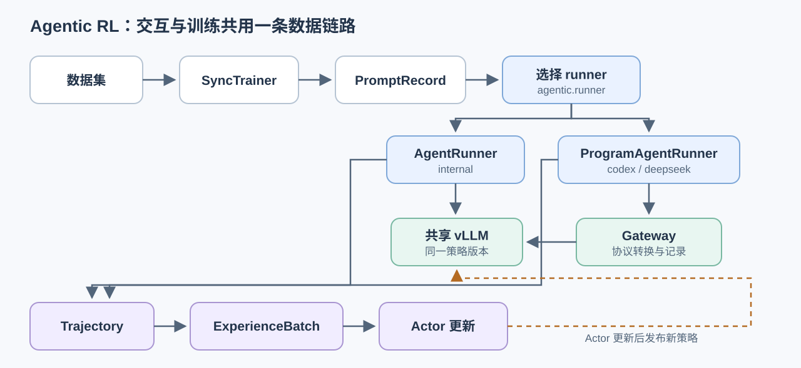

# Agentic RL：Agentic 模块如何接入 hyperparallel-RL

Agentic 模块负责让模型在一个 episode 内反复执行“生成动作—调用工具—接收观察—继续生成”，并把完整过程收敛为
hyperparallel-RL 认识的 `Trajectory`。hyperparallel-RL 仍然负责数据加载、批处理、优势估计、Actor 更新、权重发布和检查点。

换句话说，Agentic 决定模型如何与任务环境交互；hyperparallel-RL 决定这些交互数据如何用于强化学习。

## 整体关系



图中实线表示一次训练 step 内的数据或调用方向，虚线表示 Actor 更新后向共享 vLLM 发布下一版本策略。三种 runner
共享同一套 `PromptRecord → Trajectory → ExperienceBatch` 训练契约，不会形成第二条独立训练链路。

## 职责边界

| 层次 | 主要职责 | 不负责的内容 |
| --- | --- | --- |
| Agentic | episode 生命周期、多轮动作与观察、工具执行、终止判断、任务奖励、轨迹构造 | 优势估计、梯度更新、权重发布 |
| Rollout | 提供共享 vLLM 推理端点，返回 token ID、raw logprob 和策略身份 | 任务语义和奖励规则 |
| hyperparallel-RL Trainer | 构建 prompt、选择 runner、准备训练 batch、更新 Actor、发布策略并记录指标 | 具体工具如何实现 |

`SyncTrainer` 是唯一的顶层编排者。它在 `rl/trainer.py` 中创建 rollout engine，再根据 `agentic.runner` 选择对应的
rollout manager。Agentic 不绕过 Trainer，也不直接更新模型参数。

## 三种执行路径

| `agentic.runner` | 实际入口 | episode 控制者 | 适用方式 |
| --- | --- | --- | --- |
| `internal`（默认） | `RolloutManager` → `AgentRunner` | hyperparallel-RL 内部循环 | 自定义环境、协议和 Python 工具 |
| `codex` | `CodexRolloutManager` → `ProgramAgentRunner` | Codex CLI program | Codex Responses 协议、shell 或 MCP 工具 |
| `deepseek` | `DeepSeekRolloutManager` → `ProgramAgentRunner` | DeepSeek Harness program | DeepSeek Chat 协议和 Harness 工具 |

配置校验只接受以上三个值。当前不能在 YAML 中填写任意第四种 runner。`ProgramAgentRunner` 虽然是公开的 Python
接口，但把新的外部 harness 接入 `SyncTrainer` 仍需要增加对应的 runtime、factory、manager 和配置校验。

### Internal：框架内多轮交互

`AgentRunner` 为每个 `PromptRecord` 创建 `AgentSession` 和已注册的 Environment。每一轮按以下顺序运行：

1. Environment 的 `reset()` 返回初始 `Observation`。
2. `AgentRunner` 将活跃 session 左填充成 batch，并调用共享 `GenerationEngine`。
3. 生成结果作为 `Action` 交给 Environment 的 `step()`。
4. `ToolEnvironment` 使用 `InteractionProtocol` 解析最终答案或工具调用。
5. 工具调用由 `ToolExecutor` 在 `ToolRegistry` 中查找并执行，结果编码成下一轮 observation。
6. 最终答案由环境奖励函数评分；达到终止条件后，`AgentSession.build()` 生成 `Trajectory`。

已完成的 session 仍保留一个 dummy batch row，以保证所有分布式 rank 执行相同数量的 generation collective；
dummy 输出会被丢弃，不进入训练。

### Codex 与 DeepSeek：外部 harness 交互

两条外部路径使用相同的数据面结构：

1. manager 启动本节点的 Gateway，并读取 vLLM 当前 `(policy_version, fingerprint)`。
2. runtime 将该策略身份绑定到本次 episode。
3. `ProgramAgentRunner` 只在 Trainer TP 组的 request-owner rank 启动外部 program。
4. Gateway 把 Codex Responses 或 DeepSeek Chat 请求转换为 vLLM 的 `/v1/chat/completions` 请求。
5. Gateway 记录模型返回的 token ID、raw sampled-token logprob、工具调用和策略身份。
6. harness 的 trajectory builder 将记录转换为标准 `Trajectory`。
7. request-owner 将 trajectory 序列化，并通过 `synchronize_agent_payload()` 同步给同 TP 组的 sibling ranks。
8. manager 再次读取策略身份；episode 执行期间发生版本变化会直接报错。

Codex 可按配置启动 MCP stdio server。`rl/agentic/mcp_server.py` 只是把现有 `ToolRegistry` 暴露为 MCP
`tools/list` 和 `tools/call`，不会复制或改写工具实现。

## hyperparallel-RL 如何消费 Agentic 结果

一次训练 step 的真实顺序位于 `SyncTrainer._train_step()`：

1. `build_prompt_records()` 把 dataloader batch 转成 `PromptRecord`。
2. 选定的 rollout manager 调用 `generate()`，返回 `ExperienceBatch`。
3. rollout engine 从 rollout residency 切回 training residency。
4. `ExperiencePreparer` 根据算法需求计算优势，并补充 reference logprob 或 value。
5. Actor 使用准备好的 experience 执行更新。
6. `_publish_policy()` 把 `PolicySnapshot(version=next_step)` 发布到 vLLM。
7. vLLM 恢复 rollout residency，下一 step 使用新策略生成。

Agentic 输出与训练侧之间最重要的边界是 token-first 契约：

| 字段 | 作用 | 约束 |
| --- | --- | --- |
| `token_ids` | 完整 prompt、动作和观察序列 | rollout 返回的 ID 是训练依据，不能 decode 后再 encode |
| `attention_mask` | 标记有效 token | 必须与 `token_ids` 等长 |
| `action_mask` | 标记参与策略损失的模型动作 | 不能选中 padding；环境和工具 observation 不参与策略损失 |
| `rollout_log_probs` | rollout 策略的 next-token logprob | 使用 FP32 raw logprob，并与 next-token 位置对齐 |
| `reward` | episode 最终奖励 | 每条 trajectory 一个标量 |
| `worker_policy_version`、`worker_policy_fingerprint` | 证明生成使用的策略 | batch 内必须一致，并匹配请求的策略版本 |

`build_experience_batch()` 会验证这些 trajectory 的对齐关系，并将其填充成 `ExperienceBatch`；随后算法和 Actor
只处理标准 batch，不需要知道 episode 来自 internal、Codex 还是 DeepSeek。

## 接入自定义 Environment

现有的自定义入口是 `agentic.module_path` 和 `ENVIRONMENTS`：

1. 在扩展模块中实现接收 `EpisodeContext` 的 environment builder。
2. 返回实现 `reset()`、`step()`、`close()` 的 Environment；需要工具时可组合 `ToolEnvironment`、
   `InteractionProtocol`、`ToolExecutor` 和 `ToolRegistry`。
3. 使用 `ENVIRONMENTS.register("name")(builder)` 注册。
4. 在 YAML 中配置同一模块路径和环境名称。

```yaml
agentic:
  runner: internal
  module_path: examples.agents.gsm8k.agent
  environment: gsm8k_tools
  interaction_mode: multi_turn
  protocol: json_function_call
  max_turns: 2
  max_observation_tokens: 0
  max_episode_tokens: 1024
```

仓库中的 `examples/agents/gsm8k/agent.py` 和 `examples/agents/search_R1/agent.py` 是可直接对照的实现：前者组合
calculator，后者组合本地 BM25 search；两者都通过同一个 `ENVIRONMENTS` registry 接入 Trainer。

## 外部 runner 的必要配置

Codex 和 DeepSeek 除各自子配置外，还必须满足以下共享约束：

- `rollout.engine` 必须是 `vllm`。
- `rollout.vllm.logprobs_mode` 必须是 `raw_logprobs`。
- `rollout.vllm.enable_auto_tool_choice` 必须为 `true`。
- `rollout.vllm.tool_call_parser` 必须是非空字符串。
- Gateway 端口不能与 vLLM 端口相同。
- Codex CLI 当前固定验证版本为 `0.152.1`。
- DeepSeek Harness SDK 当前固定验证版本为 `0.1.1rc1`。

完整配置以以下文件为准：

- `examples/agents/gsm8k/configs/codex_multi_turn.yaml`
- `examples/agents/gsm8k/configs/deepseek_multi_turn.yaml`
- `examples/agents/search_R1/configs/codex_multi_turn.yaml`

## 代码导航

| 关注点 | 文件 |
| --- | --- |
| 配置与 runner 约束 | `rl/config.py` |
| 唯一训练编排入口 | `rl/trainer.py` |
| 三种 rollout manager | `rl/roles/rollout/worker.py` |
| Internal episode 循环 | `rl/agentic/core/runner.py`、`session.py` |
| 外部 program 数据面 | `rl/agentic/core/program_runner.py` |
| 环境与工具组合 | `rl/agentic/envs/environment.py`、`rl/agentic/tools/` |
| Codex 适配 | `rl/agentic/codex/` |
| DeepSeek 适配 | `rl/agentic/deepseek/` |
| MCP 工具桥接 | `rl/agentic/mcp_server.py` |
| 标准训练数据契约 | `rl/dataset/contracts.py`、`batch_builder.py` |
| 共享 vLLM 与策略身份 | `rl/roles/rollout/vllm.py` |

## 当前实现边界

- 当前验证路径是单节点、同步训练、Torch/Ascend、Qwen3 与 GRPO；文档没有把多节点或异步 rollout 描述为已实现。
- 外部 runner 复用唯一共享 vLLM endpoint，不创建第二个 rollout Router 或 rank-local server。
- External harness 的语义循环可以不同，但必须返回标准、token 对齐且策略身份一致的 `Trajectory`。
- Agentic UT 入口为 `python hyper_parallel/rl/rl_tests/agentic_ut.py`；line 和 branch coverage 门槛均为 80%。
