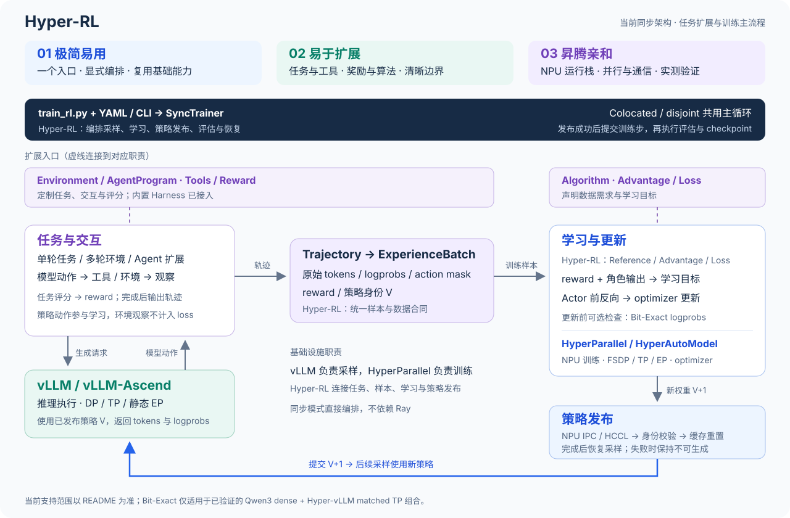
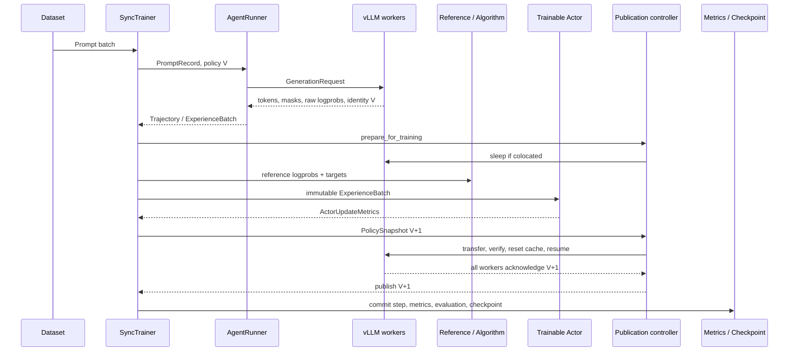

# HyperParallel-RL 架构

HyperParallel-RL 当前运行时的核心是一个同步训练状态机：每一步只消费一个已发布策略生成的数据，并且只有完成训练、权重传输、worker 校验和 cache reset 后，下一策略版本才对 rollout 可见。

可以用三个句子概括当前架构：

- 一个 `SyncTrainer` 决定全局执行顺序。
- 一组 token-first 数据合同连接数据、Agent、rollout 和训练。
- 一个 policy publication transaction 连接可训练 Actor 与 vLLM workers。

本文首先描述**当前同步实现**的组件边界、状态所有权和失败语义；文末单独说明规划中的演进边界。具体配置、已验证拓扑和运行命令分别由 [vLLM Rollout](vllm_rollout.md)、[训练-推理一致性](qwen3_training_inference_consistency.md) 和 [运行镜像](hyper_rl_runtime_image.md) 维护。

当前端到端算法为 GRPO，已接入 Qwen3 dense、Qwen3-30B-A3B 与采用 DeepSeek-V3 架构的 Moonlight-16B-A3B-Instruct；各模型的学习、发布及拓扑验证范围见 [README](../README.md#支持范围)和 [MoE 模型](moe_models.md)。Moonlight 的验证不代表完整 DeepSeek-V3 已支持，后者属于 [TODO 中的规模目标](TODO.md#代表模型与能力证明)。

## 系统视图



设计目标与取舍见[设计原则](design.md)。图中的统一入口和编排器连接以下三条主线：

- **共享模型语义**：Trainer 与 Hyper-vLLM 使用同源 Qwen3 参数语义和 HyperParallel sharding contract。
- **Token-first 数据流**：`PromptRecord → Trajectory → ExperienceBatch`，生成 token 直接进入训练。
- **Verified policy 状态流**：Actor 产生 V+1，经 layout-aware 传输、identity 校验和 cache reset 后才替换 rollout 可见的 V。

`SyncTrainer` 串行控制 rollout、learning 和 publication，metrics、evaluation 和 checkpoint 只在发布成功后执行。vLLM upstream 负责 endpoint 内部的 DP request routing；Trainer TP>1 时，每个 TP group 只有一个 request owner 发起 HTTP 请求，结果随后广播给该组的其他 ranks。

### 昇腾适配边界

训练侧通过 HyperParallel / HyperAutoModel 承载模型与并行能力，采样侧通过 vLLM / vLLM-Ascend 运行栈执行推理。当前共卡部署使用 NPU IPC，分离部署使用 HCCL 传输权重，具体生命周期与适用组合见 [vLLM Rollout](vllm_rollout.md)。CANN、torch-npu 与推理依赖由[运行镜像](hyper_rl_runtime_image.md)固定。

后续适配沿用这些职责边界：设备、算子和通信差异不进入任务与奖励逻辑；新增并行组合须验证样本语义、权重发布与恢复，并记录显存、通信和计算开销。“昇腾亲和”是设计与验证要求，不代表所有昇腾型号、拓扑或底层能力均已通过 RL 验收。

## 控制面

入口 `examples/train_rl.py` 读取 YAML 和严格的 dot-path CLI overrides，然后构造 `SyncTrainer`。初始化分为三步：

1. `rl/config.py` 校验模型、数据、算法、并行度、deployment、weight sync 和 consistency 组合。
2. HyperAutoModel 构造 Actor 和按算法需求选择的冻结 Reference；模型加载、FSDP/TP/EP、optimizer、gradient clipping 与 checkpoint 复用 HyperParallel 公共能力。
3. Rollout registry 构造一个 backend-neutral `GenerationEngine`，当前实现为共享 vLLM deployment。

`SyncTrainer` 是唯一顶层编排者。Algorithm 不启动进程、不管理设备，也不执行 checkpoint；它只声明：

- 需要哪些角色，例如 Reference 或 Critic；
- 需要哪些数据，例如 rollout logprobs、reference logprobs、values 和 returns；
- 如何构建 advantage/return；
- 如何计算 Actor/Critic loss。

当前 GRPO 具备端到端 recipe。PPO、GAE 和 Critic 的数学与角色接口已经存在，但 Trainer 尚未构造 Critic，因此不属于当前端到端范围。

## 边界合同

跨组件传递的是少量显式对象，而不是隐含的字典约定。

| 合同 | 生产者 → 消费者 | 保证 |
| --- | --- | --- |
| `ModelRegistration` | Config → Trainer / rollout / weight sync | 模型家族、checkpoint、tokenizer、tied embedding 和 rollout implementation 使用同一身份 |
| `PromptRecord` | Dataset → AgentRunner | 稳定 prompt ID、messages、ground truth 和原始 token metadata |
| `GenerationRequest/Result` | AgentRunner ↔ GenerationEngine | backend-neutral 请求；返回 token IDs、response mask、FP32 raw logprobs 和 worker policy identity |
| `Trajectory` | AgentSession / AgentProgram → batch builder | 单轮或多轮 episode 的 token、turn span、action mask、reward 和终止原因 |
| `ExperienceBatch` | batch builder / preparer → Actor / Critic | padding 后的二维 tensor 合同，以及与 next-token position 对齐的训练字段 |
| `PolicySnapshot` | Actor → publication controller | 单调递增版本、模型身份和待发布 Actor payload |

### Token-first 不变量

`GenerationResult.sequences` 中的 token IDs 是训练输入的权威来源，不能 decode 后重新 tokenize。所有训练字段围绕这些 token 对齐：

```text
sequences            [batch, tokens]
attention_mask       [batch, tokens]
action_mask          [batch, tokens]
loss_action_mask     action_mask[:, 1:]
old_log_probs        [batch, tokens - 1]
advantages           [batch, tokens - 1]
reference_log_probs  [batch, tokens - 1]
returns / values     [batch, tokens - 1] when required
```

策略生成的 EOS 是 action。Prompt、padding、环境 observation 和 EOS 后 token 不参与 policy loss。当前同步模式下，一个 `ExperienceBatch` 中的所有 trajectories 必须携带同一 worker policy version 和 fingerprint。当前以一条 token 序列及 turn span 表达轨迹；上下文压缩、历史改写和分支轨迹尚无完整训练合同。

### Agent 边界

默认 internal 路径的 `RolloutManager` 将运行配置收敛为 `AgentRunner + GenerationSettings`。AgentRunner 负责：

- 为每个 prompt/sample 建立稳定 row seed；
- 驱动 single-turn 或 multi-turn `AgentSession`；
- 调用环境、工具与 reward；
- 将 observation/action 映射为 token-aligned turns；
- 输出统一的 `Trajectory`。

`ProgramAgentRunner` 已通过内置 Codex / DeepSeek Harness 接入配置驱动的训练入口，复用同一轨迹与 batch 合同。任意自定义 runner 尚不能直接在 YAML 中接入，仍需适配 runtime、factory、manager 与配置校验；程序化路径的交付验收列入 [TODO](TODO.md)。

### Agentic Harness

`agentic.runner` 选择内部环境循环、Codex CLI 或 DeepSeek Harness。三条路径最终都产出同一个 token-first
`Trajectory`；模型返回的 token ID 和 sampled-token raw logprob 是训练证据，工具与环境内容只作为非训练上下文。

Codex 和 DeepSeek 通过本地协议 gateway 复用共享 vLLM endpoint，不创建第二个 rollout Router。
Trainer TP 组只有 request-owner rank 执行外部 harness，完整 trajectory 经对象 collective 同步给同组 rank。
每个 episode 开始和结束均校验 policy version/fingerprint。配置、接入边界与验证范围见 [Agentic RL](agentic_rl.md)。

## 一个训练步



这里的提交顺序很关键：

1. Rollout 在请求前后都验证 worker identity 没有变化。
2. 开启 consistency 时，Trainer 在 optimizer update 前 replay 同一批 token；不一致会终止该步。
3. Actor update 可以产生本地 V+1，但 `global_step` 此时尚未前进。
4. 只有 publication transaction 成功，`SyncTrainer` 才把 step 提交为 V+1，并允许记录指标或 checkpoint。

因此，训练进度代表“已经发布给 rollout 的策略”，而不是“Actor 曾经执行过一次 optimizer step”。

## 状态所有权

| 状态 | 唯一所有者 | 可见性规则 |
| --- | --- | --- |
| `global_step` | `SyncTrainer/RLTrainerState` | policy 发布成功后才前进 |
| `epoch` | `SyncTrainer/RLTrainerState` | 数据迭代耗尽、重新建立迭代器时推进 |
| `consumed_samples/tokens` | `RLTrainerState` | 当前保存与恢复字段，但训练步未累加；不作为实际消费量指标 |
| Actor weights、optimizer、scheduler | `Actor` | 训练侧立即更新；rollout 侧必须经过 publication |
| Reference weights | Frozen `Actor` | 运行期间不更新 |
| Algorithm requirements 与数学 | `RLAlgorithm` | 初始化时选择，step 内保持不变 |
| Episode token/turn state | `AgentSession` | 完成后冻结为 `Trajectory` |
| Rollout policy version/fingerprint/phase | `ActorRolloutWeightSync` | pending version 在提交前不可生成 |
| Worker weights 与 KV cache | vLLM workers | admission 打开前必须完成 identity 校验和 cache reset |
| Durable resume state | `RLCheckpointManager` | `checkpoint_complete.json` 最后原子发布 |

这个所有权表是判断新功能应该放在哪里的依据。新逻辑如果需要同时修改多个所有者，必须先定义新的跨边界合同，不能依赖读取另一个组件的内部字段。

## 两种 Deployment

Colocated 与 disjoint 共用 Trainer、GenerationEngine、Agent contracts 和 publication API；差异只在资源 residency 与 transport。

| 维度 | Colocated | Disjoint |
| --- | --- | --- |
| 设备 | Trainer 与 rollout 共享完整 NPU 集合 | Trainer 与 rollout 使用不相交设备 |
| Rollout residency | 训练前 sleep，发布后 wake | 长期 resident |
| 发布期间 | scheduler 与设备内存按阶段切换 | pause admission，worker 保持 resident |
| Weight transport | NPU IPC | HCCL |
| 成功提交 | wake weights → transfer → verify → reset cache → resume | pause → transfer → verify → reset cache → resume |
| 失败状态 | 保持不可生成或重新 pause | admission 保持关闭 |

Colocated controller 的主要状态为：

```text
rollout(V) -> training -> refit(V+1 pending) -> rollout(V+1)
```

Disjoint 不需要 training residency 切换，但 publication 期间仍会关闭 admission。两者都不允许 generation 观察 pending policy。

## 权重发布与失败原子性

权重发布的运行时检查与验收分开定义：

- **运行时**检查 worker 策略版本与 policy fingerprint，作为发布和 generation 前后的身份校验；fingerprint 不等于完整模型内容证明。
- **发布验收**使用源派生的完整参数 manifest 检查目标参数、布局与内容，不表示每次训练发布都执行完整摘要验收。

默认使用流式 full-gather，按确定性 fragment/bucket gather、传输，并在 ACK 后释放，不物化完整聚合模型权重。`bucket_size_mb` 限制单个传输 buffer，而非整个进程显存。TP1/TP2 均可显式选择 direct-reshard，只传输 source/destination layout 的交集；fallback 默认 `none`，需显式开启。

两种策略共用 canonical adapter、布局与事务校验。MoE dense 权重按 TP、专家权重按 EP 描述归属；公共 planner、EP 通信和模型特有组件的边界见 [MoE 模型](moe_models.md#组件归属)。MoE 当前仅支持 colocated，不能沿用 Qwen3 dense 的 disjoint 或 Bit-Exact 验证结论。

Direct 失败且配置 fallback 时：

```text
keep admission closed
-> abort pending worker identity
-> keep committed version V
-> full-gather overwrite every V+1 parameter
-> verify every worker
-> reset cache and resume
-> publish V+1
```

Abort 只恢复 transaction identity，不保证回滚已经写入的部分 bytes，因此 fallback 必须完整覆盖目标参数。如果 direct 和 fallback 都失败，Actor 进程内可能已经持有新权重，但 rollout version、Trainer `global_step` 和 checkpoint 都不会提交；任务以同步错误退出。

同步实现通过跨 rank 错误传播处理 rollout、publication 和 checkpoint 失败；进程退出、通信超时等新增多节点故障场景仍需独立设计与验证。

## Checkpoint 与恢复

Checkpoint 包含：

- Actor distributed state；
- optimizer 与 scheduler；
- CPU/NPU RNG；
- stateful dataloader；
- global step、epoch 和消费计数字段（当前消费计数未在训练步累加）；
- 完整 resolved config。

模型 state collective 保存，rank-local runtime state 分 rank 保存，最后由 rank 0 原子写入 `checkpoint_complete.json`。缺少完成标记或 world size 不一致的 checkpoint 会在加载前被拒绝。

Resume 后，如果 Trainer step 高于 rollout 初始版本，Trainer 会在第一次 generation 前先发布恢复后的 Actor，保证 rollout 从相同 policy identity 继续。

## 扩展点

| 扩展 | 接口 | 不应改变的边界 |
| --- | --- | --- |
| 新算法 | `register_algorithm` + `RLAlgorithm` | 显式声明 role/data requirements；训练编排仍由 Trainer 负责 |
| 新 advantage | `register_advantage_estimator` | 输入输出保持 next-token 对齐 |
| 下游 rollout backend 适配 | `RolloutEngineRegistry` + `GenerationEngine` | 返回 authoritative tokens、mask、logprobs 和 policy identity |
| 新环境 | `agentic.module_path` + Environment | 最终输出 `Trajectory` |
| 程序化 Agent | AgentProgram / ProgramAgentRunner | 内置 Harness 已接入；新增 runner 需适配，边界见 [Agentic RL](agentic_rl.md) |
| 新 reward | 环境 reward 或 reward registry | reward 与 trajectory/group identity 对齐 |
| 新模型 | `ModelRegistration`、HyperAutoModel 与 rollout adapter | 训练/推理参数语义和 weight layout 必须可映射 |

注册成功只代表组件可构造，不代表具备端到端支持。新能力还需要 shipped recipe、代表测试和对应运行门禁。

## 演进边界（规划）

长期能力目标见[设计原则](design.md)，目标模型与交付依赖见 [TODO](TODO.md)。本文维护演进所需的合同边界，不重复维护任务状态或验收数字。同步、异步与多模态应复用任务接口、算法组件和模型基础设施；不同执行模式可以采用独立的显式编排，不要求全部逻辑进入 SyncTrainer。

| 方向 | 复用内容 | 必须新增或重新定义的合同 |
| --- | --- | --- |
| 程序化 Agent 扩展 | 已接入的内置 Harness、Trajectory、batch builder、学习与发布 | 新增 runner 的适配边界及验收；按需求补齐取消、资源释放与非法轨迹检查 |
| Ray 异步 | 任务、算法、模型及权重传输基础 | 明确训练/采样的设备与显存归属、在途请求的发布边界；分别记录采样、更新与发布进度，定义 policy lag、丢弃/校正、队列背压及恢复 |
| 多模态训练 | 轨迹、奖励、算法与训练编排 | 视觉模块及投影层的模型接入、可训练/冻结范围、权重发布与恢复；媒体/处理元数据和 token/动作位置对齐，两侧预处理一致 |
| 多模态 Agent | 多模态训练与既有任务接口 | 环境反馈、工具输出及多轮媒体拼接；明确截断、取消、奖励归属与资源释放 |
| 更大规模 / 多节点 | HyperParallel 并行与流式同步 | 完整目标模型适配、容量测算、必要的并行/offload；MoE 训练/采样资源部署、跨节点发布、失败传播与恢复 |
| PPO 端到端 | 已有 GAE、PPO 与 Critic 组件 | Critic 构造、placement、optimizer、checkpoint ownership 与真实学习验收 |

### 学习与样本合同（规划）

当前已有 group ID、rollout logprobs、奖励分量和轨迹 metadata；下表补充它们在新执行模式下需要明确的语义，不表示这些能力已实现，也不要求新增一套公共框架。

| 边界 | 必须明确的语义 |
| --- | --- |
| 生成上下文 | 每段动作对应生成时实际可见的上下文与媒体；追加式多轮可沿用现有序列合同。压缩、历史改写或分支须单独定义，不能由最终 messages 重建训练条件。 |
| 概率与策略 | 区分生成策略、训练侧重算概率和当前更新策略；若算法另设近端参考策略，明确其来源。记录采样变换及 logprob 口径；版本校验、Bit-Exact 与 off-policy 校正分别承担职责。 |
| GRPO 分组与消费 | 明确 group 的预期成员、完整条件、超时补采/丢弃、零方差处置与消费次数；按完成速度或奖励筛选时记录选择规则及任务分布变化。 |
| 奖励与环境 | 记录评分规则、judge/工具/环境配置版本及证据引用；区分任务失败、环境故障和评分缺失。故障不默认转换为负奖励，处置由任务合同定义。 |
| 异步恢复 | 明确已完成未消费、已消费未提交、已提交及仍在生成的数据所有权；选择持久化恢复或显式丢弃/重采，训练状态与消费记录使用一致的恢复边界。 |

模型版本相同并不保证两个引擎的概率相同。先诊断训推 logprob 差异、校正权重与有效样本比例；MoE 另诊断路由差异和专家负载，再按证据选择校正或 Router Replay，不将特定方法作为所有模型的强制前提。

### 执行与恢复边界（规划）

请求并发、采样/学习重叠、partial rollout 是不同能力。最小异步版本先采用一种有限滞后与分组消费策略；Ray 负责调度，样本是否可训练由算法和数据合同决定。当前同步模式的单 batch 策略身份与 `global_step` 对应发布版本的假设，不能直接推广到异步模式。

通用异步可先使用单轮任务验证；Agent 异步另验收多轮在途状态。多模态训练可独立推进，多模态 Agent 再组合任务交互，两者均不要求先接入程序化 Agent。

Partial rollout、请求中途换权重和 retry 分别设计、验证后再引入。重放已完成样本保留原 token 与身份；重新生成须记录新的尝试与实际策略，不能承诺相同 seed 必然生成相同 token。重复提交约束作用于持久化训练提交边界；有副作用的外部工具通过幂等标识或明确失败语义处理，不承诺调用恰好一次。

CP/PP、更多 TP/EP 组合及动态专家重分配按实际任务需求推进；基础库存在某项并行能力不等于 RL 端到端已支持。已支持的静态 EP 组合见 [MoE 模型](moe_models.md)。

## 阅读代码

需要定位具体实现时，从 [RL Module Map](../../../.agent/rules/rl/module-map.md) 找到子系统；需要追踪配置到测试时，使用 [RL 功能导航](../../../docs/rl-navigation.md)。架构文档不重复维护函数级路径。
